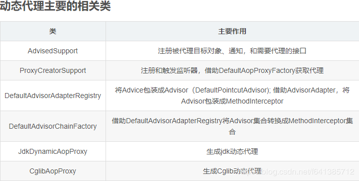

# AdvisorAOP常用词汇

joinPoint：连接点。在spring中只支持方法连接点，连接点指的是可以使用advice(增强)的地方，例如一个类中有5个方法，那么这5个方法，那么这5个方法都可以是连接点。

pointcut：切点。可理解为实实在在的连接点，即切入`advice`(增强)的点。例如一个类中有5个方法，其中有3个方法（连接点）需要织入`advice`(增强)，那么这3个需要织入`advice`的连接点就是切点。

advice：增强。实际中想要添加的功能，如日志、权限校验。

before：前置增强，目标方法执行前之前执行。

after：后置增强，目标方法执行后执行。

around：环绕增强，在目标方法执行时执行，可控制目标方法是否执行。

after throwing：异常增强，目标方法抛出异常时执行。

weaving：织入。即对方法的增强，将切面的代码织入（应用）到目标函数的过程。

introduction advice：引入增强。即对类的增强。

advisor：切面。由切点和增强相结合而成，定义增强应用到哪些切点上。

# AOP联盟(AOP Alliance)

此包中只含有接口，定义AOP的规范

 包名：org.aopalliance.aop、org.aopalliance.intercept


Advice：增强器标记接口

AspectException：AOP异常超类

Interceptor：拦截器，Advice的子接口，标记拦截器。拦截器是增强器的一种。

MethodInterceptor：方法拦截器，`Interceptor`的子接口，拦截方法并处理。

ConstructorInterceptor：构造器拦截器，`Interceptor`的子接口，拦截构造器并处理。

Joinpoint：连接点。在拦截器中使用，封装了原方法调用的相关信息，如参数、原对象信息，以及直接调用原方法的`proceed`方法。

Invocation：`Joinpoint`的子类，添加了获取调用参数方法。

MethodInvocation：`Invocation`的子类，包含了获取调用`方法`的方法。

ConstructorInvocation：Invocation的子类，包含了获取构造器的方法。


# Spring AOP相关类层次

spring-aop.jar包的层次结构：

其中aopallience和AOP联盟中的一样


- org.aopalliance.intercept.Joinpoint(顶级标记接口，连接点)
  - org.aopalliance.intercept.Invocation(唯一子接口，调用连接点，可以被拦截器拦截)
    - org.aopalliance.intercept.ConstructorInvocation(子接口，构造器调用，无实现)
    - org.aopalliance.intercept.MethodInvocation(子接口，方法调用)
      - org.springframework.aop.ProxyMethodInvocation(子接口，代理方法调用)
        - org.springframework.aop.framework.ReflectiveMethodInvocation(实现类，反射方法调用)
          - org.springframework.aop.framework.CglibAopProxy.CglibMethodInvocation(Cglib方法调用)

- org.aopalliance.aop.Advice(顶级标记接口，通知或增强)
  - org.springframework.aop.DynamicIntroductionAdvice(动态引入)
    - org.springframework.aop.IntroductionInterceptor(引介拦截器)
  - org.aopalliance.intercept.Interceptor(`标记接口，拦截器`，一般是持有advice的引用 )
    - org.aopalliance.intercept.ConstructorInterceptor(构造器拦截，无实现，唯一方法`Object construct(ConstructorInvocation invocation)`)
    - org.aopalliance.intercept.MethodInterceptor(接口，方法拦截，唯一方法`Object invoke(MethodInvocation invocation)`)
  - org.springframework.aop.BeforeAdvice(标记接口，`前置拦截`)
    - org.springframework.aop.MethodBeforeAdvice
      - org.springframework.aop.aspectj.AspectJMethodBeforeAdvice(针对于aspectJ的实现类)
    - org.springframework.aop.framework.adapter.MethodBeforeAdviceInterceptor(实现了MethodInterceptor#invoke，持有`MethodBeforeAdvice`)
  - org.springframework.aop.AfterAdvice(后置通知)
    - org.springframework.aop.ThrowsAdvice(异常通知)
    - org.springframework.aop.AfterReturningAdvice(返回通知)
  - org.springframework.aop.framework.adapter.AfterReturningAdviceInterceptor(实现了MethodInterceptor#invoke，持有`AfterReturningAdvice`)
    - org.springframework.aop.framework.adapter.ThrowsAdviceInterceptor(实现了MethodInterceptor#invoke，持有`throwsAdvice`)
  
- org.springframework.aop.Advisor(顶级接口，切面，提供获取Advice方法)
  - org.springframework.aop.PointcutAdvisor(子接口，Joinpoint切面，提供获取Pointcut方法)
    - org.springframework.aop.support.AbstractPointcutAdvisor
      - org.springframework.scheduling.annotation.AsyncAnnotationAdvisor(实现类，异步切面)
  - org.springframework.aop.IntroductionAdvisor(引介切面)


- org.springframework.aop.IntroductionInfo(顶级接口，引介信息)

> `引入增强（Introduction Advice）的概念：一个Java类，没有实现A接口，在不修改Java类的情况下，使其具备A接口的功能。（非常强大有木有，A不需要动代码，就能有别的功能，吊炸天有木有

- org.springframework.aop.IntroductionInterceptor(引介拦截器)

> 在Spring中，为目标对象`添加新的属性`和行为必须声明相应的接口以及相应的实现。这样，再通过特定的拦截器将新的接口定义以及实现类中的逻辑附加到目标对象上。然后，目标对象（确切的说，是目标对象的代理对象）就拥有了新的状态和行为

## Spring AOP常用类解释



## AopInfrastructureBean：免被AOP代理的标记接口

`AopInfrastructureBean`是一个标记接口。若Bean实现了此接口，表明它是一个Spring AOP的基础类，那么这个类是不会被AOP给代理的，即使它能被切面切进去~~~

## ProxyConfig：AOP配置类

用于创建代理的配置的**父类**，以确保所有代理创建者具有**一致的属性**。 它有五个属性，解释如下：

```java
public class ProxyConfig implements Serializable {

	// 标记是否直接对目标类进行代理，而不是通过接口产生代理
	private boolean proxyTargetClass = false;
	// 标记是否对代理进行优化。true：那么在生成代理对象之后，如果对代理配置进行了修改，已经创建的代理对象也不会获取修改之后的代理配置。
	// 如果exposeProxy设置为true，即使optimize为true也会被忽略。
	private boolean optimize = false;
	// 标记是否需要阻止通过该配置创建的代理对象转换为Advised类型，默认值为false，表示代理对象可以被转换为Advised类型
	//Advised接口其实就代表了被代理的对象（此接口是Spring AOP提供，它提供了方法可以对代理进行操作，比如移除一个切面之类的），它持有了代理对象的一些属性，通过它可以对生成的代理对象的一些属性进行人为干预
	// 默认情况，我们可以这么完 Advised target = (Advised) context.getBean("opaqueTest"); 从而就可以对该代理持有的一些属性进行干预勒   若此值为true，就不能这么玩了
	boolean opaque = false;
	//标记代理对象是否应该被aop框架通过AopContext以ThreadLocal的形式暴露出去。
	//当一个代理对象需要调用它【自己】的另外一个代理方法时，这个属性将非常有用。默认是是false，以避免不必要的拦截。
	boolean exposeProxy = false;
	//标记是否需要冻结代理对象，即在代理对象生成之后，是否允许对其进行修改，默认为false.
	// 当我们不希望调用方修改转换成Advised对象之后的代理对象时，就可以设置为true 给冻结上即可
	private boolean frozen = false;
}
```

## ProxyProcessorSupport

简单的说它就是提供为代理创建器提供了一些公共方法实现：

```java
public class ProxyProcessorSupport extends ProxyConfig implements Ordered, BeanClassLoaderAware, AopInfrastructureBean {
	/**
	 * This should run after all other processors, so that it can just add
	 * an advisor to existing proxies rather than double-proxy.
	 * 【AOP的自动代理创建器必须在所有的别的processors之后执行，以确保它可以代理到所有的小伙伴们，即使需要双重代理得那种】
	 */
	private int order = Ordered.LOWEST_PRECEDENCE;
	// 当然此处还是提供了方法，你可以自己set或者使用@Order来人为的改变这个顺序~~~
	public void setOrder(int order) {
		this.order = order;
	}
	@Override
	public int getOrder() {
		return this.order;
	}
	
	...
	// 这是它提供的一个最为核心的方法：这里决定了如果目标类没有实现接口直接就是Cglib代理
	// 检查给定beanClass上的接口们，并交给proxyFactory处理
	protected void evaluateProxyInterfaces(Class<?> beanClass, ProxyFactory proxyFactory) {
		// 找到该类实现的所有接口们~~~
		Class<?>[] targetInterfaces = ClassUtils.getAllInterfacesForClass(beanClass, getProxyClassLoader());
			
		// 标记：是否有存在【合理的】接口~~~
		boolean hasReasonableProxyInterface = false;
		for (Class<?> ifc : targetInterfaces) {
			if (!isConfigurationCallbackInterface(ifc) && !isInternalLanguageInterface(ifc) &&
					
					// 该接口必须还有方法才行，不要忘记了这步判断咯~~~~
					ifc.getMethods().length > 0) {
				hasReasonableProxyInterface = true;
				break;
			}
		}
		if (hasReasonableProxyInterface) {
			// Must allow for introductions; can't just set interfaces to the target's interfaces only.
			// 这里Spring的Doc特别强调了：不能值只把合理的接口设置进去，而是都得加入进去
			for (Class<?> ifc : targetInterfaces) {
				proxyFactory.addInterface(ifc);
			}
		}
		else {
			// 这个很明显设置true，表示使用CGLIB得方式去创建代理了~~~~
			proxyFactory.setProxyTargetClass(true);
		}
	}

	// 判断此接口类型是否属于：容器去回调的类型，这里例举处理一些接口 初始化、销毁、自动刷新、自动关闭、Aware感知等等
	protected boolean isConfigurationCallbackInterface(Class<?> ifc) {
		return (InitializingBean.class == ifc || DisposableBean.class == ifc || Closeable.class == ifc ||
				AutoCloseable.class == ifc || ObjectUtils.containsElement(ifc.getInterfaces(), Aware.class));
	}
	// 是否是如下通用的接口。若实现的是这些接口也会排除，不认为它是实现了接口的类
	protected boolean isInternalLanguageInterface(Class<?> ifc) {
		return (ifc.getName().equals("groovy.lang.GroovyObject") ||
				ifc.getName().endsWith(".cglib.proxy.Factory") ||
				ifc.getName().endsWith(".bytebuddy.MockAccess"));
	}
}
```

## ProxyCreatorSupport

 这个类应该很熟了，我们之前介绍过的三大创建代理对象的工厂ProxyFactoryBean、ProxyFactory、AspectJProxyFactory都是继承自此类的
参考：[【小家Spring】面向切面编程Spring AOP创建代理的方式：ProxyFactoryBean、ProxyFactory、AspectJProxyFactory（JDK Proxy和CGLIB）](https://blog.csdn.net/f641385712/article/details/88926243)

ProxyCreatorSupport用于设置和保存下面三大信息：

1. 设置被代理对象target
2. 设置代理接口
3. 设置通知advice

ProxyCreatorSupport继承AdvisedSupport,主要提供了createAopProxy方法用来得到用来生成代理对象的AopProxy对象：

```java
public class ProxyCreatorSupport extends AdvisedSupport {
	
	// new了一个aopProxyFactory 
	public ProxyCreatorSupport() {
		this.aopProxyFactory = new DefaultAopProxyFactory();
	}
	
	protected final synchronized AopProxy createAopProxy() {
		if (!this.active) {
			activate();
		}
		// 由此可议看出，它还是委托给了`AopProxyFactory`去做这件事~~~  它的实现类为：DefaultAopProxyFactory
		return getAopProxyFactory().createAopProxy(this);
	}
}

//DefaultAopProxyFactory#createAopProxy
public class DefaultAopProxyFactory implements AopProxyFactory, Serializable {

	@Override
	public AopProxy createAopProxy(AdvisedSupport config) throws AopConfigException {
		// 对代理进行优化  或者  直接采用CGLIB动态代理  或者 
		//config.isOptimize()与config.isProxyTargetClass()默认返回都是false
		// 需要优化  强制cglib  没有实现接口等都会进入这里面来
		if (config.isOptimize() || config.isProxyTargetClass() || hasNoUserSuppliedProxyInterfaces(config)) {
			Class<?> targetClass = config.getTargetClass();
			if (targetClass == null) {
				throw new AopConfigException("TargetSource cannot determine target class: " +
						"Either an interface or a target is required for proxy creation.");
			}
			// 倘若目标Class本身就是个接口，或者它已经是个JDK得代理类（Proxy的子类。所有的JDK代理类都是此类的子类），那还是用JDK的动态代理吧
			if (targetClass.isInterface() || Proxy.isProxyClass(targetClass)) {
				return new JdkDynamicAopProxy(config);
			}
			// 实用CGLIB代理方式 ObjenesisCglibAopProxy是CglibAopProxy的子类。Spring4.0之后提供的
			// 
			return new ObjenesisCglibAopProxy(config);
		}
		// 否则（一般都是有实现接口） 都会采用JDK的动态代理
		else {
			return new JdkDynamicAopProxy(config);
		}
	}

	// 如果它没有实现过接口（ifcs.length == ）  或者 仅仅实现了一个接口，但是呢这个接口却是SpringProxy类型的   那就返回false
	// 总体来说，就是看看这个cofnig有没有实现过靠谱的、可以用的接口
	// SpringProxy:一个标记接口。Spring AOP产生的所有的代理类 都是它的子类~~
	private boolean hasNoUserSuppliedProxyInterfaces(AdvisedSupport config) {
		Class<?>[] ifcs = config.getProxiedInterfaces();
		return (ifcs.length == 0 || (ifcs.length == 1 && SpringProxy.class.isAssignableFrom(ifcs[0])));
	}
}
```

> Objenesis是专门用于实例化一些特殊java对象的一个工具，如私有构造方法。我们知道带参数的构造等不能通过class.newInstance()实例化的，通过它可以轻松完成
> 基于Objenesis的CglibAopProxy扩展，用于创建代理实例，没有调用类的构造器(厉害了)

## Advised

Advice: 通知拦截器
Advisor: 持有Advice
Advised: 已经被拦截过得，实现此接口的类包含AOP工厂的包含Interceptors和other advice

该接口用于保存一个代理的相关配置。比如保存了这个代理相关的拦截器、通知、增强器等等。
所有的代理对象都实现了该接口（我们就能够通过一个代理对象获取这个代理对象怎么被代理出来的相关信息）

> 不管是JDKproxy，还是cglib proxy，代理出来的对象都实现了org.springframework.aop.framework.Advised接口；


```java
public interface Advised extends TargetClassAware {

	boolean isFrozen();
	boolean isProxyTargetClass();
	//返回被代理了的接口们
	Class<?>[] getProxiedInterfaces();
	// 检查这个指定的接口是否被代理了。。。
	boolean isInterfaceProxied(Class<?> intf);
	// 设置一个源。只有isFrozen为false才能调用此方法
	void setTargetSource(TargetSource targetSource);
	TargetSource getTargetSource();

	void setExposeProxy(boolean exposeProxy);
	boolean isExposeProxy();

	// 默认是false，和ClassFilter接口有关，暂时不做讨论
	void setPreFiltered(boolean preFiltered);
	boolean isPreFiltered();

	// 拿到作用在当前代理商得所有通知（和切面的适配器）
	Advisor[] getAdvisors();

	//相当于在通知（拦截器）链的最后一个加入一个新的
	void addAdvisor(Advisor advisor) throws AopConfigException;
	void addAdvisor(int pos, Advisor advisor) throws AopConfigException;
	boolean removeAdvisor(Advisor advisor);
	// 按照角标移除一个通知
	void removeAdvisor(int index) throws AopConfigException;
	int indexOf(Advisor advisor);
	boolean replaceAdvisor(Advisor a, Advisor b) throws AopConfigException;

	// 增加通知得相关方法  采用了适配器的模式
	// 最终都会变成一个DefaultIntroductionAdvisor(包装Advice的)
	void addAdvice(Advice advice) throws AopConfigException;
	void addAdvice(int pos, Advice advice) throws AopConfigException;
	boolean removeAdvice(Advice advice);
	int indexOf(Advice advice);

	String toProxyConfigString();

}

```

下面看看基础实现AdvisedSupport

它最重要的一个方法是：提供getInterceptorsAndDynamicInterceptionAdvice方法用来获取对应代理方法对应有效的拦截器链

>  AdvisedSupport本身不会提供创建代理的任何方法，专注于生成拦截器链。委托给ProxyCreatorSupport去创建代理对象

```java
public class AdvisedSupport extends ProxyConfig implements Advised {
	@Override
	public void addAdvisor(Advisor advisor) {
		int pos = this.advisors.size();
		addAdvisor(pos, advisor);
	}
	@Override
	public void addAdvisor(int pos, Advisor advisor) throws AopConfigException {
		if (advisor instanceof IntroductionAdvisor) {
			validateIntroductionAdvisor((IntroductionAdvisor) advisor);
		}
		addAdvisorInternal(pos, advisor);
	}	
	
	// advice最终都会备转换成一个`Advisor`（DefaultPointcutAdvisor  表示切面+通知），它使用的切面为Pointcut.TRUE
	// Pointcut.TRUE：表示啥都返回true，也就是说这个增强通知将作用于所有的方法上/所有的方法
	// 若要自己指定切面（比如切点表达式）,使用它的另一个构造函数：public DefaultPointcutAdvisor(Pointcut pointcut, Advice advice)
	@Override
	public void addAdvice(Advice advice) throws AopConfigException {
		int pos = this.advisors.size();
		addAdvice(pos, advice);
	}
	@Override
	public void addAdvice(int pos, Advice advice) throws AopConfigException {
		Assert.notNull(advice, "Advice must not be null");
		if (advice instanceof IntroductionInfo) {
			// We don't need an IntroductionAdvisor for this kind of introduction:
			// It's fully self-describing.
			addAdvisor(pos, new DefaultIntroductionAdvisor(advice, (IntroductionInfo) advice));
		}
		else if (advice instanceof DynamicIntroductionAdvice) {
			// We need an IntroductionAdvisor for this kind of introduction.
			throw new AopConfigException("DynamicIntroductionAdvice may only be added as part of IntroductionAdvisor");
		}
		else {
			addAdvisor(pos, new DefaultPointcutAdvisor(advice));
		}
	}

	// 这里需要注意的是：setTarget最终的效果其实也是转换成了TargetSource
	// 也就是说Spring最终代理的  是放进去TargetSource让它去处理
	public void setTarget(Object target) {
		setTargetSource(new SingletonTargetSource(target));
	}
	@Override
	public void setTargetSource(@Nullable TargetSource targetSource) {
		this.targetSource = (targetSource != null ? targetSource : EMPTY_TARGET_SOURCE);
	}

	
		... 其它实现略过，基本都是实现Advised接口的内容

	//将之前注入到advisorChain中的advisors转换为MethodInterceptor和InterceptorAndDynamicMethodMatcher集合（放置了这两种类型的数据）
	// 这些MethodInterceptor们最终在执行目标方法的时候  都是会执行的
	public List<Object> getInterceptorsAndDynamicInterceptionAdvice(Method method, @Nullable Class<?> targetClass) {
		
		// 以这个Method生成一个key，准备缓存 
		// 此处小技巧：当你的key比较复杂事，可以用类来处理。然后重写它的equals、hashCode、toString、compare等方法
		MethodCacheKey cacheKey = new MethodCacheKey(method);
		List<Object> cached = this.methodCache.get(cacheKey);
		if (cached == null) {
			// 这个方法最终在这 DefaultAdvisorChainFactory#getInterceptorsAndDynamicInterceptionAdvice
			//DefaultAdvisorChainFactory：生成通知器链的工厂，实现了interceptor链的获取过程
			cached = this.advisorChainFactory.getInterceptorsAndDynamicInterceptionAdvice(
					this, method, targetClass);
			
			// 此处为了提供效率，相当于把该方法对应的拦截器们都缓存起来，加速后续调用得速度
			this.methodCache.put(cacheKey, cached);
		}
		return cached;
	}
}

//DefaultAdvisorChainFactory：生成拦截器链
public class DefaultAdvisorChainFactory implements AdvisorChainFactory, Serializable {

public List<Object> getInterceptorsAndDynamicInterceptionAdvice(
			Advised config, Method method, @Nullable Class<?> targetClass) {

		// This is somewhat tricky... We have to process introductions first,
		// but we need to preserve order in the ultimate list.
		AdvisorAdapterRegistry registry = GlobalAdvisorAdapterRegistry.getInstance();
		Advisor[] advisors = config.getAdvisors();
		List<Object> interceptorList = new ArrayList<>(advisors.length);
		Class<?> actualClass = (targetClass != null ? targetClass : method.getDeclaringClass());
		Boolean hasIntroductions = null;

		for (Advisor advisor : advisors) {
            // 切点增强
			if (advisor instanceof PointcutAdvisor) {
				// Add it conditionally.
				PointcutAdvisor pointcutAdvisor = (PointcutAdvisor) advisor;
				if (config.isPreFiltered() || pointcutAdvisor.getPointcut().getClassFilter().matches(actualClass)) {
					MethodMatcher mm = pointcutAdvisor.getPointcut().getMethodMatcher();
					boolean match;
					if (mm instanceof IntroductionAwareMethodMatcher) {
						if (hasIntroductions == null) {
							hasIntroductions = hasMatchingIntroductions(advisors, actualClass);
						}
						match = ((IntroductionAwareMethodMatcher) mm).matches(method, actualClass, hasIntroductions);
					}
					else {
						match = mm.matches(method, actualClass);
					}
					if (match) {
                        // 如果匹配了，加入拦截器集合
						MethodInterceptor[] interceptors = registry.getInterceptors(advisor);
						if (mm.isRuntime()) {
							// Creating a new object instance in the getInterceptors() method
							// isn't a problem as we normally cache created chains.
							for (MethodInterceptor interceptor : interceptors) {
								interceptorList.add(new InterceptorAndDynamicMethodMatcher(interceptor, mm));
							}
						}
						else {
							interceptorList.addAll(Arrays.asList(interceptors));
						}
					}
				}
			}
            // 引介增强
			else if (advisor instanceof IntroductionAdvisor) {
				IntroductionAdvisor ia = (IntroductionAdvisor) advisor;
				if (config.isPreFiltered() || ia.getClassFilter().matches(actualClass)) {
					Interceptor[] interceptors = registry.getInterceptors(advisor);
					interceptorList.addAll(Arrays.asList(interceptors));
				}
			}
            // 如果都不是，则直接加入集合
			else {
				Interceptor[] interceptors = registry.getInterceptors(advisor);
				interceptorList.addAll(Arrays.asList(interceptors));
			}
		}

		return interceptorList;
}

//DefaultAdvisorAdapterRegistry
public MethodInterceptor[] getInterceptors(Advisor advisor) throws UnknownAdviceTypeException {
    // 初始化为3个大小
    List<MethodInterceptor> interceptors = new ArrayList<>(3);
    Advice advice = advisor.getAdvice();
    if (advice instanceof MethodInterceptor) {
        // 此处是MethodInterceptor类型的有针对Aspect注解适配的advice,有以下三个
        // AspectJAfterThrowingAdvice，AspectJAfterAdvice，AspectJAroundAdvice
        // 必须是方法拦截(构造器拦截除外)
        interceptors.add((MethodInterceptor) advice);
    }
    //adapters有如下几个
    //MethodBeforeAdviceAdapter、AfterReturningAdviceAdapter、ThrowsAdviceAdapter
    //作用就是把advice转换成具体的拦截器(interceptor)
    //MethodBeforeAdviceInterceptor(MethodBeforeAdvice)
    //AfterReturningAdvice(AfterReturningAdvice)
    //ThrowsAdviceInterceptor(ThrowsAdvice)
    for (AdvisorAdapter adapter : this.adapters) {
        if (adapter.supportsAdvice(advice)) {
            interceptors.add(adapter.getInterceptor(advisor));
        }
    }
    if (interceptors.isEmpty()) {
        throw new UnknownAdviceTypeException(advisor.getAdvice());
    }
    return interceptors.toArray(new MethodInterceptor[0]);
}
```

## AdvisorAdapter

spring aop框架对`BeforeAdvice`、`AfterAdvice`、`ThrowsAdvice`三种通知类型的支持实际上是借助适配器模式来实现的，这样的好处是使得框架允许用户向框架中加入自己想要支持的任何一种通知类型

`AdvisorAdapter`是一个适配器接口，它定义了自己支持的Advice类型，并且能把一个Advisor适配成`MethodInterceptor`（这也是AOP联盟定义的借口），以下是它的定义

```java
public interface AdvisorAdapter {
    // 判断此适配器是否支持特定的Advice  
    boolean supportsAdvice(Advice advice);  
    // 将一个Advisor适配成MethodInterceptor  
    MethodInterceptor getInterceptor(Advisor advisor);  
}
```

一般我们自己并不需要自己去提供此接口的实现（除非你还行适配被的Advice进来），因为Spring为我们提供了对应的实现


实现也非常的简单，如下：

```java
class MethodBeforeAdviceAdapter implements AdvisorAdapter, Serializable {

	@Override
	public boolean supportsAdvice(Advice advice) {
		return (advice instanceof MethodBeforeAdvice);
	}

	@Override
	public MethodInterceptor getInterceptor(Advisor advisor) {
		MethodBeforeAdvice advice = (MethodBeforeAdvice) advisor.getAdvice();
		return new MethodBeforeAdviceInterceptor(advice);
	}
}

// 都转为了AOP联盟的MethodInterceptor 从而实现拦截统一的拦截工作
public class MethodBeforeAdviceInterceptor implements MethodInterceptor, Serializable {

    private MethodBeforeAdvice advice;

    /**
         * Create a new MethodBeforeAdviceInterceptor for the given advice.
         * @param advice the MethodBeforeAdvice to wrap
         */
    public MethodBeforeAdviceInterceptor(MethodBeforeAdvice advice) {
        Assert.notNull(advice, "Advice must not be null");
        this.advice = advice;
    }

    @Override
    public Object invoke(MethodInvocation mi) throws Throwable {
        this.advice.before(mi.getMethod(), mi.getArguments(), mi.getThis());
        // 最终调用，实现了链式调用的效果
        return mi.proceed();
    }
}
```

> 参考：`AdvisorAdapterRegistry`和`DefaultAdvisorAdapterRegistry`,`GlobalAdvisorAdapterRegistry`用于管理管理AdvisorAdapter

如果我们想把自己定义的AdvisorAdapter注册到spring aop框架中，怎么办？

1. 把我们自己写好得AdvisorAdapter放进Spring IoC容器中
2. 配置一个`AdvisorAdapterRegistrationManager`，它是一个`BeanPostProcessor`，它会检测所有的Bean。若是AdvisorAdapter类型，就：`this.advisorAdapterRegistry.registerAdvisorAdapter((AdvisorAdapter) bean);`

## TargetSource

该接口代表一个目标对象，在aop调用目标对象的时候，使用该接口返回真实的对象。
比如它有其中两个实现`SingletonTargetSource`和`PrototypeTargetSource`代表着每次调用返回同一个实例，和每次调用返回一个新的实例

```java
public interface TargetSource extends TargetClassAware {
	Class<?> getTargetClass();
	boolean isStatic();
	Object getTarget() throws Exception;
	void releaseTarget(Object target) throws Exception;
}
```

## TargetClassAware

`所有的`Aop代理对象或者代理工厂（proxy factory)都要实现的接口，该接口用于暴露出被代理目标对象类型；

```java
public interface TargetClassAware {
	// 返回被代理得目标类型  AopUtils#getTargetClass(Object)
	@Nullable
	Class<?> getTargetClass();
}
```

## AspectMetadata：Metadata for an AspectJ aspect class

表示一个AspectJ的切面的元数据类。

```java
public class AspectMetadata implements Serializable {
	private final String aspectName;
	private final Class<?> aspectClass;
	// AjType这个字段非常的关键，它表示有非常非常多得关于这个切面的一些数据、方法（位于org.aspectj下）
	private transient AjType<?> ajType;
	
	// 解析切入点表达式用的，但是真正的解析工作为委托给`org.aspectj.weaver.tools.PointcutExpression`来解析的
	//若是单例：则是Pointcut.TRUE  否则为AspectJExpressionPointcut
	private final Pointcut perClausePointcut;

	public AspectMetadata(Class<?> aspectClass, String aspectName) {
		this.aspectName = aspectName;

		Class<?> currClass = aspectClass;
		AjType<?> ajType = null;
		
		// 此处会一直遍历到顶层知道Object  直到找到有一个是Aspect切面就行，然后保存起来
		// 因此我们的切面写在父类上 也是欧克的
		while (currClass != Object.class) {
			AjType<?> ajTypeToCheck = AjTypeSystem.getAjType(currClass);
			if (ajTypeToCheck.isAspect()) {
				ajType = ajTypeToCheck;
				break;
			}
			currClass = currClass.getSuperclass();
		}
		
		// 由此可见，我们传进来的Class必须是个切面或者切面的子类的~~~
		if (ajType == null) {
			throw new IllegalArgumentException("Class '" + aspectClass.getName() + "' is not an @AspectJ aspect");
		}
		// 显然Spring AOP目前也不支持优先级的声明。。。
		if (ajType.getDeclarePrecedence().length > 0) {
			throw new IllegalArgumentException("DeclarePrecendence not presently supported in Spring AOP");
		}
		this.aspectClass = ajType.getJavaClass();
		this.ajType = ajType;

		// 切面的处在类型：PerClauseKind  由此可议看出，Spring的AOP目前只支持下面4种 
		switch (this.ajType.getPerClause().getKind()) {
			case SINGLETON:
				// 如国是单例，这个表达式返回这个常量
				this.perClausePointcut = Pointcut.TRUE;
				return;
			case PERTARGET:
			case PERTHIS:
				// PERTARGET和PERTHIS处理方式一样  返回的是AspectJExpressionPointcut
				AspectJExpressionPointcut ajexp = new AspectJExpressionPointcut();
				ajexp.setLocation(aspectClass.getName());
				//设置好 切点表达式
				ajexp.setExpression(findPerClause(aspectClass));
				ajexp.setPointcutDeclarationScope(aspectClass);
				this.perClausePointcut = ajexp;
				return;
			case PERTYPEWITHIN:
				// Works with a type pattern
				// 组成的、合成得切点表达式~~~
				this.perClausePointcut = new ComposablePointcut(new TypePatternClassFilter(findPerClause(aspectClass)));
				return;
			default:
				// 其余的Spring AOP暂时不支持
				throw new AopConfigException(
						"PerClause " + ajType.getPerClause().getKind() + " not supported by Spring AOP for " + aspectClass);
		}
	}

	private String findPerClause(Class<?> aspectClass) {
		String str = aspectClass.getAnnotation(Aspect.class).value();
		str = str.substring(str.indexOf('(') + 1);
		str = str.substring(0, str.length() - 1);
		return str;
	}
	...
	public Pointcut getPerClausePointcut() {
		return this.perClausePointcut;
	}
	// 判断perThis或者perTarger，最单实例、多实例处理
	public boolean isPerThisOrPerTarget() {
		PerClauseKind kind = getAjType().getPerClause().getKind();
		return (kind == PerClauseKind.PERTARGET || kind == PerClauseKind.PERTHIS);
	}
	// 是否是within的
	public boolean isPerTypeWithin() {
		PerClauseKind kind = getAjType().getPerClause().getKind();
		return (kind == PerClauseKind.PERTYPEWITHIN);
	}
	// 只要不是单例的，就都属于Lazy懒加载，延迟实例化的类型~~~~
	public boolean isLazilyInstantiated() {
		return (isPerThisOrPerTarget() || isPerTypeWithin());
	}
}

```

## Spring AOP切面实例化模型

Spring AOP支持AspectJ的`singleton、perthis、pertarget、pertypewithin`实例化模型（目前不支持`percflow、percflowbelow`） 参见枚举类`PerClauseKind`

1. singleton：即切面只会有一个实例；
2. perthis：每个切入点表达式匹配的连接点对应的AOP对象（代理对象）都会创建一个新切面实例；
3. pertarget：每个切入点表达式匹配的连接点对应的目标对象都会创建一个新的切面实例
4. pertypewithin：

> 默认是singleton实例化模型，Schema风格只支持singleton实例化模型，而@AspectJ风格支持这三种实例化模型

`singleton`：使用@Aspect()指定，即默认就是单例实例化模式，在此就不演示示例了
`perthis`：每个切入点表达式匹配的连接点对应的AOP代理对象都会**创建一个新的切面实例**，使用`@Aspect("perthis(切入点表达式)")`指定切入点表达式；

```java
// 他将为每个被切入点表达式匹配上的代理对象，都创建一个新的切面实例（此处允许HelloService是接口）
@Aspect("perthis(this(com.fsx.HelloService))") 
```

`pertarget`：每个切入点表达式匹配的连接点对应的目标对象都会创建一个新的切面实例，使用`@Aspect("pertarget(切入点表达式)")`指定切入点表达式； 此处要求HelloService不能是接口

>  另外需要注意一点：若在Spring内要使用perthis和pertarget，请把切面的Scope定义为：prototype

## AspectInstanceFactory：切面工厂

专门为切面创建实例的工厂（因为切面也不一定是单例的，也支持各种多例形式。上面已有说明）

```java
// 它实现了Order接口哦~~~~支持排序的
public interface AspectInstanceFactory extends Ordered {
	//Create an instance of this factory's aspect.
	Object getAspectInstance();
	//Expose the aspect class loader that this factory uses.
	@Nullable
	ClassLoader getAspectClassLoader();
}

```

它的实现类如下：


`SimpleAspectInstanceFactory`：根据切面的aspectClass，调用空构造函数反射.newInstance()创建一个实例（备注：构造函数private的也没有关系）
`SingletonAspectInstanceFactory`：这个就更简单了，因为已经持有aspectInstance得引用了，直接return即可

## MetadataAwareAspectInstanceFactory

`AspectInstanceFactory`的子接口。提供了获取`AspectMetadata`的方法

```java
public interface MetadataAwareAspectInstanceFactory extends AspectInstanceFactory {
	AspectMetadata getAspectMetadata();
	// Spring4.3提供  和beanFactory.getSingletonMutex()  否则一般都是this
	Object getAspectCreationMutex();
}
```

`SimpleMetadataAwareAspectInstanceFactory`和`SingletonMetadataAwareAspectInstanceFactory`已经直接关联到`AspectMetadata`，所以直接return即可。
`LazySingletonAspectInstanceFactoryDecorator`也只是个简单的装饰而已。

## BeanFactoryAspectInstanceFactory

这个就和Bean工厂有关了。比较重要

```java
public class BeanFactoryAspectInstanceFactory implements MetadataAwareAspectInstanceFactory, Serializable {
	
	// 持有对Bean工厂的引用
	private final BeanFactory beanFactory;
	// 需要处理的名称
	private final String name;
	private final AspectMetadata aspectMetadata;

	// 传了Name，type可议不传，内部判断出来
	public BeanFactoryAspectInstanceFactory(BeanFactory beanFactory, String name) {
		this(beanFactory, name, null);
	}
	public BeanFactoryAspectInstanceFactory(BeanFactory beanFactory, String name, @Nullable Class<?> type) {
		this.beanFactory = beanFactory;
		this.name = name;
		Class<?> resolvedType = type;
		// 若没传type，就去Bean工厂里看看它的Type是啥  type不能为null~~~~
		if (type == null) {
			resolvedType = beanFactory.getType(name);
			Assert.notNull(resolvedType, "Unresolvable bean type - explicitly specify the aspect class");
		}
		// 包装成切面元数据类
		this.aspectMetadata = new AspectMetadata(resolvedType, name);
	}

	// 此处：切面实例 是从Bean工厂里获取的  需要注意
	// 若是多例的，请注意Scope的值
	@Override
	public Object getAspectInstance() {
		return this.beanFactory.getBean(this.name);
	}

	@Override
	@Nullable
	public ClassLoader getAspectClassLoader() {
		return (this.beanFactory instanceof ConfigurableBeanFactory ?
				((ConfigurableBeanFactory) this.beanFactory).getBeanClassLoader() :
				ClassUtils.getDefaultClassLoader());
	}

	@Override
	public AspectMetadata getAspectMetadata() {
		return this.aspectMetadata;
	}

	@Override
	@Nullable
	public Object getAspectCreationMutex() {
		if (this.beanFactory.isSingleton(this.name)) {
			// Rely on singleton semantics provided by the factory -> no local lock.
			return null;
		}
		else if (this.beanFactory instanceof ConfigurableBeanFactory) {
			// No singleton guarantees from the factory -> let's lock locally but
			// reuse the factory's singleton lock, just in case a lazy dependency
			// of our advice bean happens to trigger the singleton lock implicitly...
			return ((ConfigurableBeanFactory) this.beanFactory).getSingletonMutex();
		}
		else {
			return this;
		}
	}

	@Override
	public int getOrder() {
		Class<?> type = this.beanFactory.getType(this.name);
		if (type != null) {
			if (Ordered.class.isAssignableFrom(type) && this.beanFactory.isSingleton(this.name)) {
				return ((Ordered) this.beanFactory.getBean(this.name)).getOrder();
			}
			// 若没实现接口，就拿注解的值
			return OrderUtils.getOrder(type, Ordered.LOWEST_PRECEDENCE);
		}
		return Ordered.LOWEST_PRECEDENCE;
	}
}

```

### PrototypeAspectInstanceFactory

多例专用的工厂 若是多例的，推荐使用

```java
public class PrototypeAspectInstanceFactory extends BeanFactoryAspectInstanceFactory implements Serializable {
	public PrototypeAspectInstanceFactory(BeanFactory beanFactory, String name) {
		super(beanFactory, name);
		// 若是单例，直接报错了
		if (!beanFactory.isPrototype(name)) {
			throw new IllegalArgumentException(
					"Cannot use PrototypeAspectInstanceFactory with bean named '" + name + "': not a prototype");
		}
	}
}
```

## 介绍`org.aspectj`包下的几个类（单独导入的Jar包）

### AjTypeSystem：从@Aspect的Class到AjType的工具类

```java
public class AjTypeSystem {
		
    // 每个切面都给缓存上   注意：此处使用的是WeakReference 一定程度上节约内存
    private static Map<Class, WeakReference<AjType>> ajTypes = 
        Collections.synchronizedMap(new WeakHashMap<Class,WeakReference<AjType>>());

    public static <T> AjType<T> getAjType(Class<T> fromClass) {
        WeakReference<AjType> weakRefToAjType =  ajTypes.get(fromClass);
        if (weakRefToAjType!=null) {
            AjType<T> theAjType = weakRefToAjType.get();
            if (theAjType != null) {
                return theAjType;
            } else {
                // 其实只有这一步操作：new AjTypeImpl~~~  AjTypeImpl就相当于代理了Class的很多事情~~~~
                theAjType = new AjTypeImpl<T>(fromClass);
                ajTypes.put(fromClass, new WeakReference<AjType>(theAjType));
                return theAjType;
            }
        }
        // neither key nor value was found
        AjType<T> theAjType =  new AjTypeImpl<T>(fromClass);
        ajTypes.put(fromClass, new WeakReference<AjType>(theAjType));
        return theAjType;
    }
}
```

### AjType

```java
// 它继承自Java得Type和AnnotatedElement  它自己还提供了非常非常多的方法，基本都是获取元数据的一些方法，等到具体使用到的时候再来看也可以
public interface AjType<T> extends Type, AnnotatedElement {
	...
}
```

### AjTypeImpl

AjTypeImpl是`AjType`的唯一实现类，因为方法实在是太多了，因此下面我只展示一些觉得比较有意思的方法实现：

```java
public class AjTypeImpl<T> implements AjType<T> {
	private static final String ajcMagic = "ajc$";
	// 它真正传进来的，只是这个class，它是一个标注了@Aspect注解的Class类
	private Class<T> clazz;
	
	private Pointcut[] declaredPointcuts = null;
	private Pointcut[] pointcuts = null;
	private Advice[] declaredAdvice = null;
	private Advice[] advice = null;
	private InterTypeMethodDeclaration[] declaredITDMethods = null;
	private InterTypeMethodDeclaration[] itdMethods = null;
	private InterTypeFieldDeclaration[] declaredITDFields = null;
	private InterTypeFieldDeclaration[] itdFields = null;
	private InterTypeConstructorDeclaration[] itdCons = null;
	private InterTypeConstructorDeclaration[] declaredITDCons = null;

	// 唯一的一个构造函数
	public AjTypeImpl(Class<T> fromClass) {
		this.clazz = fromClass;
	}

	// 这个方法有意思的地方在于：它把所有的接口类，都变成AjType类型了
	public AjType<?>[] getInterfaces() {
		Class<?>[] baseInterfaces = clazz.getInterfaces();
		return toAjTypeArray(baseInterfaces);
	}
	private AjType<?>[] toAjTypeArray(Class<?>[] classes) {
		AjType<?>[] ajtypes = new AjType<?>[classes.length];
		for (int i = 0; i < ajtypes.length; i++) {
			ajtypes[i] = AjTypeSystem.getAjType(classes[i]);
		}
		return ajtypes;
	}
	
	// 就是把clazz返回出去
	public Class<T> getJavaClass() {
		return clazz;
	}
	public AjType<? super T> getSupertype() {
		Class<? super T> superclass = clazz.getSuperclass();
		return superclass==null ? null : (AjType<? super T>) new AjTypeImpl(superclass);
	}
	// 判断是否是切面，就看是否有这个注解~~
	public boolean isAspect() {
		return clazz.getAnnotation(Aspect.class) != null;
	}
	
	// 这个方法很重要：PerClause AspectJ切面的表现形式
	// 备注：虽然有这么多(参考这个类PerClauseKind)，但是Spring AOP只支持前三种~~~
	public PerClause getPerClause() {
		if (isAspect()) {
			Aspect aspectAnn = clazz.getAnnotation(Aspect.class);
			String perClause = aspectAnn.value();
			if (perClause.equals("")) {
				// 如果自己没写，但是存在父类的话并且父类是切面，那就以父类的为准~~~~
				if (getSupertype().isAspect()) {
					return getSupertype().getPerClause();
				} 
				
				// 不写默认是单例的,下面的就不一一解释了
				return new PerClauseImpl(PerClauseKind.SINGLETON);
			} else if (perClause.startsWith("perthis(")) {
				return new PointcutBasedPerClauseImpl(PerClauseKind.PERTHIS,perClause.substring("perthis(".length(),perClause.length() - 1));
			} else if (perClause.startsWith("pertarget(")) {
				return new PointcutBasedPerClauseImpl(PerClauseKind.PERTARGET,perClause.substring("pertarget(".length(),perClause.length() - 1));				
			} else if (perClause.startsWith("percflow(")) {
				return new PointcutBasedPerClauseImpl(PerClauseKind.PERCFLOW,perClause.substring("percflow(".length(),perClause.length() - 1));								
			} else if (perClause.startsWith("percflowbelow(")) {
				return new PointcutBasedPerClauseImpl(PerClauseKind.PERCFLOWBELOW,perClause.substring("percflowbelow(".length(),perClause.length() - 1));
			} else if (perClause.startsWith("pertypewithin")) {
				return new TypePatternBasedPerClauseImpl(PerClauseKind.PERTYPEWITHIN,perClause.substring("pertypewithin(".length(),perClause.length() - 1));				
			} else {
				throw new IllegalStateException("Per-clause not recognized: " + perClause);
			}
		} else {
			return null;
		}
	}

	public AjType<?>[] getAjTypes() {
		Class[] classes = clazz.getClasses();
		return toAjTypeArray(classes);
	}
	
	public Field getDeclaredField(String name) throws NoSuchFieldException {
		Field f =  clazz.getDeclaredField(name);
		if (f.getName().startsWith(ajcMagic)) throw new NoSuchFieldException(name);
		return f;
	}

	// 这个有点意思：表示标注了@Before、@Around注解的并不算真的方法了，不会给与返回了
	public Method[] getMethods() {
		Method[] methods = clazz.getMethods();
		List<Method> filteredMethods = new ArrayList<Method>();
		for (Method method : methods) {
			if (isReallyAMethod(method)) filteredMethods.add(method);
		}
		Method[] ret = new Method[filteredMethods.size()];
		filteredMethods.toArray(ret);
		return ret;
	}
	private boolean isReallyAMethod(Method method) {
		if (method.getName().startsWith(ajcMagic)) return false;
		if (method.getAnnotations().length==0) return true;
		if (method.isAnnotationPresent(org.aspectj.lang.annotation.Pointcut.class)) return false;
		if (method.isAnnotationPresent(Before.class)) return false;
		if (method.isAnnotationPresent(After.class)) return false;
		if (method.isAnnotationPresent(AfterReturning.class)) return false;
		if (method.isAnnotationPresent(AfterThrowing.class)) return false;
		if (method.isAnnotationPresent(Around.class)) return false;
		return true;
	}

	// 拿到所有的Pointcut方法  并且保存缓存起来
	public Pointcut[] getDeclaredPointcuts() {
		if (declaredPointcuts != null) return declaredPointcuts;
		List<Pointcut> pointcuts = new ArrayList<Pointcut>();
		Method[] methods = clazz.getDeclaredMethods();
		for (Method method : methods) {
			Pointcut pc = asPointcut(method);
			if (pc != null) pointcuts.add(pc);
		}
		Pointcut[] ret = new Pointcut[pointcuts.size()];
		pointcuts.toArray(ret);
		declaredPointcuts = ret;
		return ret;
	}
	// 标注有org.aspectj.lang.annotation.Pointcut这个注解的方法。  相当于解析这个注解吧，最终包装成一个PointcutImpl
	// 主义：Spring-aop也有个接口Pointcut，这里也有一个Pointcut接口  注意别弄混了
	private Pointcut asPointcut(Method method) {
		org.aspectj.lang.annotation.Pointcut pcAnn = method.getAnnotation(org.aspectj.lang.annotation.Pointcut.class);
		if (pcAnn != null) {
			String name = method.getName();
			if (name.startsWith(ajcMagic)) {
				// extract real name
				int nameStart = name.indexOf("$$");
				name = name.substring(nameStart +2,name.length());
				int nextDollar = name.indexOf("$");
				if (nextDollar != -1) name = name.substring(0,nextDollar);
			}
			return new PointcutImpl(name,pcAnn.value(),method,AjTypeSystem.getAjType(method.getDeclaringClass()),pcAnn.argNames());
		} else {
			return null;
		}
	}

	// 最终返回的对象为AdviceImpl实现类
	public Advice[] getDeclaredAdvice(AdviceKind... ofType) { ... }
	public Advice[] getAdvice(AdviceKind... ofType) { ... }
	private void initDeclaredAdvice() {
		Method[] methods = clazz.getDeclaredMethods();
		List<Advice> adviceList = new ArrayList<Advice>();
		for (Method method : methods) {
			Advice advice = asAdvice(method);
			if (advice != null) adviceList.add(advice);
		}
		declaredAdvice = new Advice[adviceList.size()];
		adviceList.toArray(declaredAdvice);
	}
	// 标注了各个注解的 做对应的处理
	private Advice asAdvice(Method method) {
		if (method.getAnnotations().length == 0) return null;
		Before beforeAnn = method.getAnnotation(Before.class);
		if (beforeAnn != null) return new AdviceImpl(method,beforeAnn.value(),AdviceKind.BEFORE);
		After afterAnn = method.getAnnotation(After.class);
		if (afterAnn != null) return new AdviceImpl(method,afterAnn.value(),AdviceKind.AFTER);
		AfterReturning afterReturningAnn = method.getAnnotation(AfterReturning.class);
		if (afterReturningAnn != null) {
			// 如果没有自己指定注解pointcut()的值，那就取值为value的值吧~~~
			String pcExpr = afterReturningAnn.pointcut();
			if (pcExpr.equals("")) pcExpr = afterReturningAnn.value();
			
			// 会把方法的返回值放进去、下同。。。   这就是@After和@AfterReturning的区别的原理
			// 它可议自定义自己的切点表达式咯
			return new AdviceImpl(method,pcExpr,AdviceKind.AFTER_RETURNING,afterReturningAnn.returning());
		}
		AfterThrowing afterThrowingAnn = method.getAnnotation(AfterThrowing.class);
		if (afterThrowingAnn != null) {
			String pcExpr = afterThrowingAnn.pointcut();
			if (pcExpr == null) pcExpr = afterThrowingAnn.value();
			return new AdviceImpl(method,pcExpr,AdviceKind.AFTER_THROWING,afterThrowingAnn.throwing());
		}
		Around aroundAnn = method.getAnnotation(Around.class);
		if (aroundAnn != null) return new AdviceImpl(method,aroundAnn.value(),AdviceKind.AROUND);
		return null;
	}

	// 必须不是切面才行哦~~~~
	public boolean isLocalClass() {
		return clazz.isLocalClass() && !isAspect();
	}
	public boolean isMemberClass() {
		return clazz.isMemberClass() && !isAspect();
	}
	// 内部类也是能作为切面哒  哈哈
	public boolean isMemberAspect() {
		return clazz.isMemberClass() && isAspect();
	}

	public String toString() { return getName(); }
}

```

