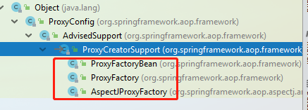
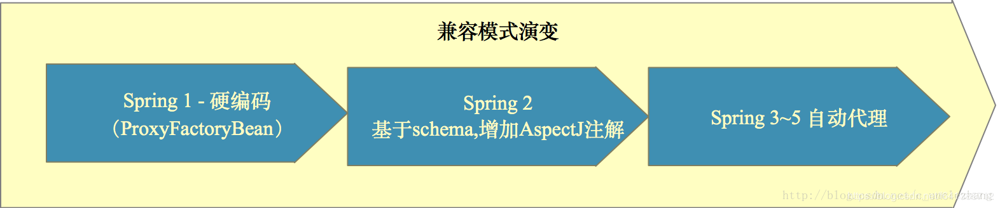

# 前言

Spring AOP是大家都非常熟悉的一个概念，在Spring家族体系中扮演着举足轻重的作用。

然后Spring作为一个优秀的框架，提供了多种应用层面上代理的方式：`ProxyFactoryBean`、`ProxyFactory`、`AspectJProxyFactory`

> 注意：此处这里指的是Spring提供的应用层得方式，并不是指的底层实现方式。底层实现方式现在只有业界都熟悉的两种：JDK动态代理和CGLIB代理~

`ProxyFactoryBean`是将我们的`AOP和IOC`融合起来，而ProxyFactory 则是只能通过代码**硬编码**进行编写 一般都是给`spring自己使用`。而`AspectJ`是目前大家最常用的 起到集成`AspectJ`和`Spring`~~~



Spring AOP进化史:



# 涉及的关键类说明

`ProxyConfig`：为上面三个类提供配置属性
`AdvisedSupport`:继承**ProxyConfig**，实现了Advised。封装了对通知（Advise）和通知器(Advisor)的操作
`ProxyCreatorSupport`:继承**AdvisedSupport**，其帮助子类（上面三个类）创建JDK或者cglib的代理对象
`Advised`：可以获取拦截器和其他 advice, Advisors和代理接口

# 涉及到的几个关键概念

`Advice`:**通知**，定义在连接点做什么，比如我们在方法前后进行日志打印（前置通知、后置通知、环绕通知等等）
`Pointcut`：**切点**，决定**advice**应该作用于那个连接点，比如根据**正则等规则匹配**哪些方法需要增强（Pointcut 目前有getClassFilter（类匹配），getMethodMatcher（方法匹配），Pointcut TRUE （全匹配））
`JoinPoint`：**连接点**，就是spring允许你是通知（Advice）的地方，那可就真多了，基本每个方法的前、后（两者都有也行），或抛出异常是时都可以是连接点，**spring只支持方法连接点**。其他如AspectJ还可以让你在构造器或属性注入时都行，不过那不是咱们关注的，只要记住，和方法有关的前前后后都是连接点（**通知方法里都可以获取到这个连接点，顺便获取到相关信息**）。
`Advisor`：**把pointcut和advice连接起来**（可由Spring去完成，我们都交给容器管理就行，当然，你也可以手动完成）Spring的Advisor是Pointcut和Advice的配置器，它是将**Advice**注入程序中**Pointcut**位置的代码。`org.springframework.aop.support.DefaultPointcutAdvisor`是最通用的Advisor类

继续阅读之前，强烈建议先阅读：[【小家Spring】Spring AOP原理使用的基础类打点（ProxyProcessorSupport、AopInfrastructureBean、Advised、TargetClassAware）](https://blog.csdn.net/f641385712/article/details/88925478)

# ProxyFactoryBean

使用Spring提供的类`org.springframework.aop.framework.ProxyFactoryBean`是创建AOP的最基本的方式。
它是个工厂Bean，然后我们可以自定义我们的代理实现逻辑，最终交给Spring容器管理即可。

```java
public class ProxyFactoryBean extends ProxyCreatorSupport
		implements FactoryBean<Object>, BeanClassLoaderAware, BeanFactoryAware {
		...
}
```

写个例子如下：

```java
// 先定义一个前置通知
@Component("logMethodBeforeAdvice")
public class LogMethodBeforeAdvice implements MethodBeforeAdvice {

    @Override
    public void before(Method method, Object[] args, Object target) throws Throwable {
        System.out.println("this is LogMethodBeforeAdvice");
    }
}

// 注册一个代理Bean
    @Bean
    public ProxyFactoryBean proxyFactoryBean(HelloService helloService) {
        ProxyFactoryBean factoryBean = new ProxyFactoryBean();

        //代理的目标对象  效果同setTargetSource(@Nullable TargetSource targetSource)
        // 此处需要注意的是，这里如果直接new，那么该类就不能使用@Autowired之类的注入  因此建议此处还是从容器中去拿
        // 因此可以写在入参上（这也是标准的写法~~）
        //factoryBean.setTarget(new HelloServiceImpl());
        factoryBean.setTarget(helloService);

        // setInterfaces和setProxyInterfaces的效果是相同的。设置需要被代理的接口，
        // 若没有实现接口，那就会采用cglib去代理
        // 需要说明的一点是：这里不设置也能正常被代理（若你没指定，Spring内部会去帮你找到所有的接口，然后全部代理上~~~~~~~~~~~~）  设置的好处是只代理指定的接口
        factoryBean.setInterfaces(HelloService.class);
        //factoryBean.setProxyInterfaces(new Class[]{HelloService.class});

        // 需要植入进目标对象的bean列表 此处需要注意：这些bean必须实现类 org.aopalliance.intercept.MethodInterceptor或 org.springframework.aop.Advisor的bean ,配置中的顺序对应调用的顺序
        factoryBean.setInterceptorNames("logMethodBeforeAdvice");

        // 若设置为true，强制使用cglib，默认是false的
        //factoryBean.setProxyTargetClass(true);

        return factoryBean;
    }

// main方法测试：
    public static void main(String[] args) {
        AnnotationConfigApplicationContext applicationContext = new AnnotationConfigApplicationContext(RootConfig.class);

        //expected single matching bean but found 2: helloServiceImpl,proxyFactoryBean
        // 如果通过类型获取，会找到两个Bean：一个我们自己的实现类、一个ProxyFactoryBean所生产的代理类 而此处我们显然是希望要生成的代理类的  因此我们只能通过名称来(或者加上@Primary)
        //HelloService bean = applicationContext.getBean(HelloService.class);
        HelloService bean = (HelloService) applicationContext.getBean("proxyFactoryBean");
        bean.hello();
        
        System.out.println(bean); //com.fsx.service.HelloServiceImpl@4e50c791
        System.out.println(bean.getClass()); //class com.sun.proxy.$Proxy22 用得JDK的动态代理
        // 顺便说一句：这样也是没错得。因为Spring AOP代理出来的每个代理对象，都默认实现了这个接口（它是个标记接口）
        // 它这个也就类似于所有的JDK代理出来的，都是Proxy的子类是一样的思想~
        SpringProxy springProxy = (SpringProxy) bean;
    }

输出：
this is LogMethodBeforeAdvice
this is my method~~
    
    // todo
    // 结果：其中"this is LogMethodBeforeAdvice"打印次数每次都不一样
    // debug的时候明显会多一些，但是却不进入断点
    /*
        this is LogMethodBeforeAdvice
        this is hello method
        this is LogMethodBeforeAdvice
        com.hy.springboot.aop.common.service.HelloServiceImpl@75329a49
        class com.sun.proxy.$Proxy10
         */
    //debug打印
    /*
    //sun.reflect.ConstructorAccessor#newInstance
    this is LogMethodBeforeAdvice
    this is LogMethodBeforeAdvice
    
    this is LogMethodBeforeAdvice
    this is hello method
    this is LogMethodBeforeAdvice
    com.hy.springboot.aop.common.service.HelloServiceImpl@31ea9581
    class com.sun.proxy.$Proxy10
    */
```


由此可见，我们的`HelloServiceImpl`就被成功代理了。下面我们稍微看看它是怎么创建这个代理的，直接来到`getObject()`方法：

```java
@Override
@Nullable
public Object getObject() throws BeansException {
    //就是根据我们配置的interceptorNames来获取对应的bean，并却转化成Advisor。
    //this.advisorChainInitialized：标示是否已进行过初始化，若以初始化则不再进行初始化。
    initializeAdvisorChain();

    //生成代理对象时,因为Spring中有singleton类型和prototype类型这两种不同的Bean,所以要对代理对象的生成做一个区分
    if (isSingleton()) {
        //生成singleton的代理对象,这个方法是ProxyFactoryBean生成AOPProxy代理对象的调用入口
        return getSingletonInstance();
    }
    else {
        if (this.targetName == null) {
            logger.warn("Using non-singleton proxies with singleton targets is often undesirable. " +
                        "Enable prototype proxies by setting the 'targetName' property.");
        }
        // 生成原型的代理对象
        return newPrototypeInstance();
    }
}

//通过读取interceptorNames将BeanFactory工厂内对应的Advice，Advisor，MethodInterceptor
//通过AdvisorAdapterRegistry.wrap(Advice需要有对应的AdvisorAdapter的支持才可以转换)转换为Advisor然后加载到执行链条中
private synchronized void initializeAdvisorChain() throws AopConfigException, BeansException {
    if (this.advisorChainInitialized) {
        return;
    }

    if (!ObjectUtils.isEmpty(this.interceptorNames)) {
        // Globals can't be last unless we specified a targetSource using the property...
        // 最后一个不能是全局的suffix *，除非我们指定了targetSource之类的
        if (this.interceptorNames[this.interceptorNames.length - 1].endsWith(GLOBAL_SUFFIX) &&
            this.targetName == null && this.targetSource == EMPTY_TARGET_SOURCE) {
            throw new AopConfigException("Target required after globals");
        }

        // Materialize interceptor chain from bean names.
        for (String name : this.interceptorNames) {

            // 如国拦截器的名称是以*结尾的，说明它要去全局里面都搜索出来
            // 全局：去自己容器以及父容器中找，类型为Advisor.class以及Interceptor.class所有的，名称是以这个名称为开头的prefix的Bean.
            // 最终也一样交给addAdvisorOnChainCreation(bean, name);   相当于一个批量处理吧  在特殊场景还是很有用处的
            if (name.endsWith(GLOBAL_SUFFIX)) {
                addGlobalAdvisor((ListableBeanFactory) this.beanFactory,
                                 name.substring(0, name.length() - GLOBAL_SUFFIX.length()));
            }

            // 绝大部分情况肯定都走这里：精确匹配
            else {
                Object advice;
                if (this.singleton || this.beanFactory.isSingleton(name)) {
                    // 从容器里把这个Bean拿出来~~~~~~~~~~~~~
                    advice = this.beanFactory.getBean(name);
                }
                // 多例的  这里每次都是new一个新的
                else {
                    // It's a prototype Advice or Advisor: replace with a prototype.
                    // Avoid unnecessary creation of prototype bean just for advisor chain initialization.
                    advice = new PrototypePlaceholderAdvisor(name);
                }
                // 这个方法的作用还挺大的：将advice对象添加到通知器链中
                //方法中首先会调用namedBeanToAdvisor(next)方法，将从ioc容器获取的普通对象转换成通知器Advisor对象。  详细如下：
                addAdvisorOnChainCreation(advice, name);
            }
        }
    }

    this.advisorChainInitialized = true;
}

//addAdvisorOnChainCreation
private void addAdvisorOnChainCreation(Object next, String name) {
    // We need to convert to an Advisor if necessary so that our source reference
    // matches what we find from superclass interceptors.
    // 这里调用namedBeanToAdvisor做了一下适配：成统一的Advisor 
    Advisor advisor = namedBeanToAdvisor(next);
    addAdvisor(advisor);
}
//namedBeanToAdvisor
private Advisor namedBeanToAdvisor(Object next) {
    try {
        return this.advisorAdapterRegistry.wrap(next);
    }
}
```

## DefaultAdvisorAdapterRegistry / AdvisorAdapterRegistry

```java
public class DefaultAdvisorAdapterRegistry implements AdvisorAdapterRegistry, Serializable {
	////通知器适配器集合
	private final List<AdvisorAdapter> adapters = new ArrayList<>(3);
	
	// 默认就支持这几种类型的适配器
	public DefaultAdvisorAdapterRegistry() {
		registerAdvisorAdapter(new MethodBeforeAdviceAdapter());
		registerAdvisorAdapter(new AfterReturningAdviceAdapter());
		registerAdvisorAdapter(new ThrowsAdviceAdapter());
	}

	////将通知封装为通知器
	@Override
	public Advisor wrap(Object adviceObject) throws UnknownAdviceTypeException {
		if (adviceObject instanceof Advisor) {
			return (Advisor) adviceObject;
		}
		if (!(adviceObject instanceof Advice)) {
			throw new UnknownAdviceTypeException(adviceObject);
		}

		Advice advice = (Advice) adviceObject;
		// 如果是MethodInterceptor类型，就根本不用适配器。DefaultPointcutAdvisor是天生处理这种有连接点得通知器的
		if (advice instanceof MethodInterceptor) {
			// So well-known it doesn't even need an adapter.
			return new DefaultPointcutAdvisor(advice);
		}
		
		// 这一步很显然了，就是校验看看这个advice是否是我们支持的这些类型（系统默认给出3中，但是我们也可以自己往里添加注册的）
		for (AdvisorAdapter adapter : this.adapters) {
			// Check that it is supported.
			if (adapter.supportsAdvice(advice)) {
				// 如果是支持的，也是被包装成了一个通用类型的DefaultPointcutAdvisor
				return new DefaultPointcutAdvisor(advice);
			}
		}
		throw new UnknownAdviceTypeException(advice);
	}

	////获得通知器的通知
	@Override
	public MethodInterceptor[] getInterceptors(Advisor advisor) throws UnknownAdviceTypeException {
		List<MethodInterceptor> interceptors = new ArrayList<>(3);
		Advice advice = advisor.getAdvice();
		if (advice instanceof MethodInterceptor) {
			interceptors.add((MethodInterceptor) advice);
		}
		
		// 从所支持的适配器中拿到拦截器通知器
		for (AdvisorAdapter adapter : this.adapters) {
			if (adapter.supportsAdvice(advice)) {
				// 这一步需要注意：一定要把从适配器中拿到MethodInterceptor类型的通知器
				interceptors.add(adapter.getInterceptor(advisor));
			}
		}
		if (interceptors.isEmpty()) {
			throw new UnknownAdviceTypeException(advisor.getAdvice());
		}
		return interceptors.toArray(new MethodInterceptor[0]);
	}

	////注册通知适配器
	@Override
	public void registerAdvisorAdapter(AdvisorAdapter adapter) {
		this.adapters.add(adapter);
	}
}
```

下面看看具体的生成代理的两个方法：`getSingletonInstance和newPrototypeInstance`
`getSingletonInstance`：

```java
private synchronized Object getSingletonInstance() {
    // 如果是单例的，现在这里持有这个缓存  创建过就不会再创建了
    if (this.singletonInstance == null) {
        // 根据设置的targetName，去工厂里拿到这个bean对象（普通Bean被包装成SingletonTargetSource）
        this.targetSource = freshTargetSource();

        // 这一步是如果你手动没有去设置需要被代理的接口，Spring还是会去帮你找看你有没有实现啥接口，然后全部给你代理上。可见Spring的容错性是很强的
        if (this.autodetectInterfaces && getProxiedInterfaces().length == 0 && !isProxyTargetClass()) {
            // Rely on AOP infrastructure to tell us what interfaces to proxy.
            Class<?> targetClass = getTargetClass();
            if (targetClass == null) {
                throw new FactoryBeanNotInitializedException("Cannot determine target class for proxy");
            }
            setInterfaces(ClassUtils.getAllInterfacesForClass(targetClass, this.proxyClassLoader));
        }
        // Initialize the shared singleton instance.
        super.setFrozen(this.freezeProxy);
        // createAopProxy()方法就是父类ProxyCreatorSupport的方法，它的具体原理在推荐的博文里已经讲过了，这里就不鳌诉了
        // 其中JdkDynamicAopProxy和CglibAopProxy对getProxy()方法的实现，也请参考前面分析
        this.singletonInstance = getProxy(createAopProxy());
    }
    return this.singletonInstance;
}
```

`newPrototypeInstance`：
多例的生成，基本和单例差不多。只是没有缓存了、然后每次创建得事后都是copy一份配置出来，创建一个代理实例~~~有兴趣的自个看哈~

## ProxyFactoryBean脱离IoC容器使用

虽然它大多数都是结合IoC容器一起使用，但是它脱离容器依然是可议单独使用的（毕竟生成代理得核心功能在父类`ProxyCreatorSupport`上，和容器无关的）。比如如下：

```java
public class Main {

    public static void main(String[] args) {
        String pointcutExpression = "execution( int com.fsx.maintest.Person.run() )";

        // =============================================================
        //因为我们要使用AspectJ,所以此处采用AspectJProxyFactory，当然你也可以使用和容器相关的ProxyFactoryBean
        ProxyFactoryBean factory = new ProxyFactoryBean();
        factory.setTarget(new Person());

        //AspectJProxyFactory factory = new AspectJProxyFactory(new Person());

        //声明一个aspectj切点,一张切面
        AspectJExpressionPointcut cut = new AspectJExpressionPointcut();
        cut.setExpression(pointcutExpression); // 设置切点表达式

        // 声明一个通知（此处使用环绕通知 MethodInterceptor ）
        Advice advice = (MethodInterceptor) invocation -> {
            System.out.println("============>放行前拦截...");
            Object obj = invocation.proceed();
            System.out.println("============>放行后拦截...");
            return obj;
        };

        //切面=切点+通知
        // 它还有个构造函数：DefaultPointcutAdvisor(Advice advice); 用的切面就是Pointcut.TRUE，所以如果你要指定切面，请使用自己指定的构造函数
        // Pointcut.TRUE：表示啥都返回true，也就是说这个切面作用于所有的方法上/所有的方法
        // addAdvice();方法最终内部都是被包装成一个 `DefaultPointcutAdvisor`，且使用的是Pointcut.TRUE切面，因此需要注意这些区别
        Advisor advisor = new DefaultPointcutAdvisor(cut, advice);
        factory.addAdvisor(advisor);
        //Person p = factory.getProxy();
        Person p = (Person) factory.getObject();

        // 执行方法
        p.run();
        p.run(10);
        p.say();
        p.sayHi("Jack");
        p.say("Tom", 666);

    }
}

class Person {
    public int run() {
        System.out.println("我在run...");
        return 0;
    }

    public void run(int i) {
        System.out.println("我在run...<" + i + ">");
    }

    public void say() {
        System.out.println("我在say...");
    }

    public void sayHi(String name) {
        System.out.println("Hi," + name + ",你好");
    }

    public int say(String name, int i) {
        System.out.println(name + "----" + i);
        return 0;
    }

}

```

# ProxyFactory

它和Spring容器没啥关系，可议直接创建代理来使用：

```java
public static void main(String[] args) {
        ProxyFactory proxyFactory = new ProxyFactory(new HelloServiceImpl());

        // 添加两个Advise，一个匿名内部类表示
        proxyFactory.addAdvice((AfterReturningAdvice) (returnValue, method, args1, target) ->
                System.out.println("AfterReturningAdvice method=" + method.getName()));
        proxyFactory.addAdvice(new LogMethodBeforeAdvice());
        
        HelloService proxy = (HelloService) proxyFactory.getProxy();
        proxy.hello();
    }

输出：
this is LogMethodBeforeAdvice
this is my method~~
AfterReturningAdvice method=hello
```

很显然它代理的Bean都是new出来的，所以比如`HelloServiceImpl`就不能和Spring IoC很好的结合了，所以一般都是Spring内部去使用。

```java
public class ProxyFactory extends ProxyCreatorSupport {
	// 它提供了丰富的构造函数~~~
	public ProxyFactory() {
	}
	public ProxyFactory(Object target) {
		setTarget(target);
		setInterfaces(ClassUtils.getAllInterfaces(target));
	}
	public ProxyFactory(Class<?>... proxyInterfaces) {
		setInterfaces(proxyInterfaces);
	}
	public ProxyFactory(Class<?> proxyInterface, Interceptor interceptor) {
		addInterface(proxyInterface);
		addAdvice(interceptor);
	}
	public ProxyFactory(Class<?> proxyInterface, TargetSource targetSource) {
		addInterface(proxyInterface);
		setTargetSource(targetSource);
	}
	
	// 创建代理的语句：调用父类ProxyCreatorSupport#createAopProxy 此处就不用再解释了
	public Object getProxy() {
		return createAopProxy().getProxy();
	}
	public Object getProxy(@Nullable ClassLoader classLoader) {
		return createAopProxy().getProxy(classLoader);
	}

	// 主义这是个静态方法，可以一步到位，代理指定的接口
	public static <T> T getProxy(Class<T> proxyInterface, Interceptor interceptor) {
		return (T) new ProxyFactory(proxyInterface, interceptor).getProxy();
	}
	public static <T> T getProxy(Class<T> proxyInterface, TargetSource targetSource) {
		return (T) new ProxyFactory(proxyInterface, targetSource).getProxy();
	}
	// 注意：若调用此方法生成代理，就直接使用的是CGLIB的方式的
	public static Object getProxy(TargetSource targetSource) {
		if (targetSource.getTargetClass() == null) {
			throw new IllegalArgumentException("Cannot create class proxy for TargetSource with null target class");
		}
		ProxyFactory proxyFactory = new ProxyFactory();
		proxyFactory.setTargetSource(targetSource);
		proxyFactory.setProxyTargetClass(true);
		return proxyFactory.getProxy();
	}
}
```

**原理**：由源代码可议看出，`ProxyFactory`的原理就是`ProxyCreatorSupport#createAopProxy`这个方法，其余的没啥了

# AspectJProxyFactory

其实`ProxyFactory`拥有的功能`AspectjProxyFactory`都有，它可以使用编程的方式去创建代理

在低版本Spring中定义一个切面是比较麻烦的，需要实现特定的接口，并进行一些较为复杂的配置，低版本Spring AOP的配置是被批评最多的地方。Spring听取这方面的批评声音，并下决心彻底改变这一现状。**在Spring2.0中，Spring AOP已经焕然一新，你可以使用@AspectJ注解非常容易的定义一个切面，不需要实现任何的接口**

AspectJ是目前大家最常用的 起到集成AspectJ和Spring，也就是我们平时长谈的：**自动代理模式**。它整个代理的过程全部交给Spring内部去完成，无侵入。

我们只需要配置切面、通知、切点表达式就能自动的实现切入的效果，使用起来极其方便，对调用者可以说是非常透明化的。相信这也是为何当下最流行这种方式的原因~
**Demo体验**

```java
    @Aspect
    class MyAspect {

        @Pointcut("execution(* hello(..))")
        private void beforeAdd() {
        }

        @Before("beforeAdd()")
        public void before1() {
            System.out.println("-----------before-----------");
        }

    }
```

在上述切面类定义中我们定义了一个**Advisor**（采用注解@Aspect标注的），其对应了一个**MethodBeforeAdvice**，实际上是一个**AspectJMethodBeforeAdvice**，该Advice对应的是上面的before1()方法，还对应了一个Pointcut：是一个**AspectJExpressionPointcut**。
该**Advisor**的语义拦截所有的方法名为**“hello”**的方法在它之前执行MyAspect.before1()方法。

如果我们现在需要创建一个代理对象，其需要绑定的**Advisor**逻辑跟上面定义的切面类中定义的Advisor类似。则我们可以进行如下编程：

```java
public static void main(String[] args) {
    AspectJProxyFactory proxyFactory = new AspectJProxyFactory(new HelloServiceImpl());
    // 注意：此处得MyAspect类上面的@Aspect注解必不可少
    proxyFactory.addAspect(MyAspect.class);
    //proxyFactory.setProxyTargetClass(true);//是否需要使用CGLIB代理
    HelloService proxy = proxyFactory.getProxy();
    proxy.hello();

    System.out.println(proxy.getClass()); //class com.sun.proxy.$Proxy6
}
输出：
-----------before-----------
this is my method~~
class com.sun.proxy.$Proxy6
```

这里面很有意思的地方在于：我们只是`proxyFactory.addAspect(MyAspect.class);`，就自动帮我们完成了方法、通知的绑定工作。

**原理**

```java
public class AspectJProxyFactory extends ProxyCreatorSupport {
	/** Cache for singleton aspect instances */
	private static final Map<Class<?>, Object> aspectCache = new ConcurrentHashMap<>();
	//基于AspectJ时,创建Spring AOP的Advice  下面详说
	private final AspectJAdvisorFactory aspectFactory = new ReflectiveAspectJAdvisorFactory();

	public AspectJProxyFactory() {
	}
	public AspectJProxyFactory(Object target) {
		Assert.notNull(target, "Target object must not be null");
		setInterfaces(ClassUtils.getAllInterfaces(target));
		setTarget(target);
	}
	public AspectJProxyFactory(Class<?>... interfaces) {
		setInterfaces(interfaces);
	}

	// 这两个addAspect方法是最重要的：我们可以把一个现有的aspectInstance传进去，当然也可以是一个Class（下面）======
	public void addAspect(Object aspectInstance) {
		Class<?> aspectClass = aspectInstance.getClass();
		String aspectName = aspectClass.getName();
		
		AspectMetadata am = createAspectMetadata(aspectClass, aspectName);
		// 显然这种直接传实例进来的，默认就是单例的。不是单例我们就报错了~~~~
		if (am.getAjType().getPerClause().getKind() != PerClauseKind.SINGLETON) {
			throw new IllegalArgumentException(
					"Aspect class [" + aspectClass.getName() + "] does not define a singleton aspect");
		}
		
		// 这个方法就非常的关键了~~~ Singleton...是它MetadataAwareAspectInstanceFactory的子类
		addAdvisorsFromAspectInstanceFactory(
				new SingletonMetadataAwareAspectInstanceFactory(aspectInstance, aspectName));
	}
	public void addAspect(Class<?> aspectClass) {
		String aspectName = aspectClass.getName();
		AspectMetadata am = createAspectMetadata(aspectClass, aspectName);
		MetadataAwareAspectInstanceFactory instanceFactory = createAspectInstanceFactory(am, aspectClass, aspectName);
		addAdvisorsFromAspectInstanceFactory(instanceFactory);
	}

	// 从切面工厂里，把对应切面实例里面的增强器（通知）都获取到~~~
	private void addAdvisorsFromAspectInstanceFactory(MetadataAwareAspectInstanceFactory instanceFactory) {
		// 从切面工厂里，先拿到所有的增强器们~~~
		List<Advisor> advisors = this.aspectFactory.getAdvisors(instanceFactory);
		Class<?> targetClass = getTargetClass();
		Assert.state(targetClass != null, "Unresolvable target class");
		advisors = AopUtils.findAdvisorsThatCanApply(advisors, targetClass);
		AspectJProxyUtils.makeAdvisorChainAspectJCapableIfNecessary(advisors);
		AnnotationAwareOrderComparator.sort(advisors);
		addAdvisors(advisors);
	}
}

```

注意：

- 需要注意的是在使用**AspectjProxyFactory**基于切面类创建代理对象时，我们指定的切面类上必须包含**@Aspect**注解。
- 虽然我们自己通过编程的方式可以通过**AspectjProxyFactory**创建基于`@Aspect`标注的切面类的代理，但是通过配置`<aop:aspectj-autoproxy/>（@EnableAspectJAutoProxy）`使用基于注解的`Aspectj`风格的Aop时，**Spring内部不是通过AspectjProxyFactory创建的代理对象，而是通过ProxyFactory**（这个在分析自动代理源码的时候有说到过~~~~）

# 总结

这三个类本身没有什么关系，但都继承自：`ProxyCreatorSupport`，创建代理对象的核心逻辑都是在ProxyCreatorSupport中实现的

**AspectJProxyFactory,ProxyFactoryBean,ProxyFactory** 大体逻辑都是：

1. 填充**AdvisedSupport**（ProxyCreatorSupport是其子类）的，然后交给父类**ProxyCreatorSupport**。
2. 得到**JDK**或者**CGLIB**的**AopProxy**
3. 代理调用时候被**invoke**或者**intercept**方法拦截 （分别在**JdkDynamicAopProxy**和**ObjenesisCglibAopProxy（CglibAopProxy的子类）**的中）
   并且在这两个方法中调用**ProxyCreatorSupport**的**getInterceptorsAndDynamicInterceptionAdvice**方法去初始化advice和各个方法直接映射关系并缓存
   
