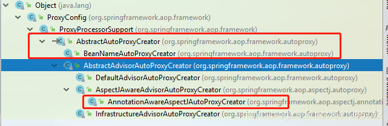

# 自动代理创建器

已经刚刚结合实例，介绍了`Spring AOP`的过程以及对源码进行了逐步分析~

但是这中间当时事忽略了整个Spring AOP最为核心的一个类：**==自动代理创建器==**。

本文将主要以`AnnotationAwareAspectJAutoProxyCreator`为引线，好好聊聊自动代理创建器是做什么的，具体做了什么，以及Spring为我们提供的其它几个Creator：==DefaultAdvisorAutoProxyCreator==，==InfrastructureAdvisorAutoProxyCreator==和==AspectJAwareAdvisorAutoProxyCreator==，有何区别和对应的实用场景



可以看出来，所有的创建器都是`AbstractAutoProxyCreator`该抽象类的子类~


当系统比较复杂，或者中需要进行aop进行织入的bean较多时，简单采用`ProxyFactoryBean`无疑会增加很多工作量（因为每个Bean都得手动写一个）。另外由于要从ProxyFactoryBean获得代理对象，也会使应用和Spring之间的耦合度增加，并且很多时候可维护性不强（我个人认为耦合这个不是最主要的原因，毕竟现在Spring已成为实际上的规范了）。

譬如，我们需要给bean名字满足“*service”的bean每个方法增加事务功能，如果采用`ProxyFacotryBean`必须为每个以service结尾的bean增加一个配置（工作量巨大），若需要修改，这个后果是灾难性的。

这样的情况下，自动代理的方式就能发挥它巨大的优势了，牛刀小试一把，上面案例只需下面一个类就搞定了（这里以功能最弱的**BeanNameAutoProxyCreator**为例）：

```xml
<bean class="org.springframework.aop.framework.autoproxy.BeanNameAutoProxyCreator">
  <property name="beanNames"><value>*service</value></property>
  <property name="interceptorNames">
    <list>
      <!-- 这里可以写具体的Interceptor的BeanName -->
      <value>myInterceptor</value>
    </list>
  </property>
</bean>
```

# Spring中自动创建代理器（分类）

在内部，Spring使用`BeanPostProcessor`让自动生成代理。基于`BeanPostProcessor`的自动代理创建器的实现类，将根据一些规则在容器实例化Bean时为匹配的Bean生成代理实例。代理创建器可以分为三类：

1. 基于Bean配置名规则的自动代理生成器：允许为一组特定配置名的Bean自动创建代理实例的代理创建器，实现类为**==BeanNameAutoProxyCreator==**
2. 基于Advisor匹配机制的自动代理创建器它会对容器中的**==所有Advisor==**进行扫描，自动将这些切面应用到匹配的Bean中，实现类是**==DefaultAdvisorAutoProxyCreator（它也支持前缀匹配）==**
3. 基于Bean中**==AspectJ==**注解的自动代理生成器：为包含**==AspectJ==**注解的切入的Bean自动创建代理实例
   

# AbstractAutoProxyCreator

```java
public abstract class AbstractAutoProxyCreator extends ProxyProcessorSupport
		implements SmartInstantiationAwareBeanPostProcessor, BeanFactoryAware {
		...
}
```

首先它继承自：`ProxyProcessorSupport`：这个类应该很熟了，我们之前介绍过的三大创建代理对象的工厂`ProxyFactoryBean、ProxyFactory、AspectJProxyFactory`都是继承自此类的
参考：[【小家Spring】面向切面编程Spring AOP创建代理的方式：ProxyFactoryBean、ProxyFactory、AspectJProxyFactory（JDK Proxy和CGLIB）](https://blog.csdn.net/f641385712/article/details/88926243)

这里还是简单的科普一下吧：

```java
// 显然，它是个ProxyConfig 拥有AOP的基本配置
public class ProxyProcessorSupport extends ProxyConfig implements Ordered, BeanClassLoaderAware, AopInfrastructureBean {
	...
	// 这是它最重要的一个方法：就是把该bean所有的实现的接口 都作用在ProxyFactory 上 当然是有过滤得
	protected void evaluateProxyInterfaces(Class<?> beanClass, ProxyFactory proxyFactory) {
		// 拿到该类所有实现的接口们~~~~
        // 先是直接实现接口，然后拿继承类的实现的接口，依次向上查找，实现接口不会向上查找
		Class<?>[] targetInterfaces = ClassUtils.getAllInterfacesForClass(beanClass, getProxyClassLoader());

		// 标记：是否存在“有问题的”代理接口  默认是false
		boolean hasReasonableProxyInterface = false;
		for (Class<?> ifc : targetInterfaces) {
			
			//判断这些接口是否是“有问题的”：既我们需要处理的
			if (!isConfigurationCallbackInterface(ifc) && !isInternalLanguageInterface(ifc) &&
					ifc.getMethods().length > 0) {
				hasReasonableProxyInterface = true;
				break;
			}
		}
		
		// 说明除开哪些接口外，但凡有一个有用的接口，就add进去（这样就会采用JDK的动态代理了）
		if (hasReasonableProxyInterface) {
			for (Class<?> ifc : targetInterfaces) {
                // 重要
				proxyFactory.addInterface(ifc);
			}
		}
		// 否则直接采用CGLIB
		else {
            // 重要
			proxyFactory.setProxyTargetClass(true);
		}
	}
	// InitializingBean...Aware接口的子接口等等这些回调性质的接口
	protected boolean isConfigurationCallbackInterface(Class<?> ifc) {
		return (InitializingBean.class == ifc || DisposableBean.class == ifc || Closeable.class == ifc ||
				AutoCloseable.class == ifc || ObjectUtils.containsElement(ifc.getInterfaces(), Aware.class));
	}
	// 接口名称为这些的  也就是spring aop自己的东西
	protected boolean isInternalLanguageInterface(Class<?> ifc) {
		return (ifc.getName().equals("groovy.lang.GroovyObject") ||
				ifc.getName().endsWith(".cglib.proxy.Factory") ||
				ifc.getName().endsWith(".bytebuddy.MockAccess"));
	}
	
}
```

`AbstractAutoProxyCreator`是对自动代理创建器的一个抽象实现。最重要的是，它实现了`SmartInstantiationAwareBeanPostProcessor`接口，因此会**==介入到Spring IoC容器Bean实例化的过程==**，因此由此为入口进行展开~

> `SmartInstantiationAwareBeanPostProcessor`继承自`InstantiationAwareBeanPostProcessor`继承自`BeanPostProcessor` 所以它需要实现的方法有很多~~~
> 这里重点提一个方法(如下图)：在bean被create之前，先会执行所有的`InstantiationAwareBeanPostProcessor#postProcessBeforeInstantiation`，谁第一个返回了不为null的Bean，后面就都不会执行了 。然后会再执行`BeanPostProcessor#postProcessAfterInitialization` 就完事了
>
> 说明：`SmartInstantiationAwareBeanPostProcessor`的实现类只有4个，分别是AbstractAutoProxyCreator、CommonAnnotationBeanPostProcessor、InstantiationAwareBeanPostProcessorAdapter、ScriptFactoryPostProcessor，其中只有AbstractAutoProxyCreator的实现`postProcessBeforeInstantiation(Class<?> beanClass, String beanName)`方法返回可能不为null（如果需要AOP代理则不会返回null），其他都是null
>
> 
>
> ```java
> AbstractAutowireCapableBeanFactory
> protected Object createBean(String beanName, RootBeanDefinition mbd, @Nullable Object[] args)
>  throws BeanCreationException {
>  ...
>      try {
>          // Give BeanPostProcessors a chance to return a proxy instead of the target bean instance.
>          // 此处就是AbstractAutoProxyCreator#postProcessBeforeInstantiation执行处
>          Object bean = resolveBeforeInstantiation(beanName, mbdToUse);
>          if (bean != null) {
>              return bean;
>          }
>      }
>  ...
>      // 如果上面InstantiationAwareBeanPostProcessor没有返回值则执行正常初始化流程
>      // 1.实例化bean(通过构造器)
>      // 2.populateBean(给属性赋值)
>      // 2.执行初始化方法
>      // 	1.回调Awear接口
>      // 	2.执行BeanPostProcessor#postProcessBeforeInitialization方法
>      // 	3.执行InitializingBean#afterPropertiesSet方法
>      // 	4.执行初始化方法，如<bean init-method=''>
>      // 	5.执行BeanPostProcessor#postProcessAfterInitialization方法
>      try {
>          Object beanInstance = doCreateBean(beanName, mbdToUse, args);
>          if (logger.isTraceEnabled()) {
>              logger.trace("Finished creating instance of bean '" + beanName + "'");
>          }
>          return beanInstance;
>      }
> }
> protected Object resolveBeforeInstantiation(String beanName, RootBeanDefinition mbd) {
>  Object bean = null;
>  if (!Boolean.FALSE.equals(mbd.beforeInstantiationResolved)) {
>      // Make sure bean class is actually resolved at this point.
>      if (!mbd.isSynthetic() && hasInstantiationAwareBeanPostProcessors()) {
>          Class<?> targetType = determineTargetType(beanName, mbd);
>          if (targetType != null) {
>              // 执行bean的实例化前处理器
>              bean = applyBeanPostProcessorsBeforeInstantiation(targetType, beanName);
>              if (bean != null) {
>                  // 执行bean的实例化后处理器
>                  bean = applyBeanPostProcessorsAfterInitialization(bean, beanName);
>              }
>          }
>      }
>      mbd.beforeInstantiationResolved = (bean != null);
>  }
>  return bean;
> }
> protected Object applyBeanPostProcessorsBeforeInstantiation(Class<?> beanClass, String beanName) {
>  for (BeanPostProcessor bp : getBeanPostProcessors()) {
>      if (bp instanceof InstantiationAwareBeanPostProcessor) {
>          InstantiationAwareBeanPostProcessor ibp = (InstantiationAwareBeanPostProcessor) bp;
>          Object result = ibp.postProcessBeforeInstantiation(beanClass, beanName);
>          // 返回不是null的
>          if (result != null) {
>              return result;
>          }
>      }
>  }
>  return null;
> }
> ```

按照执行顺序，我们来看看`AbstractAutoProxyCreator`的实现：

```java
public abstract class AbstractAutoProxyCreator extends ProxyProcessorSupport
		implements SmartInstantiationAwareBeanPostProcessor, BeanFactoryAware {
	
	// 实现类就是我们熟悉的它：	DefaultAdvisorAdapterRegistry
	private AdvisorAdapterRegistry advisorAdapterRegistry = GlobalAdvisorAdapterRegistry.getInstance();	

	// 目标源的创建器。它有一个方法getTargetSource(Class<?> beanClass, String beanName)
	// 两个实现类：QuickTargetSourceCreator和LazyInitTargetSourceCreator
	// 它的具体使用 后面有详解
	@Nullable
	private TargetSourceCreator[] customTargetSourceCreators;
	@Nullable
	private BeanFactory beanFactory;
	...
	private final Set<String> targetSourcedBeans = Collections.newSetFromMap(new ConcurrentHashMap<>(16));
	private final Set<Object> earlyProxyReferences = Collections.newSetFromMap(new ConcurrentHashMap<>(16));
	private final Map<Object, Class<?>> proxyTypes = new ConcurrentHashMap<>(16);
	private final Map<Object, Boolean> advisedBeans = new ConcurrentHashMap<>(256);
	...
	
	// 可以自己指定Registry 
	public void setAdvisorAdapterRegistry(AdvisorAdapterRegistry advisorAdapterRegistry) {
		this.advisorAdapterRegistry = advisorAdapterRegistry;
	}
	// 可议指定多个
	public void setCustomTargetSourceCreators(TargetSourceCreator... targetSourceCreators) {
		this.customTargetSourceCreators = targetSourceCreators;
	}
	// 通用拦截器得名字。These must be bean names in the current factory
	// 这些Bean必须在当前容器内存在的~~~
	public void setInterceptorNames(String... interceptorNames) {
		this.interceptorNames = interceptorNames;
	}
	//Set whether the common interceptors should be applied before bean-specific ones
	// 默认值是true
	public void setApplyCommonInterceptorsFirst(boolean applyCommonInterceptorsFirst) {
		this.applyCommonInterceptorsFirst = applyCommonInterceptorsFirst;
	}

	//===========下面是关于BeanPostProcessor的一些实现方法============
	
	// getBeanNamesForType()的时候会根据每个BeanName去匹配类型合适的Bean，这里不例外，也会帮忙在proxyTypes找一下
	@Override
	@Nullable
	public Class<?> predictBeanType(Class<?> beanClass, String beanName) {
		if (this.proxyTypes.isEmpty()) {
			return null;
		}
		Object cacheKey = getCacheKey(beanClass, beanName);
		return this.proxyTypes.get(cacheKey);
	}

	// getEarlyBeanReference()它是为了解决单例bean之间的循环依赖问题，提前将代理对象暴露出去
	@Override
	public Object getEarlyBeanReference(Object bean, String beanName) throws BeansException {
		Object cacheKey = getCacheKey(bean.getClass(), beanName);
		if (!this.earlyProxyReferences.contains(cacheKey)) {
			this.earlyProxyReferences.add(cacheKey);
		}
		return wrapIfNecessary(bean, beanName, cacheKey);
	}

	// 不做构造函数检测，返回null 让用空构造初始化吧
	@Override
	@Nullable
	public Constructor<?>[] determineCandidateConstructors(Class<?> beanClass, String beanName) throws BeansException {
		return null;
	}
	
	// 这个很重要，在Bean实例化之前，先给一个机会，看看缓存里有木有，有就直接返回得了
	// 简单的说：其主要目的在于如果用户使用了自定义的TargetSource对象，则直接使用该对象生成目标对象，而不会使用Spring的默认逻辑生成目标对象
	// (并且这里会判断各个切面逻辑是否可以应用到当前bean上)
	@Override
	public Object postProcessBeforeInstantiation(Class<?> beanClass, String beanName) throws BeansException {
		Object cacheKey = getCacheKey(beanClass, beanName);
		
		// beanName无效或者targetSourcedBeans里不包含此Bean
		if (!StringUtils.hasLength(beanName) || !this.targetSourcedBeans.contains(beanName)) {
			
			//advisedBeans：已经被通知了的（被代理了的）Bean~~~~  如果在这里面  也返回null 
			if (this.advisedBeans.containsKey(cacheKey)) {
				return null;
			}
			// isInfrastructureClass:Advice、Pointcut、Advisor、AopInfrastructureBean的子类，表示是框架所属的Bean
			// shouldSkip:默认都是返回false的。AspectJAwareAdvisorAutoProxyCreator重写此方法：只要存在一个Advisor   ((AspectJPointcutAdvisor) advisor).getAspectName().equals(beanName)成立  就返回true
			if (isInfrastructureClass(beanClass) || shouldSkip(beanClass, beanName)) {	
				// 所以这里会把我们所有的Advice、Pointcut、Advisor、AopInfrastructureBean等Bean都装进来
				this.advisedBeans.put(cacheKey, Boolean.FALSE);
				return null;
			}
		}

		//到这，只有在TargetSource中没有进行缓存，并且应该被切面逻辑环绕，但是目前还未生成代理对象的bean才会通过此方法

		// Create proxy here if we have a custom TargetSource.
		// 如果我们有TargetSourceCreator，这里就会创建一个代理对象
		// getCustomTargetSource逻辑：存在TargetSourceCreator  并且 beanFactory.containsBean(beanName)  然后遍历所有的TargetSourceCreator，调用getTargetSource谁先创建不为null就终止
		TargetSource targetSource = getCustomTargetSource(beanClass, beanName);
		// 若创建好了这个代理对象，继续进一步的操作：：：
		if (targetSource != null) {
			if (StringUtils.hasLength(beanName)) {
			  	// 缓存起来
				this.targetSourcedBeans.add(beanName);
			}
			
			//getAdvicesAndAdvisorsForBean：方法判断当前bean是否需要进行代理，若需要则返回满足条件的Advice(增强)或者Advisor(切面)集合
			// 这个方法由子类实现，AbstractAdvisorAutoProxyCreator和BeanNameAutoProxyCreator  代表中两种不同的代理方式
			Object[] specificInterceptors = getAdvicesAndAdvisorsForBean(beanClass, beanName, targetSource);
			
			// 顾名思义，就是根据目标对象创建代理对象的核心逻辑了 下面详解
			Object proxy = createProxy(beanClass, beanName, specificInterceptors, targetSource);
			
			// 把创建好的代理  缓存~~~
			this.proxyTypes.put(cacheKey, proxy.getClass());
			return proxy;
		}

		return null;
	}

	// 这个方法也很重要，若我们自己要实现一个TargetSourceCreator ，就可议实现我们自定义的逻辑了
	// 这里条件苛刻：customTargetSourceCreators 必须不为null
	// 并且容器内还必须有这个Bean：beanFactory.containsBean(beanName)    备注：此BeanName指的即将需要被代理得BeanName，而不是TargetSourceCreator 的BeanName
	//下面会介绍我们自己自定义一个TargetSourceCreator 来实现我们自己的逻辑
	@Nullable
	protected TargetSource getCustomTargetSource(Class<?> beanClass, String beanName) {
		// We can't create fancy target sources for directly registered singletons.
		if (this.customTargetSourceCreators != null &&
				this.beanFactory != null && this.beanFactory.containsBean(beanName)) {
			for (TargetSourceCreator tsc : this.customTargetSourceCreators) {
				TargetSource ts = tsc.getTargetSource(beanClass, beanName);
				if (ts != null) {
					// Found a matching TargetSource.
					if (logger.isDebugEnabled()) {
						logger.debug("TargetSourceCreator [" + tsc +
								" found custom TargetSource for bean with name '" + beanName + "'");
					}
					return ts;
				}
			}
		}

		// No custom TargetSource found.
		return null;
	}

	// 这三个方法，没做什么动作~~
	@Override
	public boolean postProcessAfterInstantiation(Object bean, String beanName) {
		return true;
	}
	@Override
	public PropertyValues postProcessPropertyValues(
			PropertyValues pvs, PropertyDescriptor[] pds, Object bean, String beanName) {
		return pvs;
	}
	@Override
	public Object postProcessBeforeInitialization(Object bean, String beanName) {
		return bean;
	}


	// 代理是通过AbstractAutoProxyCreator中的postProcessAfterInitialization()创建的
	// 因此这个方法是蛮重要的，主要是wrapIfNecessary()方法会特别的重要
	// earlyProxyReferences缓存：该缓存用于保存已经创建过代理对象的cachekey，**避免重复创建**
	@Override
	public Object postProcessAfterInitialization(@Nullable Object bean, String beanName) throws BeansException {
		if (bean != null) {
			Object cacheKey = getCacheKey(bean.getClass(), beanName);
			if (!this.earlyProxyReferences.contains(cacheKey)) {
				return wrapIfNecessary(bean, beanName, cacheKey);
			}
		}
		return bean;
	}

	// ============wrapIfNecessary方法==============
	protected Object wrapIfNecessary(Object bean, String beanName, Object cacheKey) {
		// 若此Bean已经在targetSourcedBeans里，说明已经被代理过，那就直接返回即可
		// (postProcessBeforeInstantiation()中成功创建的代理对象都会将beanName加入到targetSourceBeans中)
		if (StringUtils.hasLength(beanName) && this.targetSourcedBeans.contains(beanName)) {
			return bean;
		}
		
		// 如果该Bean基础框架Bean或者免代理得Bean，那也不处理
		if (Boolean.FALSE.equals(this.advisedBeans.get(cacheKey))) {
			return bean;
		}
		// 逻辑同上，对于实现了Advice，Advisor，AopInfrastructureBean接口的bean，都认为是spring aop的基础框架类，不能对他们创建代理对象，
		// 同时子类也可以覆盖shouldSkip方法来指定不对哪些bean进行代理
		if (isInfrastructureClass(bean.getClass()) || shouldSkip(bean.getClass(), beanName)) {
			this.advisedBeans.put(cacheKey, Boolean.FALSE);
			return bean;
		}

		// Create proxy if we have advice.
		// getAdvicesAndAdvisorsForBean该方法由子类实现，如国有Advice切面切进去了，我们就要给他代理
		//根据getAdvicesAndAdvisorsForBean()方法的具体实现的不同，AbstractAutoProxyCreator又分成了两类自动代理机制
		Object[] specificInterceptors = getAdvicesAndAdvisorsForBean(bean.getClass(), beanName, null);
		
		// 需要代理，那就进来给它创建一个代理对象吧
		if (specificInterceptors != DO_NOT_PROXY) {
			// 缓存起来，赋值为true，说明此key是被代理了的
			this.advisedBeans.put(cacheKey, Boolean.TRUE);
			
			// 创建这个代理对象
			Object proxy = createProxy(bean.getClass(), beanName, specificInterceptors, new SingletonTargetSource(bean));
			// 创建好后缓存起来  避免重复创建
			this.proxyTypes.put(cacheKey, proxy.getClass());
			return proxy;
		}
		
		// 不需要代理，也把这种不需要代理的对象给与缓存起来  赋值为false
		this.advisedBeans.put(cacheKey, Boolean.FALSE);
		return bean;
	}

	// 创建代理对象  specificInterceptors：作用在这个Bean上的增强器们
	// 这里需要注意的地方：入参是targetSource  而不是target
	// 所以最终代理的是  ``每次AOP代理处理方法调用时，目标实例都会用到TargetSource实现``
	protected Object createProxy(Class<?> beanClass, @Nullable String beanName,
			@Nullable Object[] specificInterceptors, TargetSource targetSource) {

		if (this.beanFactory instanceof ConfigurableListableBeanFactory) {
			AutoProxyUtils.exposeTargetClass((ConfigurableListableBeanFactory) this.beanFactory, beanName, beanClass);
		}
		
		// 这个我们非常熟悉了ProxyFactory   创建代理对象的三大方式之一~~~
        //
		ProxyFactory proxyFactory = new ProxyFactory();
		// 复制当前类的相关配置，因为当前类它也是个ProxyConfig
		proxyFactory.copyFrom(this);

		// 看看是否是基于类的代理（CGLIB），若表面上是基于接口的代理  我们还需要进一步去检测
		if (!proxyFactory.isProxyTargetClass()) {
			// shouldProxyTargetClass方法用于判断是否应该使用targetClass类而不是接口来进行代理
			// 默认实现为和该bean定义是否属性值preserveTargetClass为true有关。默认情况下都不会有此属性值的~~~~~
			if (shouldProxyTargetClass(beanClass, beanName)) {
				proxyFactory.setProxyTargetClass(true);
			}
			
			// 到此处，上面说了，就是把这个类实现的接口们，都放进proxyFactory（当然也会处理一些特殊的接口~~~不算数的）
			else {
				evaluateProxyInterfaces(beanClass, proxyFactory);
			}
		}
		
		// buildAdvisors：整理合并得到最终的advisors （毕竟interceptorNames还指定了一些拦截器的）
		// 至于调用的先后顺序，通过applyCommonInterceptorsFirst参数可以进行设置，若applyCommonInterceptorsFirst为true，interceptorNames属性指定的Advisor优先调用。默认为true
		Advisor[] advisors = buildAdvisors(beanName, specificInterceptors);
		// 添加进工厂里
		proxyFactory.addAdvisors(advisors);
		// 把targetSource放进去  TargetSource的实现方式有多种 后面会介绍
		proxyFactory.setTargetSource(targetSource);

		// 这个方法是交给子类的，子类可以继续去定制此proxyFactory（Spring内部并没有搭理它）
		customizeProxyFactory(proxyFactory);
		
		// 沿用this得freezeProxy的属性值
		proxyFactory.setFrozen(this.freezeProxy);
		
		// 设置preFiltered的属性值，默认是false。子类：AbstractAdvisorAutoProxyCreator修改为true
		// preFiltered：字段意思为：是否已为特定目标类筛选Advisor
		// 这个字段和DefaultAdvisorChainFactory.getInterceptorsAndDynamicInterceptionAdvice获取所有的Advisor有关
		//CglibAopProxy和JdkDynamicAopProxy都会调用此方法，然后递归执行所有的Advisor的
		if (advisorsPreFiltered()) {
			proxyFactory.setPreFiltered(true);
		}
		
		// getProxyClassLoader():调用者可议指定  否则为：ClassUtils.getDefaultClassLoader()
		return proxyFactory.getProxy(getProxyClassLoader());
	}

	// 下面，只剩一个重要的方法：buildAdvisors()没有解释了
	protected Advisor[] buildAdvisors(@Nullable String beanName, @Nullable Object[] specificInterceptors) {
		// 解析interceptorNames而来得Advisor数组~~~
		Advisor[] commonInterceptors = resolveInterceptorNames();

		// 注意：此处用得事Object
		List<Object> allInterceptors = new ArrayList<>();

		if (specificInterceptors != null) {
			allInterceptors.addAll(Arrays.asList(specificInterceptors));
				
			// 若解析它来的有内容
			if (commonInterceptors.length > 0) {
				// 放在头部  也就是最上面
				if (this.applyCommonInterceptorsFirst) {
					allInterceptors.addAll(0, Arrays.asList(commonInterceptors));
				}
				// 放在末尾
				else {
					allInterceptors.addAll(Arrays.asList(commonInterceptors));
				}
			}
		}

		// 把每一个Advisor都用advisorAdapterRegistry.wrap()包装一下~~~~
		// 注意wrap方法，默认只支持那三种类型的Advice转换为Advisor的~~~
        // AfterReturningAdvice、MethodBeforeAdvice、ThrowsAdvice
        // 默认包装成DefaultPointcutAdvisor类型
		Advisor[] advisors = new Advisor[allInterceptors.size()];
		for (int i = 0; i < allInterceptors.size(); i++) {
			advisors[i] = this.advisorAdapterRegistry.wrap(allInterceptors.get(i));
		}
		return advisors;
	}

	// 处理interceptorNames，去容器内找出来
	private Advisor[] resolveInterceptorNames() {
		BeanFactory bf = this.beanFactory;
		ConfigurableBeanFactory cbf = (bf instanceof ConfigurableBeanFactory ? (ConfigurableBeanFactory) bf : null);
		List<Advisor> advisors = new ArrayList<>();
		for (String beanName : this.interceptorNames) {
			// 排除一些情况：此工厂不是ConfigurableBeanFactory或者该Bean不在创建中
			if (cbf == null || !cbf.isCurrentlyInCreation(beanName)) {
				Assert.state(bf != null, "BeanFactory required for resolving interceptor names");
				
				// 拿到这个Bean，然后使用advisorAdapterRegistry把它适配一下即可~~~
				Object next = bf.getBean(beanName);
                //只支持以下三种Advice
                //AfterReturningAdvice
                //MethodBeforeAdvice
                //ThrowsAdvice
                // 为什么要wrap一下？
				advisors.add(this.advisorAdapterRegistry.wrap(next));
			}
		}
		return advisors.toArray(new Advisor[0]);
	}
}

public Advisor wrap(Object adviceObject) throws UnknownAdviceTypeException {
    if (adviceObject instanceof Advisor) {
        return (Advisor) adviceObject;
    }
    if (!(adviceObject instanceof Advice)) {
        throw new UnknownAdviceTypeException(adviceObject);
    }
    Advice advice = (Advice) adviceObject;
    if (advice instanceof MethodInterceptor) {
        // So well-known it doesn't even need an adapter.
        return new DefaultPointcutAdvisor(advice);
    }
    for (AdvisorAdapter adapter : this.adapters) {
        // Check that it is supported.
        if (adapter.supportsAdvice(advice)) {
            //默认包装成DefaultPointcutAdvisor类型
            return new DefaultPointcutAdvisor(advice);
        }
    }
    throw new UnknownAdviceTypeException(advice);
}

```

