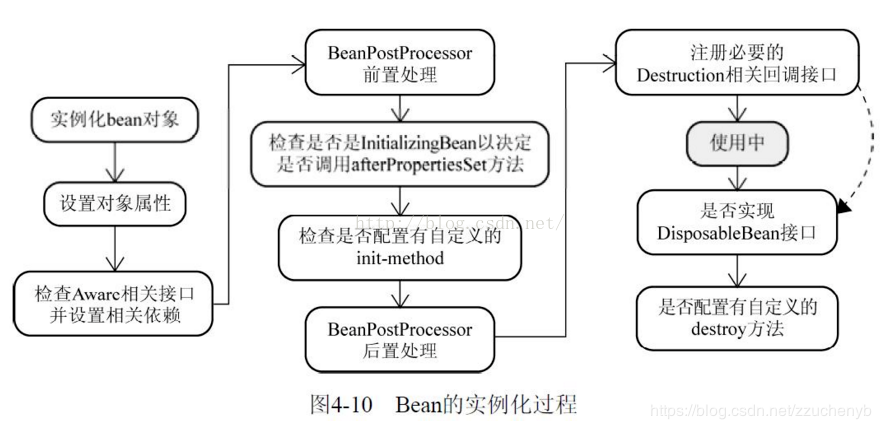

顶级接口：org.springframework.beans.factory.Aware，`标记接口`，用于容器回调

# 调用时机如下图所示



其中检查Aware相关接口并设置相关依赖到代码如下

```java
protected Object initializeBean(final String beanName, final Object bean, @Nullable RootBeanDefinition mbd) {
   //检查Aware相关接口并设置相关依赖
   if (System.getSecurityManager() != null) {
      AccessController.doPrivileged((PrivilegedAction<Object>) () -> {
         invokeAwareMethods(beanName, bean);
         return null;
      }, getAccessControlContext());
   }
   else {
      invokeAwareMethods(beanName, bean);
   }

   Object wrappedBean = bean;
   if (mbd == null || !mbd.isSynthetic()) {
      // BeanPostProcessor前置处理器，ApplicationContextAwareProcessor处理了部分Aware接口
      wrappedBean = applyBeanPostProcessorsBeforeInitialization(wrappedBean, beanName);
   }

   try {
      // 1. 调用实现InitializingBean接口的afterPropertiesSet方法
      // 2. 调用标注Bean注解的initMethod方法或者是xml中<bean init-method="">方法
      invokeInitMethods(beanName, wrappedBean, mbd);
   }
   catch (Throwable ex) {
      throw new BeanCreationException(
            (mbd != null ? mbd.getResourceDescription() : null),
            beanName, "Invocation of init method failed", ex);
   }
   if (mbd == null || !mbd.isSynthetic()) {
       // BeanPostProcessor后置处理器
      wrappedBean = applyBeanPostProcessorsAfterInitialization(wrappedBean, beanName);
   }

   return wrappedBean;
}
// 处理了BeanNameAware、BeanClassLoaderAware、BeanFactoryAware
private void invokeAwareMethods(final String beanName, final Object bean) {
   if (bean instanceof Aware) {
      if (bean instanceof BeanNameAware) {
         ((BeanNameAware) bean).setBeanName(beanName);
      }
      if (bean instanceof BeanClassLoaderAware) {
         ClassLoader bcl = getBeanClassLoader();
         if (bcl != null) {
            ((BeanClassLoaderAware) bean).setBeanClassLoader(bcl);
         }
      }
      if (bean instanceof BeanFactoryAware) {
         ((BeanFactoryAware) bean).setBeanFactory(AbstractAutowireCapableBeanFactory.this);
      }
   }
}
```

> 其中Aware接口的调用主要分布在两个位置（顺序排列）
>
> 1. BeanPostProcessor前置处理器调用之前，处理了实现了以下接口的Aware（3个，顺序排列）`BeanNameAware`、`BeanClassLoaderAware`、`BeanFactoryAware`
> 2. AbstractAutowireCapableBeanFactory#applyBeanPostProcessorsBeforeInitialization调用了BeanPostProcessor#postProcessBeforeInitialization方法，而ApplicationContextAwareProcessor是最先加进beanPostProcessors集合(CopyOnWriteArrayList)中的，在所有的BeanPostProcessor之前处理，处理了实现了以下接口的Aware（6个，顺序排列）`EnvironmentAware`、`EmbeddedValueResolverAware`、`ResourceLoaderAware`、`ApplicationEventPublisherAware`、`MessageSourceAware`、`ApplicationContextAware`

# Aware列表

容器管理的 Bean 一般不需要了解容器的状态和直接使用容器, 但是在某些情况下, 是需要在 Bean 中直接对IOC容器进行操作的, 可以通过特定的 `Aware` 接口来完成. `aware` 接口有以下这些：

|             接口名             |                             描述                             | Processor                                             |
| :----------------------------: | :----------------------------------------------------------: | :---------------------------------------------------- |
|    ApplicationContextAware     | 实现了这个接口的类都可以获取到一个 ApplicationContext 对象. 可以获取容器中的所有 Bean | ApplicationContextAwareProcessor                      |
| ApplicationEventPublisherAware | 在 bean 中可以得到应用上下文的事件发布器, 从而可以在Bean中发布应用上下文的事件. | ApplicationContextAwareProcessor                      |
|      BeanClassLoaderAware      |                     获取 bean 的类加载器                     | AbstractAutowireCapableBeanFactory#invokeAwareMethods |
|        BeanFactoryAware        |                       获取 bean 的工厂                       | AbstractAutowireCapableBeanFactory#invokeAwareMethods |
|         BeanNameAware          |                   获取 bean 在容器中的名字                   | AbstractAutowireCapableBeanFactory#invokeAwareMethods |
|   EmbeddedValueResolverAware   |      实现该接口可以获取Spring加载properties文件的属性值      | ApplicationContextAwareProcessor                      |
|        EnvironmentAware        |            实现该接口可以获取到系统的环境变量信息            | ApplicationContextAwareProcessor                      |
|          ImportAware           |            获取导入的@Configuration类的注解元数据            | ConfigurationClassPostProcessor                       |
|     BootstrapContextAware      |              获取 BootstrapContext，位于tx包中               |                                                       |
|      LoadTimeWeaverAware       |          加载Spring Bean时织入第三方模块, 如AspectJ          | LoadTimeWeaverAwareProcessor                          |
|       MessageSourceAware       |                  主要用于获取国际化相关接口                  | ApplicationContextAwareProcessor                      |
|   NotificationPublisherAware   |               允许spring管理的mbean发布JMX通知               | 无                                                    |
|      ResourceLoaderAware       |                  初始化时注入ResourceLoader                  | ApplicationContextAwareProcessor                      |
|       ServletConfigAware       |                web开发过程中获取ServletConfig                | ServletContextAwareProcessor                          |
|      ServletContextAware       |             web开发过程中获取ServletContext信息              | ServletContextAwareProcessor                          |

# 接口详细说明

## ApplicationContextAware

实现ApplicationContextAware接口的Bean可以获得Spring上下文信息ApplicationContext，**[ApplicationContextAware](https://docs.spring.io/spring/docs/current/javadoc-api/org/springframework/context/ApplicationContextAware.html)**接口内部只有一个方法：

```java
void setApplicationContext(ApplicationContext applicationContext) throws BeansException;
```

该方法会在Spring容器加载完后被调用，用户只要实现这个接口就能拿到Spring上下文信息。

调用链

1. org.springframework.beans.factory.support.AbstractAutowireCapableBeanFactory#initializeBean(java.lang.String, java.lang.Object, org.springframework.beans.factory.support.RootBeanDefinition)

2. org.springframework.beans.factory.support.AbstractAutowireCapableBeanFactory#applyBeanPostProcessorsBeforeInitialization
3. org.springframework.context.support.ApplicationContextAwareProcessor#invokeAwareInterfaces,这个方法位于`ApplicationContextAwareProcessor`，意为`ApplicationContextAware`处理器，`postProcessBeforeInitialization`不会处理如下实现如下接口的bean

`EnvironmentAware`，`EmbeddedValueResolverAware`，`ResourceLoaderAware`，`ApplicationEventPublisherAware`，`MessageSourceAware`，`ApplicationContextAware`

```java
public Object postProcessBeforeInitialization(Object bean, String beanName) throws BeansException {
    if (!(bean instanceof EnvironmentAware || bean instanceof EmbeddedValueResolverAware ||
          bean instanceof ResourceLoaderAware || bean instanceof ApplicationEventPublisherAware ||
          bean instanceof MessageSourceAware || bean instanceof ApplicationContextAware)){
        return bean;
    }

    AccessControlContext acc = null;

    if (System.getSecurityManager() != null) {
        acc = this.applicationContext.getBeanFactory().getAccessControlContext();
    }

    if (acc != null) {
        AccessController.doPrivileged((PrivilegedAction<Object>) () -> {
            invokeAwareInterfaces(bean);
            return null;
        }, acc);
    }
    else {
        invokeAwareInterfaces(bean);
    }

    return bean;
}

private void invokeAwareInterfaces(Object bean) {
    if (bean instanceof EnvironmentAware) {
        ((EnvironmentAware) bean).setEnvironment(this.applicationContext.getEnvironment());
    }
    if (bean instanceof EmbeddedValueResolverAware) {
        ((EmbeddedValueResolverAware) bean).setEmbeddedValueResolver(this.embeddedValueResolver);
    }
    if (bean instanceof ResourceLoaderAware) {
        ((ResourceLoaderAware) bean).setResourceLoader(this.applicationContext);
    }
    if (bean instanceof ApplicationEventPublisherAware) {
        ((ApplicationEventPublisherAware) bean).setApplicationEventPublisher(this.applicationContext);
    }
    if (bean instanceof MessageSourceAware) {
        ((MessageSourceAware) bean).setMessageSource(this.applicationContext);
    }
    if (bean instanceof ApplicationContextAware) {
        ((ApplicationContextAware) bean).setApplicationContext(this.applicationContext);
    }
}
```

## ApplicationEventPublisherAware

该接口主要用于发布一些事件时使用，接口方法如下:

```java
void setApplicationEventPublisher(ApplicationEventPublisher applicationEventPublisher);
```

实现该接口能获取到ApplicationEventPublisher，这个接口具备发布事件功能。

调用位置也在`org.springframework.context.support.ApplicationContextAwareProcessor#invokeAwareInterfaces`

## BeanClassLoaderAware

该接口可以获取到加载当前类的类加载器

```java
void setBeanClassLoader(ClassLoader classLoader);
```

## BeanFactoryAware

主要哪个用于获取BeanFactory接口。

```java
void setBeanFactory(BeanFactory beanFactory) throws BeansException;
```

## BeanNameAware

获取 bean 在容器中的名字

```java
void setBeanName(String name);
```

## EmbeddedValueResolverAware

实现该接口可以获取Spring加载properties文件的属性值

```java
void setEmbeddedValueResolver(StringValueResolver resolver);
```

## EnvironmentAware

实现该接口可以获取到系统的环境变量信息

```java
void setEnvironment(Environment environment);
```

## ImportAware

获取导入的@Configuration类的注解元数据

```java
void setImportMetadata(AnnotationMetadata importMetadata);
```

## BootstrapContextAware

获取 BootstrapContext，位于tx包中。

拿到BootstrapContext信息，BootstrapContext暂时不清楚用来干啥，官方解释为:

这提供了一种机制，通过引导环境资源适配器实例时，它是引导。那是，当（开始（bootstrapcontext））在resourceadapter类的方法调用。引导上下文包含对资源适配器实例可用的有用设施的引用。

```java
void setBootstrapContext(BootstrapContext bootstrapContext);
```

## LoadTimeWeaverAware

加载Spring Bean时织入第三方模块, 如AspectJ

```java
void setLoadTimeWeaver(LoadTimeWeaver loadTimeWeaver);
```

## MessageSourceAware

主要用于获取国际化相关接口

```java
void setMessageSource(MessageSource messageSource);
```

## NotificationPublisherAware

  允许spring管理的mbean发布JMX通知

```java
void setNotificationPublisher(NotificationPublisher notificationPublisher);
```

## ResourceLoaderAware

  初始化时注入ResourceLoader

```java
void setResourceLoader(ResourceLoader resourceLoader);
```

## ServletConfigAware

web开发过程中获取ServletConfig

```java
void setServletConfig(ServletConfig servletConfig);
```

## ServletContextAware

web开发过程中获取ServletContext信息

```java
void setServletContext(ServletContext servletContext);
```