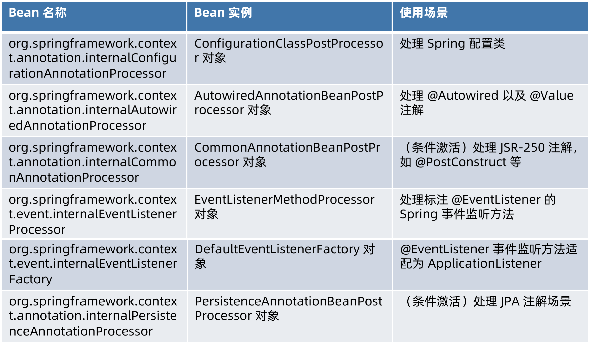
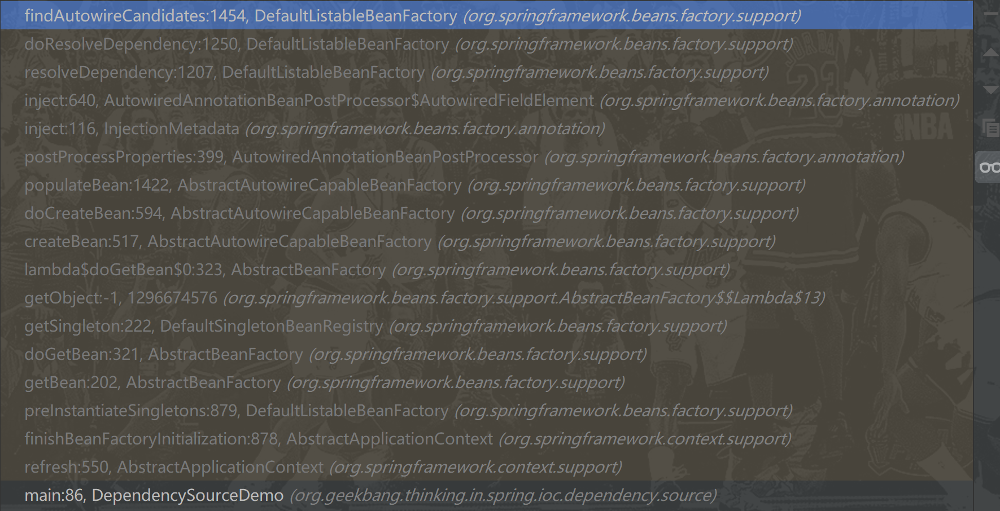

# 依赖查找的来源

## 查找来源

| 来源                  | 配置元数据                                   |
| --------------------- | -------------------------------------------- |
| Spring BeanDefinition | <bean id="user" class="org.geekbang...User"> |
|                       | @Bean public User user(){...}                |
|                       | BeanDefinitionBuilder                        |
| 单例对象              | API 实现                                     |

##  Spring 內建 BeanDefintion



##  Spring 內建单例对象


# 依赖注入的来源

| 来源                   | 配置元数据                                   |
| ---------------------- | -------------------------------------------- |
| Spring BeanDefinition  | <bean id="user" class="org.geekbang...User"> |
|                        | @Bean public User user(){...}                |
|                        | BeanDefinitionBuilder                        |
| 单例对象               | API 实现                                     |
| 非 Spring 容器管理对象 |                                              |

**非 Spring 容器管理对象 (resolvableDependencies)**：Spring容器即BeanFactory，这些对象并不存在与BeanFactory中，即不被BeanFactory管理，而是存在于ApplicationContext的一个成员变量Map中。**不能用于依赖查找**，就是是说为什么依赖注入比依赖查找多的一个来源

如果在代码中这样获取ApplicationContext类型的Bean

```java
ApplicationContext bean = applicationContext.getBean(ApplicationContext.class);
```

结果是：NoSuchBeanDefinitionException异常

```java
Exception in thread "main" org.springframework.beans.factory.NoSuchBeanDefinitionException: No qualifying bean of type 'org.springframework.context.ApplicationContext' available
	at org.springframework.beans.factory.support.DefaultListableBeanFactory.getBean(DefaultListableBeanFactory.java:351)
	at org.springframework.beans.factory.support.DefaultListableBeanFactory.getBean(DefaultListableBeanFactory.java:342)
	at org.springframework.context.support.AbstractApplicationContext.getBean(AbstractApplicationContext.java:1126)
	at org.geekbang.thinking.in.spring.ioc.dependency.source.DependencySourceDemo.main(DependencySourceDemo.java:89)
```


## 代码说明

1. AbstractApplicationContext:

```java
@Override
public void refresh() throws BeansException, IllegalStateException {
    synchronized (this.startupShutdownMonitor) {
        // Prepare this context for refreshing.
        prepareRefresh();

        // Tell the subclass to refresh the internal bean factory.
        ConfigurableListableBeanFactory beanFactory = obtainFreshBeanFactory();

        // Prepare the bean factory for use in this context.
        prepareBeanFactory(beanFactory);
    }
}
```

2. 在prepareBeanFactory方法中手动注册了四个对象
   1. BeanFactory：底层IOC容器
   2. ResourceLoader：当前ApplicationContext
   3. ApplicationEventPublisher：当前ApplicationContext
   4. ApplicationContext：当前类

```java
protected void prepareBeanFactory(ConfigurableListableBeanFactory beanFactory) {

    // BeanFactory interface not registered as resolvable type in a plain factory.
    // MessageSource registered (and found for autowiring) as a bean.
    beanFactory.registerResolvableDependency(BeanFactory.class, beanFactory);
    beanFactory.registerResolvableDependency(ResourceLoader.class, this);
    beanFactory.registerResolvableDependency(ApplicationEventPublisher.class, this);
    beanFactory.registerResolvableDependency(ApplicationContext.class, this);
}

```
DefaultListableBeanFactory

```java
	/** Map from dependency type to corresponding autowired value. */
	private final Map<Class<?>, Object> resolvableDependencies = new ConcurrentHashMap<>(16);

public void registerResolvableDependency(Class<?> dependencyType, @Nullable Object autowiredValue) {
    Assert.notNull(dependencyType, "Dependency type must not be null");
    if (autowiredValue != null) {
        if (!(autowiredValue instanceof ObjectFactory || dependencyType.isInstance(autowiredValue))) {
            throw new IllegalArgumentException("Value [" + autowiredValue +
                                               "] does not implement specified dependency type [" + dependencyType.getName() + "]");
        }
        this.resolvableDependencies.put(dependencyType, autowiredValue);
    }
}
```


3. 如果是依赖注入，Spring内部会调用**AutowireCapableBeanFactory**（自动注入能力的BeanFactory）的resolveDependency方法。**注意：这是内部依赖注入时用的**

```java
Object resolveDependency(DependencyDescriptor descriptor, @Nullable String requestingBeanName,
			@Nullable Set<String> autowiredBeanNames, @Nullable TypeConverter typeConverter) throws BeansException;
```

实现类：**DefaultListableBeanFactory**

```java
public Object resolveDependency(DependencyDescriptor descriptor, @Nullable String requestingBeanName,
                                @Nullable Set<String> autowiredBeanNames, @Nullable TypeConverter typeConverter) throws BeansException {

    descriptor.initParameterNameDiscovery(getParameterNameDiscoverer());
    if (Optional.class == descriptor.getDependencyType()) {
        return createOptionalDependency(descriptor, requestingBeanName);
    }
    else if (ObjectFactory.class == descriptor.getDependencyType() ||
             ObjectProvider.class == descriptor.getDependencyType()) {
        return new DependencyObjectProvider(descriptor, requestingBeanName);
    }
    else if (javaxInjectProviderClass == descriptor.getDependencyType()) {
        return new Jsr330Factory().createDependencyProvider(descriptor, requestingBeanName);
    }
    else {
        Object result = getAutowireCandidateResolver().getLazyResolutionProxyIfNecessary(
            descriptor, requestingBeanName);
        if (result == null) {
            result = doResolveDependency(descriptor, requestingBeanName, autowiredBeanNames, typeConverter);
        }
        return result;
    }
}
```

4. 正常情况下回调用**doResolveDependency**方法

```java
public Object doResolveDependency(DependencyDescriptor descriptor, @Nullable String beanName,
                                  @Nullable Set<String> autowiredBeanNames, @Nullable TypeConverter typeConverter) throws BeansException {
    ...
        try {
            ...
                Map<String, Object> matchingBeans = findAutowireCandidates(beanName, type, descriptor);
            ...
                return result;
        }
    finally {
        ConstructorResolver.setCurrentInjectionPoint(previousInjectionPoint);
    }
}
```

5. findAutowireCandidates：找到注入的候选bean

在这个方法中会循环resolvableDependencies(里面存有在步骤2中的4个对象)

```java
protected Map<String, Object> findAutowireCandidates(
    @Nullable String beanName, Class<?> requiredType, DependencyDescriptor descriptor) {

    //1. 首先根据类型去所有ioc容器(父子)中查找BeanNames，如果是非Spring容器管理的对象，
    //candidateNames为空
    String[] candidateNames = BeanFactoryUtils.beanNamesForTypeIncludingAncestors(
        this, requiredType, true, descriptor.isEager());
    Map<String, Object> result = new LinkedHashMap<>(candidateNames.length);
    // 2. 从resolvableDependencies(非Spring容器管理的对象集合)中查找
    for (Map.Entry<Class<?>, Object> classObjectEntry : this.resolvableDependencies.entrySet()) {
        Class<?> autowiringType = classObjectEntry.getKey();
        if (autowiringType.isAssignableFrom(requiredType)) {
            Object autowiringValue = classObjectEntry.getValue();
            autowiringValue = AutowireUtils.resolveAutowiringValue(autowiringValue, requiredType);
            if (requiredType.isInstance(autowiringValue)) {
                result.put(ObjectUtils.identityToString(autowiringValue), autowiringValue);
                break;
            }
        }
    }
  	...
    return result;
}
```


执行流程：



# Spring 容器管理和游离对象


# Spring BeanDefinition 作为依赖来源

## 元数据：BeanDefinition

```java
public interface BeanDefinition extends AttributeAccessor, BeanMetadataElement {

	String SCOPE_SINGLETON = ConfigurableBeanFactory.SCOPE_SINGLETON;
	String SCOPE_PROTOTYPE = ConfigurableBeanFactory.SCOPE_PROTOTYPE;
	int ROLE_APPLICATION = 0;
	int ROLE_SUPPORT = 1;
	int ROLE_INFRASTRUCTURE = 2;

	// Modifiable attributes
	void setParentName(@Nullable String parentName);
	String getParentName();
	void setBeanClassName(@Nullable String beanClassName);
	String getBeanClassName();
	void setScope(@Nullable String scope);
	String getScope();
	void setLazyInit(boolean lazyInit);
	boolean isLazyInit();
	void setDependsOn(@Nullable String... dependsOn);
	String[] getDependsOn();
	void setAutowireCandidate(boolean autowireCandidate);
	boolean isAutowireCandidate();
	void setPrimary(boolean primary);
	boolean isPrimary();
	void setFactoryBeanName(@Nullable String factoryBeanName);
	String getFactoryBeanName();
	void setFactoryMethodName(@Nullable String factoryMethodName);
	String getFactoryMethodName();
	ConstructorArgumentValues getConstructorArgumentValues();
	default boolean hasConstructorArgumentValues() {
		return !getConstructorArgumentValues().isEmpty();
	}
	MutablePropertyValues getPropertyValues();
	default boolean hasPropertyValues() {
		return !getPropertyValues().isEmpty();
	}
	void setInitMethodName(@Nullable String initMethodName);
	String getInitMethodName();
	void setDestroyMethodName(@Nullable String destroyMethodName);
	String getDestroyMethodName();
	void setRole(int role);
	int getRole();
	void setDescription(@Nullable String description);
	String getDescription();

	// Read-only attributes
	ResolvableType getResolvableType();
	boolean isSingleton();
	boolean isPrototype();
	boolean isAbstract();
	String getResourceDescription();
	BeanDefinition getOriginatingBeanDefinition();
}

```

## 注册：BeanDefinitionRegistry#registerBeanDefinition

唯一实现**DefaultListableBeanFactory**

```java
/** Whether to allow re-registration of a different definition with the same name. */
private boolean allowBeanDefinitionOverriding = true;

public void registerBeanDefinition(String beanName, BeanDefinition beanDefinition)
    throws BeanDefinitionStoreException {

    Assert.hasText(beanName, "Bean name must not be empty");
    Assert.notNull(beanDefinition, "BeanDefinition must not be null");

    if (beanDefinition instanceof AbstractBeanDefinition) {
        try {
            ((AbstractBeanDefinition) beanDefinition).validate();
        }
        catch (BeanDefinitionValidationException ex) {
            throw new BeanDefinitionStoreException(beanDefinition.getResourceDescription(), beanName,
                                                   "Validation of bean definition failed", ex);
        }
    }

    BeanDefinition existingDefinition = this.beanDefinitionMap.get(beanName);
    if (existingDefinition != null) {
        if (!isAllowBeanDefinitionOverriding()) {
            throw new BeanDefinitionOverrideException(beanName, beanDefinition, existingDefinition);
        }
        else if (existingDefinition.getRole() < beanDefinition.getRole()) {
            // e.g. was ROLE_APPLICATION, now overriding with ROLE_SUPPORT or ROLE_INFRASTRUCTURE
            if (logger.isInfoEnabled()) {
                logger.info("Overriding user-defined bean definition for bean '" + beanName +
                            "' with a framework-generated bean definition: replacing [" +
                            existingDefinition + "] with [" + beanDefinition + "]");
            }
        }
        else if (!beanDefinition.equals(existingDefinition)) {
            if (logger.isDebugEnabled()) {
                logger.debug("Overriding bean definition for bean '" + beanName +
                             "' with a different definition: replacing [" + existingDefinition +
                             "] with [" + beanDefinition + "]");
            }
        }
        else {
            if (logger.isTraceEnabled()) {
                logger.trace("Overriding bean definition for bean '" + beanName +
                             "' with an equivalent definition: replacing [" + existingDefinition +
                             "] with [" + beanDefinition + "]");
            }
        }
        this.beanDefinitionMap.put(beanName, beanDefinition);
    }
    else {
        if (hasBeanCreationStarted()) {
            // Cannot modify startup-time collection elements anymore (for stable iteration)
            synchronized (this.beanDefinitionMap) {
                this.beanDefinitionMap.put(beanName, beanDefinition);
                List<String> updatedDefinitions = new ArrayList<>(this.beanDefinitionNames.size() + 1);
                updatedDefinitions.addAll(this.beanDefinitionNames);
                updatedDefinitions.add(beanName);
                this.beanDefinitionNames = updatedDefinitions;
                removeManualSingletonName(beanName);
            }
        }
        else {
            // Still in startup registration phase
            this.beanDefinitionMap.put(beanName, beanDefinition);
            this.beanDefinitionNames.add(beanName);
            removeManualSingletonName(beanName);
        }
        this.frozenBeanDefinitionNames = null;
    }

    if (existingDefinition != null || containsSingleton(beanName)) {
        resetBeanDefinition(beanName);
    }
}
```

其中isAllowBeanDefinitionOverriding()方法用于**是否允许重新注册具有相同名称的不同定义**，在Spring框架中默认为true

但是在SpringBoot 2.1之后默认为false;

SpringApplication：

```java
// 默认为false
private boolean allowBeanDefinitionOverriding;

public ConfigurableApplicationContext run(String... args) {
    ...
        try {
            ApplicationArguments applicationArguments = new DefaultApplicationArguments(
                args);
            ConfigurableEnvironment environment = prepareEnvironment(listeners,
                                                                     applicationArguments);
            configureIgnoreBeanInfo(environment);
            Banner printedBanner = printBanner(environment);
            context = createApplicationContext();
            exceptionReporters = getSpringFactoriesInstances(
                SpringBootExceptionReporter.class,
                new Class[] { ConfigurableApplicationContext.class }, context);
            prepareContext(context, environment, listeners, applicationArguments,
                           printedBanner);
            refreshContext(context);
            afterRefresh(context, applicationArguments);
            ...
        }
    catch (Throwable ex) {
        handleRunFailure(context, ex, exceptionReporters, listeners);
        throw new IllegalStateException(ex);

        ...
    }
}

private void prepareContext(ConfigurableApplicationContext context,
                            ConfigurableEnvironment environment, SpringApplicationRunListeners listeners,
                            ApplicationArguments applicationArguments, Banner printedBanner) {
    context.setEnvironment(environment);
    postProcessApplicationContext(context);
    applyInitializers(context);
    listeners.contextPrepared(context);
    if (this.logStartupInfo) {
        logStartupInfo(context.getParent() == null);
        logStartupProfileInfo(context);
    }
    // Add boot specific singleton beans
    ConfigurableListableBeanFactory beanFactory = context.getBeanFactory();
    beanFactory.registerSingleton("springApplicationArguments", applicationArguments);
    if (printedBanner != null) {
        beanFactory.registerSingleton("springBootBanner", printedBanner);
    }
    if (beanFactory instanceof DefaultListableBeanFactory) {
        // 设置是否允许重新注册具有相同名称的不同定义
        ((DefaultListableBeanFactory) beanFactory)
        .setAllowBeanDefinitionOverriding(this.allowBeanDefinitionOverriding);
    }
    // Load the sources
    Set<Object> sources = getAllSources();
    Assert.notEmpty(sources, "Sources must not be empty");
    load(context, sources.toArray(new Object[0]));
    listeners.contextLoaded(context);
}

/**
	 * Sets if bean definition overriding, by registering a definition with the same name
	 * as an existing definition, should be allowed. Defaults to {@code false}.
	 * @param allowBeanDefinitionOverriding if overriding is allowed
	 * @since 2.1
	 * @see DefaultListableBeanFactory#setAllowBeanDefinitionOverriding(boolean)
	 */
// 注释说明从2.1开始默认为false
public void setAllowBeanDefinitionOverriding(boolean allowBeanDefinitionOverriding) {
    this.allowBeanDefinitionOverriding = allowBeanDefinitionOverriding;
}
```

怎么修改呢？

在application.properties文件中定义：

```pro
# 允许bean覆盖
spring.main.allow-bean-definition-overriding=true
```


## 类型：延迟和非延迟

BeanDefinetion中的boolean isLazyInit();方法

## 顺序：Bean 生命周期顺序按照注册顺序

beanDefinitionNames是一个ArrayList，保证有序

```java
/** List of bean definition names, in registration order. */
private volatile List<String> beanDefinitionNames = new ArrayList<>(256);

DefaultListableBeanFactory#registerBeanDefinition(String beanName, BeanDefinition beanDefinition);
this.beanDefinitionMap.put(beanName, beanDefinition);
this.beanDefinitionNames.add(beanName);
```

在AbstractApplicationContext的refresh方法中最后一步初始化所有非延迟的bean的顺序就是从这里取的

# 单例对象作为依赖来源

##  要素

### 来源：外部普通 Java 对象（不一定是 POJO）

可以手动的注册外部的单例对象

### 注册：SingletonBeanRegistry#registerSingleton

```java
public class DefaultListableBeanFactory implements BeanDefinitionRegistry{
    public void registerSingleton(String beanName, Object singletonObject) throws IllegalStateException {
        super.registerSingleton(beanName, singletonObject);
        updateManualSingletonNames(
            set -> set.add(beanName), 
            set -> !this.beanDefinitionMap.containsKey(beanName));
        clearByTypeCache();
    }
}

public class DefaultSingletonBeanRegistry 
    extends SimpleAliasRegistry implements SingletonBeanRegistry {

    /** Cache of singleton objects: bean name to bean instance. */
    private final Map<String, Object> singletonObjects = new ConcurrentHashMap<>(256);

    /** Cache of singleton factories: bean name to ObjectFactory. */
    private final Map<String, ObjectFactory<?>> singletonFactories = new HashMap<>(16);

    /** Cache of early singleton objects: bean name to bean instance. */
    private final Map<String, Object> earlySingletonObjects = new HashMap<>(16);

    /** Set of registered singletons, containing the bean names in registration order. */
    private final Set<String> registeredSingletons = new LinkedHashSet<>(256);

    @Override
    public void registerSingleton(String beanName, Object singletonObject) throws IllegalStateException {
        Assert.notNull(beanName, "Bean name must not be null");
        Assert.notNull(singletonObject, "Singleton object must not be null");
        synchronized (this.singletonObjects) {
            Object oldObject = this.singletonObjects.get(beanName);
            if (oldObject != null) {
                throw new IllegalStateException("Could not register object [" + singletonObject +
                                                "] under bean name '" + beanName + "': there is already object [" + oldObject + "] bound");
            }
            addSingleton(beanName, singletonObject);
        }
    }

    protected void addSingleton(String beanName, Object singletonObject) {
        synchronized (this.singletonObjects) {
            this.singletonObjects.put(beanName, singletonObject);
            this.singletonFactories.remove(beanName);
            this.earlySingletonObjects.remove(beanName);
            this.registeredSingletons.add(beanName);
        }
    }
}
```

在AbstractBeanFactory通过名称获取bean的时候，首先就会调用getSingleton(beanName)方法去查找手动注册的单例Bean对象

```java
public Object getBean(String name) throws BeansException {
    return doGetBean(name, null, null, false);
}

protected <T> T doGetBean(final String name, @Nullable final Class<T> requiredType,
                          @Nullable final Object[] args, boolean typeCheckOnly) throws BeansException {

    final String beanName = transformedBeanName(name);
    Object bean;

    // Eagerly check singleton cache for manually registered singletons.
    Object sharedInstance = getSingleton(beanName);
    if (sharedInstance != null && args == null) {
        if (logger.isTraceEnabled()) {
            if (isSingletonCurrentlyInCreation(beanName)) {
                logger.trace("Returning eagerly cached instance of singleton bean '" + beanName +
                             "' that is not fully initialized yet - a consequence of a circular reference");
            }
            else {
                logger.trace("Returning cached instance of singleton bean '" + beanName + "'");
            }
        }
        bean = getObjectForBeanInstance(sharedInstance, name, beanName, null);
        ...	
    }
}

public class DefaultSingletonBeanRegistry {
    public Object getSingleton(String beanName) {
        return getSingleton(beanName, true);
    }
    protected Object getSingleton(String beanName, boolean allowEarlyReference) {
        Object singletonObject = this.singletonObjects.get(beanName);
        if (singletonObject == null && isSingletonCurrentlyInCreation(beanName)) {
            synchronized (this.singletonObjects) {
                singletonObject = this.earlySingletonObjects.get(beanName);
                if (singletonObject == null && allowEarlyReference) {
                    ObjectFactory<?> singletonFactory = this.singletonFactories.get(beanName);
                    if (singletonFactory != null) {
                        singletonObject = singletonFactory.getObject();
                        this.earlySingletonObjects.put(beanName, singletonObject);
                        this.singletonFactories.remove(beanName);
                    }
                }
            }
        }
        return singletonObject;
    }
}
```


## 限制

### 无生命周期管理

### 无法实现延迟初始化 Bean


# 非 Spring 容器管理对象作为依赖来源

## 要素

### 注册：ConfigurableListableBeanFactory#registerResolvableDependency

#### 接口

```java
public interface ConfigurableListableBeanFactory
    extends ListableBeanFactory, 
	AutowireCapableBeanFactory, 
	ConfigurableBeanFactory {
        
    void registerResolvableDependency(Class<?> dependencyType, @Nullable Object autowiredValue);
}
```

#### 实现类

```java
public class DefaultListableBeanFactory extends AbstractAutowireCapableBeanFactory
    implements ConfigurableListableBeanFactory, 
	BeanDefinitionRegistry, 
	Serializable {
        
    @Override
    public void registerResolvableDependency(Class<?> dependencyType, @Nullable Object autowiredValue) {
        Assert.notNull(dependencyType, "Dependency type must not be null");
        if (autowiredValue != null) {
            if (!(autowiredValue instanceof ObjectFactory || dependencyType.isInstance(autowiredValue))) {
                throw new IllegalArgumentException("Value [" + autowiredValue +
                                                   "] does not implement specified dependency type [" + dependencyType.getName() + "]");
            }
            this.resolvableDependencies.put(dependencyType, autowiredValue);
        }
    }
}
```

#### 示例

```java
public class ResolvableDependencySourceDemo {

    @Autowired
    private String value;

    @PostConstruct
    public void init() {
        System.out.println(value);
    }

    public static void main(String[] args) {

        // 创建 BeanFactory 容器
        AnnotationConfigApplicationContext applicationContext = new AnnotationConfigApplicationContext();

        // 注册 Configuration Class（配置类） -> Spring Bean
        applicationContext.register(ResolvableDependencySourceDemo.class);

        applicationContext.addBeanFactoryPostProcessor(beanFactory -> {
            // 注册 Resolvable Dependency
            beanFactory.registerResolvableDependency(String.class, "Hello,World");
        });

        // 启动 Spring 应用上下文
        applicationContext.refresh();

        // 显示地关闭 Spring 应用上下文
        applicationContext.close();
    }

}
```

BeanFactoryPostProcessor方法参数就是ConfigurableListableBeanFactory

```java
public interface BeanFactoryPostProcessor {

	void postProcessBeanFactory(ConfigurableListableBeanFactory beanFactory) throws BeansException;

}
```


## 限制

- 只能添加类型，不能设置名称
- 无生命周期管理
- 无法实现延迟初始化 Bean
-  无法通过依赖查找

# 外部化配置作为依赖来源

## 要素

类型：非常规 Spring 对象依赖来源

代码演示

default.properties：

```pro
user.id = 1
usr.name = 小马哥

user.resource = classpath://META-INF/default.properties
```

java代码

```java
@Configuration
@PropertySource(value = "META-INF/default.properties",encoding="UTF-8")
public class ExternalConfigurationDependencySourceDemo {

    @Value("${user.id:-1}")
    private Long id;

    @Value("${usr.name}")
    private String name;

    @Value("${user.resource:classpath://default.properties}")
    private Resource resource;

    public static void main(String[] args) {

        // 创建 BeanFactory 容器
        AnnotationConfigApplicationContext applicationContext = new AnnotationConfigApplicationContext();
        // 注册 Configuration Class（配置类） -> Spring Bean
        applicationContext.register(ExternalConfigurationDependencySourceDemo.class);

        // 启动 Spring 应用上下文
        applicationContext.refresh();

        // 依赖查找 ExternalConfigurationDependencySourceDemo Bean
        ExternalConfigurationDependencySourceDemo demo = applicationContext.getBean(ExternalConfigurationDependencySourceDemo.class);

        System.out.println("demo.id = " + demo.id);
        System.out.println("demo.name = " + demo.name);
        System.out.println("demo.resource = " + demo.resource);

        // 显示地关闭 Spring 应用上下文
        applicationContext.close();
    }
}
```

**AutowiredAnnotationBeanPostProcessor**用于处理Autowired和Value注解

其中有个内部类**AutowiredFieldElement**

```java
private class AutowiredFieldElement extends InjectionMetadata.InjectedElement {

    private final boolean required;

    private volatile boolean cached = false;

    @Nullable
    private volatile Object cachedFieldValue;

    public AutowiredFieldElement(Field field, boolean required) {
        super(field, null);
        this.required = required;
    }

    @Override
    protected void inject(Object bean, @Nullable String beanName, @Nullable PropertyValues pvs) throws Throwable {
        Field field = (Field) this.member;
        Object value;
        if (this.cached) {
            value = resolvedCachedArgument(beanName, this.cachedFieldValue);
        }
        else {
            DependencyDescriptor desc = new DependencyDescriptor(field, this.required);
            desc.setContainingClass(bean.getClass());
            Set<String> autowiredBeanNames = new LinkedHashSet<>(1);
            Assert.state(beanFactory != null, "No BeanFactory available");
            TypeConverter typeConverter = beanFactory.getTypeConverter();
            try {
                value = beanFactory.resolveDependency(desc, beanName, autowiredBeanNames, typeConverter);
            }
            catch (BeansException ex) {
                throw new UnsatisfiedDependencyException(null, beanName, new InjectionPoint(field), ex);
            }
            synchronized (this) {
                if (!this.cached) {
                    if (value != null || this.required) {
                        this.cachedFieldValue = desc;
                        registerDependentBeans(beanName, autowiredBeanNames);
                        if (autowiredBeanNames.size() == 1) {
                            String autowiredBeanName = autowiredBeanNames.iterator().next();
                            if (beanFactory.containsBean(autowiredBeanName) &&
                                beanFactory.isTypeMatch(autowiredBeanName, field.getType())) {
                                this.cachedFieldValue = new ShortcutDependencyDescriptor(
                                    desc, autowiredBeanName, field.getType());
                            }
                        }
                    }
                    else {
                        this.cachedFieldValue = null;
                    }
                    this.cached = true;
                }
            }
        }
        if (value != null) {
            ReflectionUtils.makeAccessible(field);
            field.set(bean, value);
        }
    }
}
```

在inject方法中调用了**beanFactory.resolveDependency**，进行依赖注入

实现位置**DefaultListableBeanFactory**

```java
public Object resolveDependency(DependencyDescriptor descriptor, @Nullable String requestingBeanName,
                                @Nullable Set<String> autowiredBeanNames, @Nullable TypeConverter typeConverter) throws BeansException {

    descriptor.initParameterNameDiscovery(getParameterNameDiscoverer());
    if (Optional.class == descriptor.getDependencyType()) {
        return createOptionalDependency(descriptor, requestingBeanName);
    }
    else if (ObjectFactory.class == descriptor.getDependencyType() ||
             ObjectProvider.class == descriptor.getDependencyType()) {
        return new DependencyObjectProvider(descriptor, requestingBeanName);
    }
    else if (javaxInjectProviderClass == descriptor.getDependencyType()) {
        return new Jsr330Factory().createDependencyProvider(descriptor, requestingBeanName);
    }
    else {
        Object result = getAutowireCandidateResolver().getLazyResolutionProxyIfNecessary(
            descriptor, requestingBeanName);
        if (result == null) {
            result = doResolveDependency(descriptor, requestingBeanName, autowiredBeanNames, typeConverter);
        }
        return result;
    }
}
```

doResolveDependency方法，解析SPEL是在**getAutowireCandidateResolver().getSuggestedValue(descriptor);**这一行代码，

getAutowireCandidateResolver()返回的是**ContextAnnotationAutowireCandidateResolver**对象

**getSuggestedValue**返回值为"${usr.name}"，最终调用StringValueResolver#resolveStringValue(String strVal)方法获取最终的值

```java
public Object doResolveDependency(DependencyDescriptor descriptor, @Nullable String beanName,
                                  @Nullable Set<String> autowiredBeanNames, @Nullable TypeConverter typeConverter) throws BeansException {

    InjectionPoint previousInjectionPoint = ConstructorResolver.setCurrentInjectionPoint(descriptor);
    try {
        Object shortcut = descriptor.resolveShortcut(this);
        if (shortcut != null) {
            return shortcut;
        }

        Class<?> type = descriptor.getDependencyType();
        Object value = getAutowireCandidateResolver().getSuggestedValue(descriptor);
        if (value != null) {
            if (value instanceof String) {
                String strVal = resolveEmbeddedValue((String) value);
                BeanDefinition bd = (beanName != null && containsBean(beanName) ?
                                     getMergedBeanDefinition(beanName) : null);
                value = evaluateBeanDefinitionString(strVal, bd);
            }
            TypeConverter converter = (typeConverter != null ? typeConverter : getTypeConverter());
            try {
                return converter.convertIfNecessary(value, type, descriptor.getTypeDescriptor());
            }
            catch (UnsupportedOperationException ex) {
                // A custom TypeConverter which does not support TypeDescriptor resolution...
                return (descriptor.getField() != null ?
                        converter.convertIfNecessary(value, type, descriptor.getField()) :
                        converter.convertIfNecessary(value, type, descriptor.getMethodParameter()));
            }
        }
    }

    ...
}
```


## 限制

- 无生命周期管理
- 无法实现延迟初始化 Bean
- 无法通过依赖查找

# 面试题

##  注入和查找的依赖来源是否相同？

答：否，依赖查找的来源仅限于 Spring BeanDefinition 以及单例对象，而依赖注入的来源还包括 ResolvableDependency 以及@Value 所标注的外部化配置

## 单例对象能在 IoC 容器启动后注册吗？

答：可以的，单例对象的注册与 BeanDefinition 不同，BeanDefinition 会被 ConfigurableListableBeanFactory#freezeConfiguration() 方法影响，从而冻结注册，单例对象则没有这个限制。

实现**DefaultListableBeanFactory**

```java
public void freezeConfiguration() {
    this.configurationFrozen = true;
    this.frozenBeanDefinitionNames = StringUtils.toStringArray(this.beanDefinitionNames);
}
```

这个方法只有一处调用：在完成所有单实例bean实例化之前，希望在bean实例化的时候不被修改

```java
protected void finishBeanFactoryInitialization(ConfigurableListableBeanFactory beanFactory) {
    // Initialize conversion service for this context.
    if (beanFactory.containsBean(CONVERSION_SERVICE_BEAN_NAME) &&
        beanFactory.isTypeMatch(CONVERSION_SERVICE_BEAN_NAME, ConversionService.class)) {
        beanFactory.setConversionService(
            beanFactory.getBean(CONVERSION_SERVICE_BEAN_NAME, ConversionService.class));
    }

    // Register a default embedded value resolver if no bean post-processor
    // (such as a PropertyPlaceholderConfigurer bean) registered any before:
    // at this point, primarily for resolution in annotation attribute values.
    if (!beanFactory.hasEmbeddedValueResolver()) {
        beanFactory.addEmbeddedValueResolver(strVal -> getEnvironment().resolvePlaceholders(strVal));
    }

    // Initialize LoadTimeWeaverAware beans early to allow for registering their transformers early.
    String[] weaverAwareNames = beanFactory.getBeanNamesForType(LoadTimeWeaverAware.class, false, false);
    for (String weaverAwareName : weaverAwareNames) {
        getBean(weaverAwareName);
    }

    // Stop using the temporary ClassLoader for type matching.
    beanFactory.setTempClassLoader(null);

    // Allow for caching all bean definition metadata, not expecting further changes.
    beanFactory.freezeConfiguration();

    // Instantiate all remaining (non-lazy-init) singletons.
    beanFactory.preInstantiateSingletons();
}
```


## Spring 依赖注入的来源有哪些？

答：

1. Spring BeanDefinition
2. 单例对象
3. Resolvable Dependency
4. @Value 外部化配置