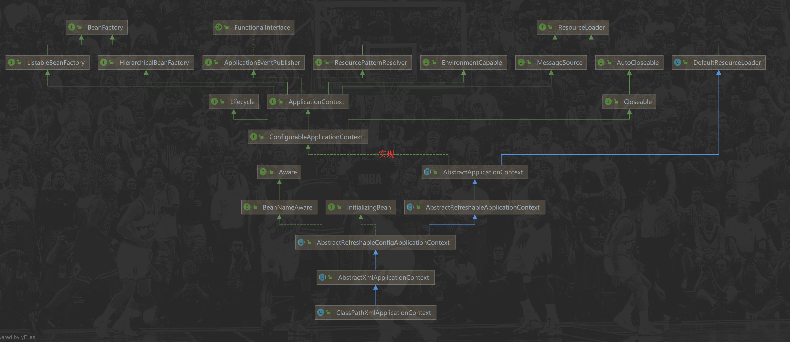

# SpringIOC依赖查找

## 根据 Bean 名称查找

### 实时查找

使用`org.springframework.beans.factory.BeanFactory#getBean(java.lang.String)`方式

```xml
<bean id="user" class="org.geekbang.thinking.in.spring.ioc.overview.domain.User">
    <property name="id" value="1"/>
    <property name="name" value="小马哥"/>
</bean>
```

### 延迟查找

关键接口ObjectFactory，当调用getObject的时候才回去容器中getBean

```java
@FunctionalInterface
public interface ObjectFactory<T> {

	T getObject() throws BeansException;

}

//ObjectFactoryCreatingFactoryBean的一个内部类
private static class TargetBeanObjectFactory implements ObjectFactory<Object>, Serializable {

    private final BeanFactory beanFactory;

    private final String targetBeanName;

    public TargetBeanObjectFactory(BeanFactory beanFactory, String targetBeanName) {
        this.beanFactory = beanFactory;
        this.targetBeanName = targetBeanName;
    }

    @Override
    public Object getObject() throws BeansException {
        return this.beanFactory.getBean(this.targetBeanName);
    }
}
```

使用**ObjectFactoryCreatingFactoryBean**

```xml
<bean id="objectFactory" class="org.springframework.beans.factory.config.ObjectFactoryCreatingFactoryBean">
    <property name="targetBeanName" value="user"/>
</bean>
```

java代码：

```java
ObjectFactory<User> objectFactory = (ObjectFactory<User>) beanFactory.getBean("objectFactory");
User user = objectFactory.getObject();
```


## 根据 Bean 类型查找

### 单个 Bean 对象

```java
User user = beanFactory.getBean(User.class);
```

### 集合 Bean 对象

```java
if (beanFactory instanceof ListableBeanFactory) {
    ListableBeanFactory listableBeanFactory = (ListableBeanFactory) beanFactory;
    Map<String, User> users = listableBeanFactory.getBeansOfType(User.class);
    System.out.println("查找到的所有的 User 集合对象：" + users);
}
// 输出
查找到的所有的 User 集合对象：{user=User{id=1, name='小马哥'}}
```


## 根据 Bean 名称 + 类型查找

`org.springframework.beans.factory.BeanFactory#getBean(java.lang.String, java.lang.Class<T>)`

## 根据 Java 注解查找

org.springframework.beans.factory.ListableBeanFactory

Map<String, Object> **getBeansWithAnnotation**(Class<? extends Annotation> annotationType) throws BeansException

实体类：

```java
@Super
public class SuperUser extends User {

    private String address;
	
    ...
}
```

```java
if (beanFactory instanceof ListableBeanFactory) {
    ListableBeanFactory listableBeanFactory = (ListableBeanFactory) beanFactory;
    Map<String, User> users = (Map) listableBeanFactory.getBeansWithAnnotation(Super.class);
    System.out.println("查找标注 @Super 所有的 User 集合对象：" + users);
}
//查找到的所有的 User 集合对象：{user=User{id=1, name='小马哥'}}
```

# Spring IoC 依赖注入

## 根据 Bean 名称注入

```xml
<bean id="superUser" class="org.geekbang.thinking.in.spring.ioc.overview.domain.SuperUser" parent="user"
      primary="true">
    <property name="address" value="杭州"/>
</bean>

<bean id="userRepository" class="org.geekbang.thinking.in.spring.ioc.overview.repository.UserRepository"> 
    <!-- 手动配置 -->
    <property name="users">
        <util:list>
                <!-- 根据bean名称注入 -->
            <ref bean="superUser" />
            <ref bean="user" />
        </util:list>
    </property>

</bean>
```


## 根据 Bean 类型注入

> 注意：**Auto-Wiring** 方式不能自定义集合的注入顺序，手动配置可以定义顺序

### 单个 Bean 对象

```java
public class UserRepository {

    private Collection<User> users; // 自定义 Bean

    public Collection<User> getUsers() {
        return users;
    }

    // 必须要set方法
    public void setUsers(Collection<User> users) {
        this.users = users;
    }
}
```

xml配置：

```xml
<bean id="userRepository" class="org.geekbang.thinking.in.spring.ioc.overview.repository.UserRepository"
      autowire="byType"> <!-- Auto-Wiring -->

</bean>
```

### 集合 Bean 对象

```xml
<bean id="userRepository" class="org.geekbang.thinking.in.spring.ioc.overview.repository.UserRepository"> 
    <!-- 手动配置 -->
    <property name="users">
        <util:list>
            <ref bean="superUser" />
            <ref bean="user" />
        </util:list>
    </property>

</bean>
```


## 注入容器內建 Bean 对象

```java
public class UserRepository {

    private Collection<User> users; // 自定义 Bean

    private BeanFactory beanFactory; // 內建非 Bean 对象（依赖）

    private ObjectFactory<ApplicationContext> objectFactory;// 注意：ApplicationContext

    public Collection<User> getUsers() {
        return users;
    }

    public void setUsers(Collection<User> users) {
        this.users = users;
    }


    public void setBeanFactory(BeanFactory beanFactory) {
        this.beanFactory = beanFactory;
    }

    public BeanFactory getBeanFactory() {
        return beanFactory;
    }

    public ObjectFactory<ApplicationContext> getObjectFactory() {
        return objectFactory;
    }

    public void setObjectFactory(ObjectFactory<ApplicationContext> objectFactory) {
        this.objectFactory = objectFactory;
    }
}
```

xml配置：

```xml
<bean id="userRepository" class="org.geekbang.thinking.in.spring.ioc.overview.repository.UserRepository"
      autowire="byType"> <!-- Auto-Wiring -->

</bean>
```

测试代码：

```java
public static void main(String[] args) {
    // 配置 XML 配置文件
    // 启动 Spring 应用上下文
     BeanFactory beanFactory = new ClassPathXmlApplicationContext("classpath:/META-INF/dependency-injection-context.xml");
	//ApplicationContext applicationContext = new ClassPathXmlApplicationContext("classpath:/META-INF/dependency-injection-context.xml");

    // 依赖来源一：自定义 Bean
    UserRepository userRepository = applicationContext.getBean("userRepository", UserRepository.class);

    // 依赖来源二：依赖注入（內建依赖）
    System.out.println(userRepository.getBeanFactory());
    // org.springframework.beans.factory.support.DefaultListableBeanFactory@5315b42e: defining beans [user,superUser,objectFactory,userRepository]; root of factory hierarchy
    System.out.println(userRepository.getBeanFactory() == beanFactory);
    // false?
    
    ObjectFactory objectFactory = userRepository.getObjectFactory();

    System.out.println(objectFactory.getObject() == beanFactory);
	// true
    
    // 依赖查找（错误）
    // System.out.println(beanFactory.getBean(BeanFactory.class));

    // 依赖来源三：容器內建 Bean
    Environment environment = applicationContext.getBean(Environment.class);
    System.out.println("获取 Environment 类型的 Bean：" + environment);
}
```

说明：

1. beanFactory.getBean(BeanFactory.class)：**依赖查找提示错误**，没有找到bean，说明beanFactory不是内建的bean对象

2. objectFactory.getObject() == beanFactory：为什么相等？

```java
public class ObjectFactoryCreatingFactoryBean extends AbstractFactoryBean<ObjectFactory<Object>> {

	@Nullable
	private String targetBeanName;

	public void setTargetBeanName(String targetBeanName) {
		this.targetBeanName = targetBeanName;
	}

	@Override
	protected ObjectFactory<Object> createInstance() {
		BeanFactory beanFactory = getBeanFactory();
		Assert.state(beanFactory != null, "No BeanFactory available");
		Assert.state(this.targetBeanName != null, "No target bean name specified");
		return new TargetBeanObjectFactory(beanFactory, this.targetBeanName);
	}

	/**
	 * Independent inner class - for serialization purposes.
	 */
	@SuppressWarnings("serial")
	private static class TargetBeanObjectFactory implements ObjectFactory<Object>, Serializable {

		private final BeanFactory beanFactory;

		private final String targetBeanName;

		public TargetBeanObjectFactory(BeanFactory beanFactory, String targetBeanName) {
			this.beanFactory = beanFactory;
			this.targetBeanName = targetBeanName;
		}

		@Override
		public Object getObject() throws BeansException {
			return this.beanFactory.getBean(this.targetBeanName);
		}
	}
}
```

ObjectFactoryCreatingFactoryBean#createInstance()方法中的getBeanFactory()调用的是父类AbstractFactoryBean#getBeanFactory()方法

```java
public abstract class AbstractFactoryBean<T>
		implements FactoryBean<T>, BeanClassLoaderAware, BeanFactoryAware, InitializingBean, DisposableBean {

    private BeanFactory beanFactory;
    
    @Override
	public void setBeanFactory(@Nullable BeanFactory beanFactory) {
		this.beanFactory = beanFactory;
	}

	/**
	 * Return the BeanFactory that this bean runs in.
	 */
	@Nullable
	protected BeanFactory getBeanFactory() {
		return this.beanFactory;
	}

}
```

此方法中的`setBeanFactory(@Nullable BeanFactory beanFactory)`是实现BeanFactoryAware接口中的方法，作用是让让容器回调，回调位置：`AbstractAutowireCapableBeanFactory#invokeAwareMethods`

```java
	protected Object initializeBean(final String beanName, final Object bean, @Nullable RootBeanDefinition mbd) {
		if (System.getSecurityManager() != null) {
			AccessController.doPrivileged((PrivilegedAction<Object>) () -> {
				invokeAwareMethods(beanName, bean);
				return null;
			}, getAccessControlContext());
		}
		else {
			invokeAwareMethods(beanName, bean);
		}

		Object wrappedBean = bean;
		if (mbd == null || !mbd.isSynthetic()) {
			wrappedBean = applyBeanPostProcessorsBeforeInitialization(wrappedBean, beanName);
		}

		try {
			invokeInitMethods(beanName, wrappedBean, mbd);
		}
		catch (Throwable ex) {
			throw new BeanCreationException(
					(mbd != null ? mbd.getResourceDescription() : null),
					beanName, "Invocation of init method failed", ex);
		}
		if (mbd == null || !mbd.isSynthetic()) {
			wrappedBean = applyBeanPostProcessorsAfterInitialization(wrappedBean, beanName);
		}

		return wrappedBean;
	}

	private void invokeAwareMethods(final String beanName, final Object bean) {
		if (bean instanceof Aware) {
			if (bean instanceof BeanNameAware) {
				((BeanNameAware) bean).setBeanName(beanName);
			}
			if (bean instanceof BeanClassLoaderAware) {
				ClassLoader bcl = getBeanClassLoader();
				if (bcl != null) {
					((BeanClassLoaderAware) bean).setBeanClassLoader(bcl);
				}
			}
			if (bean instanceof BeanFactoryAware) {
                // 此处进行回调，
				((BeanFactoryAware) bean).setBeanFactory(AbstractAutowireCapableBeanFactory.this);
			}
		}
	}
```

设置的是AbstractAutowireCapableBeanFactory类型，**AbstractAutowireCapableBeanFactory是BeanFactory类型**，

所以userRepository.getObjectFactory().getObject() 和 beanFactory 相等


## 注入非 Bean 对象

## 注入类型

### 实时注入

### 延迟注入

# Spring IoC 依赖来源

## 1.自定义 Bean

如：业务自身定义的，User

## 2.容器內建 Bean 对象

Environment

## 3.容器內建依赖

**不能通过依赖查找找到**，如：BeanFactory

# BeanFactory 和 ApplicationContext 谁才是 Spring IoC 容器？

**答案：BeanFactory的实现类才是真正的Spring IOC容器，ApplicationContext委托了BeanFactory进行依赖查找**

分析：

切入点**ClassPathXmlApplicationContext**

```java
ApplicationContext applicationContext = new ClassPathXmlApplicationContext("classpath:/META-INF/dependency-injection-context.xml");
```

ClassPathXmlApplicationContext类结构图：



从图中可以看出实现BeanFactory，ApplicationContext也具有BeanFactory功能

```java
public abstract class AbstractRefreshableApplicationContext extends AbstractApplicationCo
    /** Bean factory for this context. */
	@Nullable
	private DefaultListableBeanFactory beanFactory;

	@Override
	protected final void refreshBeanFactory() throws BeansException {
		if (hasBeanFactory()) {
			destroyBeans();
			closeBeanFactory();
		}
		try {
            // 创建BeanFactory
			DefaultListableBeanFactory beanFactory = createBeanFactory();
			beanFactory.setSerializationId(getId());
			customizeBeanFactory(beanFactory);
			loadBeanDefinitions(beanFactory);
			synchronized (this.beanFactoryMonitor) {
				this.beanFactory = beanFactory;
			}
		}
		catch (IOException ex) {
			throw new ApplicationContextException("I/O error parsing bean definition source for " + getDisplayName(), ex);
		}
	}

	// 创建BeanFactory
	protected DefaultListableBeanFactory createBeanFactory() {
		return new DefaultListableBeanFactory(getInternalParentBeanFactory());
	}

	@Override
	public final ConfigurableListableBeanFactory getBeanFactory() {
		synchronized (this.beanFactoryMonitor) {
			if (this.beanFactory == null) {
				throw new IllegalStateException("BeanFactory not initialized or already closed - " +
						"call 'refresh' before accessing beans via the ApplicationContext");
			}
			return this.beanFactory;
		}
	}
}
```

在`refreshBeanFactory()`方法中调用`createBeanFactory()`创建了BeanFactory,类型是**DefaultListableBeanFactory**

```java
public abstract class AbstractApplicationContext extends DefaultResourceLoader
		implements ConfigurableApplicationContext {
    
	@Override
	public abstract ConfigurableListableBeanFactory getBeanFactory() throws IllegalStateException;
}

public interface ConfigurableApplicationContext extends ApplicationContext, Lifecycle, Closeable {
	ConfigurableListableBeanFactory getBeanFactory() throws IllegalStateException;
}
```

在**AbstractRefreshableApplicationContext**实现`getBeanFactory()`方法,返回在`refreshBeanFactory()`方法中创建的类型为**DefaultListableBeanFactory**的BeanFactory，所以子类调用`getBeanFactory`方法都是返回的`DefaultListableBeanFactory`类型的BeanFactory去进行依赖查找

在**ClassPathXmlApplicationContext**的父类**AbstractApplicationContext**中实现了**BeanFactory**的依赖查找方法

```java
public abstract class AbstractApplicationContext extends DefaultResourceLoader
		implements ConfigurableApplicationContext {
    
    ···
    @Override
	public <T> T getBean(Class<T> requiredType) throws BeansException {
		assertBeanFactoryActive();
		return getBeanFactory().getBean(requiredType);
	}
    ···
}
```

其中`getBeanFactory()`就是调用的父类**AbstractRefreshableApplicationContext**的方法，返回了BeanFactory

因此：BeanFactory和ApplicationContext并不是同一个东西，此处用到了**代理的设计模式**，其中**ApplicationContext委托了BeanFactory进行依赖查找**

# Spring 应用上下文

ApplicationContext 除了 IoC 容器角色，还有提供：

- 面向切面（AOP）
- 配置元信息（Configuration Metadata）
- 资源管理（Resources）
- 事件（Events）
- 国际化（i18n）
- 注解（Annotations）

- Environment 抽象（Environment Abstraction）

https://docs.spring.io/spring/docs/5.2.2.RELEASE/spring-framework-reference/core.html#beans-introduction

# 使用 Spring IoC 容器

## BeanFactory 是 Spring 底层 IoC 容器

## ApplicationContext 是具备应用特性的 BeanFactory 超集

## 代码示例

### BeanFactory作为IOC容器

```java
public class BeanFactoryAsIoCContainerDemo {

    public static void main(String[] args) {
        // 创建 BeanFactory 容器
        DefaultListableBeanFactory beanFactory = new DefaultListableBeanFactory();
        XmlBeanDefinitionReader reader = new XmlBeanDefinitionReader(beanFactory);
        // XML 配置文件 ClassPath 路径
        String location = "classpath:/META-INF/dependency-lookup-context.xml";
        // 加载配置
        int beanDefinitionsCount = reader.loadBeanDefinitions(location);
        System.out.println("Bean 定义加载的数量：" + beanDefinitionsCount);
        // 依赖查找集合对象
        lookupCollectionByType(beanFactory);
    }

    private static void lookupCollectionByType(BeanFactory beanFactory) {
        if (beanFactory instanceof ListableBeanFactory) {
            ListableBeanFactory listableBeanFactory = (ListableBeanFactory) beanFactory;
            Map<String, User> users = listableBeanFactory.getBeansOfType(User.class);
            System.out.println("查找到的所有的 User 集合对象：" + users);
        }
    }
}
```

### 注解能力的ApplicationContext作为IOC容器

> **@Configuration** 并不是必须的，加了之后当前Class会被CGLIB提升

```java
@Configuration
public class AnnotationApplicationContextAsIoCContainerDemo {

    public static void main(String[] args) {
        // 创建 BeanFactory 容器
        AnnotationConfigApplicationContext applicationContext = new AnnotationConfigApplicationContext();
        // 将当前类 AnnotationApplicationContextAsIoCContainerDemo 作为配置类（Configuration Class）
        applicationContext.register(AnnotationApplicationContextAsIoCContainerDemo.class);
        // 启动应用上下文
        applicationContext.refresh();
        // 依赖查找集合对象
        lookupCollectionByType(applicationContext);

        // 关闭应用上下文
        applicationContext.close();

    }

    /**
     * 通过 Java 注解的方式，定义了一个 Bean
     */
    @Bean
    public User user() {
        User user = new User();
        user.setId(1L);
        user.setName("小马哥");
        return user;
    }

    private static void lookupCollectionByType(BeanFactory beanFactory) {
        if (beanFactory instanceof ListableBeanFactory) {
            ListableBeanFactory listableBeanFactory = (ListableBeanFactory) beanFactory;
            Map<String, User> users = listableBeanFactory.getBeansOfType(User.class);
            System.out.println("查找到的所有的 User 集合对象：" + users);
        }
    }

}
```

