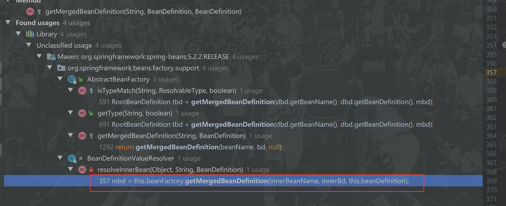

# 1. Spring Bean 元信息配置阶段

## BeanDefinition 配置

### 面向资源


#### XML 配置 - XmlBeanDefinitionReader

dependency-lookup-context.xml：

```xml
<bean id="user" class="org.geekbang.thinking.in.spring.ioc.overview.domain.User">
    <property name="id" value="1"/>
    <property name="name" value="小马哥"/>
    <property name="city" value="HANGZHOU"/>
    <property name="workCities" value="BEIJING,HANGZHOU"/>
    <property name="lifeCities">
        <list>
            <value>BEIJING</value>
            <value>SHANGHAI</value>
        </list>
    </property>
    <property name="configFileLocation" value="classpath:/META-INF/user-config.properties"/>
</bean>
```

```java
// 创建 BeanFactory 容器
DefaultListableBeanFactory beanFactory = new DefaultListableBeanFactory();
XmlBeanDefinitionReader reader = new XmlBeanDefinitionReader(beanFactory);
// XML 配置文件 ClassPath 路径
String location = "classpath:/META-INF/dependency-lookup-context.xml";
// 加载配置
int beanDefinitionsCount = reader.loadBeanDefinitions(location);
```

#### Properties 资源配置 - PropertiesBeanDefinitionReader

> properties文件默认是按照ISO-8859-1编码方式读取的，这样会乱码

user.properties：

```properties
user.(class) = org.geekbang.thinking.in.spring.ioc.overview.domain.User
user.id = 001
user.name = 小马哥
user.city = HANGZHOU

```

```java
DefaultListableBeanFactory beanFactory = new DefaultListableBeanFactory();
// 实例化基于 Properties 资源 BeanDefinitionReader
PropertiesBeanDefinitionReader beanDefinitionReader = new PropertiesBeanDefinitionReader(beanFactory);
String location = "META-INF/user.properties";
// 基于 ClassPath 加载 properties 资源
Resource resource = new ClassPathResource(location);
// 指定字符编码 UTF-8
EncodedResource encodedResource = new EncodedResource(resource, "UTF-8");
int beanNumbers = beanDefinitionReader.loadBeanDefinitions(encodedResource);
System.out.println("已加载 BeanDefinition 数量：" + beanNumbers);
// 通过 Bean Id 和类型进行依赖查找
User user = beanFactory.getBean("user", User.class);
System.out.println(user);
```

#### Groovy配置 - GroovyBeanDefinitionReader

### 面向注解 - AnnotatedBeanDefinitionReader

> 没有实现**DefinitionReader**接口

```java
public class AnnotatedBeanDefinitionParsingDemo {

    public static void main(String[] args) {
        DefaultListableBeanFactory beanFactory = new DefaultListableBeanFactory();
        // 基于 Java 注解的 AnnotatedBeanDefinitionReader 的实现
        AnnotatedBeanDefinitionReader beanDefinitionReader = new AnnotatedBeanDefinitionReader(beanFactory);
        int beanDefinitionCountBefore = beanFactory.getBeanDefinitionCount();
        // 注册当前类（非 @Component class）
        beanDefinitionReader.register(AnnotatedBeanDefinitionParsingDemo.class);
        int beanDefinitionCountAfter = beanFactory.getBeanDefinitionCount();
        int beanDefinitionCount = beanDefinitionCountAfter - beanDefinitionCountBefore;
        System.out.println("已加载 BeanDefinition 数量：" + beanDefinitionCount);
        // 普通的 Class 作为 Component 注册到 Spring IoC 容器后，通常 Bean 名称为 annotatedBeanDefinitionParsingDemo
        // Bean 名称生成来自于 BeanNameGenerator，注解实现 AnnotationBeanNameGenerator
        AnnotatedBeanDefinitionParsingDemo demo = beanFactory.getBean("annotatedBeanDefinitionParsingDemo",
                AnnotatedBeanDefinitionParsingDemo.class);
        System.out.println(demo);
    }
}
```

### 面向 API

# 2. Spring Bean 注册阶段

## BeanDefinition 注册接口 - BeanDefinitionRegistry

```java
public interface BeanDefinitionRegistry extends AliasRegistry {

	void registerBeanDefinition(String beanName, BeanDefinition beanDefinition)
			throws BeanDefinitionStoreException;
    
	void removeBeanDefinition(String beanName) throws NoSuchBeanDefinitionException;

	BeanDefinition getBeanDefinition(String beanName) throws NoSuchBeanDefinitionException;

	boolean containsBeanDefinition(String beanName);

	String[] getBeanDefinitionNames();

	int getBeanDefinitionCount();

	boolean isBeanNameInUse(String beanName);

}
```

## 实现DefaultListableBeanFactory

```java
@Override
public void registerBeanDefinition(String beanName, BeanDefinition beanDefinition)
    throws BeanDefinitionStoreException {

    Assert.hasText(beanName, "Bean name must not be empty");
    Assert.notNull(beanDefinition, "BeanDefinition must not be null");

    if (beanDefinition instanceof AbstractBeanDefinition) {
        try {
            ((AbstractBeanDefinition) beanDefinition).validate();
        }
        catch (BeanDefinitionValidationException ex) {
            throw new BeanDefinitionStoreException(beanDefinition.getResourceDescription(), beanName,
                                                   "Validation of bean definition failed", ex);
        }
    }

    BeanDefinition existingDefinition = this.beanDefinitionMap.get(beanName);
    if (existingDefinition != null) {
        if (!isAllowBeanDefinitionOverriding()) {
            throw new BeanDefinitionOverrideException(beanName, beanDefinition, existingDefinition);
        }
        else if (existingDefinition.getRole() < beanDefinition.getRole()) {
            // e.g. was ROLE_APPLICATION, now overriding with ROLE_SUPPORT or ROLE_INFRASTRUCTURE
            if (logger.isInfoEnabled()) {
                logger.info("Overriding user-defined bean definition for bean '" + beanName +
                            "' with a framework-generated bean definition: replacing [" +
                            existingDefinition + "] with [" + beanDefinition + "]");
            }
        }
        else if (!beanDefinition.equals(existingDefinition)) {
            if (logger.isDebugEnabled()) {
                logger.debug("Overriding bean definition for bean '" + beanName +
                             "' with a different definition: replacing [" + existingDefinition +
                             "] with [" + beanDefinition + "]");
            }
        }
        else {
            if (logger.isTraceEnabled()) {
                logger.trace("Overriding bean definition for bean '" + beanName +
                             "' with an equivalent definition: replacing [" + existingDefinition +
                             "] with [" + beanDefinition + "]");
            }
        }
        this.beanDefinitionMap.put(beanName, beanDefinition);
    }
    else {
        if (hasBeanCreationStarted()) {
            // Cannot modify startup-time collection elements anymore (for stable iteration)
            synchronized (this.beanDefinitionMap) {
                this.beanDefinitionMap.put(beanName, beanDefinition);
                List<String> updatedDefinitions = new ArrayList<>(this.beanDefinitionNames.size() + 1);
                updatedDefinitions.addAll(this.beanDefinitionNames);
                updatedDefinitions.add(beanName);
                this.beanDefinitionNames = updatedDefinitions;
                removeManualSingletonName(beanName);
            }
        }
        else {
            // Still in startup registration phase
            this.beanDefinitionMap.put(beanName, beanDefinition);
            this.beanDefinitionNames.add(beanName);
            removeManualSingletonName(beanName);
        }
        this.frozenBeanDefinitionNames = null;
    }

    if (existingDefinition != null || containsSingleton(beanName)) {
        resetBeanDefinition(beanName);
    }
}

public void removeBeanDefinition(String beanName) throws NoSuchBeanDefinitionException {
    Assert.hasText(beanName, "'beanName' must not be empty");

    BeanDefinition bd = this.beanDefinitionMap.remove(beanName);
    if (bd == null) {
        if (logger.isTraceEnabled()) {
            logger.trace("No bean named '" + beanName + "' found in " + this);
        }
        throw new NoSuchBeanDefinitionException(beanName);
    }

    if (hasBeanCreationStarted()) {
        // Cannot modify startup-time collection elements anymore (for stable iteration)
        synchronized (this.beanDefinitionMap) {
            List<String> updatedDefinitions = new ArrayList<>(this.beanDefinitionNames);
            updatedDefinitions.remove(beanName);
            this.beanDefinitionNames = updatedDefinitions;
        }
    }
    else {
        // Still in startup registration phase
        this.beanDefinitionNames.remove(beanName);
    }
    this.frozenBeanDefinitionNames = null;

    resetBeanDefinition(beanName);
}

public BeanDefinition getBeanDefinition(String beanName) throws NoSuchBeanDefinitionException {
    BeanDefinition bd = this.beanDefinitionMap.get(beanName);
    if (bd == null) {
        if (logger.isTraceEnabled()) {
            logger.trace("No bean named '" + beanName + "' found in " + this);
        }
        throw new NoSuchBeanDefinitionException(beanName);
    }
    return bd;
}

public boolean containsBeanDefinition(String beanName) {
    Assert.notNull(beanName, "Bean name must not be null");
    return this.beanDefinitionMap.containsKey(beanName);
}

public String[] getBeanDefinitionNames() {
    String[] frozenNames = this.frozenBeanDefinitionNames;
    if (frozenNames != null) {
        return frozenNames.clone();
    }
    else {
        return StringUtils.toStringArray(this.beanDefinitionNames);
    }
}

public boolean isBeanNameInUse(String beanName) {
    return isAlias(beanName) || containsLocalBean(beanName) || hasDependentBean(beanName);
}
```

# 3. Spring BeanDefinition 合并阶段

父子 BeanDefinition 合并

- 当前 BeanFactory 查找
- 层次性 BeanFactory 查找

## 代码

dependency-lookup-context.xml

```xml
    <!-- Root BeanDefinition 不需要合并，不存在 parent -->
    <!-- 普通 beanDefinition GenericBeanDefinition -->
    <!-- 经过合并后 GenericBeanDefinition 变成 RootBeanDefinition -->
    <bean id="user" class="org.geekbang.thinking.in.spring.ioc.overview.domain.User">
        <property name="id" value="1"/>
        <property name="name" value="小马哥"/>
        <property name="city" value="HANGZHOU"/>
        <property name="workCities" value="BEIJING,HANGZHOU"/>
        <property name="lifeCities">
            <list>
                <value>BEIJING</value>
                <value>SHANGHAI</value>
            </list>
        </property>
        <property name="configFileLocation" value="classpath:/META-INF/user-config.properties"/>
    </bean>

    <!-- 普通 beanDefinition GenericBeanDefinition -->
    <!-- 合并后 GenericBeanDefinition 变成 RootBeanDefinition，并且覆盖 parent 相关配置-->
    <!-- primary = true , 增加了一个 address 属性 -->
    <bean id="superUser" class="org.geekbang.thinking.in.spring.ioc.overview.domain.SuperUser" parent="user"
          primary="true">
        <property name="address" value="杭州"/>
    </bean>
```

```java
public class MergedBeanDefinitionDemo {

    public static void main(String[] args) {
        DefaultListableBeanFactory beanFactory = new DefaultListableBeanFactory();
        // 基于 XML 资源 BeanDefinitionReader 实现
        XmlBeanDefinitionReader beanDefinitionReader = new XmlBeanDefinitionReader(beanFactory);
        String location = "META-INF/dependency-lookup-context.xml";
        // 基于 ClassPath 加载 XML 资源
        Resource resource = new ClassPathResource(location);
        // 指定字符编码 UTF-8
        EncodedResource encodedResource = new EncodedResource(resource, "UTF-8");
        int beanNumbers = beanDefinitionReader.loadBeanDefinitions(encodedResource);
        System.out.println("已加载 BeanDefinition 数量：" + beanNumbers);
        // 通过 Bean Id 和类型进行依赖查找
        User user = beanFactory.getBean("user", User.class);
        System.out.println(user);

        User superUser = beanFactory.getBean("superUser", User.class);
        System.out.println(superUser);
    }
}
```

## 合并流程

> 由于没有使用ApplicationContext，直接使用DefaultListableBeanFactory，所以按照beanFactory.getBean()方法的调用顺序初始化bean

1. AbstractBeanFactory#getBean

```java
public <T> T getBean(String name, Class<T> requiredType) throws BeansException {
   return doGetBean(name, requiredType, null, false);
}
```

2. AbstractBeanFactory#doGetBean

```java
protected <T> T doGetBean(final String name, @Nullable final Class<T> requiredType,
                          @Nullable final Object[] args, boolean typeCheckOnly) throws BeansException {

    // 把name转换成合法的beanName
    final String beanName = transformedBeanName(name);
    Object bean;

    // Eagerly check singleton cache for manually registered singletons.
    // 从早期单例对象中获取
    Object sharedInstance = getSingleton(beanName);
    if (sharedInstance != null && args == null) {
        if (logger.isTraceEnabled()) {
            if (isSingletonCurrentlyInCreation(beanName)) {
                logger.trace("Returning eagerly cached instance of singleton bean '" + beanName +
                             "' that is not fully initialized yet - a consequence of a circular reference");
            }
            else {
                logger.trace("Returning cached instance of singleton bean '" + beanName + "'");
            }
        }
        bean = getObjectForBeanInstance(sharedInstance, name, beanName, null);
    }

    else {
        // Fail if we're already creating this bean instance:
        // We're assumably within a circular reference.
        if (isPrototypeCurrentlyInCreation(beanName)) {
            throw new BeanCurrentlyInCreationException(beanName);
        }

        // Check if bean definition exists in this factory.
        // 获取父IOC
        BeanFactory parentBeanFactory = getParentBeanFactory();
        if (parentBeanFactory != null && !containsBeanDefinition(beanName)) {
            // 如果父IOC存在 且 当前DefaultListableBeanFactory不存在BeanDefinition
            // Not found -> check parent.
            // 确定原始bean名称
            String nameToLookup = originalBeanName(name);
            if (parentBeanFactory instanceof AbstractBeanFactory) {
                // 递归查找
                return ((AbstractBeanFactory) parentBeanFactory).doGetBean(
                    nameToLookup, requiredType, args, typeCheckOnly);
            }
            else if (args != null) {
                // Delegation to parent with explicit args.
                return (T) parentBeanFactory.getBean(nameToLookup, args);
            }
            else if (requiredType != null) {
                // No args -> delegate to standard getBean method.
                return parentBeanFactory.getBean(nameToLookup, requiredType);
            }
            else {
                return (T) parentBeanFactory.getBean(nameToLookup);
            }
        }

        if (!typeCheckOnly) {
            // 如果不是检查实例，则标记当前bean正在创建
            markBeanAsCreated(beanName);
        }

        try {
            // 获取合并的本地BeanDefinition
            final RootBeanDefinition mbd = getMergedLocalBeanDefinition(beanName);
            checkMergedBeanDefinition(mbd, beanName, args);

            // Guarantee initialization of beans that the current bean depends on.
            String[] dependsOn = mbd.getDependsOn();
            if (dependsOn != null) {
                for (String dep : dependsOn) {
                    if (isDependent(beanName, dep)) {
                        throw new BeanCreationException(mbd.getResourceDescription(), beanName,
                                                        "Circular depends-on relationship between '" + beanName + "' and '" + dep + "'");
                    }
                    registerDependentBean(dep, beanName);
                    try {
                        getBean(dep);
                    }
                    catch (NoSuchBeanDefinitionException ex) {
                        throw new BeanCreationException(mbd.getResourceDescription(), beanName,
                                                        "'" + beanName + "' depends on missing bean '" + dep + "'", ex);
                    }
                }
            }


            return (T) bean;
        }
```

3. AbstractBeanFactory#getMergedLocalBeanDefinition

   获取合并的本地BeanDefinition

```java
protected RootBeanDefinition getMergedLocalBeanDefinition(String beanName) throws BeansException {
   // Quick check on the concurrent map first, with minimal locking.
    // 从本地缓存中查询，如果有就返回
   RootBeanDefinition mbd = this.mergedBeanDefinitions.get(beanName);
   if (mbd != null && !mbd.stale) {
       // 如果不为null 且 不是陈旧的(修改过的)
      return mbd;
   }
   return getMergedBeanDefinition(beanName, getBeanDefinition(beanName));
}
```

4. 获取BeanDefinition和获取合并的BeanDefinition

   4.1 DefaultListableBeanFactory#getBeanDefinition(String beanName)

   获取当前IOC中beanName的BeanDefinition

   ```java
   public BeanDefinition getBeanDefinition(String beanName) throws NoSuchBeanDefinitionException {
       BeanDefinition bd = this.beanDefinitionMap.get(beanName);
       if (bd == null) {
           if (logger.isTraceEnabled()) {
               logger.trace("No bean named '" + beanName + "' found in " + this);
           }
           throw new NoSuchBeanDefinitionException(beanName);
       }
       return bd;
   }
   ```

   4.2 AbstractBeanFactory(String beanName, BeanDefinition bd)

   ```java
   protected RootBeanDefinition getMergedBeanDefinition(String beanName, BeanDefinition bd)
       throws BeanDefinitionStoreException {
   
       return getMergedBeanDefinition(beanName, bd, null);
   }
   ```

   4.3 AbstractBeanFactory#getMergedBeanDefinition(
   			String beanName, BeanDefinition bd, @Nullable BeanDefinition containingBd)

   **真正合并代码**

   参数解释：

   bd：原始bean定义（Root / ChildBeanDefinition），当前IOC中的原始的bean定义

   containingBd：如果是内部bean，则为包含bean的定义；如果是顶级bean，则为null

   这里传入的是null，说明此处就是顶级Bean

```java
protected RootBeanDefinition getMergedBeanDefinition(
    String beanName, BeanDefinition bd, @Nullable BeanDefinition containingBd)
    throws BeanDefinitionStoreException {

    synchronized (this.mergedBeanDefinitions) {
        RootBeanDefinition mbd = null;
        RootBeanDefinition previous = null;

        // Check with full lock now in order to enforce the same merged instance.
        // 现在使用full lock进行检查，以强制执行相同的合并实例
        if (containingBd == null) {
            // 如果内部的bean为null 即 beanName是顶级bean
            // 在步骤3中已经获取过一次 防止多线程创建过
            // 重新获取一次
            mbd = this.mergedBeanDefinitions.get(beanName);
        }

        if (mbd == null || mbd.stale) {
            // mbd == null：mergedBeanDefinitions这个map中没有
            // 这个条件判断在步骤3中已经判断过，还要在判断一次的原因是 这里不是原子操作
            // 如果RootBeanDefinition为null 或者 是陈旧的
            previous = mbd;
            if (bd.getParentName() == null) {
                // 如果beanDefinitionMap获取的不存在父BeanDefinition，相当于就是RootBeanDefinition
                // 手动转成RootBeanDefinition类型
                // Use copy of given root bean definition.
                if (bd instanceof RootBeanDefinition) {
                    mbd = ((RootBeanDefinition) bd).cloneBeanDefinition();
                }
                else {
                    mbd = new RootBeanDefinition(bd);
                }
            }
            else {
                // mergedBeanDefinitions里面有 且 不是陈旧的
                // Child bean definition: needs to be merged with parent.
                // 子BeanDefinition 需要与父合并
                BeanDefinition pbd;
                try {
                    // 把parentName转换成合法的beanName
                    String parentBeanName = transformedBeanName(bd.getParentName());
                    if (!beanName.equals(parentBeanName)) {
                        // 如果 当前的beanName和parentBeanName 名称不同，执行合并
                        pbd = getMergedBeanDefinition(parentBeanName);
                    }
                    else {
                        // 如果名称相同，则要去父IOC中去查找
                        BeanFactory parent = getParentBeanFactory();
                        if (parent instanceof ConfigurableBeanFactory) {
                            // 递归操作，重复 4.1 操作
                            pbd = ((ConfigurableBeanFactory) parent).getMergedBeanDefinition(parentBeanName);
                        }
                        else {
                            throw new NoSuchBeanDefinitionException(parentBeanName,
                                                                    "Parent name '" + parentBeanName + "' is equal to bean name '" + beanName +
                                                                    "': cannot be resolved without an AbstractBeanFactory parent");
                        }
                    }
                }
                catch (NoSuchBeanDefinitionException ex) {
                    throw new BeanDefinitionStoreException(bd.getResourceDescription(), beanName,
                                                           "Could not resolve parent bean definition '" + bd.getParentName() + "'", ex);
                }
                // Deep copy with overridden values.
                // 将父BeanDefinition拷贝一份
                mbd = new RootBeanDefinition(pbd);
                // 将父BeanDefinition 与 当前 BeanDefinition 进行合并
                mbd.overrideFrom(bd);
            }

            // Set default singleton scope, if not configured before.
            // 如果没有配置作用范围则设置为 单例
            if (!StringUtils.hasLength(mbd.getScope())) {
                mbd.setScope(SCOPE_SINGLETON);
            }

            // A bean contained in a non-singleton bean cannot be a singleton itself.
            // Let's correct this on the fly here, since this might be the result of
            // parent-child merging for the outer bean, in which case the original inner bean
            // definition will not have inherited the merged outer bean's singleton status.
            
            //非单例bean中包含的bean本身不能是单例的。
            //让我们在这个过程中修正一下，因为这可能是
            //外部bean的父-子合并，在这种情况下原始的内部bean
            // definition将不会继承合并的外部bean的单例状态。
			 // 此处下面小结有详细分析
            if (containingBd != null && !containingBd.isSingleton() && mbd.isSingleton()) {
                mbd.setScope(containingBd.getScope());
            }

            // Cache the merged bean definition for the time being
            // (it might still get re-merged later on in order to pick up metadata changes)
            
            //暂时缓存合并的bean定义
			//(为了获取元数据的变化，它可能会在以后重新合并)
            if (containingBd == null && isCacheBeanMetadata()) {
                this.mergedBeanDefinitions.put(beanName, mbd);
            }
        }
        if (previous != null) {
            copyRelevantMergedBeanDefinitionCaches(previous, mbd);
        }
        return mbd;
    }
}
```

## 关于containingBd分析

在 4.3 中方法参数有个containingBd，在此分析一下

如果xml中配置如下，superUser为原型，dept为单例，可以出现containingBd不为null的情况

```xml
<bean id="superUser" class="org.geekbang.thinking.in.spring.ioc.overview.domain.SuperUser" parent="user"
      primary="true" scope="prototype">
    <property name="address" value="杭州"/>
    <property name="dept">
        <bean id="dept" class="org.geekbang.thinking.in.spring.ioc.overview.domain.Dept">
            <property name="id" value="1"/>
            <property name="name" value="开发部"/>
        </bean>
    </property>
</bean>
```

其中dept是SuperUser的一个成员变量

```java
public class SuperUser extends User {

    private String address;

    private Dept dept;
	
    ...
}
```

此时**containingBd**不为null


方法参数的值分别为

**beanName**：dept

**bd**：Generic bean: class [org.geekbang.thinking.in.spring.ioc.overview.domain.Dept]; scope=; abstract=false; lazyInit=false; autowireMode=0; dependencyCheck=0; autowireCandidate=true; primary=false; factoryBeanName=null; factoryMethodName=null; initMethodName=null; destroyMethodName=null; defined in class path resource [META-INF/dependency-lookup-context.xml]

**containingBd**：Root bean: class [org.geekbang.thinking.in.spring.ioc.overview.domain.SuperUser]; scope=singleton; abstract=false; lazyInit=false; autowireMode=0; dependencyCheck=0; autowireCandidate=true; primary=true; factoryBeanName=null; factoryMethodName=null; initMethodName=null; destroyMethodName=null; defined in class path resource [META-INF/dependency-lookup-context.xml]

在 4.2 步骤中，代码调用 **getMergedBeanDefinition** 方法时固定传null，肯定会有其他地方的调用不会传null，通过查找调用发现有如下几处在调用此方法



其中红色框中就是调用位置

根据上面的配置然后debug，调用链路如下


可以发现其实还是在获取superUser的过程中

查看superUser的bean定义信息，可以看出dept是**BeanDefinitionHolder**类型


属性赋值调用

AbstractAutowireCapableBeanFactory

```java
protected void populateBean(String beanName, RootBeanDefinition mbd, @Nullable BeanWrapper bw) {
		...

		if (pvs != null) {
			applyPropertyValues(beanName, mbd, bw, pvs);
		}
	}
```

```java
protected void applyPropertyValues(String beanName, BeanDefinition mbd, BeanWrapper bw, PropertyValues pvs) {
   if (pvs.isEmpty()) {
      return;
   }

   if (System.getSecurityManager() != null && bw instanceof BeanWrapperImpl) {
      ((BeanWrapperImpl) bw).setSecurityContext(getAccessControlContext());
   }

   MutablePropertyValues mpvs = null;
   List<PropertyValue> original;

   if (pvs instanceof MutablePropertyValues) {
      mpvs = (MutablePropertyValues) pvs;
      if (mpvs.isConverted()) {
         // Shortcut: use the pre-converted values as-is.
         try {
            bw.setPropertyValues(mpvs);
            return;
         }
         catch (BeansException ex) {
            throw new BeanCreationException(
                  mbd.getResourceDescription(), beanName, "Error setting property values", ex);
         }
      }
      original = mpvs.getPropertyValueList();
   }
   else {
      original = Arrays.asList(pvs.getPropertyValues());
   }

   TypeConverter converter = getCustomTypeConverter();
   if (converter == null) {
      converter = bw;
   }
   BeanDefinitionValueResolver valueResolver = new BeanDefinitionValueResolver(this, beanName, mbd, converter);

   // Create a deep copy, resolving any references for values.
   List<PropertyValue> deepCopy = new ArrayList<>(original.size());
   boolean resolveNecessary = false;
   for (PropertyValue pv : original) {
      if (pv.isConverted()) {
         deepCopy.add(pv);
      }
      else {
         String propertyName = pv.getName();
         Object originalValue = pv.getValue();
         if (originalValue == AutowiredPropertyMarker.INSTANCE) {
            Method writeMethod = bw.getPropertyDescriptor(propertyName).getWriteMethod();
            if (writeMethod == null) {
               throw new IllegalArgumentException("Autowire marker for property without write method: " + pv);
            }
            originalValue = new DependencyDescriptor(new MethodParameter(writeMethod, 0), true);
         }
         Object resolvedValue = valueResolver.resolveValueIfNecessary(pv, originalValue);
         Object convertedValue = resolvedValue;
         boolean convertible = bw.isWritableProperty(propertyName) &&
               !PropertyAccessorUtils.isNestedOrIndexedProperty(propertyName);
         if (convertible) {
            convertedValue = convertForProperty(resolvedValue, propertyName, bw, converter);
         }
         // Possibly store converted value in merged bean definition,
         // in order to avoid re-conversion for every created bean instance.
         if (resolvedValue == originalValue) {
            if (convertible) {
               pv.setConvertedValue(convertedValue);
            }
            deepCopy.add(pv);
         }
         else if (convertible && originalValue instanceof TypedStringValue &&
               !((TypedStringValue) originalValue).isDynamic() &&
               !(convertedValue instanceof Collection || ObjectUtils.isArray(convertedValue))) {
            pv.setConvertedValue(convertedValue);
            deepCopy.add(pv);
         }
         else {
            resolveNecessary = true;
            deepCopy.add(new PropertyValue(pv, convertedValue));
         }
      }
       ...
   }

}
```

`valueResolver.resolveValueIfNecessary(pv, originalValue);` 这行代码完成值解析，即把beanDefinition中的propertyValues中的值替换成真正的类型

BeanDefinitionValueResolver

```java
public Object resolveValueIfNecessary(Object argName, @Nullable Object value) {
    // We must check each value to see whether it requires a runtime reference
    // to another bean to be resolved.
    if (value instanceof RuntimeBeanReference) {
        RuntimeBeanReference ref = (RuntimeBeanReference) value;
        return resolveReference(argName, ref);
    }
    else if (value instanceof RuntimeBeanNameReference) {
        String refName = ((RuntimeBeanNameReference) value).getBeanName();
        refName = String.valueOf(doEvaluate(refName));
        if (!this.beanFactory.containsBean(refName)) {
            throw new BeanDefinitionStoreException(
                "Invalid bean name '" + refName + "' in bean reference for " + argName);
        }
        return refName;
    }
    else if (value instanceof BeanDefinitionHolder) {
        // 进入下面
        // Resolve BeanDefinitionHolder: contains BeanDefinition with name and aliases.
        BeanDefinitionHolder bdHolder = (BeanDefinitionHolder) value;
        return resolveInnerBean(argName, bdHolder.getBeanName(), bdHolder.getBeanDefinition());
    }
    ...
}
```

value为BeanDefinitionHolder因此进入到下面代码

`resolveInnerBean(argName, bdHolder.getBeanName(), bdHolder.getBeanDefinition())`从方法名中可以看出目的是 **解析内部bean**

BeanDefinitionValueResolver

```java
private Object resolveInnerBean(Object argName, String innerBeanName, BeanDefinition innerBd) {
   RootBeanDefinition mbd = null;
   try {
       // 此处就是调用getMergedBeanDefinition方法
      mbd = this.beanFactory.getMergedBeanDefinition(innerBeanName, innerBd, this.beanDefinition);
      // Check given bean name whether it is unique. If not already unique,
      // add counter - increasing the counter until the name is unique.
      String actualInnerBeanName = innerBeanName;
      if (mbd.isSingleton()) {
         actualInnerBeanName = adaptInnerBeanName(innerBeanName);
      }
      this.beanFactory.registerContainedBean(actualInnerBeanName, this.beanName);
      // Guarantee initialization of beans that the inner bean depends on.
      String[] dependsOn = mbd.getDependsOn();
      if (dependsOn != null) {
         for (String dependsOnBean : dependsOn) {
            this.beanFactory.registerDependentBean(dependsOnBean, actualInnerBeanName);
            this.beanFactory.getBean(dependsOnBean);
         }
      }
      // Actually create the inner bean instance now...
      Object innerBean = this.beanFactory.createBean(actualInnerBeanName, mbd, null);
      if (innerBean instanceof FactoryBean) {
         boolean synthetic = mbd.isSynthetic();
         innerBean = this.beanFactory.getObjectFromFactoryBean(
               (FactoryBean<?>) innerBean, actualInnerBeanName, !synthetic);
      }
      if (innerBean instanceof NullBean) {
         innerBean = null;
      }
      return innerBean;
   }
   catch (BeansException ex) {
      throw new BeanCreationException(
            this.beanDefinition.getResourceDescription(), this.beanName,
            "Cannot create inner bean '" + innerBeanName + "' " +
            (mbd != null && mbd.getBeanClassName() != null ? "of type [" + mbd.getBeanClassName() + "] " : "") +
            "while setting " + argName, ex);
   }
}
```

此时从方法参数就可以明显看出端倪，目的就是获取**dept**的**MergedBeanDefinition**，然后创建dept实例

`this.beanFactory.getMergedBeanDefinition(innerBeanName, innerBd, this.beanDefinition);`

**innerBeanName**：dept

**innerBd**：Generic bean: class [org.geekbang.thinking.in.spring.ioc.overview.domain.Dept]; scope=; abstract=false; lazyInit=false; autowireMode=0; dependencyCheck=0; autowireCandidate=true; primary=false; factoryBeanName=null; factoryMethodName=null; initMethodName=null; destroyMethodName=null; defined in class path resource [META-INF/dependency-lookup-context.xml]

**containingBd**：Root bean: class [org.geekbang.thinking.in.spring.ioc.overview.domain.SuperUser]; scope=singleton; abstract=false; lazyInit=false; autowireMode=0; dependencyCheck=0; autowireCandidate=true; primary=true; factoryBeanName=null; factoryMethodName=null; initMethodName=null; destroyMethodName=null; defined in class path resource [META-INF/dependency-lookup-context.xml]

所以在回到getMergedBeanDefinition方法中看这个**containingBd**的含义

```java
protected RootBeanDefinition getMergedBeanDefinition(
			String beanName, BeanDefinition bd, @Nullable BeanDefinition containingBd)
			throws BeanDefinitionStoreException {

		synchronized (this.mergedBeanDefinitions) {
			RootBeanDefinition mbd = null;
			RootBeanDefinition previous = null;

			// Check with full lock now in order to enforce the same merged instance.
			if (containingBd == null) {
				mbd = this.mergedBeanDefinitions.get(beanName);
			}

			if (mbd == null || mbd.stale) {
				previous = mbd;
				if (bd.getParentName() == null) {
				...
				}
				else {
					...


				// A bean contained in a non-singleton bean cannot be a singleton itself.
				// Let's correct this on the fly here, since this might be the result of
				// parent-child merging for the outer bean, in which case the original inner bean
				// definition will not have inherited the merged outer bean's singleton status.
                        
                 // 再把之前的翻译拿过来理解
                        
                 //非单例bean中包含的bean本身不能是单例的。
                //让我们在这个过程中修正一下，因为这可能是
                //外部bean的父-子合并，在这种情况下原始的内部bean
                // definition将不会继承合并的外部bean的单例状态。
                        
                // 简答的说：一个原型bean中不能包含单例bean,不然这个原型bean每次获取，dept都是一样的
				if (containingBd != null && !containingBd.isSingleton() && mbd.isSingleton()) {
					mbd.setScope(containingBd.getScope());
				}

				// Cache the merged bean definition for the time being
				// (it might still get re-merged later on in order to pick up metadata changes)
                // 如果发生了上面的情况 containingBd有值，此时dept是不会缓存的
				if (containingBd == null && isCacheBeanMetadata()) {
					this.mergedBeanDefinitions.put(beanName, mbd);
				}
			}

			return mbd;
		}
	}
```

如果此时想从IOC中查询dept，会发生**NoSuchBeanDefinitionException**异常

如果是以ref方法依赖的话就不会出现异常，此时dept为prototype，这样也不会superUser中propertyValues中dept的类型就不是**BeanDefinitionHolder**而是**RuntimeBeanReference**类型就会重新从IOC中getBean

```xml
<bean id="superUser" class="org.geekbang.thinking.in.spring.ioc.overview.domain.SuperUser" parent="user"
      primary="true">
    <property name="address" value="杭州"/>
    <property name="dept" ref="dept"></property>
</bean>

<bean id="dept" class="org.geekbang.thinking.in.spring.ioc.overview.domain.Dept" scope="prototype">
    <property name="id" value="1"/>
    <property name="name" value="开发部"/>
</bean>
```

# 4. Spring Bean Class 加载阶段

## ClassLoader 类加载

## Java Security 安全控制

## ConfigurableBeanFactory 临时 ClassLoader

在BeanDefinition合并之后，就会去加载Class

AbstractAutowireCapableBeanFactory

```java
protected Object createBean(String beanName, RootBeanDefinition mbd, @Nullable Object[] args)
    throws BeanCreationException {

    if (logger.isTraceEnabled()) {
        logger.trace("Creating instance of bean '" + beanName + "'");
    }
    RootBeanDefinition mbdToUse = mbd;

    // Make sure bean class is actually resolved at this point, and
    // clone the bean definition in case of a dynamically resolved Class
    // which cannot be stored in the shared merged bean definition.
    // 1
    Class<?> resolvedClass = resolveBeanClass(mbd, beanName);
    if (resolvedClass != null && !mbd.hasBeanClass() && mbd.getBeanClassName() != null) {
        mbdToUse = new RootBeanDefinition(mbd);
        mbdToUse.setBeanClass(resolvedClass);
    }

    // Prepare method overrides.
    try {
        mbdToUse.prepareMethodOverrides();
    }
    catch (BeanDefinitionValidationException ex) {
        throw new BeanDefinitionStoreException(mbdToUse.getResourceDescription(),
                                               beanName, "Validation of method overrides failed", ex);
    }

    try {
        // Give BeanPostProcessors a chance to return a proxy instead of the target bean instance.
        Object bean = resolveBeforeInstantiation(beanName, mbdToUse);
        if (bean != null) {
            return bean;
        }
    }
    catch (Throwable ex) {
        throw new BeanCreationException(mbdToUse.getResourceDescription(), beanName,
                                        "BeanPostProcessor before instantiation of bean failed", ex);
    }

    try {
        // 2
        Object beanInstance = doCreateBean(beanName, mbdToUse, args);
        if (logger.isTraceEnabled()) {
            logger.trace("Finished creating instance of bean '" + beanName + "'");
        }
        return beanInstance;
    }
    catch (BeanCreationException | ImplicitlyAppearedSingletonException ex) {
        // A previously detected exception with proper bean creation context already,
        // or illegal singleton state to be communicated up to DefaultSingletonBeanRegistry.
        throw ex;
    }
    catch (Throwable ex) {
        throw new BeanCreationException(
            mbdToUse.getResourceDescription(), beanName, "Unexpected exception during bean creation", ex);
    }
}
```

在1处解析BeanClass

```java
protected Class<?> resolveBeanClass(final RootBeanDefinition mbd, String beanName, final Class<?>... typesToMatch)
      throws CannotLoadBeanClassException {

   try {
       // 通常为false
      if (mbd.hasBeanClass()) {
         return mbd.getBeanClass();
      }
      if (System.getSecurityManager() != null) {
         return AccessController.doPrivileged((PrivilegedExceptionAction<Class<?>>) () ->
            doResolveBeanClass(mbd, typesToMatch), getAccessControlContext());
      }
      else {
          
          // 1.1
         return doResolveBeanClass(mbd, typesToMatch);
      }
   }
   catch (PrivilegedActionException pae) {
      ClassNotFoundException ex = (ClassNotFoundException) pae.getException();
      throw new CannotLoadBeanClassException(mbd.getResourceDescription(), beanName, mbd.getBeanClassName(), ex);
   }
   catch (ClassNotFoundException ex) {
      throw new CannotLoadBeanClassException(mbd.getResourceDescription(), beanName, mbd.getBeanClassName(), ex);
   }
   catch (LinkageError err) {
      throw new CannotLoadBeanClassException(mbd.getResourceDescription(), beanName, mbd.getBeanClassName(), err);
   }
}
```

在1.1处

```java
private Class<?> doResolveBeanClass(RootBeanDefinition mbd, Class<?>... typesToMatch)
      throws ClassNotFoundException {

   ClassLoader beanClassLoader = getBeanClassLoader();
   ClassLoader dynamicLoader = beanClassLoader;
   boolean freshResolve = false;

    // 通常typesToMatch为空
   if (!ObjectUtils.isEmpty(typesToMatch)) {
      // When just doing type checks (i.e. not creating an actual instance yet),
      // use the specified temporary class loader (e.g. in a weaving scenario).
      ClassLoader tempClassLoader = getTempClassLoader();
      if (tempClassLoader != null) {
         dynamicLoader = tempClassLoader;
         freshResolve = true;
         if (tempClassLoader instanceof DecoratingClassLoader) {
            DecoratingClassLoader dcl = (DecoratingClassLoader) tempClassLoader;
            for (Class<?> typeToMatch : typesToMatch) {
               dcl.excludeClass(typeToMatch.getName());
            }
         }
      }
   }

    // className=org.geekbang.thinking.in.spring.ioc.overview.domain.SuperUser
   String className = mbd.getBeanClassName();
   if (className != null) {
      Object evaluated = evaluateBeanDefinitionString(className, mbd);
      if (!className.equals(evaluated)) {
         // A dynamically resolved expression, supported as of 4.2...
         if (evaluated instanceof Class) {
            return (Class<?>) evaluated;
         }
         else if (evaluated instanceof String) {
            className = (String) evaluated;
            freshResolve = true;
         }
         else {
            throw new IllegalStateException("Invalid class name expression result: " + evaluated);
         }
      }
       // 一般为false
      if (freshResolve) {
         // When resolving against a temporary class loader, exit early in order
         // to avoid storing the resolved Class in the bean definition.
         if (dynamicLoader != null) {
            try {
               return dynamicLoader.loadClass(className);
            }
            catch (ClassNotFoundException ex) {
               if (logger.isTraceEnabled()) {
                  logger.trace("Could not load class [" + className + "] from " + dynamicLoader + ": " + ex);
               }
            }
         }
          // 加载Class
         return ClassUtils.forName(className, dynamicLoader);
      }
   }

   // Resolve regularly, caching the result in the BeanDefinition...
    //定期解析，将结果缓存到bean定义中……
   return mbd.resolveBeanClass(beanClassLoader);
}
```

AbstractBeanDefinition

```java
public Class<?> resolveBeanClass(@Nullable ClassLoader classLoader) throws ClassNotFoundException {
   String className = getBeanClassName();
   if (className == null) {
      return null;
   }
    // 加载Class
   Class<?> resolvedClass = ClassUtils.forName(className, classLoader);
   this.beanClass = resolvedClass;
   return resolvedClass;
}
```

# 5. Spring Bean 实例化前阶段

非主流生命周期 - Bean 实例化前阶段

**内部使用接口，不推荐扩展**

## InstantiationAwareBeanPostProcessor#postProcessBeforeInstantiation

```java
public interface InstantiationAwareBeanPostProcessor extends BeanPostProcessor {

    // 实例化之前执行
    //“自动装配构造函数”(按类型提供构造函数参数)行为。
	//如果指定了显式构造函数参数值，将所有剩余参数与bean工厂中的bean匹配，也可以应用。
	//这与构造函数注入相对应:在这种模式下，Spring bean工厂能够承载期望基于构造函数的依赖项解析的组件。
    @Nullable
    default Object postProcessBeforeInstantiation(Class<?> beanClass, String beanName) throws BeansException {
        return null;
    }
    // 实例化之后执行
    //通过构造函数或工厂方法实例化bean之后，
    //但在Spring属性填充(来自显式属性或自动装配)发生之前执行操作。
	//这是在Spring的自动装配开始之前，对给定bean实例执行自定义字段注入的理想回调。
	//默认实现返回true。
    //如果应该在bean上设置属性，则为true;如果应该跳过属性填充，则为false。
    //正常的实现应该返回true。
    //返回false还将防止在此bean实例上调用任何后续的InstantiationAwareBeanPostProcessor实例。
    default boolean postProcessAfterInstantiation(Object bean, String beanName) throws BeansException {
        return true;
    }

    // 在赋值前操作PropertyValues属性值
    @Nullable
    default PropertyValues postProcessProperties(PropertyValues pvs, Object bean, String beanName)
        throws BeansException {

        return null;
    }

    /**
    * @deprecated as of 5.1, in favor of {@link #postProcessProperties(PropertyValues, Object, String)}
    */
    @Deprecated
    @Nullable
    default PropertyValues postProcessPropertyValues(
        PropertyValues pvs, PropertyDescriptor[] pds, Object bean, String beanName) throws BeansException {

        return pvs;
    }

}
```

## 示例代码

```java
class MyInstantiationAwareBeanPostProcessor implements InstantiationAwareBeanPostProcessor {

    @Override
    public Object postProcessBeforeInstantiation(Class<?> beanClass, String beanName) throws BeansException {
        if (ObjectUtils.nullSafeEquals("superUser", beanName) && SuperUser.class.equals(beanClass)) {
            // 把配置完成 superUser Bean 覆盖
            return new SuperUser();
        }
        return null; // 保持 Spring IoC 容器的实例化操作
    }
}
```

**ConfigurableBeanFactory#addBeanPostProcessor**调用此方法加入IOC容器

## 调用时机

AbstractAutowireCapableBeanFactory

```java
protected Object createBean(String beanName, RootBeanDefinition mbd, @Nullable Object[] args)
    throws BeanCreationException {

    if (logger.isTraceEnabled()) {
        logger.trace("Creating instance of bean '" + beanName + "'");
    }
    RootBeanDefinition mbdToUse = mbd;

    // Make sure bean class is actually resolved at this point, and
    // clone the bean definition in case of a dynamically resolved Class
    // which cannot be stored in the shared merged bean definition.
    Class<?> resolvedClass = resolveBeanClass(mbd, beanName);
    if (resolvedClass != null && !mbd.hasBeanClass() && mbd.getBeanClassName() != null) {
        mbdToUse = new RootBeanDefinition(mbd);
        mbdToUse.setBeanClass(resolvedClass);
    }

    // Prepare method overrides.
    try {
        mbdToUse.prepareMethodOverrides();
    }
    catch (BeanDefinitionValidationException ex) {
        throw new BeanDefinitionStoreException(mbdToUse.getResourceDescription(),
                                               beanName, "Validation of method overrides failed", ex);
    }

    try {
        // Give BeanPostProcessors a chance to return a proxy instead of the target bean instance.
        // 调用开始
        Object bean = resolveBeforeInstantiation(beanName, mbdToUse);
        if (bean != null) {
            return bean;
        }
    }
    catch (Throwable ex) {
        throw new BeanCreationException(mbdToUse.getResourceDescription(), beanName,
                                        "BeanPostProcessor before instantiation of bean failed", ex);
    }

    try {
        Object beanInstance = doCreateBean(beanName, mbdToUse, args);
        if (logger.isTraceEnabled()) {
            logger.trace("Finished creating instance of bean '" + beanName + "'");
        }
        return beanInstance;
    }
    catch (BeanCreationException | ImplicitlyAppearedSingletonException ex) {
        // A previously detected exception with proper bean creation context already,
        // or illegal singleton state to be communicated up to DefaultSingletonBeanRegistry.
        throw ex;
    }
    catch (Throwable ex) {
        throw new BeanCreationException(
            mbdToUse.getResourceDescription(), beanName, "Unexpected exception during bean creation", ex);
    }
}

protected Object resolveBeforeInstantiation(String beanName, RootBeanDefinition mbd) {
    Object bean = null;
    if (!Boolean.FALSE.equals(mbd.beforeInstantiationResolved)) {
        // Make sure bean class is actually resolved at this point.
        if (!mbd.isSynthetic() && hasInstantiationAwareBeanPostProcessors()) {
            Class<?> targetType = determineTargetType(beanName, mbd);
            if (targetType != null) {
                bean = applyBeanPostProcessorsBeforeInstantiation(targetType, beanName);
                if (bean != null) {
                    bean = applyBeanPostProcessorsAfterInitialization(bean, beanName);
                }
            }
        }
        mbd.beforeInstantiationResolved = (bean != null);
    }
    return bean;
}

protected Object applyBeanPostProcessorsBeforeInstantiation(Class<?> beanClass, String beanName) {
    for (BeanPostProcessor bp : getBeanPostProcessors()) {
        if (bp instanceof InstantiationAwareBeanPostProcessor) {
            InstantiationAwareBeanPostProcessor ibp = (InstantiationAwareBeanPostProcessor) bp;
            Object result = ibp.postProcessBeforeInstantiation(beanClass, beanName);
            if (result != null) {
                return result;
            }
        }
    }
    return null;
}
```

# 6. Spring Bean 实例化阶段

## 实例化方式

### 传统实例化方式

#### 实例化策略 - InstantiationStrategy

### 构造器依赖注入

## 代码流程

### AbstractBeanFactory#doGetBean

```java
protected <T> T doGetBean(final String name, @Nullable final Class<T> requiredType,
                          @Nullable final Object[] args, boolean typeCheckOnly) throws BeansException {

    final String beanName = transformedBeanName(name);
    Object bean;

    // Eagerly check singleton cache for manually registered singletons.
    Object sharedInstance = getSingleton(beanName);
    if (sharedInstance != null && args == null) {
        // 从早期singleton获取
    }

    else {
		// 尝试从parentFactory中获取

        try {
            // 获取BeanDefinition 
            final RootBeanDefinition mbd = getMergedLocalBeanDefinition(beanName);

            // Create bean instance.
            if (mbd.isSingleton()) {
                // 1.单例
                sharedInstance = getSingleton(beanName, () -> {
                    try {
                        return createBean(beanName, mbd, args);
                    }
                    catch (BeansException ex) {
                        // Explicitly remove instance from singleton cache: It might have been put there
                        // eagerly by the creation process, to allow for circular reference resolution.
                        // Also remove any beans that received a temporary reference to the bean.
                        destroySingleton(beanName);
                        throw ex;
                    }
                });
                bean = getObjectForBeanInstance(sharedInstance, name, beanName, mbd);
            }

            else if (mbd.isPrototype()) 
                // 原型
                // It's a prototype -> create a new instance.
                Object prototypeInstance = null;
                try {
                    beforePrototypeCreation(beanName);
                    prototypeInstance = createBean(beanName, mbd, args);
                }
                finally {
                    afterPrototypeCreation(beanName);
                }
                bean = getObjectForBeanInstance(prototypeInstance, name, beanName, mbd);
            }

            else {
                // 自动以作用域
                String scopeName = mbd.getScope();
                final Scope scope = this.scopes.get(scopeName);
                if (scope == null) {
                    throw new IllegalStateException("No Scope registered for scope name '" + scopeName + "'");
                }
                try {
                    Object scopedInstance = scope.get(beanName, () -> {
                        beforePrototypeCreation(beanName);
                        try {
                            return createBean(beanName, mbd, args);
                        }
                        finally {
                            afterPrototypeCreation(beanName);
                        }
                    });
                    bean = getObjectForBeanInstance(scopedInstance, name, beanName, mbd);
                }
                catch (IllegalStateException ex) {
                    throw new BeanCreationException(beanName,
                                                    "Scope '" + scopeName + "' is not active for the current thread; consider " +
                                                    "defining a scoped proxy for this bean if you intend to refer to it from a singleton",
                                                    ex);
                }
            }
        }
        catch (BeansException ex) {
            cleanupAfterBeanCreationFailure(beanName);
            throw ex;
        }
    }

    return (T) bean;
}
```

在1处的单例创建过程，最终会调用传入的lambda表达式的**createBean**方法

### AbstractAutowireCapableBeanFactory#createBean

```java
protected Object createBean(String beanName, RootBeanDefinition mbd, @Nullable Object[] args)
    throws BeanCreationException {

    if (logger.isTraceEnabled()) {
        logger.trace("Creating instance of bean '" + beanName + "'");
    }
    RootBeanDefinition mbdToUse = mbd;

    // Make sure bean class is actually resolved at this point, and
    // clone the bean definition in case of a dynamically resolved Class
    // which cannot be stored in the shared merged bean definition.
    Class<?> resolvedClass = resolveBeanClass(mbd, beanName);
    if (resolvedClass != null && !mbd.hasBeanClass() && mbd.getBeanClassName() != null) {
        mbdToUse = new RootBeanDefinition(mbd);
        mbdToUse.setBeanClass(resolvedClass);
    }

    // Prepare method overrides.
    try {
        mbdToUse.prepareMethodOverrides();
    }
    catch (BeanDefinitionValidationException ex) {
        throw new BeanDefinitionStoreException(mbdToUse.getResourceDescription(),
                                               beanName, "Validation of method overrides failed", ex);
    }

    try {
        // Give BeanPostProcessors a chance to return a proxy instead of the target bean instance.
        // bean实例化前InstantiationAwareBeanPostProcessor#postProcessBeforeInstantiation处理
        Object bean = resolveBeforeInstantiation(beanName, mbdToUse);
        if (bean != null) {
            return bean;
        }
    }
    catch (Throwable ex) {
        throw new BeanCreationException(mbdToUse.getResourceDescription(), beanName,
                                        "BeanPostProcessor before instantiation of bean failed", ex);
    }

    try {
        // 1 创建bean实例
        Object beanInstance = doCreateBean(beanName, mbdToUse, args);
        if (logger.isTraceEnabled()) {
            logger.trace("Finished creating instance of bean '" + beanName + "'");
        }
        return beanInstance;
    }
    catch (BeanCreationException | ImplicitlyAppearedSingletonException ex) {
        // A previously detected exception with proper bean creation context already,
        // or illegal singleton state to be communicated up to DefaultSingletonBeanRegistry.
        throw ex;
    }
    catch (Throwable ex) {
        throw new BeanCreationException(
            mbdToUse.getResourceDescription(), beanName, "Unexpected exception during bean creation", ex);
    }
}
```

在1处创建bean实例，这个仅仅是实例化并没有给属性赋值

### AbstractAutowireCapableBeanFactory#doCreateBean

```java
protected Object doCreateBean(final String beanName, final RootBeanDefinition mbd, final @Nullable Object[] args)
      throws BeanCreationException {

   // Instantiate the bean.
   BeanWrapper instanceWrapper = null;
   if (mbd.isSingleton()) {
       // 如果是单例，从factoryBean实例缓存中移除
      instanceWrapper = this.factoryBeanInstanceCache.remove(beanName);
   }
   if (instanceWrapper == null) {
       // 1 如果为null,创建实例
      instanceWrapper = createBeanInstance(beanName, mbd, args);
   }
   final Object bean = instanceWrapper.getWrappedInstance();
   Class<?> beanType = instanceWrapper.getWrappedClass();
   if (beanType != NullBean.class) {
      mbd.resolvedTargetType = beanType;
   }

   // Allow post-processors to modify the merged bean definition.
   synchronized (mbd.postProcessingLock) {
      if (!mbd.postProcessed) {
         try {
            applyMergedBeanDefinitionPostProcessors(mbd, beanType, beanName);
         }
         catch (Throwable ex) {
            throw new BeanCreationException(mbd.getResourceDescription(), beanName,
                  "Post-processing of merged bean definition failed", ex);
         }
         mbd.postProcessed = true;
      }
   }

   // Eagerly cache singletons to be able to resolve circular references
   // even when triggered by lifecycle interfaces like BeanFactoryAware.
   boolean earlySingletonExposure = (mbd.isSingleton() && this.allowCircularReferences &&
         isSingletonCurrentlyInCreation(beanName));
   if (earlySingletonExposure) {
      if (logger.isTraceEnabled()) {
         logger.trace("Eagerly caching bean '" + beanName +
               "' to allow for resolving potential circular references");
      }
      addSingletonFactory(beanName, () -> getEarlyBeanReference(beanName, mbd, bean));
   }

   // Initialize the bean instance.
   Object exposedObject = bean;
   try {
      populateBean(beanName, mbd, instanceWrapper);
      exposedObject = initializeBean(beanName, exposedObject, mbd);
   }
   catch (Throwable ex) {
      if (ex instanceof BeanCreationException && beanName.equals(((BeanCreationException) ex).getBeanName())) {
         throw (BeanCreationException) ex;
      }
      else {
         throw new BeanCreationException(
               mbd.getResourceDescription(), beanName, "Initialization of bean failed", ex);
      }
   }

   if (earlySingletonExposure) {
      Object earlySingletonReference = getSingleton(beanName, false);
      if (earlySingletonReference != null) {
         if (exposedObject == bean) {
            exposedObject = earlySingletonReference;
         }
         else if (!this.allowRawInjectionDespiteWrapping && hasDependentBean(beanName)) {
            String[] dependentBeans = getDependentBeans(beanName);
            Set<String> actualDependentBeans = new LinkedHashSet<>(dependentBeans.length);
            for (String dependentBean : dependentBeans) {
               if (!removeSingletonIfCreatedForTypeCheckOnly(dependentBean)) {
                  actualDependentBeans.add(dependentBean);
               }
            }
            if (!actualDependentBeans.isEmpty()) {
               throw new BeanCurrentlyInCreationException(beanName,
                     "Bean with name '" + beanName + "' has been injected into other beans [" +
                     StringUtils.collectionToCommaDelimitedString(actualDependentBeans) +
                     "] in its raw version as part of a circular reference, but has eventually been " +
                     "wrapped. This means that said other beans do not use the final version of the " +
                     "bean. This is often the result of over-eager type matching - consider using " +
                     "'getBeanNamesOfType' with the 'allowEagerInit' flag turned off, for example.");
            }
         }
      }
   }

   // Register bean as disposable.
   try {
      registerDisposableBeanIfNecessary(beanName, bean, mbd);
   }
   catch (BeanDefinitionValidationException ex) {
      throw new BeanCreationException(
            mbd.getResourceDescription(), beanName, "Invalid destruction signature", ex);
   }

   return exposedObject;
}
```

#### 1.创建实例AbstractAutowireCapableBeanFactory#createBeanInstance

Doc注释翻译：

为指定的bean创建一个新实例，使用适当的实例化策略:工厂方法、构造函数自动装配或简单实例化。

```java
/**
 * Create a new instance for the specified bean, using an appropriate instantiation strategy:
 * factory method, constructor autowiring, or simple instantiation.
 * @param beanName the name of the bean
 * @param mbd the bean definition for the bean
 * @param args explicit arguments to use for constructor or factory method invocation
 * @return a BeanWrapper for the new instance
 * @see #obtainFromSupplier
 * @see #instantiateUsingFactoryMethod
 * @see #autowireConstructor
 * @see #instantiateBean
 */
protected BeanWrapper createBeanInstance(String beanName, RootBeanDefinition mbd, @Nullable Object[] args) {
    // Make sure bean class is actually resolved at this point.
    // 确保在这一步Class已经被加载了
    Class<?> beanClass = resolveBeanClass(mbd, beanName);

    // class不是public and 不 允许没有public访问(默认为true)
    if (beanClass != null && !Modifier.isPublic(beanClass.getModifiers()) && !mbd.isNonPublicAccessAllowed()) {
        throw new BeanCreationException(mbd.getResourceDescription(), beanName,
                                        "Bean class isn't public, and non-public access not allowed: " + beanClass.getName());
    }

    Supplier<?> instanceSupplier = mbd.getInstanceSupplier();
    if (instanceSupplier != null) {
        // 是否有自定义初始化实例方法
        return obtainFromSupplier(instanceSupplier, beanName);
    }

    if (mbd.getFactoryMethodName() != null) {
        // 从指定的工厂方法实例化bean
        return instantiateUsingFactoryMethod(beanName, mbd, args);
    }

    // Shortcut when re-creating the same bean
    // 当创建相同bean的时候的一个捷径
    // 相当于解析的东西缓存之后再创建的时候就不解析了
    boolean resolved = false;
    boolean autowireNecessary = false;
    if (args == null) {
        // 参数为null
        // 1
        synchronized (mbd.constructorArgumentLock) {
            if (mbd.resolvedConstructorOrFactoryMethod != null) {
                // 已经解析过Constructor 和 FactoryMethod
                resolved = true;
                autowireNecessary = mbd.constructorArgumentsResolved;
            }
        }
    }
    if (resolved) {
        if (autowireNecessary) {
            // 自动装配
            return autowireConstructor(beanName, mbd, null, null);
        }
        else {
            return instantiateBean(beanName, mbd);
        }
    }

    // Candidate constructors for autowiring?
    // 2 找到 自动装配 适合的构造器 
    // SmartInstantiationAwareBeanPostProcessor#determineCandidateConstructors
    Constructor<?>[] ctors = determineConstructorsFromBeanPostProcessors(beanClass, beanName);
    // 构造器不为null || 自动装配模式为构造器 || 有构造器参数 || args不为空
    // AutowireMode() 装配模式：byName、byType、constructor
    if (ctors != null || mbd.getResolvedAutowireMode() == AUTOWIRE_CONSTRUCTOR ||
        mbd.hasConstructorArgumentValues() || !ObjectUtils.isEmpty(args)) {
        // 3 构造器装配模式
        return autowireConstructor(beanName, mbd, ctors, args);
    }

    // Preferred constructors for default construction?
    // 默认构造的首选构造函数?
    ctors = mbd.getPreferredConstructors();
    if (ctors != null) {
        // 一般为null
        return autowireConstructor(beanName, mbd, ctors, null);
    }

    // No special handling: simply use no-arg constructor.
    // 不需要特殊处理:只需使用无参数构造函数。
    return instantiateBean(beanName, mbd);
}
```

##### 1.同步锁解释

```java
public RootBeanDefinition {
    /** Common lock for the four constructor fields below. */
    // 下面4个字段的通用锁
    final Object constructorArgumentLock = new Object();

    /** Package-visible field for caching the resolved constructor or factory method. */
    @Nullable
    Executable resolvedConstructorOrFactoryMethod;

    /** Package-visible field that marks the constructor arguments as resolved. */
    boolean constructorArgumentsResolved = false;

    /** Package-visible field for caching fully resolved constructor arguments. */
    @Nullable
    Object[] resolvedConstructorArguments;

    /** Package-visible field for caching partly prepared constructor arguments. */
    @Nullable
    Object[] preparedConstructorArguments;
}
```

##### 2.determineConstructorsFromBeanPostProcessors（SmartInstantiationAwareBeanPostProcessor）

用到了**SmartInstantiationAwareBeanPostProcessor**处理器，继承了**InstantiationAwareBeanPostProcessor**

```java
public interface SmartInstantiationAwareBeanPostProcessor 
    extends InstantiationAwareBeanPostProcessor {


    //预测这个处理器的postProcessBeforeInstantiation回调最终返回的bean的类型。
	//默认实现返回null。
    @Nullable
    default Class<?> predictBeanType(Class<?> beanClass, String beanName) throws BeansException {
        return null;
    }
	// 确定候选构造函数
    // 默认实现返回null。
    @Nullable
    default Constructor<?>[] determineCandidateConstructors(Class<?> beanClass, String beanName)
        throws BeansException {

        return null;
    }

    //获取指定bean的早期访问引用，通常用于解析循环引用。
    //这个回调为后处理程序提供了尽早公开包装器的机会——也就是说，在目标bean实例完全初始化之前。
	//公开的对象应该与以其他方式公开的postprocessbeforeinitial化/ postprocessafterinitial化相同。
	//注意，此方法返回的对象将被用作bean引用，除非后处理器返回的包装与前述后处理回调不同。
	//换句话说:后处理回调可以最终暴露相同的引用或者从这些后续的回调返回原始的bean实例(如果受影响的包装器bean构建了调用这个方法,它将作为最终使bean引用默认情况下)。
	//默认实现按原样返回给定的bean。
    default Object getEarlyBeanReference(Object bean, String beanName) throws BeansException {
        return bean;
    }

}
```

```java
protected Constructor<?>[] determineConstructorsFromBeanPostProcessors(@Nullable Class<?> beanClass, String beanName)
    throws BeansException {

    if (beanClass != null && hasInstantiationAwareBeanPostProcessors()) {
        for (BeanPostProcessor bp : getBeanPostProcessors()) {
            if (bp instanceof SmartInstantiationAwareBeanPostProcessor) {
                SmartInstantiationAwareBeanPostProcessor ibp = (SmartInstantiationAwareBeanPostProcessor) bp;
                Constructor<?>[] ctors = ibp.determineCandidateConstructors(beanClass, beanName);
                if (ctors != null) {
                    return ctors;
                }
            }
        }
    }
    return null;
}
```

##### 3.构造器装配：autowireConstructor

> Doc注释：
>
> “自动装配构造函数”(按类型提供构造函数参数)行为。
> 如果指定了显式构造函数参数值，将所有剩余参数与bean工厂中的bean匹配，也可以应用。
> 这与构造函数注入相对应:在这种模式下，Spring bean工厂能够承载期望基于构造函数的依赖项解析的组件。

```java
protected BeanWrapper autowireConstructor(
    String beanName, RootBeanDefinition mbd, @Nullable Constructor<?>[] ctors, @Nullable Object[] explicitArgs) {

    return new ConstructorResolver(this).autowireConstructor(beanName, mbd, ctors, explicitArgs);
}

```

ConstructorResolver#autowireConstructor

```java
public BeanWrapper autowireConstructor(String beanName, RootBeanDefinition mbd,
                                       @Nullable Constructor<?>[] chosenCtors, @Nullable Object[] explicitArgs) {

    BeanWrapperImpl bw = new BeanWrapperImpl();
    this.beanFactory.initBeanWrapper(bw);

    Constructor<?> constructorToUse = null;
    ArgumentsHolder argsHolderToUse = null;
    Object[] argsToUse = null;

    if (explicitArgs != null) {
        argsToUse = explicitArgs;
    }
    else {
        Object[] argsToResolve = null;
        synchronized (mbd.constructorArgumentLock) {
            constructorToUse = (Constructor<?>) mbd.resolvedConstructorOrFactoryMethod;
            if (constructorToUse != null && mbd.constructorArgumentsResolved) {
                // Found a cached constructor...
                argsToUse = mbd.resolvedConstructorArguments;
                if (argsToUse == null) {
                    argsToResolve = mbd.preparedConstructorArguments;
                }
            }
        }
        if (argsToResolve != null) {
            argsToUse = resolvePreparedArguments(beanName, mbd, bw, constructorToUse, argsToResolve, true);
        }
    }

    if (constructorToUse == null || argsToUse == null) {
        // Take specified constructors, if any.
        Constructor<?>[] candidates = chosenCtors;
        if (candidates == null) {
            Class<?> beanClass = mbd.getBeanClass();
            try {
                // 1 见解释
                candidates = (mbd.isNonPublicAccessAllowed() ?
                              beanClass.getDeclaredConstructors() : beanClass.getConstructors());
            }
            catch (Throwable ex) {
                throw new BeanCreationException(mbd.getResourceDescription(), beanName,
                                                "Resolution of declared constructors on bean Class [" + beanClass.getName() +
                                                "] from ClassLoader [" + beanClass.getClassLoader() + "] failed", ex);
            }
        }

        if (candidates.length == 1 && explicitArgs == null && !mbd.hasConstructorArgumentValues()) {
            Constructor<?> uniqueCandidate = candidates[0];
            if (uniqueCandidate.getParameterCount() == 0) {
                synchronized (mbd.constructorArgumentLock) {
                    mbd.resolvedConstructorOrFactoryMethod = uniqueCandidate;
                    mbd.constructorArgumentsResolved = true;
                    mbd.resolvedConstructorArguments = EMPTY_ARGS;
                }
                bw.setBeanInstance(instantiate(beanName, mbd, uniqueCandidate, EMPTY_ARGS));
                return bw;
            }
        }

        // Need to resolve the constructor.
        boolean autowiring = (chosenCtors != null ||
                              mbd.getResolvedAutowireMode() == AutowireCapableBeanFactory.AUTOWIRE_CONSTRUCTOR);
        ConstructorArgumentValues resolvedValues = null;

        int minNrOfArgs;
        if (explicitArgs != null) {
            minNrOfArgs = explicitArgs.length;
        }
        else {
            ConstructorArgumentValues cargs = mbd.getConstructorArgumentValues();
            resolvedValues = new ConstructorArgumentValues();
            minNrOfArgs = resolveConstructorArguments(beanName, mbd, bw, cargs, resolvedValues);
        }

        // 2. 此方法对构造器进行排序
        //结果将首先包含公共构造函数，参数数量减少，
        //然后是非公共构造函数，参数数量再次减少。
        AutowireUtils.sortConstructors(candidates);
        int minTypeDiffWeight = Integer.MAX_VALUE;
        Set<Constructor<?>> ambiguousConstructors = null;
        LinkedList<UnsatisfiedDependencyException> causes = null;

        // 循环构造器
        for (Constructor<?> candidate : candidates) {

            int parameterCount = candidate.getParameterCount();

            if (constructorToUse != null && argsToUse != null && argsToUse.length > parameterCount) {
                // Already found greedy constructor that can be satisfied ->
                // do not look any further, there are only less greedy constructors left.
                break;
            }
            if (parameterCount < minNrOfArgs) {
                continue;
            }

            ArgumentsHolder argsHolder;
            Class<?>[] paramTypes = candidate.getParameterTypes();
            if (resolvedValues != null) {
                try {
                    String[] paramNames = ConstructorPropertiesChecker.evaluate(candidate, parameterCount);
                    if (paramNames == null) {
                        ParameterNameDiscoverer pnd = this.beanFactory.getParameterNameDiscoverer();
                        if (pnd != null) {
                            paramNames = pnd.getParameterNames(candidate);
                        }
                    }
                    // 获取构造器参数实例，如果发生NoUniqueBeanDefinitionException或者其他异常
                    // 则打印日志，循环下一个构造器
                    argsHolder = createArgumentArray(beanName, mbd, resolvedValues, bw, paramTypes, paramNames,
                                                     getUserDeclaredConstructor(candidate), autowiring, candidates.length == 1);
                }
                catch (UnsatisfiedDependencyException ex) {
                    if (logger.isTraceEnabled()) {
                        logger.trace("Ignoring constructor [" + candidate + "] of bean '" + beanName + "': " + ex);
                    }
                    // Swallow and try next constructor.
                    if (causes == null) {
                        causes = new LinkedList<>();
                    }
                    causes.add(ex);
                    continue;
                }
            }
            else {
                // Explicit arguments given -> arguments length must match exactly.
                if (parameterCount != explicitArgs.length) {
                    continue;
                }
                argsHolder = new ArgumentsHolder(explicitArgs);
            }

            int typeDiffWeight = (mbd.isLenientConstructorResolution() ?
                                  argsHolder.getTypeDifferenceWeight(paramTypes) : argsHolder.getAssignabilityWeight(paramTypes));
            // Choose this constructor if it represents the closest match.
            if (typeDiffWeight < minTypeDiffWeight) {
                constructorToUse = candidate;
                argsHolderToUse = argsHolder;
                argsToUse = argsHolder.arguments;
                minTypeDiffWeight = typeDiffWeight;
                ambiguousConstructors = null;
            }
            else if (constructorToUse != null && typeDiffWeight == minTypeDiffWeight) {
                if (ambiguousConstructors == null) {
                    ambiguousConstructors = new LinkedHashSet<>();
                    ambiguousConstructors.add(constructorToUse);
                }
                ambiguousConstructors.add(candidate);
            }
        }

        // 如果没有满足的构造器，则抛出异常
        if (constructorToUse == null) {
            if (causes != null) {
                UnsatisfiedDependencyException ex = causes.removeLast();
                for (Exception cause : causes) {
                    this.beanFactory.onSuppressedException(cause);
                }
                throw ex;
            }
            throw new BeanCreationException(mbd.getResourceDescription(), beanName,
                                            "Could not resolve matching constructor " +
                                            "(hint: specify index/type/name arguments for simple parameters to avoid type ambiguities)");
        }
        else if (ambiguousConstructors != null && !mbd.isLenientConstructorResolution()) {
            throw new BeanCreationException(mbd.getResourceDescription(), beanName,
                                            "Ambiguous constructor matches found in bean '" + beanName + "' " +
                                            "(hint: specify index/type/name arguments for simple parameters to avoid type ambiguities): " +
                                            ambiguousConstructors);
        }

        if (explicitArgs == null && argsHolderToUse != null) {
            argsHolderToUse.storeCache(mbd, constructorToUse);
        }
    }

    Assert.state(argsToUse != null, "Unresolved constructor arguments");
    // 创建并设置bean实例
    bw.setBeanInstance(instantiate(beanName, mbd, constructorToUse, argsToUse));
    return bw;
}

private Object instantiate(
    String beanName, RootBeanDefinition mbd, Constructor<?> constructorToUse, Object[] argsToUse) {

    try {
        // 3 获取实例化策略，默认为
        //	/** Strategy for creating bean instances. */
        // private InstantiationStrategy instantiationStrategy = new CglibSubclassingInstantiationStrategy();
        InstantiationStrategy strategy = this.beanFactory.getInstantiationStrategy();
        if (System.getSecurityManager() != null) {
            return AccessController.doPrivileged((PrivilegedAction<Object>) () ->
                                                 strategy.instantiate(mbd, beanName, this.beanFactory, constructorToUse, argsToUse),
                                                 this.beanFactory.getAccessControlContext());
        }
        else {
            return strategy.instantiate(mbd, beanName, this.beanFactory, constructorToUse, argsToUse);
        }
    }
    catch (Throwable ex) {
        throw new BeanCreationException(mbd.getResourceDescription(), beanName,
                                        "Bean instantiation via constructor failed", ex);
    }
}

// SimpleInstantiationStrategy
@Override
public Object instantiate(RootBeanDefinition bd, @Nullable String beanName, BeanFactory owner,
                          final Constructor<?> ctor, Object... args) {

    if (!bd.hasMethodOverrides()) {
        if (System.getSecurityManager() != null) {
            // use own privileged to change accessibility (when security is on)
            AccessController.doPrivileged((PrivilegedAction<Object>) () -> {
                ReflectionUtils.makeAccessible(ctor);
                return null;
            });
        }
        return BeanUtils.instantiateClass(ctor, args);
    }
    else {
        return instantiateWithMethodInjection(bd, beanName, owner, ctor, args);
    }
}
```

###### 1. beanClass.getDeclaredConstructors()

> candidates = (mbd.isNonPublicAccessAllowed() ?
>                               beanClass.getDeclaredConstructors() : beanClass.getConstructors());
>
> beanClass.getDeclaredConstructors() 此方法返回的没有顺序

###### 2. AutowireUtils.sortConstructors(candidates);

> 对构造器进行排序
>
> 排序给定的构造函数，优先选择公共构造函数和参数数量最多的“贪婪”构造函数。
>
> 结果将首先**包含公共构造函数**，**参数数量减少**，然后是**非公共构造函数**，**参数数量再次减少。**

###### 3. InstantiationStrategy

> Doc注释
>
> 接口，负责创建与根bean定义对应的实例。
>
> 由于各种方法都是可能的，所以这被纳入到一个策略中，包括使用CGLIB动态创建子类来支持方法注入。

两个实现类

**SimpleInstantiationStrategy** implements InstantiationStrategy

CglibSubclassingInstantiationStrategy extends **SimpleInstantiationStrategy**

```java
public interface InstantiationStrategy {

   Object instantiate(RootBeanDefinition bd, @Nullable String beanName, BeanFactory owner)
         throws BeansException;

   Object instantiate(RootBeanDefinition bd, @Nullable String beanName, BeanFactory owner,
         Constructor<?> ctor, Object... args) throws BeansException;

   Object instantiate(RootBeanDefinition bd, @Nullable String beanName, BeanFactory owner,
         @Nullable Object factoryBean, Method factoryMethod, Object... args)
         throws BeansException;

}
```

## 问题

1. 如果装配模式是constructor时，是选择byName还是byType，如果都不合适则会抛出**NoUniqueBeanDefinitionException**异常

```java
protected String determineAutowireCandidate(Map<String, Object> candidates, DependencyDescriptor descriptor) {
    Class<?> requiredType = descriptor.getDependencyType();
    // 1. 获取primary的
    String primaryCandidate = determinePrimaryCandidate(candidates, requiredType);
    if (primaryCandidate != null) {
        return primaryCandidate;
    }
    // 2. 根据 是否实现OrderComparator 接口判断
    String priorityCandidate = determineHighestPriorityCandidate(candidates, requiredType);
    if (priorityCandidate != null) {
        return priorityCandidate;
    }
    // Fallback
    // 3. 最后根据 参数名称 匹配
    for (Map.Entry<String, Object> entry : candidates.entrySet()) {
        String candidateName = entry.getKey();
        Object beanInstance = entry.getValue();
        if ((beanInstance != null && this.resolvableDependencies.containsValue(beanInstance)) ||
            matchesBeanName(candidateName, descriptor.getDependencyName())) {
            return candidateName;
        }
    }
    return null;
}
```

2. 当有多个构造器时，选择哪个？

这个需要注意两点

- beanClass.getDeclaredConstructors() 此方法返回的没顺序

- AutowireUtils.sortConstructors(candidates);结果将首先**包含公共构造函数**，**参数数量减少**，然后是**非公共构造函数**，**参数数量再次减少。**

基于上面两点，开始匹配public参数最多的构造器

从最多的参数构造器开始，如果所有参数都匹配，按照问题1中的方式，如果发生异常， 则尝试一下个构造器

# 7. Spring Bean 实例化后阶段

## InstantiationAwareBeanPostProcessor#postProcessAfterInstantiation

```java
public interface InstantiationAwareBeanPostProcessor extends BeanPostProcessor {

    // 实例化之前执行
    //“自动装配构造函数”(按类型提供构造函数参数)行为。
	//如果指定了显式构造函数参数值，将所有剩余参数与bean工厂中的bean匹配，也可以应用。
	//这与构造函数注入相对应:在这种模式下，Spring bean工厂能够承载期望基于构造函数的依赖项解析的组件。
    @Nullable
    default Object postProcessBeforeInstantiation(Class<?> beanClass, String beanName) throws BeansException {
        return null;
    }
    // 实例化之后执行
    //通过构造函数或工厂方法实例化bean之后，
    //但在Spring属性填充(来自显式属性或自动装配)发生之前执行操作。
	//这是在Spring的自动装配开始之前，对给定bean实例执行自定义字段注入的理想回调。
	//默认实现返回true。
    //如果应该在bean上设置属性，则为true;如果应该跳过属性填充，则为false。
    //正常的实现应该返回true。
    //返回false还将防止在此bean实例上调用任何后续的InstantiationAwareBeanPostProcessor实例。
    default boolean postProcessAfterInstantiation(Object bean, String beanName) throws BeansException {
        return true;
    }
}
```

## 示例代码

```java
class MyInstantiationAwareBeanPostProcessor implements InstantiationAwareBeanPostProcessor {

    @Override
    public Object postProcessBeforeInstantiation(Class<?> beanClass, String beanName) throws BeansException {
        if (ObjectUtils.nullSafeEquals("superUser", beanName) && SuperUser.class.equals(beanClass)) {
            // 把配置完成 superUser Bean 覆盖
            return new SuperUser();
        }
        return null; // 保持 Spring IoC 容器的实例化操作
    }

    @Override
    public boolean postProcessAfterInstantiation(Object bean, String beanName) throws BeansException {
        if (ObjectUtils.nullSafeEquals("user", beanName) && User.class.equals(bean.getClass())) {
            User user = (User) bean;
            user.setId(2L);
            user.setName("mercyblitz");
            // "user" 对象不允许属性赋值（填入）（配置元信息 -> 属性值）
            return false;
        }
        return true;
    }
}
```

## 调用时机

在bean完成示例化之后、属性赋值之前

属性赋值

AbstractAutowireCapableBeanFactory

```java
protected void populateBean(String beanName, RootBeanDefinition mbd, @Nullable BeanWrapper bw) {
   if (bw == null) {
      if (mbd.hasPropertyValues()) {
         throw new BeanCreationException(
               mbd.getResourceDescription(), beanName, "Cannot apply property values to null instance");
      }
      else {
         // Skip property population phase for null instance.
         return;
      }
   }

   // Give any InstantiationAwareBeanPostProcessors the opportunity to modify the
   // state of the bean before properties are set. This can be used, for example,
   // to support styles of field injection.
    //给任何实例化awarebeanpostprocessor修改的机会
	//属性设置之前bean的状态。这可以使用，例如，
	//支持字段注入的样式。
   if (!mbd.isSynthetic() && hasInstantiationAwareBeanPostProcessors()) {
      for (BeanPostProcessor bp : getBeanPostProcessors()) {
         if (bp instanceof InstantiationAwareBeanPostProcessor) {
            InstantiationAwareBeanPostProcessor ibp = (InstantiationAwareBeanPostProcessor) bp;
            if (!ibp.postProcessAfterInstantiation(bw.getWrappedInstance(), beanName)) {
                // 如果返回false,就不进行属性赋值
               return;
            }
         }
      }
   }

   PropertyValues pvs = (mbd.hasPropertyValues() ? mbd.getPropertyValues() : null);

   int resolvedAutowireMode = mbd.getResolvedAutowireMode();
   if (resolvedAutowireMode == AUTOWIRE_BY_NAME || resolvedAutowireMode == AUTOWIRE_BY_TYPE) {
      MutablePropertyValues newPvs = new MutablePropertyValues(pvs);
      // Add property values based on autowire by name if applicable.
      if (resolvedAutowireMode == AUTOWIRE_BY_NAME) {
         autowireByName(beanName, mbd, bw, newPvs);
      }
      // Add property values based on autowire by type if applicable.
      if (resolvedAutowireMode == AUTOWIRE_BY_TYPE) {
         autowireByType(beanName, mbd, bw, newPvs);
      }
      pvs = newPvs;
   }

   boolean hasInstAwareBpps = hasInstantiationAwareBeanPostProcessors();
   boolean needsDepCheck = (mbd.getDependencyCheck() != AbstractBeanDefinition.DEPENDENCY_CHECK_NONE);

   PropertyDescriptor[] filteredPds = null;
   if (hasInstAwareBpps) {
      if (pvs == null) {
         pvs = mbd.getPropertyValues();
      }
      for (BeanPostProcessor bp : getBeanPostProcessors()) {
         if (bp instanceof InstantiationAwareBeanPostProcessor) {
            InstantiationAwareBeanPostProcessor ibp = (InstantiationAwareBeanPostProcessor) bp;
            PropertyValues pvsToUse = ibp.postProcessProperties(pvs, bw.getWrappedInstance(), beanName);
            if (pvsToUse == null) {
               if (filteredPds == null) {
                  filteredPds = filterPropertyDescriptorsForDependencyCheck(bw, mbd.allowCaching);
               }
               pvsToUse = ibp.postProcessPropertyValues(pvs, filteredPds, bw.getWrappedInstance(), beanName);
               if (pvsToUse == null) {
                  return;
               }
            }
            pvs = pvsToUse;
         }
      }
   }
   if (needsDepCheck) {
      if (filteredPds == null) {
         filteredPds = filterPropertyDescriptorsForDependencyCheck(bw, mbd.allowCaching);
      }
      checkDependencies(beanName, mbd, filteredPds, pvs);
   }

   if (pvs != null) {
      applyPropertyValues(beanName, mbd, bw, pvs);
   }
}
```

# 8. Spring Bean 属性赋值前阶段

##  Bean 属性值元信息

### PropertyValues

接口，表示属性值


```java
public interface PropertyValues extends Iterable<PropertyValue> {

   /**
    * @since 5.1
    */
   @Override
   default Iterator<PropertyValue> iterator() {
      return Arrays.asList(getPropertyValues()).iterator();
   }

   /**
    * @since 5.1
    */
   @Override
   default Spliterator<PropertyValue> spliterator() {
      return Spliterators.spliterator(getPropertyValues(), 0);
   }

   /**
    * @since 5.1
    */
   default Stream<PropertyValue> stream() {
      return StreamSupport.stream(spliterator(), false);
   }

   PropertyValue[] getPropertyValues();

   @Nullable
   PropertyValue getPropertyValue(String propertyName);

   PropertyValues changesSince(PropertyValues old);

   boolean contains(String propertyName);

   boolean isEmpty();

}
```

### PropertyValue

集合中的元素

> 其中name和value都是final，不予许被修改，如果想要修改，就要用子类MutablePropertyValues移除，然后重新添加

```java
public class PropertyValue extends BeanMetadataAttributeAccessor implements Serializable {

    private final String name;

    @Nullable
    private final Object value;

    private boolean optional = false;

    private boolean converted = false;

    @Nullable
    private Object convertedValue;

    /** Package-visible field that indicates whether conversion is necessary. */
    @Nullable
    volatile Boolean conversionNecessary;

    /** Package-visible field for caching the resolved property path tokens. */
    @Nullable
    transient volatile Object resolvedTokens;
}
```

## Bean 属性赋值前回调

```java
public interface InstantiationAwareBeanPostProcessor extends BeanPostProcessor {

   @Nullable
   default PropertyValues postProcessProperties(PropertyValues pvs, Object bean, String beanName)
         throws BeansException {
      return null;
   }

   @Deprecated
   @Nullable
   default PropertyValues postProcessPropertyValues(
         PropertyValues pvs, PropertyDescriptor[] pds, Object bean, String beanName) throws BeansException {
      return pvs;
   }

}
```

### Spring 1.2 - 5.0：InstantiationAwareBeanPostProcessor#postProcessPropertyValues

### Spring 5.1：InstantiationAwareBeanPostProcessor#postProcessProperties

> 默认返回null，如果返回不为null，则使用返回的值对属性进行赋值

## 示例代码

```java
class MyInstantiationAwareBeanPostProcessor implements InstantiationAwareBeanPostProcessor {

    // user 是跳过 Bean 属性赋值（填入）
    // superUser 也是完全跳过 Bean 实例化（Bean 属性赋值（填入））
    // userHolder

    @Override
    public PropertyValues postProcessProperties(PropertyValues pvs, Object bean, String beanName)
            throws BeansException {
        // 对 "userHolder" Bean 进行拦截
        if (ObjectUtils.nullSafeEquals("userHolder", beanName) && UserHolder.class.equals(bean.getClass())) {
            // 假设 <property name="number" value="1" /> 配置的话，那么在 PropertyValues 就包含一个 PropertyValue(number=1)

            final MutablePropertyValues propertyValues;

            // 做一个向下转型，此处转换有点问题，判断不完全
            if (pvs instanceof MutablePropertyValues) {
                propertyValues = (MutablePropertyValues) pvs;
            } else {
                propertyValues = new MutablePropertyValues();
            }

            // 等价于 <property name="number" value="1" />
            propertyValues.addPropertyValue("number", "1");
            // 原始配置 <property name="description" value="The user holder" />

            // 如果存在 "description" 属性配置的话
            if (propertyValues.contains("description")) {
                // PropertyValue value 是不可变的
				//PropertyValue propertyValue = propertyValues.getPropertyValue("description");
                // 先调用移除方法
                propertyValues.removePropertyValue("description");
                // 然后重新添加
                propertyValues.addPropertyValue("description", "The user holder V2");
            }

            return propertyValues;
        }
        return null;
    }
```

## 调用时机

### populateBean

```java
protected void populateBean(String beanName, RootBeanDefinition mbd, @Nullable BeanWrapper bw) {

    ...
	// 执行InstantiationAwareBeanPostProcessor#postProcessAfterInstantiation回调
    ...
        
    PropertyValues pvs = (mbd.hasPropertyValues() ? mbd.getPropertyValues() : null);

    // 判断装配模式
    int resolvedAutowireMode = mbd.getResolvedAutowireMode();
    if (resolvedAutowireMode == AUTOWIRE_BY_NAME || resolvedAutowireMode == AUTOWIRE_BY_TYPE) {
        MutablePropertyValues newPvs = new MutablePropertyValues(pvs);
        // Add property values based on autowire by name if applicable.
        if (resolvedAutowireMode == AUTOWIRE_BY_NAME) {
            autowireByName(beanName, mbd, bw, newPvs);
        }
        // Add property values based on autowire by type if applicable.
        if (resolvedAutowireMode == AUTOWIRE_BY_TYPE) {
            autowireByType(beanName, mbd, bw, newPvs);
        }
        pvs = newPvs;
    }

    boolean hasInstAwareBpps = hasInstantiationAwareBeanPostProcessors();
    boolean needsDepCheck = (mbd.getDependencyCheck() != AbstractBeanDefinition.DEPENDENCY_CHECK_NONE);

    PropertyDescriptor[] filteredPds = null;
    if (hasInstAwareBpps) {
        if (pvs == null) {
            pvs = mbd.getPropertyValues();
        }
        for (BeanPostProcessor bp : getBeanPostProcessors()) {
            if (bp instanceof InstantiationAwareBeanPostProcessor) {
                InstantiationAwareBeanPostProcessor ibp = (InstantiationAwareBeanPostProcessor) bp;
                // 执行postProcessProperties回调
                PropertyValues pvsToUse = ibp.postProcessProperties(pvs, bw.getWrappedInstance(), beanName);
                if (pvsToUse == null) {
                    // 没有做修改
                    if (filteredPds == null) {
                        filteredPds = filterPropertyDescriptorsForDependencyCheck(bw, mbd.allowCaching);
                    }
                    // 上面没有做修改返回null,这里就执行下面回调
                    // 执行postProcessPropertyValues回调
                    pvsToUse = ibp.postProcessPropertyValues(pvs, filteredPds, bw.getWrappedInstance(), beanName);
                    if (pvsToUse == null) {
                        return;
                    }
                }
                pvs = pvsToUse;
            }
        }
    }
    if (needsDepCheck) {
        if (filteredPds == null) {
            filteredPds = filterPropertyDescriptorsForDependencyCheck(bw, mbd.allowCaching);
        }
        checkDependencies(beanName, mbd, filteredPds, pvs);
    }

    if (pvs != null) {
        // 执行赋值操作
        applyPropertyValues(beanName, mbd, bw, pvs);
    }
}
```

# 9. Spring Bean Aware 接口回调阶段

## 执行顺序

BeanNameAware
BeanClassLoaderAware
BeanFactoryAware

以下回调需要ApplicationCotext支持

EnvironmentAware
EmbeddedValueResolverAware
ResourceLoaderAware
ApplicationEventPublisherAware
MessageSourceAware
ApplicationContextAware

## 代码分析

### BeanFactory阶段执行的回调

#### invokeAwareMethods

在populateBean方法之后执行

AbstractAutowireCapableBeanFactory

```java
protected Object initializeBean(final String beanName, final Object bean, @Nullable RootBeanDefinition mbd) {
    if (System.getSecurityManager() != null) {
        AccessController.doPrivileged((PrivilegedAction<Object>) () -> {
            invokeAwareMethods(beanName, bean);
            return null;
        }, getAccessControlContext());
    }
    else {
        // 调用Aware接口
        invokeAwareMethods(beanName, bean);
    }

    Object wrappedBean = bean;
    if (mbd == null || !mbd.isSynthetic()) {
        // 执行BeanPostProcessorsBeforeInitialization方法
        // 其中ApplicationContextAwareProcessor就在此处执行
        wrappedBean = applyBeanPostProcessorsBeforeInitialization(wrappedBean, beanName);
    }

    try {
        invokeInitMethods(beanName, wrappedBean, mbd);
    }
    catch (Throwable ex) {
        throw new BeanCreationException(
            (mbd != null ? mbd.getResourceDescription() : null),
            beanName, "Invocation of init method failed", ex);
    }
    if (mbd == null || !mbd.isSynthetic()) {
        wrappedBean = applyBeanPostProcessorsAfterInitialization(wrappedBean, beanName);
    }

    return wrappedBean;
}

private void invokeAwareMethods(final String beanName, final Object bean) {
    if (bean instanceof Aware) {
        if (bean instanceof BeanNameAware) {
            ((BeanNameAware) bean).setBeanName(beanName);
        }
        if (bean instanceof BeanClassLoaderAware) {
            ClassLoader bcl = getBeanClassLoader();
            if (bcl != null) {
                ((BeanClassLoaderAware) bean).setBeanClassLoader(bcl);
            }
        }
        if (bean instanceof BeanFactoryAware) {
            ((BeanFactoryAware) bean).setBeanFactory(AbstractAutowireCapableBeanFactory.this);
        }
    }
}
```

### ApplicationContext阶段执行的Aware回调

> 需要ApplicationContextAwareProcessor支持

1. 添加ApplicationContextAwareProcessor处理器

在ApplicationContext准备阶段

```java
protected void prepareBeanFactory(ConfigurableListableBeanFactory beanFactory) {
    // Tell the internal bean factory to use the context's class loader etc.
    beanFactory.setBeanClassLoader(getClassLoader());
    beanFactory.setBeanExpressionResolver(new StandardBeanExpressionResolver(beanFactory.getBeanClassLoader()));
    beanFactory.addPropertyEditorRegistrar(new ResourceEditorRegistrar(this, getEnvironment()));

    // Configure the bean factory with context callbacks.
    // 添加了一个Processor
    beanFactory.addBeanPostProcessor(new ApplicationContextAwareProcessor(this));
    // 并把下面这些Aware接口给忽略依赖注入
    beanFactory.ignoreDependencyInterface(EnvironmentAware.class);
    beanFactory.ignoreDependencyInterface(EmbeddedValueResolverAware.class);
    beanFactory.ignoreDependencyInterface(ResourceLoaderAware.class);
    beanFactory.ignoreDependencyInterface(ApplicationEventPublisherAware.class);
    beanFactory.ignoreDependencyInterface(MessageSourceAware.class);
    beanFactory.ignoreDependencyInterface(ApplicationContextAware.class);
}
```

2. 执行位置

   AbstractAutowireCapableBeanFactory

   ```java
   protected Object initializeBean(final String beanName, final Object bean, @Nullable RootBeanDefinition mbd) {
       if (System.getSecurityManager() != null) {
           AccessController.doPrivileged((PrivilegedAction<Object>) () -> {
               invokeAwareMethods(beanName, bean);
               return null;
           }, getAccessControlContext());
       }
       else {
           // 调用Aware接口
           invokeAwareMethods(beanName, bean);
       }
   
       Object wrappedBean = bean;
       if (mbd == null || !mbd.isSynthetic()) {
           // 执行BeanPostProcessorsBeforeInitialization方法
           // 其中ApplicationContextAwareProcessor就在此处执行
           wrappedBean = applyBeanPostProcessorsBeforeInitialization(wrappedBean, beanName);
       }
   
       try {
           invokeInitMethods(beanName, wrappedBean, mbd);
       }
       catch (Throwable ex) {
           throw new BeanCreationException(
               (mbd != null ? mbd.getResourceDescription() : null),
               beanName, "Invocation of init method failed", ex);
       }
       if (mbd == null || !mbd.isSynthetic()) {
           wrappedBean = applyBeanPostProcessorsAfterInitialization(wrappedBean, beanName);
       }
   
       return wrappedBean;
   }
   
   public Object applyBeanPostProcessorsBeforeInitialization(Object existingBean, String beanName)
       throws BeansException {
   
       Object result = existingBean;
       for (BeanPostProcessor processor : getBeanPostProcessors()) {
           Object current = processor.postProcessBeforeInitialization(result, beanName);
           if (current == null) {
               // 如果返回了null,就把上一个PostProcessor的result直接返回
               return result;
           }
           result = current;
       }
       return result;
   }
   ```

3. ApplicationContextAwareProcessor结构

直接实现了BeanPostProcessor并重写了postProcessBeforeInitialization方法，**在调用初始化方法前调用**

注意：这个类的修饰符是**default**，说明只能在当前包或者子包中才能引用，防止使用BeanFactory的时候手动将这Processor添加到beanPostProcessors这个集合中，因为这个processor中的接口必须在ApplicationContext中才能使用，比如ApplicationContextAware

这个PostProcessor是第一个添加的，所以在第一个执行

```java
class ApplicationContextAwareProcessor implements BeanPostProcessor {

    private final ConfigurableApplicationContext applicationContext;

    private final StringValueResolver embeddedValueResolver;


    /**
    * Create a new ApplicationContextAwareProcessor for the given context.
    */
    public ApplicationContextAwareProcessor(ConfigurableApplicationContext applicationContext) {
        this.applicationContext = applicationContext;
        this.embeddedValueResolver = new EmbeddedValueResolver(applicationContext.getBeanFactory());
    }


    @Override
    @Nullable
    public Object postProcessBeforeInitialization(Object bean, String beanName) throws BeansException {
        if (!(bean instanceof EnvironmentAware || bean instanceof EmbeddedValueResolverAware ||
              bean instanceof ResourceLoaderAware || bean instanceof ApplicationEventPublisherAware ||
              bean instanceof MessageSourceAware || bean instanceof ApplicationContextAware)){
            return bean;
        }

        AccessControlContext acc = null;

        if (System.getSecurityManager() != null) {
            acc = this.applicationContext.getBeanFactory().getAccessControlContext();
        }

        if (acc != null) {
            AccessController.doPrivileged((PrivilegedAction<Object>) () -> {
                invokeAwareInterfaces(bean);
                return null;
            }, acc);
        }
        else {
            invokeAwareInterfaces(bean);
        }

        return bean;
    }

    private void invokeAwareInterfaces(Object bean) {
        if (bean instanceof EnvironmentAware) {
            ((EnvironmentAware) bean).setEnvironment(this.applicationContext.getEnvironment());
        }
        if (bean instanceof EmbeddedValueResolverAware) {
            ((EmbeddedValueResolverAware) bean).setEmbeddedValueResolver(this.embeddedValueResolver);
        }
        if (bean instanceof ResourceLoaderAware) {
            ((ResourceLoaderAware) bean).setResourceLoader(this.applicationContext);
        }
        if (bean instanceof ApplicationEventPublisherAware) {
            ((ApplicationEventPublisherAware) bean).setApplicationEventPublisher(this.applicationContext);
        }
        if (bean instanceof MessageSourceAware) {
            ((MessageSourceAware) bean).setMessageSource(this.applicationContext);
        }
        if (bean instanceof ApplicationContextAware) {
            ((ApplicationContextAware) bean).setApplicationContext(this.applicationContext);
        }
    }

}
```

# 10. Spring Bean 初始化前阶段

## 已完成的操作

- Bean 实例化
- Bean 属性赋值
- Bean Aware 接口回调

## 方法回调

### BeanPostProcessor#postProcessBeforeInitialization

基本结构

```java
public interface BeanPostProcessor {

	/**
	 * Apply this {@code BeanPostProcessor} to the given new bean instance <i>before</i> any bean
	 * initialization callbacks (like InitializingBean's {@code afterPropertiesSet}
	 * or a custom init-method). The bean will already be populated with property values.
	 * The returned bean instance may be a wrapper around the original.
	 * <p>The default implementation returns the given {@code bean} as-is.
	 * @param bean the new bean instance
	 * @param beanName the name of the bean
	 * @return the bean instance to use, either the original or a wrapped one;
	 * if {@code null}, no subsequent BeanPostProcessors will be invoked
	 * @throws org.springframework.beans.BeansException in case of errors
	 * @see org.springframework.beans.factory.InitializingBean#afterPropertiesSet
	 */
    // 在InitializingBean#afterPropertiesSet()和custom init-method方法之前调用
    // 注意这里没有写@PostConstruct注解
    // 这个注解处理是在CommonAnnotationBeanPostProcessor倒数第4位执行
    // 所以@PostConstruct在上面两个方法之前执行
	@Nullable
	default Object postProcessBeforeInitialization(Object bean, String beanName) throws BeansException {
		return bean;
	}

	/**
	 * Apply this {@code BeanPostProcessor} to the given new bean instance <i>after</i> any bean
	 * initialization callbacks (like InitializingBean's {@code afterPropertiesSet}
	 * or a custom init-method). The bean will already be populated with property values.
	 * The returned bean instance may be a wrapper around the original.
	 * <p>In case of a FactoryBean, this callback will be invoked for both the FactoryBean
	 * instance and the objects created by the FactoryBean (as of Spring 2.0). The
	 * post-processor can decide whether to apply to either the FactoryBean or created
	 * objects or both through corresponding {@code bean instanceof FactoryBean} checks.
	 * <p>This callback will also be invoked after a short-circuiting triggered by a
	 * {@link InstantiationAwareBeanPostProcessor#postProcessBeforeInstantiation} method,
	 * in contrast to all other {@code BeanPostProcessor} callbacks.
	 * <p>The default implementation returns the given {@code bean} as-is.
	 * @param bean the new bean instance
	 * @param beanName the name of the bean
	 * @return the bean instance to use, either the original or a wrapped one;
	 * if {@code null}, no subsequent BeanPostProcessors will be invoked
	 * @throws org.springframework.beans.BeansException in case of errors
	 * @see org.springframework.beans.factory.InitializingBean#afterPropertiesSet
	 * @see org.springframework.beans.factory.FactoryBean
	 */
    // 在InitializingBean#afterPropertiesSet()和custom init-method方法之后调用
	@Nullable
	default Object postProcessAfterInitialization(Object bean, String beanName) throws BeansException {
		return bean;
	}

}
```

# 11. Spring Bean 初始化阶段

> 按照执行顺序

## 1. @PostConstruct 标注方法

在CommonAnnotationBeanPostProcessor倒数第4位执行，在初始化前就已经完成的调用

## 2. 实现 InitializingBean 接口的 afterPropertiesSet() 方法

## 3. 自定义初始化方法

2和3 调用位置

AbstractAutowireCapableBeanFactory

```java
protected Object initializeBean(final String beanName, final Object bean, @Nullable RootBeanDefinition mbd) {
    if (System.getSecurityManager() != null) {
        AccessController.doPrivileged((PrivilegedAction<Object>) () -> {
            invokeAwareMethods(beanName, bean);
            return null;
        }, getAccessControlContext());
    }
    else {
        invokeAwareMethods(beanName, bean);
    }

    Object wrappedBean = bean;
    if (mbd == null || !mbd.isSynthetic()) {
        // @PostConstruct执行位置
        wrappedBean = applyBeanPostProcessorsBeforeInitialization(wrappedBean, beanName);
    }

    try {
        // afterPropertiesSet()和自定义初始化回调方法
        invokeInitMethods(beanName, wrappedBean, mbd);
    }
    catch (Throwable ex) {
        throw new BeanCreationException(
            (mbd != null ? mbd.getResourceDescription() : null),
            beanName, "Invocation of init method failed", ex);
    }
    if (mbd == null || !mbd.isSynthetic()) {
        // 执行BeanPostProcessor#postProcessAfterInitialization方法
        wrappedBean = applyBeanPostProcessorsAfterInitialization(wrappedBean, beanName);
    }

    return wrappedBean;
}

protected void invokeInitMethods(String beanName, final Object bean, @Nullable RootBeanDefinition mbd)
    throws Throwable {

    boolean isInitializingBean = (bean instanceof InitializingBean);
    if (isInitializingBean && (mbd == null || !mbd.isExternallyManagedInitMethod("afterPropertiesSet"))) {
        if (logger.isTraceEnabled()) {
            logger.trace("Invoking afterPropertiesSet() on bean with name '" + beanName + "'");
        }
        if (System.getSecurityManager() != null) {
            try {
                AccessController.doPrivileged((PrivilegedExceptionAction<Object>) () -> {
                    ((InitializingBean) bean).afterPropertiesSet();
                    return null;
                }, getAccessControlContext());
            }
            catch (PrivilegedActionException pae) {
                throw pae.getException();
            }
        }
        else {
            // afterPropertiesSet
            ((InitializingBean) bean).afterPropertiesSet();
        }
    }

    if (mbd != null && bean.getClass() != NullBean.class) {
        String initMethodName = mbd.getInitMethodName();
        if (StringUtils.hasLength(initMethodName) &&
            !(isInitializingBean && "afterPropertiesSet".equals(initMethodName)) &&
            !mbd.isExternallyManagedInitMethod(initMethodName)) {
            // 自定义回调方法
            invokeCustomInitMethod(beanName, bean, mbd);
        }
    }
}
```

# 12. Spring Bean 初始化后阶段

## BeanPostProcessor#postProcessAfterInitialization

执行流程参考上面代码

```java
public Object applyBeanPostProcessorsAfterInitialization(Object existingBean, String beanName)
    throws BeansException {

    Object result = existingBean;
    for (BeanPostProcessor processor : getBeanPostProcessors()) {
        Object current = processor.postProcessAfterInitialization(result, beanName);
        if (current == null) {
            return result;
        }
        result = current;
    }
    return result;
}
```

# 13. Spring Bean 初始化完成阶段

##  Spring 4.1 +：SmartInitializingSingleton#afterSingletonsInstantiated

任意Bean可以实现此方法，在单实例Bean初始化完成之后执行

```java
public interface SmartInitializingSingleton {

   /**
    * Invoked right at the end of the singleton pre-instantiation phase,
    * with a guarantee that all regular singleton beans have been created
    * already. {@link ListableBeanFactory#getBeansOfType} calls within
    * this method won't trigger accidental side effects during bootstrap.
    * <p><b>NOTE:</b> This callback won't be triggered for singleton beans
    * lazily initialized on demand after {@link BeanFactory} bootstrap,
    * and not for any other bean scope either. Carefully use it for beans
    * with the intended bootstrap semantics only.
    */
   void afterSingletonsInstantiated();

}
```

## 执行流程

### AbstractApplicationContext#refresh

```java
public void refresh() throws BeansException, IllegalStateException {
    synchronized (this.startupShutdownMonitor) {
        // Prepare this context for refreshing.
        prepareRefresh();

        // Tell the subclass to refresh the internal bean factory.
        ConfigurableListableBeanFactory beanFactory = obtainFreshBeanFactory();

        // Prepare the bean factory for use in this context.
        prepareBeanFactory(beanFactory);

        try {
            // Allows post-processing of the bean factory in context subclasses.
            postProcessBeanFactory(beanFactory);

            // Invoke factory processors registered as beans in the context.
            invokeBeanFactoryPostProcessors(beanFactory);

            // Register bean processors that intercept bean creation.
            registerBeanPostProcessors(beanFactory);

            // Initialize message source for this context.
            initMessageSource();

            // Initialize event multicaster for this context.
            initApplicationEventMulticaster();

            // Initialize other special beans in specific context subclasses.
            onRefresh();

            // Check for listener beans and register them.
            registerListeners();

            // Instantiate all remaining (non-lazy-init) singletons.
            // 调用
            finishBeanFactoryInitialization(beanFactory);

            // Last step: publish corresponding event.
            finishRefresh();
        }

        catch (BeansException ex) {
            if (logger.isWarnEnabled()) {
                logger.warn("Exception encountered during context initialization - " +
                            "cancelling refresh attempt: " + ex);
            }

            // Destroy already created singletons to avoid dangling resources.
            destroyBeans();

            // Reset 'active' flag.
            cancelRefresh(ex);

            // Propagate exception to caller.
            throw ex;
        }

        finally {
            // Reset common introspection caches in Spring's core, since we
            // might not ever need metadata for singleton beans anymore...
            resetCommonCaches();
        }
    }
}
```

### AbstractApplicationContext#finishBeanFactoryInitialization

```java
DefaultListableBeanFactoryprotected void finishBeanFactoryInitialization(ConfigurableListableBeanFactory beanFactory) {
    // Initialize conversion service for this context.
    if (beanFactory.containsBean(CONVERSION_SERVICE_BEAN_NAME) &&
        beanFactory.isTypeMatch(CONVERSION_SERVICE_BEAN_NAME, ConversionService.class)) {
        beanFactory.setConversionService(
            beanFactory.getBean(CONVERSION_SERVICE_BEAN_NAME, ConversionService.class));
    }

    // Register a default embedded value resolver if no bean post-processor
    // (such as a PropertyPlaceholderConfigurer bean) registered any before:
    // at this point, primarily for resolution in annotation attribute values.
    if (!beanFactory.hasEmbeddedValueResolver()) {
        beanFactory.addEmbeddedValueResolver(strVal -> getEnvironment().resolvePlaceholders(strVal));
    }

    // Initialize LoadTimeWeaverAware beans early to allow for registering their transformers early.
    String[] weaverAwareNames = beanFactory.getBeanNamesForType(LoadTimeWeaverAware.class, false, false);
    for (String weaverAwareName : weaverAwareNames) {
        getBean(weaverAwareName);
    }

    // Stop using the temporary ClassLoader for type matching.
    beanFactory.setTempClassLoader(null);

    // Allow for caching all bean definition metadata, not expecting further changes.
    beanFactory.freezeConfiguration();

    // Instantiate all remaining (non-lazy-init) singletons.
    // 调用
    beanFactory.preInstantiateSingletons();
}
```

DefaultListableBeanFactory#preInstantiateSingletons

```java
public void preInstantiateSingletons() throws BeansException {
   if (logger.isTraceEnabled()) {
      logger.trace("Pre-instantiating singletons in " + this);
   }

   // Iterate over a copy to allow for init methods which in turn register new bean definitions.
   // While this may not be part of the regular factory bootstrap, it does otherwise work fine.
   List<String> beanNames = new ArrayList<>(this.beanDefinitionNames);

   // Trigger initialization of all non-lazy singleton beans...
   for (String beanName : beanNames) {
      RootBeanDefinition bd = getMergedLocalBeanDefinition(beanName);
      if (!bd.isAbstract() && bd.isSingleton() && !bd.isLazyInit()) {
         if (isFactoryBean(beanName)) {
            Object bean = getBean(FACTORY_BEAN_PREFIX + beanName);
            if (bean instanceof FactoryBean) {
               final FactoryBean<?> factory = (FactoryBean<?>) bean;
               boolean isEagerInit;
               if (System.getSecurityManager() != null && factory instanceof SmartFactoryBean) {
                  isEagerInit = AccessController.doPrivileged((PrivilegedAction<Boolean>)
                              ((SmartFactoryBean<?>) factory)::isEagerInit,
                        getAccessControlContext());
               }
               else {
                  isEagerInit = (factory instanceof SmartFactoryBean &&
                        ((SmartFactoryBean<?>) factory).isEagerInit());
               }
               if (isEagerInit) {
                  getBean(beanName);
               }
            }
         }
         else {
            getBean(beanName);
         }
      }
   }

   // Trigger post-initialization callback for all applicable beans...
   for (String beanName : beanNames) {
      Object singletonInstance = getSingleton(beanName);
      if (singletonInstance instanceof SmartInitializingSingleton) {
         final SmartInitializingSingleton smartSingleton = (SmartInitializingSingleton) singletonInstance;
         if (System.getSecurityManager() != null) {
            AccessController.doPrivileged((PrivilegedAction<Object>) () -> {
               smartSingleton.afterSingletonsInstantiated();
               return null;
            }, getAccessControlContext());
         }
         else {
             // 调用
            smartSingleton.afterSingletonsInstantiated();
         }
      }
   }
}
```

# 14. Spring Bean 销毁前阶段

## DestructionAwareBeanPostProcessor#postProcessBeforeDestruction

在销毁前执行

## 接口定义

```java
public interface DestructionAwareBeanPostProcessor extends BeanPostProcessor {

   /**
    * Apply this BeanPostProcessor to the given bean instance before its
    * destruction, e.g. invoking custom destruction callbacks.
    * <p>Like DisposableBean's {@code destroy} and a custom destroy method, this
    * callback will only apply to beans which the container fully manages the
    * lifecycle for. This is usually the case for singletons and scoped beans.
    * @param bean the bean instance to be destroyed
    * @param beanName the name of the bean
    * @throws org.springframework.beans.BeansException in case of errors
    * @see org.springframework.beans.factory.DisposableBean#destroy()
    * @see org.springframework.beans.factory.support.AbstractBeanDefinition#setDestroyMethodName(String)
    */
   void postProcessBeforeDestruction(Object bean, String beanName) throws BeansException;

   /**
    * Determine whether the given bean instance requires destruction by this
    * post-processor.
    * <p>The default implementation returns {@code true}. If a pre-5 implementation
    * of {@code DestructionAwareBeanPostProcessor} does not provide a concrete
    * implementation of this method, Spring silently assumes {@code true} as well.
    * @param bean the bean instance to check
    * @return {@code true} if {@link #postProcessBeforeDestruction} is supposed to
    * be called for this bean instance eventually, or {@code false} if not needed
    * @since 4.3
    */
   default boolean requiresDestruction(Object bean) {
      return true;
   }

}
```

## 执行流程

### AbstractBeanFactory#destroyBean

```java
@Override
public void destroyBean(String beanName, Object beanInstance) {
    destroyBean(beanName, beanInstance, getMergedLocalBeanDefinition(beanName));
}

protected void destroyBean(String beanName, Object bean, RootBeanDefinition mbd) {
    new DisposableBeanAdapter(bean, beanName, mbd, getBeanPostProcessors(), getAccessControlContext()).destroy();
}
```

### DisposableBeanAdapter#destroy

实现接口为DisposableBean

```java
public void destroy() {
   if (!CollectionUtils.isEmpty(this.beanPostProcessors)) {
      for (DestructionAwareBeanPostProcessor processor : this.beanPostProcessors) {
          // 执行postProcessBeforeDestruction 方法回调
         processor.postProcessBeforeDestruction(this.bean, this.beanName);
      }
   }

   if (this.invokeDisposableBean) {
      if (logger.isTraceEnabled()) {
         logger.trace("Invoking destroy() on bean with name '" + this.beanName + "'");
      }
      try {
         if (System.getSecurityManager() != null) {
            AccessController.doPrivileged((PrivilegedExceptionAction<Object>) () -> {
               ((DisposableBean) this.bean).destroy();
               return null;
            }, this.acc);
         }
         else {
            ((DisposableBean) this.bean).destroy();
         }
      }
      catch (Throwable ex) {
         String msg = "Invocation of destroy method failed on bean with name '" + this.beanName + "'";
         if (logger.isDebugEnabled()) {
            logger.warn(msg, ex);
         }
         else {
            logger.warn(msg + ": " + ex);
         }
      }
   }

   if (this.destroyMethod != null) {
      invokeCustomDestroyMethod(this.destroyMethod);
   }
   else if (this.destroyMethodName != null) {
      Method methodToInvoke = determineDestroyMethod(this.destroyMethodName);
      if (methodToInvoke != null) {
         invokeCustomDestroyMethod(ClassUtils.getInterfaceMethodIfPossible(methodToInvoke));
      }
   }
}
```

# 15. Spring Bean 销毁阶段

## @PreDestroy 标注方法

## 实现 DisposableBean 接口的 destroy() 方法

## 自定义销毁方法

## 执行流程

### AbstractApplicationContext#close

手动关闭容器

```java
public void close() {
    synchronized (this.startupShutdownMonitor) {
        doClose();
        // If we registered a JVM shutdown hook, we don't need it anymore now:
        // We've already explicitly closed the context.
        if (this.shutdownHook != null) {
            try {
                Runtime.getRuntime().removeShutdownHook(this.shutdownHook);
            }
            catch (IllegalStateException ex) {
                // ignore - VM is already shutting down
            }
        }
    }
}

protected void doClose() {
    // Check whether an actual close attempt is necessary...
    if (this.active.get() && this.closed.compareAndSet(false, true)) {
        if (logger.isDebugEnabled()) {
            logger.debug("Closing " + this);
        }

        LiveBeansView.unregisterApplicationContext(this);

        try {
            // Publish shutdown event.
            publishEvent(new ContextClosedEvent(this));
        }
        catch (Throwable ex) {
            logger.warn("Exception thrown from ApplicationListener handling ContextClosedEvent", ex);
        }

        // Stop all Lifecycle beans, to avoid delays during individual destruction.
        if (this.lifecycleProcessor != null) {
            try {
                this.lifecycleProcessor.onClose();
            }
            catch (Throwable ex) {
                logger.warn("Exception thrown from LifecycleProcessor on context close", ex);
            }
        }

        // Destroy all cached singletons in the context's BeanFactory.
        // 销毁 Bean
        destroyBeans();

        // Close the state of this context itself.
        closeBeanFactory();

        // Let subclasses do some final clean-up if they wish...
        onClose();

        // Reset local application listeners to pre-refresh state.
        if (this.earlyApplicationListeners != null) {
            this.applicationListeners.clear();
            this.applicationListeners.addAll(this.earlyApplicationListeners);
        }

        // Switch to inactive.
        this.active.set(false);
    }
}

protected void destroyBeans() {
    // 调用底层IOC容器的方法
    getBeanFactory().destroySingletons();
}
```

### DefaultListableBeanFactory#destroySingletons

```java
public void destroySingletons() {
    // 执行父类方法
   super.destroySingletons();
   updateManualSingletonNames(Set::clear, set -> !set.isEmpty());
   clearByTypeCache();
}
```

### DefaultSingletonBeanRegistry#destroySingletons

```java
public void destroySingletons() {
    if (logger.isTraceEnabled()) {
        logger.trace("Destroying singletons in " + this);
    }
    synchronized (this.singletonObjects) {
        this.singletonsCurrentlyInDestruction = true;
    }

    String[] disposableBeanNames;
    synchronized (this.disposableBeans) {
        // 获取所有可以销毁的BeanName
        disposableBeanNames = StringUtils.toStringArray(this.disposableBeans.keySet());
    }
    for (int i = disposableBeanNames.length - 1; i >= 0; i--) {
        // 执行销毁单实例bea操作
        // 注意这里的实现是在DefaultListableBeanFactory
        // 重写了父类DefaultSingletonBeanRegistry#destroySingleton方法
        destroySingleton(disposableBeanNames[i]);
    }

    this.containedBeanMap.clear();
    this.dependentBeanMap.clear();
    this.dependenciesForBeanMap.clear();

    clearSingletonCache();
}


public void destroySingleton(String beanName) {
    // Remove a registered singleton of the given name, if any.
    // 移除缓存中的单实例Bean
    // this.singletonObjects.remove(beanName);
    // this.singletonFactories.remove(beanName);
    // this.earlySingletonObjects.remove(beanName);
    // this.registeredSingletons.remove(beanName);
    removeSingleton(beanName);

    // Destroy the corresponding DisposableBean instance.
    DisposableBean disposableBean;
    synchronized (this.disposableBeans) {
        disposableBean = (DisposableBean) this.disposableBeans.remove(beanName);
    }
    // 销毁
    destroyBean(beanName, disposableBean);
}

protected void destroyBean(String beanName, @Nullable DisposableBean bean) {
    // Trigger destruction of dependent beans first...
    Set<String> dependencies;
    synchronized (this.dependentBeanMap) {
        // Within full synchronization in order to guarantee a disconnected Set
        dependencies = this.dependentBeanMap.remove(beanName);
    }
    if (dependencies != null) {
        if (logger.isTraceEnabled()) {
            logger.trace("Retrieved dependent beans for bean '" + beanName + "': " + dependencies);
        }
        for (String dependentBeanName : dependencies) {
            destroySingleton(dependentBeanName);
        }
    }

    // Actually destroy the bean now...
    if (bean != null) {
        try {
            // 调用DisposableBean#destroy 回调方法
            bean.destroy();
        }
        catch (Throwable ex) {
            if (logger.isWarnEnabled()) {
                logger.warn("Destruction of bean with name '" + beanName + "' threw an exception", ex);
            }
        }
    }

    // Trigger destruction of contained beans...
    Set<String> containedBeans;
    synchronized (this.containedBeanMap) {
        // Within full synchronization in order to guarantee a disconnected Set
        containedBeans = this.containedBeanMap.remove(beanName);
    }
    if (containedBeans != null) {
        for (String containedBeanName : containedBeans) {
            destroySingleton(containedBeanName);
        }
    }

    // Remove destroyed bean from other beans' dependencies.
    synchronized (this.dependentBeanMap) {
        for (Iterator<Map.Entry<String, Set<String>>> it = this.dependentBeanMap.entrySet().iterator(); it.hasNext();) {
            Map.Entry<String, Set<String>> entry = it.next();
            Set<String> dependenciesToClean = entry.getValue();
            dependenciesToClean.remove(beanName);
            if (dependenciesToClean.isEmpty()) {
                it.remove();
            }
        }
    }

    // Remove destroyed bean's prepared dependency information.
    this.dependenciesForBeanMap.remove(beanName);
}
```

### DefaultListableBeanFactory#destroySingleton

```java
public void destroySingleton(String beanName) {
    // 执行父类的销毁方法
    super.destroySingleton(beanName);
    removeManualSingletonName(beanName);
    clearByTypeCache();
}
```

### DefaultSingletonBeanRegistry#destroySingleton

```java
public void destroySingleton(String beanName) {
   // Remove a registered singleton of the given name, if any.
   removeSingleton(beanName);

   // Destroy the corresponding DisposableBean instance.
   DisposableBean disposableBean;
   synchronized (this.disposableBeans) {
       // disposableBeans存储的实际类型是DisposableBeanAdapter，适配器模式
       // DisposableBeanAdapter implements DisposableBean 
      disposableBean = (DisposableBean) this.disposableBeans.remove(beanName);
   }
   destroyBean(beanName, disposableBean);
}
```

> disposableBeans添加DisposableBeanAdapter的位置
>
> AbstractAutowireCapableBeanFactory
>
> ```java
> protected Object doCreateBean(final String beanName, final RootBeanDefinition mbd, final @Nullable Object[] args)
>     throws BeanCreationException {
> 
>     // Instantiate the bean.
>     // 创建Bean
>     ...
> 
>         // Register bean as disposable.
>         try {
>             //注册可销毁的Bean
>             registerDisposableBeanIfNecessary(beanName, bean, mbd);
>         }
>     catch (BeanDefinitionValidationException ex) {
>         throw new BeanCreationException(
>             mbd.getResourceDescription(), beanName, "Invalid destruction signature", ex);
>     }
> 
>     return exposedObject;
> }
> 
> protected void registerDisposableBeanIfNecessary(String beanName, Object bean, RootBeanDefinition mbd) {
>     AccessControlContext acc = (System.getSecurityManager() != null ? getAccessControlContext() : null);
>     if (!mbd.isPrototype() && requiresDestruction(bean, mbd)) {
>         if (mbd.isSingleton()) {
>             // Register a DisposableBean implementation that performs all destruction
>             // work for the given bean: DestructionAwareBeanPostProcessors,
>             // DisposableBean interface, custom destroy method.
>             // 注册，注意这个new了一个DisposableBeanAdapter
>             // 实现如下
>             registerDisposableBean(beanName,
>                                    new DisposableBeanAdapter(bean, beanName, mbd, getBeanPostProcessors(), acc));
>         }
>         else {
>             // A bean with a custom scope...
>             Scope scope = this.scopes.get(mbd.getScope());
>             if (scope == null) {
>                 throw new IllegalStateException("No Scope registered for scope name '" + mbd.getScope() + "'");
>             }
>             scope.registerDestructionCallback(beanName,
>                                               new DisposableBeanAdapter(bean, beanName, mbd, getBeanPostProcessors(), acc));
>         }
>     }
> }
> ```
>
> DefaultSingletonBeanRegistry
>
> ```java
> public void registerDisposableBean(String beanName, DisposableBean bean) {
>    synchronized (this.disposableBeans) {
>       this.disposableBeans.put(beanName, bean);
>    }
> }
> ```

### DefaultSingletonBeanRegistry#destroyBean

```java
protected void destroyBean(String beanName, @Nullable DisposableBean bean) {
    // Trigger destruction of dependent beans first...
    Set<String> dependencies;
    synchronized (this.dependentBeanMap) {
        // Within full synchronization in order to guarantee a disconnected Set
        dependencies = this.dependentBeanMap.remove(beanName);
    }
    if (dependencies != null) {
        if (logger.isTraceEnabled()) {
            logger.trace("Retrieved dependent beans for bean '" + beanName + "': " + dependencies);
        }
        for (String dependentBeanName : dependencies) {
            destroySingleton(dependentBeanName);
        }
    }

    // Actually destroy the bean now...
    // 现在 真正的开始销毁Bean,这里的Bean的类型是DisposableBeanAdapter
    if (bean != null) {
        try {
            bean.destroy();
        }
        catch (Throwable ex) {
            if (logger.isWarnEnabled()) {
                logger.warn("Destruction of bean with name '" + beanName + "' threw an exception", ex);
            }
        }
    }
	...

}
```

### DisposableBeanAdapter#destroy

```java
public void destroy() {
    if (!CollectionUtils.isEmpty(this.beanPostProcessors)) {
        for (DestructionAwareBeanPostProcessor processor : this.beanPostProcessors) {
            // 开始执行bean销毁前方法
            processor.postProcessBeforeDestruction(this.bean, this.beanName);
        }
    }

    if (this.invokeDisposableBean) {
        if (logger.isTraceEnabled()) {
            logger.trace("Invoking destroy() on bean with name '" + this.beanName + "'");
        }
        try {
            if (System.getSecurityManager() != null) {
                AccessController.doPrivileged((PrivilegedExceptionAction<Object>) () -> {
                    ((DisposableBean) this.bean).destroy();
                    return null;
                }, this.acc);
            }
            else {
                // 调用DisposableBean#destroy 方法
                ((DisposableBean) this.bean).destroy();
            }
        }
        catch (Throwable ex) {
            String msg = "Invocation of destroy method failed on bean with name '" + this.beanName + "'";
            if (logger.isDebugEnabled()) {
                logger.warn(msg, ex);
            }
            else {
                logger.warn(msg + ": " + ex);
            }
        }
    }

    // 调用自定义销毁方法
    if (this.destroyMethod != null) {
        invokeCustomDestroyMethod(this.destroyMethod);
    }
    else if (this.destroyMethodName != null) {
        Method methodToInvoke = determineDestroyMethod(this.destroyMethodName);
        if (methodToInvoke != null) {
            invokeCustomDestroyMethod(ClassUtils.getInterfaceMethodIfPossible(methodToInvoke));
        }
    }
}
```

# 16. Spring Bean 垃圾收集

## 关闭 Spring 容器（应用上下文）

## 执行 GC

## Spring Bean 覆盖的 finalize() 方法被回调

```java
public class BeanLifecycleDemo {

    public static void main(String[] args) throws InterruptedException {
        DefaultListableBeanFactory beanFactory = new DefaultListableBeanFactory();

        XmlBeanDefinitionReader beanDefinitionReader = new XmlBeanDefinitionReader(beanFactory);
        String[] locations = {"META-INF/dependency-lookup-context.xml", "META-INF/bean-constructor-dependency-injection.xml"};
        int beanNumbers = beanDefinitionReader.loadBeanDefinitions(locations);

        // 显示地执行 preInstantiateSingletons()
        // SmartInitializingSingleton 通常在 Spring ApplicationContext 场景使用
        // preInstantiateSingletons 将已注册的 BeanDefinition 初始化成 Spring Bean
        beanFactory.preInstantiateSingletons();

        // 销毁 BeanFactory 中的单例 Bean
        beanFactory.destroySingletons();
        // 强制 GC
        System.gc();
        // 等待一段时间
        Thread.sleep(1000L);
        // 强制 GC
        System.gc();
    }
}
```

# 面试题

## BeanPostProcessor 的使用场景有哪些？

答：BeanPostProcessor 提供 Spring Bean 初始化前和初始化后的生命周期回调，分别对应 postProcessBeforeInitialization 以及postProcessAfterInitialization 方法，允许对关心的 Bean 进行扩展
，甚至是替换。
**加分项**：其中，ApplicationContext 相关的 Aware 回调也是基于BeanPostProcessor 实现，即 ApplicationContextAwareProcessor

##  BeanFactoryPostProcessor 与BeanPostProcessor 的区别

答：BeanFactoryPostProcessor 是 Spring BeanFactory（实际为ConfigurableListableBeanFactory） 的后置处理器，用于扩展BeanFactory，或通过 BeanFactory 进行依赖查找和依赖注入。
**加分项**：BeanFactoryPostProcessor 必须有 Spring ApplicationContext执行，BeanFactory 无法与其直接交互。
而 BeanPostProcessor 则直接与BeanFactory 关联，属于 N 对 1 的关系。

## BeanFactory 是怎样处理 Bean 生命周期？

答：
BeanFactory 的默认实现为 DefaultListableBeanFactory，其中 Bean生命周期与方法映射如下：
• BeanDefinition 注册阶段 - registerBeanDefinition
• BeanDefinition 合并阶段 - getMergedBeanDefinition
• Bean 实例化前阶段 - resolveBeforeInstantiation
• Bean 实例化阶段 - createBeanInstance
• Bean 实例化后阶段 - populateBean
• Bean 属性赋值前阶段 - populateBean
• Bean 属性赋值阶段 - populateBean
• Bean Aware 接口回调阶段 - initializeBean
• Bean 初始化前阶段 - initializeBean
• Bean 初始化阶段 - initializeBean
• Bean 初始化后阶段 - initializeBean
• Bean 初始化完成阶段 - preInstantiateSingletons
• Bean 销毁前阶段 - destroyBean
• Bean 销毁阶段 - destroyBean