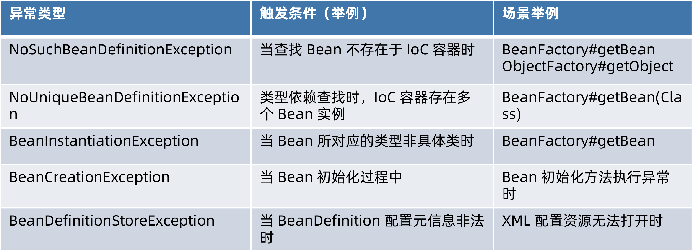

# 单一类型依赖查找接口 - BeanFactory

## 根据 Bean 名称查找

- getBean(String)
- Spring 2.5 覆盖默认参数：getBean(String,Object...)

## 根据 Bean 类型查找

### Bean 实时查找

- Spring 3.0 getBean(Class)
- Spring 4.1 覆盖默认参数：getBean(Class,Object...)：不推荐使用

### Spring 5.1 Bean 延迟查找

- getBeanProvider(Class)：ObjectProvider->ObjectFactory：见 第三章 Spring IoC容器概述#SpringIOC依赖查找#根据 Bean 名称查找#延迟查找 部分
- BeanFactory#getBeanProvider(ResolvableType)

## 根据 Bean 名称 + 类型查找

- getBean(String,Class)

# 集合类型依赖查找接口 - ListableBeanFactory

## 根据 Bean 类型查找

- 获取同类型 Bean 名称列表
  - getBeanNamesForType(Class)
  - Spring 4.2 getBeanNamesForType(ResolvableType)

- 获取同类型 Bean 实例列表
  - getBeansOfType(Class) 以及重载方法

## 通过注解类型查找

- Spring 3.0 获取标注类型 Bean 名称列表
  - getBeanNamesForAnnotation(Class<? extends Annotation>)
- Spring 3.0 获取标注类型 Bean 实例列表
  - getBeansWithAnnotation(Class<? extends Annotation>)
- Spring 3.0 获取指定名称 + 标注类型 Bean 实例
  - findAnnotationOnBean(String,Class<? extends Annotation>)

## 注意

# 层次性依赖查找接口 - HierarchicalBeanFactory

## 双亲 BeanFactory：getParentBeanFactory()

```java
public interface HierarchicalBeanFactory extends BeanFactory {

	@Nullable
	BeanFactory getParentBeanFactory();

	boolean containsLocalBean(String name);

}
```

## 设置父容器：ConfigurableBeanFactory

TODO：几种容器的关系

> **ConfigurableBeanFactory** :可配置的BeanFactory，实现接口 HierarchicalBeanFactory, SingletonBeanRegistry
>
> **ListableBeanFactory** ：可列表的BeanFactory
>
> ConfigurableListableBeanFactory extends ListableBeanFactory, AutowireCapableBeanFactory, **ConfigurableBeanFactory**

```java
public interface ConfigurableBeanFactory extends HierarchicalBeanFactory, SingletonBeanRegistry {
	void setParentBeanFactory(BeanFactory parentBeanFactory) throws IllegalStateException;
}
```


## 层次性查找

- 根据 Bean 名称查找

  - 基于 containsLocalBean 方法实现：查找当前BeanFactory中的Bean

-  根据 Bean 类型查找实例列表

  - 单一类型：在当前容器中查找

     T BeanFactoryUtils#beanOfType(ListableBeanFactory lbf, Class<T> type)

  - 集合类型：递归查找父容器

    String[] BeanFactoryUtils#beanNamesForTypeIncludingAncestors(ListableBeanFactory lbf, Class<?> type) 

- 根据 Java 注解查找名称列表，递归查找父容器

  - String[] BeanFactoryUtils#beanNamesForTypeIncludingAncestors(ListableBeanFactory lbf, Class<?> type)

# 延迟依赖查找

## org.springframework.beans.factory.ObjectFactory

## org.springframework.beans.factory.ObjectProvider

获取方法

```java
<T> ObjectProvider<T> BeanFactory#getBeanProvider(Class<T> requiredType);
```

### Spring 5 对 Java 8 特性扩展

#### 函数式接口

- getIfAvailable(Supplier)
- ifAvailable(Consumer)

#### Stream 扩展 - stream()

# 安全依赖查找

依赖查找安全性对比


> 注意：层次性依赖查找的安全性取决于其扩展的单一或集合类型的 BeanFactory 接口
>
> 如果返回单一类型就不安全，返回集合类型安全

代码示例

```java
public class TypeSafetyDependencyLookupDemo {

    public static void main(String[] args) {
        // 创建 BeanFactory 容器
        AnnotationConfigApplicationContext applicationContext = new AnnotationConfigApplicationContext();
        // 将当前类 TypeSafetyDependencyLookupDemo 作为配置类（Configuration Class）
        applicationContext.register(TypeSafetyDependencyLookupDemo.class);
        // 启动应用上下文
        applicationContext.refresh();

        // 演示 BeanFactory#getBean 方法的安全性
        displayBeanFactoryGetBean(applicationContext);
        // 演示 ObjectFactory#getObject 方法的安全性
        displayObjectFactoryGetObject(applicationContext);
        // 演示 ObjectProvider#getIfAvaiable 方法的安全性
        displayObjectProviderIfAvailable(applicationContext);

        // 演示 ListableBeanFactory#getBeansOfType 方法的安全性
        displayListableBeanFactoryGetBeansOfType(applicationContext);
        // 演示 ObjectProvider Stream 操作的安全性
        displayObjectProviderStreamOps(applicationContext);

        // 关闭应用上下文
        applicationContext.close();
    }

    private static void displayObjectProviderStreamOps(AnnotationConfigApplicationContext applicationContext) {
        ObjectProvider<User> userObjectProvider = applicationContext.getBeanProvider(User.class);
        printBeansException("displayObjectProviderStreamOps", () -> userObjectProvider.forEach(System.out::println));
    }

    private static void displayListableBeanFactoryGetBeansOfType(ListableBeanFactory beanFactory) {
        printBeansException("displayListableBeanFactoryGetBeansOfType", () -> beanFactory.getBeansOfType(User.class));
    }

    private static void displayObjectProviderIfAvailable(AnnotationConfigApplicationContext applicationContext) {
        ObjectProvider<User> userObjectProvider = applicationContext.getBeanProvider(User.class);
        printBeansException("displayObjectProviderIfAvailable", () -> userObjectProvider.getIfAvailable());
    }

    private static void displayObjectFactoryGetObject(AnnotationConfigApplicationContext applicationContext) {
        // ObjectProvider is ObjectFactory
        ObjectFactory<User> userObjectFactory = applicationContext.getBeanProvider(User.class);
        printBeansException("displayObjectFactoryGetObject", () -> userObjectFactory.getObject());
    }

    public static void displayBeanFactoryGetBean(BeanFactory beanFactory) {
        printBeansException("displayBeanFactoryGetBean", () -> beanFactory.getBean(User.class));
    }

    private static void printBeansException(String source, Runnable runnable) {
        System.err.println("==========================================");
        System.err.println("Source from :" + source);
        try {
            runnable.run();
        } catch (BeansException exception) {
            exception.printStackTrace();
        }
    }
}
```

# 内建可查找的依赖

## AbstractApplicationContext 内建可查找的依赖

| Bean 名称                   | Bean 实例                        | 使用场景                |
| --------------------------- | -------------------------------- | ----------------------- |
| environment                 | Environment 对象                 | 外部化配置以及 Profiles |
| systemProperties            | java.util.Properties             | 对象 Java 系统属性      |
| systemEnvironment           | java.util.Map                    | 操作系统环境变量        |
| messageSource               | MessageSource 对象               | 国际化文案              |
| lifecycleProcessor          | LifecycleProcessor 对象          | Lifecycle Bean 处理器   |
| applicationEventMulticaster | ApplicationEventMulticaster 对象 | Spring 事件广播器       |

# 内建可查找的依赖

注解驱动 Spring 应用上下文内建可查找的依赖（部分）


> 查找技巧：AnnotationConfigUtils定义了绝大多数内建依赖

```java
public abstract class AnnotationConfigUtils {

	/**
	 * The bean name of the internally managed Configuration annotation processor.
	 */
	public static final String CONFIGURATION_ANNOTATION_PROCESSOR_BEAN_NAME =
			"org.springframework.context.annotation.internalConfigurationAnnotationProcessor";

	/**
	 * The bean name of the internally managed BeanNameGenerator for use when processing
	 * {@link Configuration} classes. Set by {@link AnnotationConfigApplicationContext}
	 * and {@code AnnotationConfigWebApplicationContext} during bootstrap in order to make
	 * any custom name generation strategy available to the underlying
	 * {@link ConfigurationClassPostProcessor}.
	 * @since 3.1.1
	 */
	public static final String CONFIGURATION_BEAN_NAME_GENERATOR =
			"org.springframework.context.annotation.internalConfigurationBeanNameGenerator";

	/**
	 * The bean name of the internally managed Autowired annotation processor.
	 */
	public static final String AUTOWIRED_ANNOTATION_PROCESSOR_BEAN_NAME =
			"org.springframework.context.annotation.internalAutowiredAnnotationProcessor";

	/**
	 * The bean name of the internally managed Required annotation processor.
	 * @deprecated as of 5.1, since no Required processor is registered by default anymore
	 */
	@Deprecated
	public static final String REQUIRED_ANNOTATION_PROCESSOR_BEAN_NAME =
			"org.springframework.context.annotation.internalRequiredAnnotationProcessor";

	/**
	 * The bean name of the internally managed JSR-250 annotation processor.
	 */
	public static final String COMMON_ANNOTATION_PROCESSOR_BEAN_NAME =
			"org.springframework.context.annotation.internalCommonAnnotationProcessor";

	/**
	 * The bean name of the internally managed JPA annotation processor.
	 */
	public static final String PERSISTENCE_ANNOTATION_PROCESSOR_BEAN_NAME =
			"org.springframework.context.annotation.internalPersistenceAnnotationProcessor";

	private static final String PERSISTENCE_ANNOTATION_PROCESSOR_CLASS_NAME =
			"org.springframework.orm.jpa.support.PersistenceAnnotationBeanPostProcessor";

	/**
	 * The bean name of the internally managed @EventListener annotation processor.
	 */
	public static final String EVENT_LISTENER_PROCESSOR_BEAN_NAME =
			"org.springframework.context.event.internalEventListenerProcessor";

	/**
	 * The bean name of the internally managed EventListenerFactory.
	 */
	public static final String EVENT_LISTENER_FACTORY_BEAN_NAME =
			"org.springframework.context.event.internalEventListenerFactory";
}
```

# 依赖查找中的经典异常

BeansException 子类型



# 面试题

## ObjectFactory 与 BeanFactory 的区别？

答：

ObjectFactory 与 BeanFactory 均提供依赖查找的能力。

不过 ObjectFactory 仅关注一个或一种类型的 Bean 依赖查找，并且自身不具备依赖查找的能力，能力则由 BeanFactory 输出。

BeanFactory 则提供了单一类型、集合类型以及层次性等多种依赖查
找方式。

## BeanFactory.getBean 操作是否线程安全？

答：BeanFactory.getBean 方法的执行是线程安全的，过程中会增加互斥锁