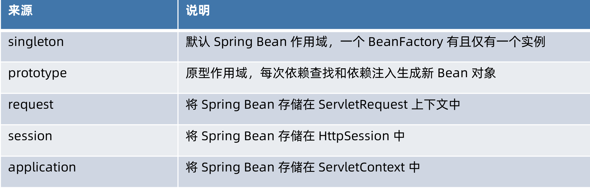
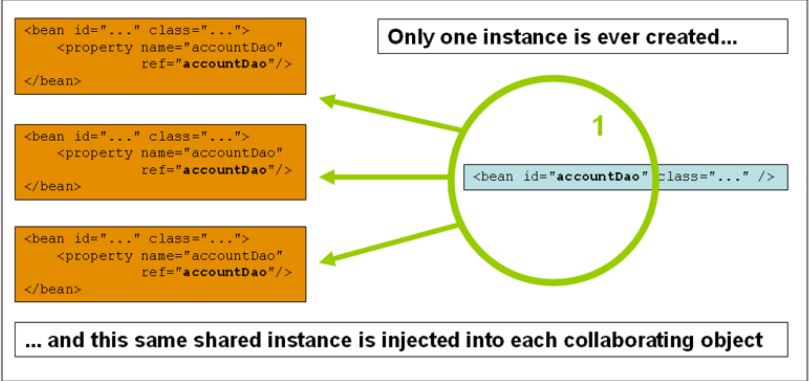
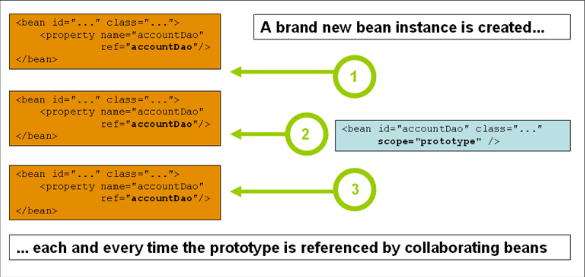
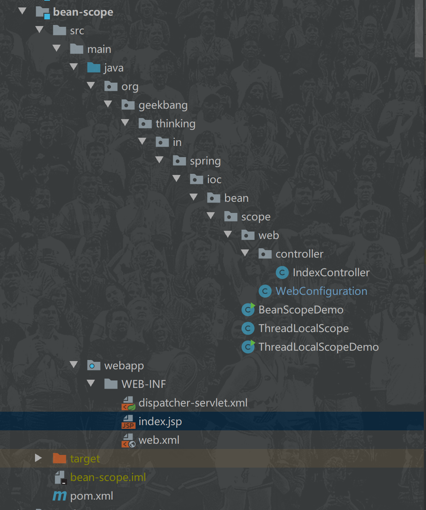
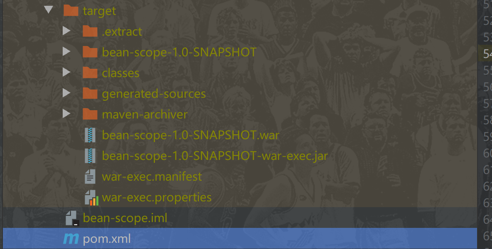
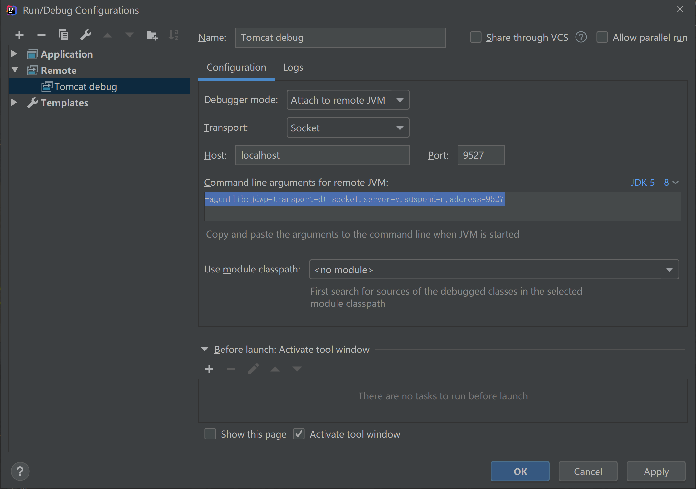
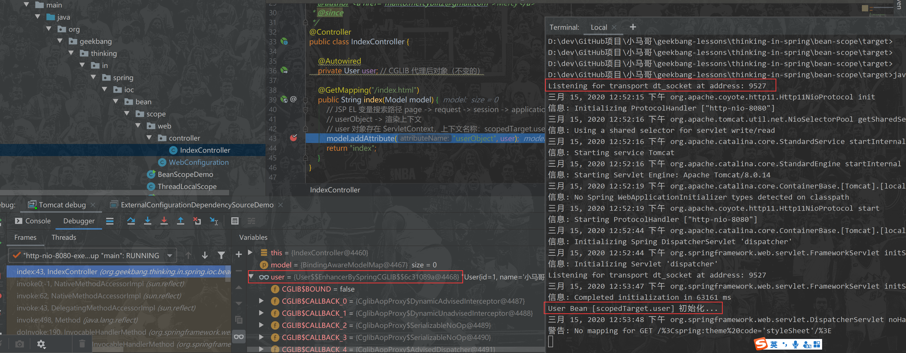

# Spring Bean 作用域



# "singleton" Bean 作用域



BeanDefinition:

```java
	/**
	 * Scope identifier for the standard singleton scope: {@value}.
	 * <p>Note that extended bean factories might support further scopes.
	 * @see #setScope
	 * @see ConfigurableBeanFactory#SCOPE_SINGLETON
	 */
	String SCOPE_SINGLETON = ConfigurableBeanFactory.SCOPE_SINGLETON;

	/**
	 * Scope identifier for the standard prototype scope: {@value}.
	 * <p>Note that extended bean factories might support further scopes.
	 * @see #setScope
	 * @see ConfigurableBeanFactory#SCOPE_PROTOTYPE
	 */
	String SCOPE_PROTOTYPE = ConfigurableBeanFactory.SCOPE_PROTOTYPE;

/**
	 * Return whether this a <b>Singleton</b>, with a single, shared instance
	 * returned on all calls.
	 * @see #SCOPE_SINGLETON
	 */
boolean isSingleton();

/**
	 * Return whether this a <b>Prototype</b>, with an independent instance
	 * returned for each call.
	 * @since 3.0
	 * @see #SCOPE_PROTOTYPE
	 */
boolean isPrototype();
```

实现AbstractBeanDefinition：

```java
/**
	 * Constant for the default scope name: {@code ""}, equivalent to singleton
	 * status unless overridden from a parent bean definition (if applicable).
	 */
public static final String SCOPE_DEFAULT = "";

private String scope = SCOPE_DEFAULT;	

@Override
public boolean isSingleton() {
    return SCOPE_SINGLETON.equals(this.scope) || SCOPE_DEFAULT.equals(this.scope);
}

/**
	 * Return whether this a <b>Prototype</b>, with an independent instance
	 * returned for each call.
	 * @see #SCOPE_PROTOTYPE
	 */
@Override
public boolean isPrototype() {
    return SCOPE_PROTOTYPE.equals(this.scope);
}
```

ConfigurableBeanFactory定义了Bean的作用域常量

```java
	/**
	 * Scope identifier for the standard singleton scope: {@value}.
	 * <p>Custom scopes can be added via {@code registerScope}.
	 * @see #registerScope
	 */
	String SCOPE_SINGLETON = "singleton";

	/**
	 * Scope identifier for the standard prototype scope: {@value}.
	 * <p>Custom scopes can be added via {@code registerScope}.
	 * @see #registerScope
	 */
	String SCOPE_PROTOTYPE = "prototype";
```


> 注意：从接口定义的代码层面上看并不是互斥的，但是从实现上确实是互斥的	

# "prototype" Bean 作用域



代码：

```java
public class BeanScopeDemo implements DisposableBean {

    @Bean
    // 默认 scope 就是 "singleton"
    public static User singletonUser() {
        return createUser();
    }

    @Bean
    @Scope(ConfigurableBeanFactory.SCOPE_PROTOTYPE)
    public static User prototypeUser() {
        return createUser();
    }

    private static User createUser() {
        User user = new User();
        user.setId(System.nanoTime());
        return user;
    }

    @Autowired
    @Qualifier("singletonUser")
    private User singletonUser;

    @Autowired
    @Qualifier("singletonUser")
    private User singletonUser1;

    @Autowired
    @Qualifier("prototypeUser")
    private User prototypeUser;

    @Autowired
    @Qualifier("prototypeUser")
    private User prototypeUser1;

    @Autowired
    @Qualifier("prototypeUser")
    private User prototypeUser2;

    @Autowired
    private Map<String, User> users;

    @Autowired
    private ConfigurableListableBeanFactory beanFactory; // Resolvable Dependency

    public static void main(String[] args) {

        // 创建 BeanFactory 容器
        AnnotationConfigApplicationContext applicationContext = new AnnotationConfigApplicationContext();
        // 注册 Configuration Class（配置类） -> Spring Bean
        applicationContext.register(BeanScopeDemo.class);

        applicationContext.addBeanFactoryPostProcessor(beanFactory -> {
            beanFactory.addBeanPostProcessor(new BeanPostProcessor() {

                @Override
                public Object postProcessAfterInitialization(Object bean, String beanName) throws BeansException {
                    System.out.printf("%s Bean 名称:%s 在初始化后回调...%n", bean.getClass().getName(), beanName);
                    return bean;
                }
            });
        });

        // 启动 Spring 应用上下文
        applicationContext.refresh();

        // 结论一：
        // Singleton Bean 无论依赖查找还是依赖注入，均为同一个对象
        // Prototype Bean 无论依赖查找还是依赖注入，均为新生成的对象

        // 结论二：
        // 如果依赖注入集合类型的对象，Singleton Bean 和 Prototype Bean 均会存在一个
        // Prototype Bean 有别于其他地方的依赖注入 Prototype Bean

        // 结论三：
        // 无论是 Singleton 还是 Prototype Bean 均会执行初始化方法回调
        // 不过仅 Singleton Bean 会执行销毁方法回调

        scopedBeansByLookup(applicationContext);

        scopedBeansByInjection(applicationContext);

        // 显示地关闭 Spring 应用上下文
        applicationContext.close();
    }

    private static void scopedBeansByLookup(AnnotationConfigApplicationContext applicationContext) {

        for (int i = 0; i < 3; i++) {
            // singletonUser 是共享 Bean 对象
            User singletonUser = applicationContext.getBean("singletonUser", User.class);
            System.out.println("singletonUser = " + singletonUser);
            // prototypeUser 是每次依赖查找均生成了新的 Bean 对象
            User prototypeUser = applicationContext.getBean("prototypeUser", User.class);
            System.out.println("prototypeUser = " + prototypeUser);
        }
    }

    private static void scopedBeansByInjection(AnnotationConfigApplicationContext applicationContext) {
        BeanScopeDemo beanScopeDemo = applicationContext.getBean(BeanScopeDemo.class);

        System.out.println("beanScopeDemo.singletonUser = " + beanScopeDemo.singletonUser);
        System.out.println("beanScopeDemo.singletonUser1 = " + beanScopeDemo.singletonUser1);

        System.out.println("beanScopeDemo.prototypeUser = " + beanScopeDemo.prototypeUser);
        System.out.println("beanScopeDemo.prototypeUser1 = " + beanScopeDemo.prototypeUser1);
        System.out.println("beanScopeDemo.prototypeUser2 = " + beanScopeDemo.prototypeUser2);

        System.out.println("beanScopeDemo.users = " + beanScopeDemo.users);
    }

    @Override
    public void destroy() throws Exception {

        System.out.println("当前 BeanScopeDemo Bean 正在销毁中...");

        this.prototypeUser.destroy();
        this.prototypeUser1.destroy();
        this.prototypeUser1.destroy();
        this.prototypeUser2.destroy();
        // 获取 BeanDefinition
        for (Map.Entry<String, User> entry : this.users.entrySet()) {
            String beanName = entry.getKey();
            BeanDefinition beanDefinition = beanFactory.getBeanDefinition(beanName);
            if (beanDefinition.isPrototype()) { // 如果当前 Bean 是 prototype scope
                User user = entry.getValue();
                user.destroy();
            }
        }

        System.out.println("当前 BeanScopeDemo Bean 销毁完成");
    }
}
```

结论：

1. Singleton Bean 无论依赖查找还是依赖注入，均为同一个对象

   Prototype Bean 无论依赖查找还是依赖注入，均为新生成的对象

2. 如果依赖注入集合类型的对象，Singleton Bean 和 Prototype Bean 均会存在一个
   Prototype Bean 有别于其他地方的依赖注入 Prototype Bean

3. 无论是 Singleton 还是 Prototype Bean 均会执行初始化方法回调
   不过仅 Singleton Bean 会执行销毁方法回调

技巧：

1. 当容器中存在多个相同类型的Bean时，可以通过@Qualifier指定bean名称

# "request" Bean 作用域

## 配置

XML - <bean class= "..." scope = "request" />
Java 注解 - @RequestScope 或 @Scope(WebApplicationContext.SCOPE_REQUEST)

## 演示

### 搭建工程

#### 项目结构



#### 配置文件

##### pom.xml

```xml
<?xml version="1.0" encoding="UTF-8"?>
<project xmlns="http://maven.apache.org/POM/4.0.0"
         xmlns:xsi="http://www.w3.org/2001/XMLSchema-instance"
         xsi:schemaLocation="http://maven.apache.org/POM/4.0.0 http://maven.apache.org/xsd/maven-4.0.0.xsd">
    <parent>
        <artifactId>thinking-in-spring</artifactId>
        <groupId>org.geekbang</groupId>
        <version>1.0-SNAPSHOT</version>
    </parent>
    <modelVersion>4.0.0</modelVersion>

    <artifactId>bean-scope</artifactId>
    <packaging>war</packaging>

    <dependencies>

        <!-- 使用 Servlet 3.1 API -->
        <dependency>
            <groupId>javax.servlet</groupId>
            <artifactId>javax.servlet-api</artifactId>
            <version>3.1.0</version>
            <scope>provided</scope>
        </dependency>

        <dependency>
            <groupId>org.geekbang</groupId>
            <artifactId>ioc-container-overview</artifactId>
            <version>1.0-SNAPSHOT</version>
            <scope>compile</scope>
        </dependency>

        <dependency>
            <groupId>org.springframework.cloud</groupId>
            <artifactId>spring-cloud-commons</artifactId>
            <version>2.2.0.RELEASE</version>
            <scope>test</scope>
        </dependency>

        <dependency>
            <groupId>org.springframework.cloud</groupId>
            <artifactId>spring-cloud-context</artifactId>
            <version>2.2.0.RELEASE</version>
            <scope>test</scope>
        </dependency>

    </dependencies>

    <build>
        <plugins>
            <!-- Tomcat 8 Maven 插件用于构建可执行 war -->
            <!-- https://mvnrepository.com/artifact/org.apache.tomcat.maven/tomcat8-maven-plugin -->
            <plugin>
                <groupId>org.apache.tomcat.maven</groupId>
                <artifactId>tomcat8-maven-plugin</artifactId>
                <version>3.0-r1655215</version>
                <executions>
                    <execution>
                        <id>tomcat-run</id>
                        <goals>
                            <!-- 最终打包成可执行的jar包 -->
                            <goal>exec-war-only</goal>
                        </goals>
                        <phase>package</phase>
                        <configuration>
                            <!-- ServletContext 路径 -->
                            <path>/</path>
                        </configuration>
                    </execution>
                </executions>
            </plugin>
        </plugins>
    </build>

    <pluginRepositories>
        <pluginRepository>
            <!-- tomcat8-maven-plugin 所在仓库 -->
            <id>Alfresco</id>
            <name>Alfresco Repository</name>
            <url>https://artifacts.alfresco.com/nexus/content/repositories/public/</url>
            <snapshots>
                <enabled>false</enabled>
            </snapshots>
        </pluginRepository>
    </pluginRepositories>

</project>
```

##### web.xml

```xml
<?xml version="1.0" encoding="UTF-8"?>
<web-app xmlns:xsi="http://www.w3.org/2001/XMLSchema-instance" xmlns="http://java.sun.com/xml/ns/javaee"
         xsi:schemaLocation="http://java.sun.com/xml/ns/javaee http://java.sun.com/xml/ns/javaee/web-app_3_0.xsd"
         version="3.0">

    <servlet>
        <servlet-name>dispatcher</servlet-name>
        <servlet-class>org.springframework.web.servlet.DispatcherServlet</servlet-class>
    </servlet>

    <servlet-mapping>
        <servlet-name>dispatcher</servlet-name>
        <url-pattern>/</url-pattern>
    </servlet-mapping>

</web-app>
```

##### dispatcher-servlet.xml

```xml
<?xml version="1.0" encoding="UTF-8"?>
<beans
        xmlns="http://www.springframework.org/schema/beans"
        xmlns:context="http://www.springframework.org/schema/context"
        xmlns:xsi="http://www.w3.org/2001/XMLSchema-instance"
        xsi:schemaLocation="http://www.springframework.org/schema/beans
        https://www.springframework.org/schema/beans/spring-beans.xsd
        http://www.springframework.org/schema/context
        https://www.springframework.org/schema/context/spring-context.xsd">

    <!-- 激活 Spring 注解驱动 -->
    <context:component-scan base-package="org.geekbang.thinking.in.spring.ioc.bean.scope"/>

    <bean class="org.springframework.web.servlet.view.InternalResourceViewResolver">
        <property name="prefix" value="/WEB-INF/"/>
        <property name="suffix" value=".jsp"/>
    </bean>

</beans>
```

##### WebConfiguration

@EnableWebMvc加不加没有影响

```java
**
 * Web MVC 配置类
 *
 * @author <a href="mailto:mercyblitz@gmail.com">Mercy</a>
 * @since
 */
@Configuration
@EnableWebMvc
public class WebConfiguration {

    @Bean
//    @RequestScope
//    @SessionScope
    @ApplicationScope
    public User user() {
        User user = new User();
        user.setId(1L);
        user.setName("小马哥");
        return user;
    }

}
```

##### User

这里的beanName是：**scopedTarget.user**

```java
public class User implements BeanNameAware {

    private Long id;

    private String name;

    @Override
    public String toString() {
        return "User{" +
                "id=" + id +
                ", name='" + name + '\'' +
                ", city=" + city +
                ", workCities=" + Arrays.toString(workCities) +
                ", lifeCities=" + lifeCities +
                ", configFileLocation=" + configFileLocation +
                '}';
    }

    public static User createUser() {
        User user = new User();
        user.setId(1L);
        user.setName("小马哥");
        return user;
    }

    @PostConstruct
    public void init() {
        System.out.println("User Bean [" + beanName + "] 初始化...");
    }

    @PreDestroy
    public void destroy() {
        System.out.println("User Bean [" + beanName + "] 销毁中...");
    }

    @Override
    public void setBeanName(String name) {
        this.beanName = name;
    }
}
```


##### IndexController

```java
@Controller
public class IndexController {

    @Autowired
    private User user; // CGLIB 代理后对象（不变的）

    @GetMapping("/index.html")
    public String index(Model model) {
        // JSP EL 变量搜索路径 page -> request -> session -> application(ServletContext)
        // userObject -> 渲染上下文
        // user 对象存在 ServletContext，上下文名称：scopedTarget.user == 新生成 Bean 名称
        model.addAttribute("userObject", user);
        return "index";
    }
}
```

##### index.jsp

```html
<?xml version="1.0" encoding="UTF-8" ?>
<jsp:directive.page language="java" contentType="text/html; charset=UTF-8"
    pageEncoding="UTF-8" />
<html>
    <head>
        <link rel="stylesheet" href="<spring:theme code='styleSheet'/>" type="text/css"/>
    </head>
    <body>
        \${userObject.name} : ${userObject.name}
        \${applicationScope['scopedTarget.user'].name} : ${applicationScope['scopedTarget.user'].name}
    </body>
</html>
```

### 运行工程

由于使用的tomcat插件，打包命令

```she
mvn clean package
```

打包之后再target目录



运行项目：

```shell
jar -jar bean-scope-1.0-SNAPSHOT-war-exec.jar
```

或者在tomcat中运行war包

### 远程debug

1. 配置远程信息



2. 在jar包的启动参数中加上上图中蓝色选中代码

java -jar -agentlib:jdwp=transport=dt_socket,server=y,suspend=n,address=9527 bean-scope-1.0-SNAPSHOT-war-exec.jar

3. 启动本地Tomcat

直接debug刚刚配置好的Tomcat debug

4. 访问 http://localhost:8080/index.html，此时可以进入断点



## API-AbstractRequestAttributesScope

顶级接口：**Scope**

这个get方法实际上是jsp中el表达式取值过程中调用的

```JAVA
public abstract class AbstractRequestAttributesScope implements Scope {

    @Override
    public Object get(String name, ObjectFactory<?> objectFactory) {
        RequestAttributes attributes = RequestContextHolder.currentRequestAttributes();
        Object scopedObject = attributes.getAttribute(name, getScope());
        if (scopedObject == null) {
            scopedObject = objectFactory.getObject();
            attributes.setAttribute(name, scopedObject, getScope());
            // Retrieve object again, registering it for implicit session attribute updates.
            // As a bonus, we also allow for potential decoration at the getAttribute level.
            Object retrievedObject = attributes.getAttribute(name, getScope());
            if (retrievedObject != null) {
                // Only proceed with retrieved object if still present (the expected case).
                // If it disappeared concurrently, we return our locally created instance.
                scopedObject = retrievedObject;
            }
        }
        return scopedObject;
    }
}
```

# "session" Bean 作用域

##  配置

XML - <bean class= "..." scope = "session" />
Java 注解 - @RequestScope 或 @Scope(WebApplicationContext.SCOPE_REQUEST)

## API - SessionScope

在get对象之间，申请了一把互斥锁，这个互斥锁一把就是当前session

```java
public class SessionScope extends AbstractRequestAttributesScope {

   @Override
   protected int getScope() {
      return RequestAttributes.SCOPE_SESSION;
   }

   @Override
   public String getConversationId() {
      return RequestContextHolder.currentRequestAttributes().getSessionId();
   }

   @Override
   public Object get(String name, ObjectFactory<?> objectFactory) {
      Object mutex = RequestContextHolder.currentRequestAttributes().getSessionMutex();
      synchronized (mutex) {
         return super.get(name, objectFactory);
      }
   }

   @Override
   @Nullable
   public Object remove(String name) {
      Object mutex = RequestContextHolder.currentRequestAttributes().getSessionMutex();
      synchronized (mutex) {
         return super.remove(name);
      }
   }

}
```

互斥锁获得过程

```java
public Object getSessionMutex() {
    return WebUtils.getSessionMutex(obtainSession());
}

public static Object getSessionMutex(HttpSession session) {
    Assert.notNull(session, "Session must not be null");
    Object mutex = session.getAttribute(SESSION_MUTEX_ATTRIBUTE);
    if (mutex == null) {
        mutex = session;
    }
    return mutex;
}
```

# "application" Bean 作用域

## 配置

XML - <bean class= "..." scope = "application" />
Java 注解 - @ApplicationScope 或 @Scope(WebApplicationContext.SCOPE_APPLICATION)

## API - ApplicationScope(ServletContextScope)

实际的实现类是**ServletContextScope**，这个类没有继承**AbstractRequestAttributesScope**

```java
public class ServletContextScope implements Scope, DisposableBean {

	private final ServletContext servletContext;

	private final Map<String, Runnable> destructionCallbacks = new LinkedHashMap<>();


	/**
	 * Create a new Scope wrapper for the given ServletContext.
	 * @param servletContext the ServletContext to wrap
	 */
	public ServletContextScope(ServletContext servletContext) {
		Assert.notNull(servletContext, "ServletContext must not be null");
		this.servletContext = servletContext;
	}


	@Override
	public Object get(String name, ObjectFactory<?> objectFactory) {
		Object scopedObject = this.servletContext.getAttribute(name);
		if (scopedObject == null) {
			scopedObject = objectFactory.getObject();
			this.servletContext.setAttribute(name, scopedObject);
		}
		return scopedObject;
	}

	@Override
	@Nullable
	public Object remove(String name) {
		Object scopedObject = this.servletContext.getAttribute(name);
		if (scopedObject != null) {
			synchronized (this.destructionCallbacks) {
				this.destructionCallbacks.remove(name);
			}
			this.servletContext.removeAttribute(name);
			return scopedObject;
		}
		else {
			return null;
		}
	}

	@Override
	public void registerDestructionCallback(String name, Runnable callback) {
		synchronized (this.destructionCallbacks) {
			this.destructionCallbacks.put(name, callback);
		}
	}

	@Override
	@Nullable
	public Object resolveContextualObject(String key) {
		return null;
	}

	@Override
	@Nullable
	public String getConversationId() {
		return null;
	}


	/**
	 * Invoke all registered destruction callbacks.
	 * To be called on ServletContext shutdown.
	 * @see org.springframework.web.context.ContextCleanupListener
	 */
	@Override
	public void destroy() {
		synchronized (this.destructionCallbacks) {
			for (Runnable runnable : this.destructionCallbacks.values()) {
				runnable.run();
			}
			this.destructionCallbacks.clear();
		}
	}

}
```

# 自定义 Bean 作用域

## 实现 Scope

- org.springframework.beans.factory.config.Scope
ThreadLocal 级别 Scope

  ```java
  public class ThreadLocalScope implements Scope {
  
      public static final String SCOPE_NAME = "thread-local";
  
      private final NamedThreadLocal<Map<String, Object>> threadLocal = new NamedThreadLocal("thread-local-scope") {
  
          public Map<String, Object> initialValue() {
              return new HashMap<>();
          }
      };
  
      @Override
      public Object get(String name, ObjectFactory<?> objectFactory) {
  
          // 非空
          Map<String, Object> context = getContext();
  
          Object object = context.get(name);
  
          if (object == null) {
              object = objectFactory.getObject();
              context.put(name, object);
          }
  
          return object;
      }
  
      @NonNull
      private Map<String, Object> getContext() {
          return threadLocal.get();
      }
  
      @Override
      public Object remove(String name) {
          Map<String, Object> context = getContext();
          return context.remove(name);
      }
  
      @Override
      public void registerDestructionCallback(String name, Runnable callback) {
          // TODO
      }
  
      @Override
      public Object resolveContextualObject(String key) {
          Map<String, Object> context = getContext();
          return context.get(key);
      }
  
      @Override
      public String getConversationId() {
          Thread thread = Thread.currentThread();
          return String.valueOf(thread.getId());
      }
  }
  ```

- 注册 Scope

```java
public class ThreadLocalScopeDemo {

    @Bean
    @Scope(ThreadLocalScope.SCOPE_NAME)
    public User user() {
        return createUser();
    }

    private static User createUser() {
        User user = new User();
        user.setId(System.nanoTime());
        return user;
    }

    public static void main(String[] args) {

        // 创建 BeanFactory 容器
        AnnotationConfigApplicationContext applicationContext = new AnnotationConfigApplicationContext();
        // 注册 Configuration Class（配置类） -> Spring Bean
        applicationContext.register(ThreadLocalScopeDemo.class);

        applicationContext.addBeanFactoryPostProcessor(beanFactory -> {
            // 注册自定义 scope
            beanFactory.registerScope(ThreadLocalScope.SCOPE_NAME, new ThreadLocalScope());
        });

        // 启动 Spring 应用上下文
        applicationContext.refresh();

        scopedBeansByLookup(applicationContext);

        // 关闭 Spring 应用上下文
        applicationContext.close();
    }

    private static void scopedBeansByLookup(AnnotationConfigApplicationContext applicationContext) {

        for (int i = 0; i < 3; i++) {
            Thread thread = new Thread(() -> {
                // user 是共享 Bean 对象
                User user = applicationContext.getBean("user", User.class);
                System.out.printf("[Thread id :%d] user = %s%n", Thread.currentThread().getId(), user);
            });

            // 启动线程
            thread.start();
            // 强制线程执行完成
            try {
                thread.join();
            } catch (InterruptedException e) {
                e.printStackTrace();
            }
        }
    }

    private static void scopedBeansByInjection(AnnotationConfigApplicationContext applicationContext) {
    }
}
```

结果：每个线程获得User对象是一样的

## API - ConfigurableBeanFactory#registerScope

## xml配置

```xml
<bean class="org.springframework.beans.factory.config.CustomScopeConfigurer">
    <property name="scopes">

        <map>
            <entry key="...">
            </entry>
        </map>

    </property>
</bean>
```

# 扩展-Spring Cloud RefreshScope 是如何控制 Bean 的动态刷新？

# 面试题

## Spring 內建的 Bean 作用域有几种？

答：singleton、prototype、request、session、application 以及websocket

# singleton Bean 是否在一个应用是唯一的？

答：否，singleton bean 仅在当前 Spring IoC 容器（BeanFactory）中是单例对象。

# “application”Bean 是否被其他方案替代

答：可以的，实际上，“application” Bean 与“singleton” Bean 没有本质区别