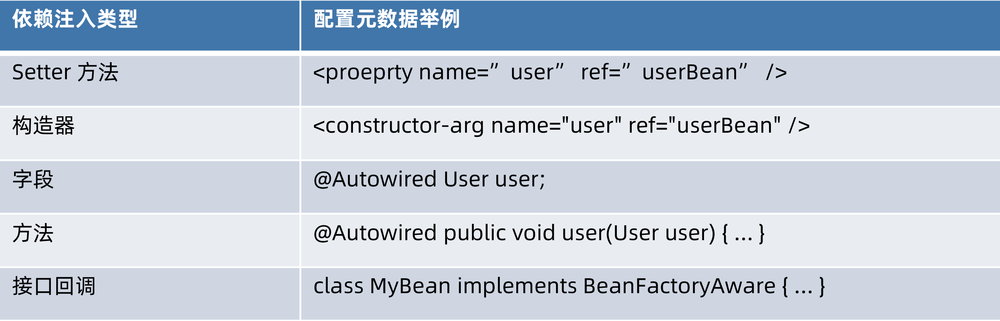
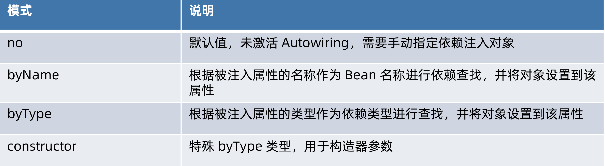

依赖注入的模式和类型

## 手动模式 - 配置或者编程的方式，提前安排注入规则

- XML 资源配置元信息

- Java 注解配置元信息

- API 配置元信息

## 自动模式 - 实现方提供依赖自动关联的方式，按照內建的注入规则

- Autowiring（自动绑定）

### 依赖注入类型



### 自动绑定（Autowiring）模式

Autowiring modes



# Setter 方法注入

UserHolder

```java
public class UserHolder {

    private User user;

    public UserHolder() {
    }

    public UserHolder(User user) {
        this.user = user;
    }

    public User getUser() {
        return user;
    }

    public void setUser(User user) {
        this.user = user;
    }

    @Override
    public String toString() {
        return "UserHolder{" +
                "user=" + user +
                '}';
    }
}
```

dependency-lookup-context.xml:

```xml
<!-- Root BeanDefinition 不需要合并，不存在 parent -->
<!-- 普通 beanDefinition GenericBeanDefinition -->
<!-- 经过合并后 GenericBeanDefinition 变成 RootBeanDefinition -->
<bean id="user" class="org.geekbang.thinking.in.spring.ioc.overview.domain.User">
    <property name="id" value="1"/>
    <property name="name" value="小马哥"/>
</bean>

<!-- 普通 beanDefinition GenericBeanDefinition -->
<!-- 合并后 GenericBeanDefinition 变成 RootBeanDefinition，并且覆盖 parent 相关配置-->
<!-- primary = true , 增加了一个 address 属性 -->
<bean id="superUser" class="org.geekbang.thinking.in.spring.ioc.overview.domain.SuperUser" parent="user"
      primary="true">
    <property name="address" value="杭州"/>
</bean>
```


## 手动模式

### XML 资源配置元信息

xml:

```xml
<bean class="org.geekbang.thinking.in.spring.ioc.dependency.injection.UserHolder">
    <property name="user" ref="superUser" />
</bean>
```

java:

```java
public class AutoWiringByNameDependencySetterInjectionDemo {

    public static void main(String[] args) {

        DefaultListableBeanFactory beanFactory = new DefaultListableBeanFactory();

        XmlBeanDefinitionReader beanDefinitionReader = new XmlBeanDefinitionReader(beanFactory);

        String xmlResourcePath = "classpath:/META-INF/autowiring-dependency-setter-injection.xml";
        // 加载 XML 资源，解析并且生成 BeanDefinition
        beanDefinitionReader.loadBeanDefinitions(xmlResourcePath);
        // 依赖查找并且创建 Bean
        UserHolder userHolder = beanFactory.getBean(UserHolder.class);
        System.out.println(userHolder);

    }
}
```


### Java 注解配置元信息

```java
public class AnnotationDependencySetterInjectionDemo {

    public static void main(String[] args) {

        // 创建 BeanFactory 容器
        AnnotationConfigApplicationContext applicationContext = new AnnotationConfigApplicationContext();
        // 注册 Configuration Class（配置类）
        applicationContext.register(AnnotationDependencySetterInjectionDemo.class);

        XmlBeanDefinitionReader beanDefinitionReader = new XmlBeanDefinitionReader(applicationContext);

        String xmlResourcePath = "classpath:/META-INF/dependency-lookup-context.xml";
        // 加载 XML 资源，解析并且生成 BeanDefinition
        beanDefinitionReader.loadBeanDefinitions(xmlResourcePath);

        // 启动 Spring 应用上下文
        applicationContext.refresh();

        // 依赖查找并且创建 Bean
        UserHolder userHolder = applicationContext.getBean(UserHolder.class);
        System.out.println(userHolder);

        // 显示地关闭 Spring 应用上下文
        applicationContext.close();
    }

    @Bean
    public UserHolder userHolder(User user) {
        UserHolder userHolder = new UserHolder();
        userHolder.setUser(user);
        return userHolder;
    }
}
```


### API 配置元信息

```java
public class ApiDependencySetterInjectionDemo {

    public static void main(String[] args) {

        // 创建 BeanFactory 容器
        AnnotationConfigApplicationContext applicationContext = new AnnotationConfigApplicationContext();

        // 生成 UserHolder 的 BeanDefinition
        BeanDefinition userHolderBeanDefinition = createUserHolderBeanDefinition();
        // 注册 UserHolder 的 BeanDefinition
        applicationContext.registerBeanDefinition("userHolder", userHolderBeanDefinition);

        XmlBeanDefinitionReader beanDefinitionReader = new XmlBeanDefinitionReader(applicationContext);

        String xmlResourcePath = "classpath:/META-INF/dependency-lookup-context.xml";
        // 加载 XML 资源，解析并且生成 BeanDefinition
        beanDefinitionReader.loadBeanDefinitions(xmlResourcePath);

        // 启动 Spring 应用上下文
        applicationContext.refresh();

        // 依赖查找并且创建 Bean
        UserHolder userHolder = applicationContext.getBean(UserHolder.class);
        System.out.println(userHolder);

        // 显示地关闭 Spring 应用上下文
        applicationContext.close();
    }

    /**
     * 为 {@link UserHolder} 生成 {@link BeanDefinition}
     *
     * @return
     */
    private static BeanDefinition createUserHolderBeanDefinition() {
        BeanDefinitionBuilder definitionBuilder = BeanDefinitionBuilder.genericBeanDefinition(UserHolder.class);
        definitionBuilder.addPropertyReference("user", "superUser");
        return definitionBuilder.getBeanDefinition();
    }

}
```


## 自动模式

### byName

```xml
<bean class="org.geekbang.thinking.in.spring.ioc.dependency.injection.UserHolder"
      autowire="byName">
    <!--<property name="user" ref="superUser" /> 替换成 autowiring 模式 -->
</bean>
```

### byType

```java
<bean class="org.geekbang.thinking.in.spring.ioc.dependency.injection.UserHolder"
    autowire="byType">
    <!-- <property name="user" ref="superUser" /> 替换成 autowiring 模式 -->
</bean>
```

# 构造器注入

##  手动模式

### XML 资源配置元信息

xml

```xml
    <bean class="org.geekbang.thinking.in.spring.ioc.dependency.injection.UserHolder">
        <property name="user" ref="superUser" />
    </bean>

</beans>
```

java

```JAVA
public class AutoWiringConstructorDependencyConstructorInjectionDemo {

    public static void main(String[] args) {

        DefaultListableBeanFactory beanFactory = new DefaultListableBeanFactory();

        XmlBeanDefinitionReader beanDefinitionReader = new XmlBeanDefinitionReader(beanFactory);

        String xmlResourcePath = "classpath:/META-INF/autowiring-dependency-constructor-injection.xml";
        // 加载 XML 资源，解析并且生成 BeanDefinition
        beanDefinitionReader.loadBeanDefinitions(xmlResourcePath);
        // 依赖查找并且创建 Bean
        UserHolder userHolder = beanFactory.getBean(UserHolder.class);
        System.out.println(userHolder);

    }
}
```


### Java 注解配置元信息

```JAVA
public class AnnotationDependencyConstructorInjectionDemo {

    public static void main(String[] args) {

        // 创建 BeanFactory 容器
        AnnotationConfigApplicationContext applicationContext = new AnnotationConfigApplicationContext();
        // 注册 Configuration Class（配置类）
        applicationContext.register(AnnotationDependencyConstructorInjectionDemo.class);

        XmlBeanDefinitionReader beanDefinitionReader = new XmlBeanDefinitionReader(applicationContext);

        String xmlResourcePath = "classpath:/META-INF/dependency-lookup-context.xml";
        // 加载 XML 资源，解析并且生成 BeanDefinition
        beanDefinitionReader.loadBeanDefinitions(xmlResourcePath);

        // 启动 Spring 应用上下文
        applicationContext.refresh();

        // 依赖查找并且创建 Bean
        UserHolder userHolder = applicationContext.getBean(UserHolder.class);
        System.out.println(userHolder);

        // 显示地关闭 Spring 应用上下文
        applicationContext.close();
    }

    @Bean
    public UserHolder userHolder(User user) {
        return new UserHolder(user);
    }
}
```

### API 配置元信息

```JAVA
public class ApiDependencyConstructorInjectionDemo {

    public static void main(String[] args) {

        // 创建 BeanFactory 容器
        AnnotationConfigApplicationContext applicationContext = new AnnotationConfigApplicationContext();

        // 生成 UserHolder 的 BeanDefinition
        BeanDefinition userHolderBeanDefinition = createUserHolderBeanDefinition();
        // 注册 UserHolder 的 BeanDefinition
        applicationContext.registerBeanDefinition("userHolder", userHolderBeanDefinition);

        XmlBeanDefinitionReader beanDefinitionReader = new XmlBeanDefinitionReader(applicationContext);

        String xmlResourcePath = "classpath:/META-INF/dependency-lookup-context.xml";
        // 加载 XML 资源，解析并且生成 BeanDefinition
        beanDefinitionReader.loadBeanDefinitions(xmlResourcePath);

        // 启动 Spring 应用上下文
        applicationContext.refresh();

        // 依赖查找并且创建 Bean
        UserHolder userHolder = applicationContext.getBean(UserHolder.class);
        System.out.println(userHolder);

        // 显示地关闭 Spring 应用上下文
        applicationContext.close();
    }

    /**
     * 为 {@link UserHolder} 生成 {@link BeanDefinition}
     *
     * @return
     */
    private static BeanDefinition createUserHolderBeanDefinition() {
        BeanDefinitionBuilder definitionBuilder = BeanDefinitionBuilder.genericBeanDefinition(UserHolder.class);
        definitionBuilder.addConstructorArgReference("superUser");
        return definitionBuilder.getBeanDefinition();
    }

//    @Bean
//    public UserHolder userHolder(User user) { // superUser -> primary = true
//        UserHolder userHolder = new UserHolder();
//        userHolder.setUser(user);
//        return userHolder;
//    }
}
```


## 自动模式

### constructor

> autowire="constructor"

```java
    <bean class="org.geekbang.thinking.in.spring.ioc.dependency.injection.UserHolder"
          autowire="constructor">
    </bean>

</beans>
```

# 字段注入

## Java 注解配置元信息

> @Autowired 会忽略掉静态字段

### @Autowired

### @Resource

### @Inject（可选）

```java
public class AnnotationDependencyFieldInjectionDemo {

    @Autowired
    private
//    static // @Autowired 会忽略掉静态字段
            UserHolder userHolder;

    @Resource
    private UserHolder userHolder2;

    public static void main(String[] args) {

        // 创建 BeanFactory 容器
        AnnotationConfigApplicationContext applicationContext = new AnnotationConfigApplicationContext();
        // 注册 Configuration Class（配置类） -> Spring Bean
        applicationContext.register(AnnotationDependencyFieldInjectionDemo.class);

        XmlBeanDefinitionReader beanDefinitionReader = new XmlBeanDefinitionReader(applicationContext);

        String xmlResourcePath = "classpath:/META-INF/dependency-lookup-context.xml";
        // 加载 XML 资源，解析并且生成 BeanDefinition
        beanDefinitionReader.loadBeanDefinitions(xmlResourcePath);

        // 启动 Spring 应用上下文
        applicationContext.refresh();

        // 依赖查找 AnnotationDependencyFieldInjectionDemo Bean
        AnnotationDependencyFieldInjectionDemo demo = applicationContext.getBean(AnnotationDependencyFieldInjectionDemo.class);

        // @Autowired 字段关联
        UserHolder userHolder = demo.userHolder;
        System.out.println(userHolder);
        System.out.println(demo.userHolder2);

        System.out.println(userHolder == demo.userHolder2);


        // 显示地关闭 Spring 应用上下文
        applicationContext.close();
    }

    @Bean
    public UserHolder userHolder(User user) {
        return new UserHolder(user);
    }
}
```

# 方法注入

Java 注解配置元信息

## @Autowired

## @Resource

## @Inject（可选）

## @Bean

> 执行顺序：@Resource > @Autowired

```java
public class AnnotationDependencyMethodInjectionDemo {

    private UserHolder userHolder;

    private UserHolder userHolder2;

    @Autowired
    public void init1(UserHolder userHolder) {
        this.userHolder = userHolder;
    }

    @Resource
    public void init2(UserHolder userHolder2) {
        this.userHolder2 = userHolder2;
    }

    @Bean
    public UserHolder userHolder(User user) {
        return new UserHolder(user);
    }

    public static void main(String[] args) {

        // 创建 BeanFactory 容器
        AnnotationConfigApplicationContext applicationContext = new AnnotationConfigApplicationContext();
        // 注册 Configuration Class（配置类） -> Spring Bean
        applicationContext.register(AnnotationDependencyMethodInjectionDemo.class);

        XmlBeanDefinitionReader beanDefinitionReader = new XmlBeanDefinitionReader(applicationContext);

        String xmlResourcePath = "classpath:/META-INF/dependency-lookup-context.xml";
        // 加载 XML 资源，解析并且生成 BeanDefinition
        beanDefinitionReader.loadBeanDefinitions(xmlResourcePath);

        // 启动 Spring 应用上下文
        applicationContext.refresh();

        // 依赖查找 AnnotationDependencyFieldInjectionDemo Bean
        AnnotationDependencyMethodInjectionDemo demo = applicationContext.getBean(AnnotationDependencyMethodInjectionDemo.class);

        // @Autowired 字段关联
        UserHolder userHolder = demo.userHolder;
        System.out.println(userHolder);
        System.out.println(demo.userHolder2);

        System.out.println(userHolder == demo.userHolder2);

        // 显示地关闭 Spring 应用上下文
        applicationContext.close();
    }
}
```

# 接口回调注入

其中Aware接口的调用主要分布在两个位置（顺序排列）

1. BeanPostProcessor前置处理器调用之前，处理了实现了以下接口的Aware（3个，顺序排列）`BeanNameAware`、`BeanClassLoaderAware`、`BeanFactoryAware`
2. AbstractAutowireCapableBeanFactory#applyBeanPostProcessorsBeforeInitialization调用了BeanPostProcessor#postProcessBeforeInitialization方法，而ApplicationContextAwareProcessor是最先加进beanPostProcessors集合(CopyOnWriteArrayList)中的，在所有的BeanPostProcessor之前处理，处理了实现了以下接口的Aware（6个，顺序排列）`EnvironmentAware`、`EmbeddedValueResolverAware`、`ResourceLoaderAware`、`ApplicationEventPublisherAware`、`MessageSourceAware`、`ApplicationContextAware`

## 第一批次

| 內建接口             | 说明                                   |
| -------------------- | -------------------------------------- |
| BeanNameAware        | 获取当前 Bean 的名称                   |
| BeanClassLoaderAware | 获取加载当前 Bean Class 的 ClassLoader |
| BeanFactoryAware     | 获取 IoC 容器 - BeanFactory            |

## 第二批次

| 內建接口                       | 说明                                                     |
| ------------------------------ | -------------------------------------------------------- |
| EnvironmentAware               | 获取 Environment 对象                                    |
| EmbeddedValueResolverAware     | 获取 StringValueResolver 对象，用于占位符处理            |
| ResourceLoaderAware            | 获取资源加载器 对象 - ResourceLoader                     |
| ApplicationEventPublisherAware | 获取 ApplicationEventPublishAware 对象，用于 Spring 事件 |
| MessageSourceAware             | 获取 MessageSource 对象，用于 Spring 国际化              |
| ApplicationContextAware        | 获取 Spring 应用上下文 - ApplicationContext 对象         |

# 基础类型注入

## 原生类型(Primitive)

boolean、 byte、 char、 short、 int、 float、 long、 double

## 标量类型(Scalar)

Number、 Character、 Boolean、 Enum、 Locale、 Charset、Currency、Properties、UUID

## 常规类型(General)

Object、 String、 TimeZone、 Calendar、 Optional 等

## Spring 类型

Resource、 InputSource、 Formatter 等

# 集合类型注入

## 数组类型(Array) 

原生类型、标量类型、常规类型、Spring类型

## 集合类型（Collection） 

List、 Set (SortedSet、 NavigableSet、 EnumSet)

Map: Properties

## 示例：

java

```java
public class User implements BeanNameAware {

    private Long id;

    private String name;

    private City city;

    private City[] workCities;

    private List<City> lifeCities;

    private Resource configFileLocation;

    /**
     * 当前 Bean 的名称
     */
    private transient String beanName;

    public Long getId() {
        return id;
    }

    public void setId(Long id) {
        this.id = id;
    }

    public String getName() {
        return name;
    }

    public void setName(String name) {
        this.name = name;
    }

    public City getCity() {
        return city;
    }

    public void setCity(City city) {
        this.city = city;
    }

    public Resource getConfigFileLocation() {
        return configFileLocation;
    }

    public void setConfigFileLocation(Resource configFileLocation) {
        this.configFileLocation = configFileLocation;
    }

    public City[] getWorkCities() {
        return workCities;
    }

    public void setWorkCities(City[] workCities) {
        this.workCities = workCities;
    }

    public List<City> getLifeCities() {
        return lifeCities;
    }

    public void setLifeCities(List<City> lifeCities) {
        this.lifeCities = lifeCities;
    }

    @Override
    public String toString() {
        return "User{" +
                "id=" + id +
                ", name='" + name + '\'' +
                ", city=" + city +
                ", workCities=" + Arrays.toString(workCities) +
                ", lifeCities=" + lifeCities +
                ", configFileLocation=" + configFileLocation +
                '}';
    }

}
```

xml

```xml
<bean id="user" class="org.geekbang.thinking.in.spring.ioc.overview.domain.User">
    <property name="id" value="1"/>
    <property name="name" value="小马哥"/>
    <!--枚举-->
    <property name="city" value="HANGZHOU"/>
    <!--数组枚举-->
    <property name="workCities" value="BEIJING,HANGZHOU"/>
    <!--集合枚举-->
    <property name="lifeCities">
        <list>
            <value>BEIJING</value>
            <value>SHANGHAI</value>
        </list>
    </property>
    <!--Resource-->
    <property name="configFileLocation" value="classpath:/META-INF/user-config.properties"/>
</bean>
```

# 限定注入

## 使用注解@Qualifier限定

通过Bean名称限定

通过分组限定

## 基于注解@Qualifier扩展限定

自定义注解 如Spring Cloud @LoadBalanced

## 示例

说明：


UserGroup注解：元标注了@Qualifier

```java
/**
 * 用户组注解，扩展 {@link Qualifier @Qualifier}
 *
 * @author <a href="mailto:mercyblitz@gmail.com">Mercy</a>
 * @since
 */
@Target({ElementType.FIELD, ElementType.METHOD, ElementType.PARAMETER, ElementType.TYPE, ElementType.ANNOTATION_TYPE})
@Retention(RetentionPolicy.RUNTIME)
@Inherited
@Documented
@Qualifier
public @interface UserGroup {
}
```

Qualifier作用：

1. 可以指定注入Bean的名称

2. 可以对Bean进行分组，标注了Qualifier的Bean会与不标注的区分开，可以使用名称区分

   ```java
   @Qualifier("user1")
   @Bean
   public User user1(){
       return new User();
   }
   @Qualifier("user1")
   @Bean
   public User user2(){
       return new User();
   }
   
   @Qualifier("user2")
   @Bean
   public User user3(){
       return new User();
   }
   
   @Autowired
   @Qualifier("user1")
   private Collection<User> users;// 此处就只会注入user1和user2
   ```

   


```java
public class QualifierAnnotationDependencyInjectionDemo {

    @Autowired
    private User user; // superUser -> primary =true

    @Autowired
    @Qualifier("user") // 指定 Bean 名称或 ID
    private User namedUser;

    // 整体应用上下文存在 4 个 User 类型的 Bean:
    // superUser
    // user
    // user1 -> @Qualifier
    // user2 -> @Qualifier

    @Autowired
    private Collection<User> allUsers; // 2 Beans = user + superUser

    @Autowired
    @Qualifier
    private Collection<User> qualifiedUsers; // 2 Beans = user1 + user2 -> 4 Beans = user1 + user2 + user3 + user4

    @Autowired
    @UserGroup
    private Collection<User> groupedUsers; // 2 Beans = user3 + user4

    @Bean
    @Qualifier // 进行逻辑分组
    public User user1() {
        return createUser(7L);
    }

    @Bean
    @Qualifier // 进行逻辑分组
    public User user2() {
        return createUser(8L);

    }

    @Bean
    @UserGroup
    public User user3() {
        return createUser(9L);
    }

    @Bean
    @UserGroup
    public User user4() {
        return createUser(10L);
    }

    private static User createUser(Long id) {
        User user = new User();
        user.setId(id);
        return user;
    }

    public static void main(String[] args) {

        // 创建 BeanFactory 容器
        AnnotationConfigApplicationContext applicationContext = new AnnotationConfigApplicationContext();
        // 注册 Configuration Class（配置类） -> Spring Bean
        applicationContext.register(QualifierAnnotationDependencyInjectionDemo.class);

        XmlBeanDefinitionReader beanDefinitionReader = new XmlBeanDefinitionReader(applicationContext);

        String xmlResourcePath = "classpath:/META-INF/dependency-lookup-context.xml";
        // 加载 XML 资源，解析并且生成 BeanDefinition
        beanDefinitionReader.loadBeanDefinitions(xmlResourcePath);

        // 启动 Spring 应用上下文
        applicationContext.refresh();

        // 依赖查找 QualifierAnnotationDependencyInjectionDemo Bean
        QualifierAnnotationDependencyInjectionDemo demo = applicationContext.getBean(QualifierAnnotationDependencyInjectionDemo.class);

        // 期待输出 superUser Bean
        System.out.println("demo.user = " + demo.user);
        // 期待输出 user Bean
        System.out.println("demo.namedUser = " + demo.namedUser);
        // 期待输出 superUser user user1 user2
        System.out.println("demo.allUsers = " + demo.allUsers);
        // 期待输出 user1 user2
        System.out.println("demo.qualifiedUsers = " + demo.qualifiedUsers);
        // 期待输出 user3 user4
        System.out.println("demo.groupedUsers = " + demo.groupedUsers);


        // 显示地关闭 Spring 应用上下文
        applicationContext.close();
    }

}
```

## 问题

**此处有一个问题？**示例代码中加载了xml配置文件，其中包含了user和superUser两个Bean，最终allUsers就只注入这两个Bean，如果不加载xml配置文件，则会注入所有User类型的Bean

# 延迟依赖注入

## 使用ObjectFactory延迟注入

## 使用ObjectProvider延迟注入(推荐)

## 代码示例

```java
public class LazyAnnotationDependencyInjectionDemo {

    @Autowired
    @Qualifier("user")
    private User user; // 实时注入

    @Autowired
    private ObjectProvider<User> userObjectProvider; // 延迟注入

    @Autowired
    private ObjectFactory<Set<User>> usersObjectFactory;

    public static void main(String[] args) {

        // 创建 BeanFactory 容器
        AnnotationConfigApplicationContext applicationContext = new AnnotationConfigApplicationContext();
        // 注册 Configuration Class（配置类） -> Spring Bean
        applicationContext.register(LazyAnnotationDependencyInjectionDemo.class);

        XmlBeanDefinitionReader beanDefinitionReader = new XmlBeanDefinitionReader(applicationContext);

        String xmlResourcePath = "classpath:/META-INF/dependency-lookup-context.xml";
        // 加载 XML 资源，解析并且生成 BeanDefinition
        beanDefinitionReader.loadBeanDefinitions(xmlResourcePath);

        // 启动 Spring 应用上下文
        applicationContext.refresh();

        // 依赖查找 QualifierAnnotationDependencyInjectionDemo Bean
        LazyAnnotationDependencyInjectionDemo demo = applicationContext.getBean(LazyAnnotationDependencyInjectionDemo.class);

        // 期待输出 superUser Bean
        System.out.println("demo.user = " + demo.user);
        // 期待输出 superUser Bean
        System.out.println("demo.userObjectProvider = " + demo.userObjectProvider.getObject()); // 继承 ObjectFactory
        // 期待输出 superUser user Beans
        System.out.println("demo.usersObjectFactory = " + demo.usersObjectFactory.getObject());

        demo.userObjectProvider.forEach(System.out::println);


        // 显示地关闭 Spring 应用上下文
        applicationContext.close();
    }
}
```

# 依赖处理流程

入口：

DefaultListableBeanFactory#resolveDependency(DependencyDescriptor descriptor, @Nullable String requestingBeanName, @Nullable Set<String> autowiredBeanNames, @Nullable TypeConverter typeConverter)


依赖描述符：

org.springframework.beans.factory.config.DependencyDescriptor

自定绑定候选对象处理器

org.springframework.beans.factory.support.AutowireCandidateResolver

# @Autowired注入

元信息解析

依赖查找

依赖注入(字段、方法)

# @Inject注入过程

> 如果 JSR-330存在于ClassPath中，复用**AutowiredAnnotationBeanPostProcessor**实现

```java
public class AutowiredAnnotationBeanPostProcessor extends InstantiationAwareBeanPostProcessorAdapter
		implements MergedBeanDefinitionPostProcessor, PriorityOrdered, BeanFactoryAware {

	public AutowiredAnnotationBeanPostProcessor() {
		this.autowiredAnnotationTypes.add(Autowired.class);
		this.autowiredAnnotationTypes.add(Value.class);
		try {
			this.autowiredAnnotationTypes.add((Class<? extends Annotation>)
					ClassUtils.forName("javax.inject.Inject", AutowiredAnnotationBeanPostProcessor.class.getClassLoader()));
			logger.trace("JSR-330 'javax.inject.Inject' annotation found and supported for autowiring");
		}
		catch (ClassNotFoundException ex) {
			// JSR-330 API not available - simply skip.
		}
	}
}
```

# Java通用注解注入原理

## CommonAnnotationBeanPostProcessor

## 注入注解

java.xml.ws.WebServiceRef

java.ejb.EJB

java.annotation.Resource

## 生命周期注解

java.annotation.PostConstruce

java.annotation.PreDestory

## 优先级关系

> AutowiredAnnotationBeanPostProcessor会在CommonAnnotationBeanPostProcessor之后进行处理，两者优先级不同，所以注解处理顺序

```java
public class AutowiredAnnotationBeanPostProcessor extends InstantiationAwareBeanPostProcessorAdapter
		implements MergedBeanDefinitionPostProcessor, PriorityOrdered, BeanFactoryAware {

    // 倒数第3位处理
	private int order = Ordered.LOWEST_PRECEDENCE - 2;
    
    public AutowiredAnnotationBeanPostProcessor() {
        this.autowiredAnnotationTypes.add(Autowired.class);
        this.autowiredAnnotationTypes.add(Value.class);
        try {
            this.autowiredAnnotationTypes.add((Class<? extends Annotation>)
                                              ClassUtils.forName("javax.inject.Inject", AutowiredAnnotationBeanPostProcessor.class.getClassLoader()));
            logger.trace("JSR-330 'javax.inject.Inject' annotation found and supported for autowiring");
        }
        catch (ClassNotFoundException ex) {
            // JSR-330 API not available - simply skip.
        }
    }
    
    public void setOrder(int order) {
        this.order = order;
	}
}
```

```java
public class CommonAnnotationBeanPostProcessor extends InitDestroyAnnotationBeanPostProcessor
		implements InstantiationAwareBeanPostProcessor, BeanFactoryAware, Serializable {
    
    public CommonAnnotationBeanPostProcessor() {
        // 构造器方法中调用了父类InitDestroyAnnotationBeanPostProcessor的优先级方法
        //// 倒数第4位处理
		setOrder(Ordered.LOWEST_PRECEDENCE - 3);
		setInitAnnotationType(PostConstruct.class);
		setDestroyAnnotationType(PreDestroy.class);
		ignoreResourceType("javax.xml.ws.WebServiceContext");
	}
}
```

# 自定义依赖注入注解

# 元标注@Autowired

这是最简单的一种方式，不需要扩展任何API，**@MyAutowired**的使用方法就和**@Autowired**一样

```JAVA
/**
 * 自定义注解（元标注 @Autowired）
 *
 * @author <a href="mailto:mercyblitz@gmail.com">Mercy</a>
 * @since
 */
@Target({ElementType.CONSTRUCTOR, ElementType.METHOD, ElementType.FIELD})
@Retention(RetentionPolicy.RUNTIME)
@Documented
@Autowired
public @interface MyAutowired {

    /**
     * Declares whether the annotated dependency is required.
     * <p>Defaults to {@code true}.
     */
    boolean required() default true;
}
```


## 基于AutowiredAnnotationBeanPostProcessor实现

自定义注解

```java
/**
 * 自定义依赖注入注解
 *
 * @author <a href="mailto:mercyblitz@gmail.com">Mercy</a>
 * @since
 */
@Target({ElementType.CONSTRUCTOR, ElementType.METHOD, ElementType.FIELD})
@Retention(RetentionPolicy.RUNTIME)
@Documented
public @interface InjectedUser {
}
```

### 方式一

给容器添加一个我们自己的**AutowiredAnnotationBeanPostProcessor**

切入点在**AnnotationConfigUtils**这个类中，这个类是Spring注解的工具配，配置了内部处理注解的Bean，其中有关于**AutowiredAnnotationBeanPostProcessor**的配置如下：

```java
public abstract class AnnotationConfigUtils {
    /**
	 * The bean name of the internally managed Autowired annotation processor.
	 */
    public static final String AUTOWIRED_ANNOTATION_PROCESSOR_BEAN_NAME =
        "org.springframework.context.annotation.internalAutowiredAnnotationProcessor";
    
    public static Set<BeanDefinitionHolder> registerAnnotationConfigProcessors(
        BeanDefinitionRegistry registry, @Nullable Object source) {

        DefaultListableBeanFactory beanFactory = unwrapDefaultListableBeanFactory(registry);
        if (beanFactory != null) {
            if (!(beanFactory.getDependencyComparator() instanceof AnnotationAwareOrderComparator)) {
                beanFactory.setDependencyComparator(AnnotationAwareOrderComparator.INSTANCE);
            }
            if (!(beanFactory.getAutowireCandidateResolver() instanceof ContextAnnotationAutowireCandidateResolver)) {
                beanFactory.setAutowireCandidateResolver(new ContextAnnotationAutowireCandidateResolver());
            }
        }

        Set<BeanDefinitionHolder> beanDefs = new LinkedHashSet<>(8);
		...
        // 如果Bean定义注册中没有AUTOWIRED_ANNOTATION_PROCESSOR_BEAN_NAME的定义就添加
        if (!registry.containsBeanDefinition(AUTOWIRED_ANNOTATION_PROCESSOR_BEAN_NAME)) {
            RootBeanDefinition def = new RootBeanDefinition(AutowiredAnnotationBeanPostProcessor.class);
            def.setSource(source);
            beanDefs.add(registerPostProcessor(registry, def, AUTOWIRED_ANNOTATION_PROCESSOR_BEAN_NAME));
        }

        ...

        return beanDefs;
    }
    
}
```

因此我们就自己向容器中注册一个名叫**AUTOWIRED_ANNOTATION_PROCESSOR_BEAN_NAME**的Bean

```java
@InjectedUser
private User myInjectedUser;

@Bean(name = AUTOWIRED_ANNOTATION_PROCESSOR_BEAN_NAME)
public static AutowiredAnnotationBeanPostProcessor beanPostProcessor() {
    AutowiredAnnotationBeanPostProcessor beanPostProcessor = new AutowiredAnnotationBeanPostProcessor();
    // @Autowired + @Inject +  新注解 @InjectedUser
    Set<Class<? extends Annotation>> autowiredAnnotationTypes =
        new LinkedHashSet<>(asList(Autowired.class, Inject.class, InjectedUser.class));
    beanPostProcessor.setAutowiredAnnotationTypes(autowiredAnnotationTypes);
    return beanPostProcessor;
}
```

注意点：

1. 一定要加上**static**关键字，提前声明Bean

2. 如果作为第三方的jar包，别人在使用的时候没有Inject这个依赖，就会报ClassNotFoundException异常，需要判断下是否有这个类，参考AutowiredAnnotationBeanPostProcessor判断

   ```java
   public AutowiredAnnotationBeanPostProcessor() {
       this.autowiredAnnotationTypes.add(Autowired.class);
       this.autowiredAnnotationTypes.add(Value.class);
       try {
           this.autowiredAnnotationTypes.add((Class<? extends Annotation>)
                                             ClassUtils.forName("javax.inject.Inject", AutowiredAnnotationBeanPostProcessor.class.getClassLoader()));
           logger.trace("JSR-330 'javax.inject.Inject' annotation found and supported for autowiring");
       }
       catch (ClassNotFoundException ex) {
           // JSR-330 API not available - simply skip.
       }
   }
   ```

### 方式二(推荐)

如果采用上面的方式，但是这样就覆盖了Spring内部提供的**AutowiredAnnotationBeanPostProcessor**

**AutowiredAnnotationBeanPostProcessor**内部提供了一个方法：

```java
public void setAutowiredAnnotationTypes(Set<Class<? extends Annotation>> autowiredAnnotationTypes) {
    Assert.notEmpty(autowiredAnnotationTypes, "'autowiredAnnotationTypes' must not be empty");
    this.autowiredAnnotationTypes.clear();
    this.autowiredAnnotationTypes.addAll(autowiredAnnotationTypes);
}
```

可以允许我们自定义注解的类型，所以可以优化为下面方式：

```java
@Autowired          // 依赖查找（处理）
private User user;

@Inject
private User injectedUser;

@Bean
@Order(Ordered.LOWEST_PRECEDENCE - 3)
@Scope
public static AutowiredAnnotationBeanPostProcessor beanPostProcessor() {
    AutowiredAnnotationBeanPostProcessor beanPostProcessor = new AutowiredAnnotationBeanPostProcessor();
    beanPostProcessor.setAutowiredAnnotationType(InjectedUser.class);
    return beanPostProcessor;
}
```

此时IOC容器中会存在两个**AutowiredAnnotationBeanPostProcessor**两个类型的Bean，我们自定义的Bean就专门用于处理InjectedUser注解

注意点：

1. @Order(Ordered.LOWEST_PRECEDENCE - 3)：此处优先级高于Spring内部的**AutowiredAnnotationBeanPostProcessor**

### 关于static关键字说明

如果在方式二中不加static会发生什么情况？

答案是：字段全部都是null

原因：在当前类的构造器中和自定义beanPostProcessor() Bean方法打断点，通过debug查看可以发现，调用链如下：

```java
AbstractApplicationContext#registerBeanPostProcessors(beanFactory);

protected void registerBeanPostProcessors(ConfigurableListableBeanFactory beanFactory) {
    PostProcessorRegistrationDelegate.registerBeanPostProcessors(beanFactory, this);
}

public static void registerBeanPostProcessors(
    ConfigurableListableBeanFactory beanFactory, AbstractApplicationContext applicationContext) {

    String[] postProcessorNames = beanFactory.getBeanNamesForType(BeanPostProcessor.class, true, false);

    // Register BeanPostProcessorChecker that logs an info message when
    // a bean is created during BeanPostProcessor instantiation, i.e. when
    // a bean is not eligible for getting processed by all BeanPostProcessors.
    int beanProcessorTargetCount = beanFactory.getBeanPostProcessorCount() + 1 + postProcessorNames.length;
    beanFactory.addBeanPostProcessor(new BeanPostProcessorChecker(beanFactory, beanProcessorTargetCount));

    // Separate between BeanPostProcessors that implement PriorityOrdered,
    // Ordered, and the rest.
    List<BeanPostProcessor> priorityOrderedPostProcessors = new ArrayList<>();
    List<BeanPostProcessor> internalPostProcessors = new ArrayList<>();
    List<String> orderedPostProcessorNames = new ArrayList<>();
    List<String> nonOrderedPostProcessorNames = new ArrayList<>();
    for (String ppName : postProcessorNames) {
        if (beanFactory.isTypeMatch(ppName, PriorityOrdered.class)) {
            BeanPostProcessor pp = beanFactory.getBean(ppName, BeanPostProcessor.class);
            priorityOrderedPostProcessors.add(pp);
            if (pp instanceof MergedBeanDefinitionPostProcessor) {
                internalPostProcessors.add(pp);
            }
        }
        else if (beanFactory.isTypeMatch(ppName, Ordered.class)) {
            orderedPostProcessorNames.add(ppName);
        }
        else {
            nonOrderedPostProcessorNames.add(ppName);
        }
    }
    // First, register the BeanPostProcessors that implement PriorityOrdered.
    sortPostProcessors(priorityOrderedPostProcessors, beanFactory);
    registerBeanPostProcessors(beanFactory, priorityOrderedPostProcessors);

    // Next, register the BeanPostProcessors that implement Ordered.
    ...
    sortPostProcessors(orderedPostProcessors, beanFactory);
    registerBeanPostProcessors(beanFactory, orderedPostProcessors);
    ...
}
```

此时当前配置类还没有初始化，关键代码为

```java
BeanPostProcessor pp = beanFactory.getBean(ppName, BeanPostProcessor.class);
```

这个会去IOC容器中查找所有**BeanPostProcessor**，当然我们自定义的**beanPostProcessor()**方法也算，然后就会初始化所有找到的**BeanPostProcessor**，要初始化我们自定义的**beanPostProcessor()**首先就要初始化当前的配置类，而这个时候**所有的BeanPostProcessor还没有被加入到IOC容器中**，自然**Spring内部的AutowiredAnnotationBeanPostProcessor就不会起作用**

## 自定义实现

### 生命周期处理

#### InstantiationAwareBeanPostProcessor

#### MergedBeanDefinitionPostProcessor

### 元数据

#### InjectElement

#### InjectMatadata

# 面试题

## 有多少种注入方式

1. 构造器注入（少依赖，强制依赖）
2. setter注入（多依赖，不强制）
3. 字段注入（便利）
4. 方法注入（Bean声明）
5. 接口回调注入（Aware接口）

## 你偏好构造器注入还是setter注入

没有最好的方案，只有相对的合理

如果是必须依赖，推荐构造器注入

如果是可选依赖，推荐setter注入