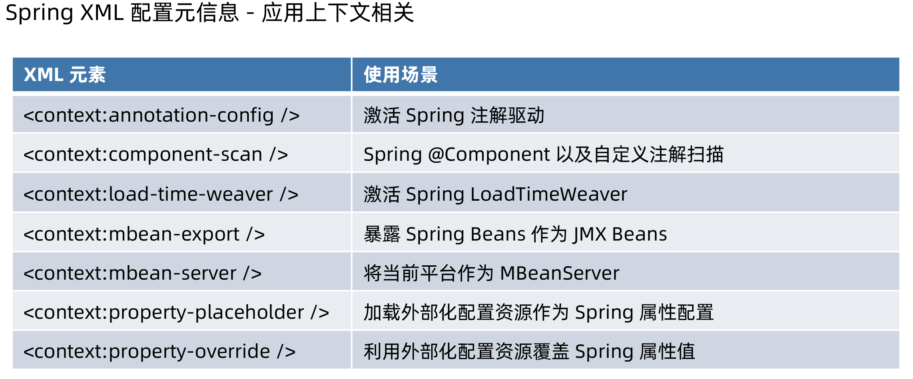

# Spring 配置元信息

Spring Bean 配置元信息 - BeanDefinition
Spring Bean 属性元信息 - PropertyValues
Spring 容器配置元信息
Spring 外部化配置元信息 - PropertySource
Spring Profile 元信息 - @Profile

# Spring Bean 配置元信息

GenericBeanDefinition：通用型 BeanDefinition

> 一站式解决方案

RootBeanDefinition：无 Parent 的 BeanDefinition 或者合并后 BeanDefinition
AnnotatedBeanDefinition：注解标注的 BeanDefinition，@Bean

> 子类：
>
> 1. ScannedGenericBeanDefinition
> 2. AnnotatedGenericBeanDefinition
> 3. 在ConfigurationClassBeanDefinitionReader的一个内部类ConfigurationClassBeanDefinition


BeanDefinition继承信息

```java
public interface BeanDefinition extends AttributeAccessor, BeanMetadataElement {
```

其中**AttributeAccessor**用于设置辅助属性(attaching)，**BeanMetadataElement**用于设置配置原对象

代码

```java
/**
 * Bean 配置元信息示例
 *
 * @author <a href="mailto:mercyblitz@gmail.com">Mercy</a>
 * @since
 */
public class BeanConfigurationMetadataDemo {

    public static void main(String[] args) {

        // BeanDefinition 的定义（声明）
        BeanDefinitionBuilder beanDefinitionBuilder = BeanDefinitionBuilder.genericBeanDefinition(User.class);
        beanDefinitionBuilder.addPropertyValue("name", "mercyblitz");
        // 获取 AbstractBeanDefinition
        AbstractBeanDefinition beanDefinition = beanDefinitionBuilder.getBeanDefinition();
        // 附加属性（不影响 Bean populate、initialize）
        beanDefinition.setAttribute("name", "小马哥");
        // 当前 BeanDefinition 来自于何方（辅助作用）
        beanDefinition.setSource(BeanConfigurationMetadataDemo.class);

        DefaultListableBeanFactory beanFactory = new DefaultListableBeanFactory();

        beanFactory.addBeanPostProcessor(new BeanPostProcessor() {
            @Override
            public Object postProcessAfterInitialization(Object bean, String beanName) throws BeansException {
                if (ObjectUtils.nullSafeEquals("user", beanName) && User.class.equals(bean.getClass())) {
                    BeanDefinition bd = beanFactory.getBeanDefinition(beanName);
                    if (BeanConfigurationMetadataDemo.class.equals(bd.getSource())) { // 通过 source 判断来
                        // 属性（存储）上下文
                        String name = (String) bd.getAttribute("name"); // 就是 "小马哥"
                        User user = (User) bean;
                        user.setName(name);
                    }
                }
                return bean;
            }
        });

        // 注册 User 的 BeanDefinition
        beanFactory.registerBeanDefinition("user", beanDefinition);

        User user = beanFactory.getBean("user", User.class);

        System.out.println(user);

    }
}
```

# spring命名空间

## BeanDefinitionParserDelegate

> 用于解析XML bean定义的有状态委托类。用于主解析器和任何扩展beandefinitionparser或beandefinitiondecorator。
>
> ```java
> public class BeanDefinitionParserDelegate {
> 
>    public static final String BEANS_NAMESPACE_URI = "http://www.springframework.org/schema/beans";
> 
>    public static final String MULTI_VALUE_ATTRIBUTE_DELIMITERS = ",; ";
>     
> }
> ```

一个典型的xml配置文件

```xml
<?xml version="1.0" encoding="UTF-8"?>
<beans xmlns="http://www.springframework.org/schema/beans"
       xmlns:xsi="http://www.w3.org/2001/XMLSchema-instance"
       xsi:schemaLocation="http://www.springframework.org/schema/beans
        https://www.springframework.org/schema/beans/spring-beans.xsd">
    
</beans>
```

**xmlns**：xml namespace，xml命名空间，和BeanDefinitionParserDelegate中的**BEANS_NAMESPACE_URI**匹配

**xsi:schemaLocation**：schema的位置，这个和xmlns是成对出现的，这里xsd文件是会去下面截图所示的位置下载，

访问：http://www.springframework.org/schema/beans


但是spring做了本地化处理


# Spring 容器配置元信息

Spring XML 配置元信息 - beans 元素相关


# Spring 容器配置元信息



# 基于 XML 资源装载 Spring Bean 配置元信息

## 底层实现 - XmlBeanDefinitionReader


# 基于 Properties 资源装载 Spring Bean 配置元信息

## 底层实现 - PropertiesBeanDefinitionReader


代码：

> properties文件编码是UTF-8，但是读取默认是IOS-8859-1，所以读取时要设置下编码

```java
/**
 * {@link PropertiesBeanDefinitionReader} 示例
 *
 * @author <a href="mailto:mercyblitz@gmail.com">Mercy</a>
 * @since
 */
public class PropertiesBeanDefinitionReaderDemo {

    public static void main(String[] args) {
        // 创建 IoC 底层容器
        DefaultListableBeanFactory beanFactory = new DefaultListableBeanFactory();
        // 创建面向 Properties 资源的 BeanDefinitionReader 示例
        PropertiesBeanDefinitionReader beanDefinitionReader = new PropertiesBeanDefinitionReader(beanFactory);
        // Properties 资源加载默认通过 ISO-8859-1，实际存储 UTF-8
        ResourceLoader resourceLoader = new DefaultResourceLoader();
        // 通过指定的 ClassPath 获取 Resource 对象
        Resource resource = resourceLoader.getResource("classpath:/META-INF/user-bean-definitions.properties");
        // 转换成带有字符编码 EncodedResource 对象
        EncodedResource encodedResource = new EncodedResource(resource, "UTF-8");
        int beanDefinitionsCount = beanDefinitionReader.loadBeanDefinitions(encodedResource);
        System.out.println(String.format("已记载 %d 个 BeanDefinition\n", beanDefinitionsCount));
        // 通过依赖查找获取 User Bean
        User user = beanFactory.getBean("user", User.class);
        System.out.println(user);
    }
}
```

# 基于 Java 注解装载 Spring Bean 配置元信息

## Spring 模式注解

解析类：**ClassPathScanningCandidateComponentProvider**


## Spring Bean 定义注解

解析类：


## Spring Bean 依赖注入注解

解析类：

**AutowiredAnnotationBeanPostProcessor**：@Autowired、@Value、@Inject(可选)

**CommonAnnotationBeanPostProcessor**：@Resource


##  Spring Bean 条件装配注解


## Spring Bean 生命周期回调注解

解析类：

**CommonAnnotationBeanPostProcessor**	


# Spring Bean 配置元信息底层实现

## Spring XML 资源 BeanDefinition 解析与注册

• 核心 API - XmlBeanDefinitionReader
	• 资源 - Resource
	• 底层 - BeanDefinitionDocumentReader
		• XML 解析 - Java DOM Level 3 API
		• BeanDefinition 解析 - BeanDefinitionParserDelegate
		• BeanDefinition 注册 - BeanDefinitionRegistry