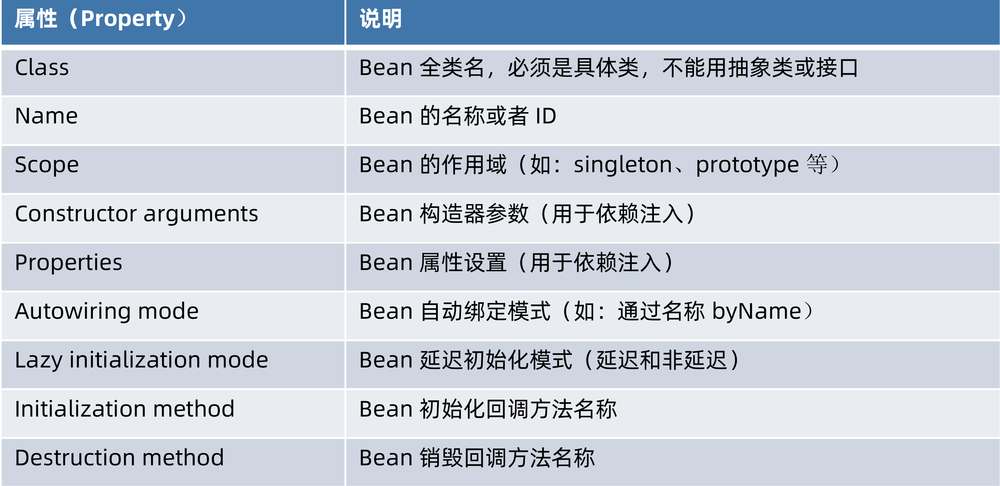
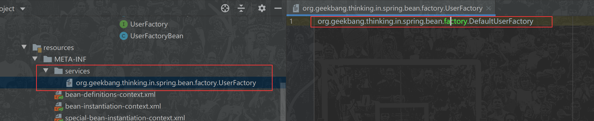
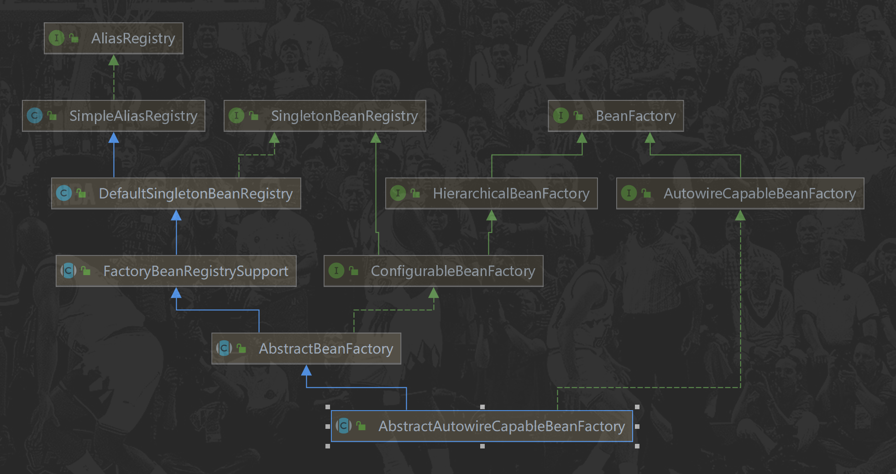

# 定义 Spring Bean

## 什么是 BeanDefinition？

BeanDefinition 是 Spring Framework 中定义 Bean 的配置元信息接口，包含：

- Bean 的类名
- Bean 行为配置元素，如作用域、自动绑定的模式，生命周期回调等
- 其他 Bean 引用，又可称作合作者（collaborators）或者依赖（dependencies）
- 配置设置，比如 Bean 属性（Properties）

# BeanDefinition 元信息



## BeanDefinition 构建

### 通过 BeanDefinitionBuilder

### 通过 AbstractBeanDefinition 以及派生类

### 代码示例

```java
public class BeanDefinitionCreationDemo {

    public static void main(String[] args) {

        // 1.通过 BeanDefinitionBuilder 构建
        BeanDefinitionBuilder beanDefinitionBuilder = BeanDefinitionBuilder.genericBeanDefinition(User.class);
        // 通过属性设置
        beanDefinitionBuilder
                .addPropertyValue("id", 1)
                .addPropertyValue("name", "小马哥");
        // 获取 BeanDefinition 实例
        BeanDefinition beanDefinition = beanDefinitionBuilder.getBeanDefinition();
        // BeanDefinition 并非 Bean 终态，可以自定义修改

        // 2. 通过 AbstractBeanDefinition 以及派生类
        GenericBeanDefinition genericBeanDefinition = new GenericBeanDefinition();
        // 设置 Bean 类型
        genericBeanDefinition.setBeanClass(User.class);
        // 通过 MutablePropertyValues 批量操作属性
        MutablePropertyValues propertyValues = new MutablePropertyValues();
//        propertyValues.addPropertyValue("id", 1);
//        propertyValues.addPropertyValue("name", "小马哥");
        propertyValues
                .add("id", 1)
                .add("name", "小马哥");
        // 通过 set MutablePropertyValues 批量操作属性
        genericBeanDefinition.setPropertyValues(propertyValues);
    }
}
```

# 命名 Spring Bean

## Bean 的名称

每个 Bean 拥有一个或多个标识符（identifiers），这些**标识符在 Bean 所在的容器必须是唯一的**。通常，一个Bean 仅有一个标识符，如果需要额外的，可考虑使用**别名（Alias）**来扩充。

在基于 XML 的配置元信息中，开发人员可用 **id 或者 name 属性**来规定 Bean 的 标识符。通常Bean 的 标识符由字母组成，允许出现特殊字符。如果要想引入 Bean 的别名的话，可在name 属性使用半角逗号（“,”）或分号（“;”) 来间隔。

Bean 的 id 或 name 属性并非必须制定，如果留空的话，容器会为 Bean 自动生成一个唯一的名称。Bean 的命名尽管没有限制，不过官方建议采用驼峰的方式，更符合 Java 的命名约定。

## Bean 名称生成器（BeanNameGenerator）

由 Spring Framework 2.0.3 引入，框架內建两种实现：

- DefaultBeanNameGenerator：默认通用 BeanNameGenerator 实现
- AnnotationBeanNameGenerator：基于注解扫描的 BeanNameGenerator 实现，起始于
  Spring Framework 2.5，关联的官方文档：
  With component scanning in the classpath, Spring generates bean names for unnamed components,
  following the rules described earlier: essentially, taking the simple class name and turning its initial
  character to lower-case. However, in the (unusual) special case when there is more than one
  character and both the first and second characters are upper case, the original casing gets preserved.
  These are the same rules as defined by java.beans.Introspector.decapitalize (which Spring uses here).

## 代码

接口

```java
public interface BeanNameGenerator {

	/**
	 * Generate a bean name for the given bean definition.
	 * @param definition the bean definition to generate a name for
	 * @param registry the bean definition registry that the given definition
	 * is supposed to be registered with
	 * @return the generated bean name
	 */
	String generateBeanName(BeanDefinition definition, BeanDefinitionRegistry registry);

}
```

### DefaultBeanNameGenerator

```java
public class DefaultBeanNameGenerator implements BeanNameGenerator {

    // 提供单例，建议使用
	public static final DefaultBeanNameGenerator INSTANCE = new DefaultBeanNameGenerator();

	@Override
	public String generateBeanName(BeanDefinition definition, BeanDefinitionRegistry registry) {
		return BeanDefinitionReaderUtils.generateBeanName(definition, registry);
	}
}

public static String generateBeanName(BeanDefinition beanDefinition, BeanDefinitionRegistry registry)
    throws BeanDefinitionStoreException {

    return generateBeanName(beanDefinition, registry, false);
}
public static String generateBeanName(
    BeanDefinition definition, BeanDefinitionRegistry registry, boolean isInnerBean)
    throws BeanDefinitionStoreException {
	// 获取className,就是类名
    String generatedBeanName = definition.getBeanClassName();
    // 如果beanName为空
    if (generatedBeanName == null) {
        // 获取父BeanDefinition名称，一般是xml中parent标签中使用
        if (definition.getParentName() != null) {
            generatedBeanName = definition.getParentName() + "$child";
        }
        //获取FactoryBean名称
        else if (definition.getFactoryBeanName() != null) {
            generatedBeanName = definition.getFactoryBeanName() + "$created";
        }
    }
    if (!StringUtils.hasText(generatedBeanName)) {
        throw new BeanDefinitionStoreException("Unnamed bean definition specifies neither " +
                                               "'class' nor 'parent' nor 'factory-bean' - can't generate bean name");
    }

    // id和name其实是一样的
    String id = generatedBeanName;
    if (isInnerBean) {
        // 如果是内部bean,generatedBeanName + # + definition十六进制哈希吗
        // Inner bean: generate identity hashcode suffix.
        // GENERATED_BEAN_NAME_SEPARATOR = "#"
        id = generatedBeanName + GENERATED_BEAN_NAME_SEPARATOR + ObjectUtils.getIdentityHexString(definition);
    }
    else {
        // 顶级bean,确保唯一性，generatedBeanName + # + 从0开始的数字
        // Top-level bean: use plain class name with unique suffix if necessary.
        return uniqueBeanName(generatedBeanName, registry);
    }
    return id;
}

public static String uniqueBeanName(String beanName, BeanDefinitionRegistry registry) {
    String id = beanName;
    int counter = -1;

    // Increase counter until the id is unique.
    while (counter == -1 || registry.containsBeanDefinition(id)) {
        counter++;
        id = beanName + GENERATED_BEAN_NAME_SEPARATOR + counter;
    }
    return id;
}
```

### AnnotationBeanNameGenerator

> 这里是针对配置类的BeanName生成，普通如@Bean的名称并不在这个生成，而是在
>
> ConfigurationClassBeanDefinitionReader#loadBeanDefinitionsForBeanMethod方法中
>
> ```java
> AnnotationAttributes bean = AnnotationConfigUtils.attributesFor(metadata, Bean.class);
> Assert.state(bean != null, "No @Bean annotation attributes");
> 
> // Consider name and any aliases
> List<String> names = new ArrayList<>(Arrays.asList(bean.getStringArray("name")));
> // methodName就是方法名
> String beanName = (!names.isEmpty() ? names.remove(0) : methodName);
> ```

```java
public class AnnotationBeanNameGenerator implements BeanNameGenerator {

	public static final AnnotationBeanNameGenerator INSTANCE = new AnnotationBeanNameGenerator();

	private static final String COMPONENT_ANNOTATION_CLASSNAME = "org.springframework.stereotype.Component";

	@Override
	public String generateBeanName(BeanDefinition definition, BeanDefinitionRegistry registry) {
		// 判断是注解类型的BeanDefinition
        if (definition instanceof AnnotatedBeanDefinition) {
			String beanName = determineBeanNameFromAnnotation((AnnotatedBeanDefinition) definition);
			if (StringUtils.hasText(beanName)) {
				// Explicit bean name found.
				return beanName;
			}
		}
        // 如果注解上没有，则使用java自带的Introspector(内省，见第二章)API创建
		// Fallback: generate a unique default bean name.
		return buildDefaultBeanName(definition, registry);
	}
	// 推断bean的名称从注解上
	@Nullable
	protected String determineBeanNameFromAnnotation(AnnotatedBeanDefinition annotatedDef) {
		// 获取配置类注解元信息，这里AnnotatedBeanDefinition是配置类的定义信息
        AnnotationMetadata amd = annotatedDef.getMetadata();
		Set<String> types = amd.getAnnotationTypes();
		String beanName = null;
		for (String type : types) {
			AnnotationAttributes attributes = AnnotationConfigUtils.attributesFor(amd, type);
			if (attributes != null && isStereotypeWithNameValue(type, amd.getMetaAnnotationTypes(type), attributes)) {
				// 获取注解的value属性，就是bean名称
                Object value = attributes.get("value");
				if (value instanceof String) {
					String strVal = (String) value;
					if (StringUtils.hasLength(strVal)) {
						if (beanName != null && !strVal.equals(beanName)) {
							throw new IllegalStateException("Stereotype annotations suggest inconsistent " +
									"component names: '" + beanName + "' versus '" + strVal + "'");
						}
						beanName = strVal;
					}
				}
			}
		}
		return beanName;
	}

    // 是否有可以标注beanName的注解名称，有以下3个注解，都有value属性
    //1.org.springframework.stereotype.Component，包含或者等于
    //2.javax.annotation.ManagedBean
    //3."javax.inject.Named
	protected boolean isStereotypeWithNameValue(String annotationType,
			Set<String> metaAnnotationTypes, @Nullable Map<String, Object> attributes) {

		boolean isStereotype = annotationType.equals(COMPONENT_ANNOTATION_CLASSNAME) ||
				metaAnnotationTypes.contains(COMPONENT_ANNOTATION_CLASSNAME) ||
				annotationType.equals("javax.annotation.ManagedBean") ||
				annotationType.equals("javax.inject.Named");

		return (isStereotype && attributes != null && attributes.containsKey("value"));
	}

	protected String buildDefaultBeanName(BeanDefinition definition, BeanDefinitionRegistry registry) {
		return buildDefaultBeanName(definition);
	}

	protected String buildDefaultBeanName(BeanDefinition definition) {
		String beanClassName = definition.getBeanClassName();
		Assert.state(beanClassName != null, "No bean class name set");
		String shortClassName = ClassUtils.getShortName(beanClassName);
        // 类名转换，驼峰式，如果第一个和第二个均为大写，则不作处理
		return Introspector.decapitalize(shortClassName);
	}

}
```

# Spring Bean 的别名

Bean 别名（Alias）的价值

- 复用现有的 BeanDefinition
- 更具有场景化的命名方法，比如：

```xml
<alias name="myApp-dataSource" alias="subsystemA-dataSource"/>
<alias name="myApp-dataSource" alias="subsystemB-dataSource"/>
```

# 注册 Spring Bean

## BeanDefinition 注册

### XML 配置元信息

```xml
<bean name=”...” ... />
```

### Java 注解配置元信息

#### @Bean

在方法上标注，给容器添加一个Bean

```java
@Target({ElementType.METHOD, ElementType.ANNOTATION_TYPE})
@Retention(RetentionPolicy.RUNTIME)
@Documented
public @interface Bean {
    
	@AliasFor("name")
	String[] value() default {};
	@AliasFor("value")
	String[] name() default {};
	@Deprecated
	Autowire autowire() default Autowire.NO;
	boolean autowireCandidate() default true;
	String initMethod() default "";
	String destroyMethod() default AbstractBeanDefinition.INFER_METHOD;

}

```

#### @Component

在类上标注，导入组件

```java
@Target(ElementType.TYPE)
@Retention(RetentionPolicy.RUNTIME)
@Documented
@Indexed
public @interface Component {

	String value() default "";

}
```

#### @Import

在类上标注，导入一个类

```java
@Target(ElementType.TYPE)
@Retention(RetentionPolicy.RUNTIME)
@Documented
public @interface Import {

	Class<?>[] value();

}
```


### Java API 配置元信息

#### 命名方式

```java
BeanDefinitionRegistry#registerBeanDefinition(String,BeanDefinition)
```

#### 非命名方式

```java
BeanDefinitionReaderUtils#registerWithGeneratedName(AbstractBeanDefinition,BeanDefinitionRegistry)
```

#### 配置类方式

```java
AnnotatedBeanDefinitionReader#register(Class...)
```

# 实例化 Spring Bean

## 常规方式

### 通过构造器（配置元信息：XML、Java 注解和 Java API ）

### 通过静态工厂方法

#### xml

> 需要指定 factory-method(工厂方法，静态方法) 属性，class(工厂方法所在的类)

```xml
<!-- 静态方法实例化 Bean -->
    <bean id="user-by-static-method" class="org.geekbang.thinking.in.spring.ioc.overview.domain.User"
      factory-method="createUser"/>
```

```java
public class User implements BeanNameAware {
	...
    //属性、get、set
    ...

    public static User createUser() {
        User user = new User();
        user.setId(1L);
        user.setName("小马哥");
        return user;
    }

}
```

#### Java API

### 通过 Bean 工厂方法

#### XML

> 需要定义 factory-bean(自定义实例工厂)，factory-method(工厂方法)

```JAVA
<bean id="userFactory" 
    class="org.geekbang.thinking.in.spring.bean.factory.DefaultUserFactory"/>

<!-- 实例（Bean）方法实例化 Bean -->
<bean id="user-by-instance-method" 
        factory-bean="userFactory" factory-method="createUser"/>
```

UserFactory作为**抽象工厂**定义接口

DefaultUserFactory为实例化工厂

```java
public interface UserFactory {

    default User createUser() {
        return User.createUser();
    }
}
public class DefaultUserFactory implements UserFactory{

}
```


### 通过 FactoryBean

## 特殊方式

### ServiceLoaderFactoryBean

> **ServiceLoader**是java提供的一种加载服务类的一个工具类，可以一次加载**多个实现类**

ServiceLoader用法：

1. 需要在resources目录下创建一个文件夹名为 `META-INF/services/`
2. 把要接口的全类名作为文件名
3. 文件内容就是接口的实现类的全类名，如果有多个则换行填写



> org.geekbang.thinking.in.spring.bean.factory.UserFactory：接口
>
> org.geekbang.thinking.in.spring.bean.factory.DefaultUserFactory：实现类

java代码：

```java
public static void demoServiceLoader() {
ServiceLoader<UserFactory> serviceLoader = ServiceLoader.load(UserFactory.class, Thread.currentThread().getContextClassLoader());
Iterator<UserFactory> iterator = serviceLoader.iterator();
        while (iterator.hasNext()) {
            UserFactory userFactory = iterator.next();
            System.out.println(userFactory.createUser());
	}
}
```

Spring提供了对ServiceLoader的扩展，**ServiceLoaderFactoryBean**

其中**serviceType**这个属性必须配置，表示服务类型，填写接口全类名

xml:

special-bean-instantiation-context.xml

```xml
<bean id="userFactoryServiceLoader" 
      class="org.springframework.beans.factory.serviceloader.ServiceLoaderFactoryBean">
    <property name="serviceType" 
              value="org.geekbang.thinking.in.spring.bean.factory.UserFactory" />
</bean>
```

java:

```java
public static void main(String[] args) {
    // 配置 XML 配置文件
    // 启动 Spring 应用上下文
    ApplicationContext applicationContext = new ClassPathXmlApplicationContext("classpath:/META-INF/special-bean-instantiation-context.xml");
    // 通过 ApplicationContext 获取 AutowireCapableBeanFactory
    AutowireCapableBeanFactory beanFactory = applicationContext.getAutowireCapableBeanFactory();

    ServiceLoader<UserFactory> serviceLoader = beanFactory.getBean("userFactoryServiceLoader", ServiceLoader.class);

    displayServiceLoader(serviceLoader);
    
    // 创建 UserFactory 对象，通过 AutowireCapableBeanFactory
    UserFactory userFactory = beanFactory.createBean(DefaultUserFactory.class);
    System.out.println(userFactory.createUser());

}
private static void displayServiceLoader(ServiceLoader<UserFactory> serviceLoader) {
    Iterator<UserFactory> iterator = serviceLoader.iterator();
    while (iterator.hasNext()) {
        UserFactory userFactory = iterator.next();
        System.out.println(userFactory.createUser());
    }
}
```


### AutowireCapableBeanFactory

结构图：



关键方法 **AutowireCapableBeanFactory#createBean(java.lang.Class, int, boolean)**

> AutowireCapableBeanFactory 此抽象类具有自动注入能力的BeanFactory，提供了createBean功能，有唯一的子类**DefaultListableBeanFactory** ，**这个类是真正的SpringIOC容器**

代码见上面ServiceLoaderFactoryBean java代码实例

### BeanDefinitionRegistry

方法：BeanDefinitionRegistry#registerBeanDefinition(String,BeanDefinition)

# Spring Bean的初始化和销毁

## Bean 初始化（Initialization）

- @PostConstruct 标注方法
- 实现 InitializingBean 接口的 afterPropertiesSet() 方法
- 自定义初始化方法
  - XML 配置：<bean init-method=”init” ... />
  - Java 注解：@Bean(initMethod=”init”)
  - Java API：AbstractBeanDefinition#setInitMethodName(String)

## Bean 销毁（Destroy）

- @PreDestroy 标注方法
- 实现 DisposableBean 接口的 destroy() 方法
- 自定义销毁方法
  - XML 配置：<bean destroy=”destroy” ... />
  - Java 注解：@Bean(destroy=”destroy”)
  - Java API：AbstractBeanDefinition#setDestroyMethodName(String)

## 执行顺序

1. Java注解 @PostConstruct、@PreDestroy
2. Spring接口 InitializingBean#afterPropertiesSet()、DisposableBean#destroy()

3. 自定义方法

java代码

```java
public class DefaultUserFactory implements UserFactory, InitializingBean, DisposableBean {

    // 1. 基于 @PostConstruct 注解
    @PostConstruct
    public void init() {
        System.out.println("@PostConstruct : UserFactory 初始化中...");
    }

    public void initUserFactory() {
        System.out.println("自定义初始化方法 initUserFactory() : UserFactory 初始化中...");
    }

    @Override
    public void afterPropertiesSet() throws Exception {
        System.out.println("InitializingBean#afterPropertiesSet() : UserFactory 初始化中...");
    }

    @PreDestroy
    public void preDestroy() {
        System.out.println("@PreDestroy : UserFactory 销毁中...");
    }

    @Override
    public void destroy() throws Exception {
        System.out.println("DisposableBean#destroy() : UserFactory 销毁中...");
    }

    public void doDestroy() {
        System.out.println("自定义销毁方法 doDestroy() : UserFactory 销毁中...");
    }

    @Override
    public void finalize() throws Throwable {
        System.out.println("当前 DefaultUserFactory 对象正在被垃圾回收...");
    }
}
```

启动类：

```java
@Configuration // Configuration Class
public class BeanInitializationDemo {

    public static void main(String[] args) {
        // 创建 BeanFactory 容器
        AnnotationConfigApplicationContext applicationContext = new AnnotationConfigApplicationContext();
        // 注册 Configuration Class（配置类）
        applicationContext.register(BeanInitializationDemo.class);
        // 启动 Spring 应用上下文
        applicationContext.refresh();
        // 非延迟初始化在 Spring 应用上下文启动完成后，被初始化
        System.out.println("Spring 应用上下文已启动...");
        // 依赖查找 UserFactory
        UserFactory userFactory = applicationContext.getBean(UserFactory.class);
        System.out.println(userFactory);
        System.out.println("Spring 应用上下文准备关闭...");
        // 关闭 Spring 应用上下文
        applicationContext.close();
        System.out.println("Spring 应用上下文已关闭...");
    }

    @Bean(initMethod = "initUserFactory", destroyMethod = "doDestroy")
    @Lazy(value = false)
    public UserFactory userFactory() {
        return new DefaultUserFactory();
    }
}
```

执行结果：

```java
Spring 应用上下文已启动...
@PostConstruct : UserFactory 初始化中...
InitializingBean#afterPropertiesSet() : UserFactory 初始化中...
自定义初始化方法 initUserFactory() : UserFactory 初始化中...
org.geekbang.thinking.in.spring.bean.factory.DefaultUserFactory@6a472554
Spring 应用上下文准备关闭...
@PreDestroy : UserFactory 销毁中...
DisposableBean#destroy() : UserFactory 销毁中...
自定义销毁方法 doDestroy() : UserFactory 销毁中...
Spring 应用上下文已关闭...
```

# 延迟初始化 Spring Bean

Bean 延迟初始化（Lazy Initialization）

- XML 配置：<bean lazy-init=”true” ... />
- Java 注解：@Lazy(true)

# 垃圾回收 Spring Bean

Bean 垃圾回收（GC）
1. 关闭 Spring 容器（应用上下文）
2. 执行 GC
3. Spring Bean 覆盖的 finalize() 方法被回调

java代码：

Bean见Spring Bean的初始化和销毁的执行顺序中的例子

启动类：

```java
public class BeanGarbageCollectionDemo {

    public static void main(String[] args) throws InterruptedException {
        // 创建 BeanFactory 容器
        AnnotationConfigApplicationContext applicationContext = new AnnotationConfigApplicationContext();
        // 注册 Configuration Class（配置类）
        applicationContext.register(BeanInitializationDemo.class);
        // 启动 Spring 应用上下文
        applicationContext.refresh();
        // 关闭 Spring 应用上下文
        applicationContext.close();
        Thread.sleep(5000L);
        // 强制触发 GC
        System.gc();
        Thread.sleep(5000L);
    }
}
```

输出：

```java
@PostConstruct : UserFactory 初始化中...
InitializingBean#afterPropertiesSet() : UserFactory 初始化中...
自定义初始化方法 initUserFactory() : UserFactory 初始化中...
@PreDestroy : UserFactory 销毁中...
DisposableBean#destroy() : UserFactory 销毁中...
自定义销毁方法 doDestroy() : UserFactory 销毁中...
当前 DefaultUserFactory 对象正在被垃圾回收...
```

# 面试题

## 如何注册一个 Spring Bean？

答：通过 BeanDefinition 和外部单体对象来注册

外部单体对象注册

> 此方式IOC容器不会回调Bean的任何生命周期，**此方式比较重要，可用于特殊场景**

主要接口：SingletonBeanRegistry

```java
public class SingletonBeanRegistrationDemo {

    public static void main(String[] args) throws InterruptedException {
        // 创建 BeanFactory 容器
        AnnotationConfigApplicationContext applicationContext = new AnnotationConfigApplicationContext();
        // 创建一个外部 UserFactory 对象
        UserFactory userFactory = new DefaultUserFactory();
        SingletonBeanRegistry singletonBeanRegistry = applicationContext.getBeanFactory();
        // 注册外部单例对象
        singletonBeanRegistry.registerSingleton("userFactory", userFactory);
        // 启动 Spring 应用上下文
        applicationContext.refresh();

        // 通过依赖查找的方式来获取 UserFactory
        UserFactory userFactoryByLookup = applicationContext.getBean("userFactory", UserFactory.class);
        System.out.println("userFactory  == userFactoryByLookup : " + (userFactory == userFactoryByLookup));

        // 关闭 Spring 应用上下文
        applicationContext.close();
    }

}
```

