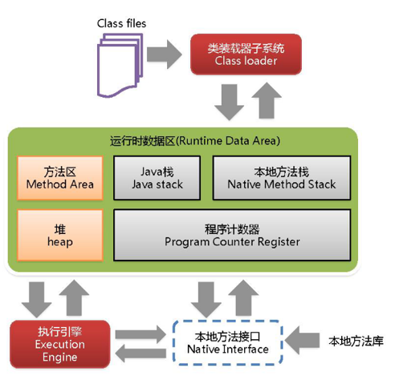
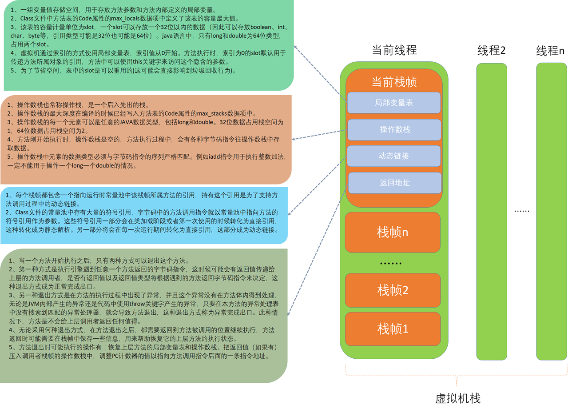
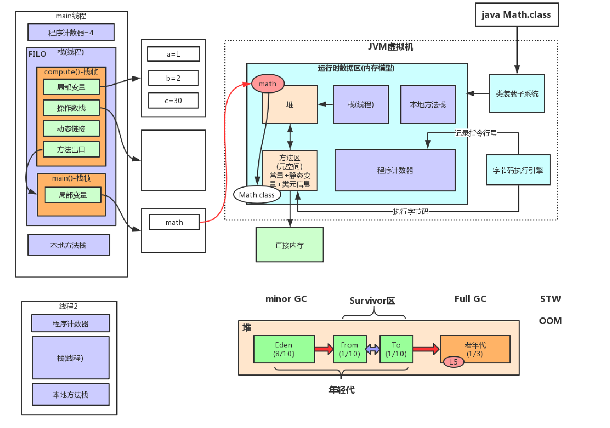

JVM内存结构



**本地方法栈(线程私有)**：登记native方法，在Execution Engine执行时加载本地方法库

**程序计数器（线程私有）**：就是一个指针，指向方法区中的方法字节码（用来存储指向下一条指令的地址,也即将要执行的指令代码），由执行引擎读取下一条指令，是一个非常小的内存空间，几乎可以忽略不记。

**方法区(线程共享)**：类的所有字段和方法字节码，以及一些特殊方法如构造函数，接口代码也在此定义。简单说，所有定义的方法的信息都保存在该区域，静态变量+常量+类信息(构造方法/接口定义)+运行时常量池都存在方法区中，虽然Java虚拟机规范把方法区描述为堆的一个逻辑部分，但是它却有一个别名叫做 Non-Heap（非堆），目的应该是与 Java 堆区分开来。

**Java栈（线程私有）**： Java线程执行方法的内存模型，一个线程对应一个栈，每个方法在执行的同时都会创建一个栈帧（用于存储局部变量表，操作数栈，动态链接，方法出口等信息）不存在垃圾回收问题，只要线程一结束该栈就释放，生命周期和线程一致

Java栈结构



JVM运行时过程



```java
public class Math{
    public int add(){
        int a = 1;
        int b = 2;
        int c = (a + b) * 10;
        return c;
    }

    public static void main(String[] args) {
        Math math = new Math();
        int i = math.add();
    }
}
```

javap -c Math.java，查看字节码

```java
public class Math {
  public Math();
    Code:
       0: aload_0
       1: invokespecial #1                  // Method java/lang/Object."<init>":()V
       4: return

  public int add();
    Code:
       0: iconst_1 // 将int类型常量1(1)压入操作数栈
       1: istore_1 // 将int类型值(1)存入局部变量1(a)，弹栈操作
       2: iconst_2 // 将int类型常量2(2)的副本压入栈
       3: istore_2 // 将int类型值(2)存入局部变量2(b)，弹栈操作
       4: iload_1 // 从局部变量1(a)中装载int类型值(1)
       5: iload_2 // 从局部变量2(b)中装载int类型值(2)
       6: iadd // 执行int类型的加法(1+2=3)
       7: bipush        10 //将一个8位带符号整数(10)压入栈
       9: imul // 执行int类型的乘法(3*10)
      10: istore_3 // 将int类型值(30)存入局部变量3(c)，弹栈操作
      11: iload_3 // 从局部变量3(c)中装载int类型值(30)
      12: ireturn //从方法中返回int类型的数据

  public static void main(java.lang.String[]);
    Code:
       0: new           #2                  // class Math
       3: dup
       4: invokespecial #3                  // Method "<init>":()V
       7: astore_1
       8: aload_1
       9: invokevirtual #4                  // Method add:()I
      12: istore_2
      13: return
}
```

一般来说会先把等号右边的值压入操作数栈，然后在存入局部变量中，当需要这个变量的时候，再取出来压入操作数栈

```java
public class Test{
   

    public static void main(String[] args) {
       int i = 1;
       i = i++;
       int j = 2;
       j = ++j;
    }
}
```

字节码文件

```java
public class Test {
  public Test();
    Code:
       0: aload_0
       1: invokespecial #1                  // Method java/lang/Object."<init>":()V
       4: return

  public static void main(java.lang.String[]);
    Code:
       0: iconst_1 // 将int类型常量1(1)压入操作数栈
       1: istore_1 // 将int类型值(1)存入局部变量1(i)，弹栈操作
       2: iload_1  // 从局部变量1(i)中装载int类型值(1)
       3: iinc          1, 1 // 把一个常量值(1)加到一个int类型的局部变量(i)上，此时i=2,但是操作数栈的值还是1
       6: istore_1 // 将int类型值(1)存入局部变量1(i)，i=1，弹栈操作
           
       7: iconst_2 // 将int类型常量2(2)的副本压入栈
       8: istore_2 // 将int类型值(2)存入局部变量2(j)，弹栈操作
       9: iinc          2, 1 // 把一个常量值(1)加到一个int类型的局部变量(j)上，此时j=2,但是操作数栈的值还是1
      12: iload_2 // 从局部变量2(j)中装载int类型值(2)
      13: istore_2 // 将int类型值(2)存入局部变量2(b)，弹栈操作
      14: return
}
```

接下来分析一下JVM是如何执行的:

i++的操作

- 第0：将int类型的1入栈，就是放到操作数栈的栈顶
- 第1：将操作数栈栈顶的值1弹出，保存到局部变量表 index （索引）值为1的位置。（局部变量表也是从1开始的，0位置一般保存当前实例的this引用，当然静态方法例外，因为静态方法是类方法而不是实例方法）
- 第2：将局部变量表index 1位置的值的副本入栈。（这时局部变量表index为1的值是1，操作数栈顶的值也是1）
- 第3：iinc是对int类型的值进行自增操作，**后面第一个数值1表示，局部变量表的index值**，说明要对此值执行iinc操作，**第二个数值1表示要增加的数值**。（**这时局部变量表index为1的值因为执行了自增操作变为2了，但是操作数栈中栈顶的值仍然是1**）
- 第6：将操作数栈顶的值弹出（值1），放到局部变量表index为1的位置（旧值：2，新值：1），覆盖了上一步局部变量表的计算结果。
- 第7：将局部变量表index 1位置的值的副本入栈。（这时局部变量表index为1的值是0，操作数栈顶的值也是0）

++j的操作

- 第7：将int类型的2入栈，就是放到操作数栈的栈顶
- 第8：将操作数栈栈顶的值2弹出，保存到局部变量表 index （索引）值为2的位置。
- 第9：iinc是对int类型的值进行自增操作，**后面第一个数值2表示，局部变量表的index值**，说明要对此值执行iinc操作，**第二个数值1表示要增加的数值**。（这时局部变量表index为2的值因为执行了自增操作变为3了）
- 第12：将局部变量表index 2位置的值的副本入栈。（这时局部变量表index为2的值是3，操作数栈顶的值也是3）
- 第13：将操作数栈顶的值弹出（值3），放到局部变量表index为2的位置（旧值：3，新值：3），覆盖了上一步局部变量表的计算结果。

总结：i++是先把局部变量表的**副本**压入操作数栈，然后对局部变量表中的值+1，++i实现对局部变量表中的值+1，然后再将局部变量表中的副本压入操作数栈